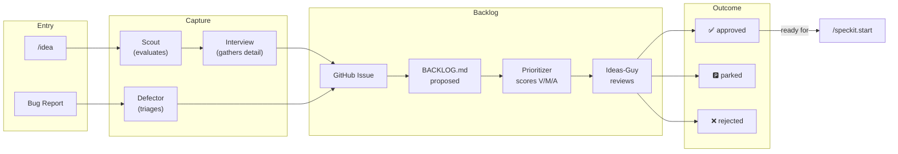
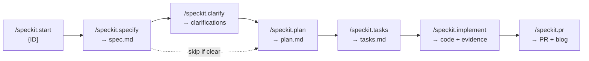
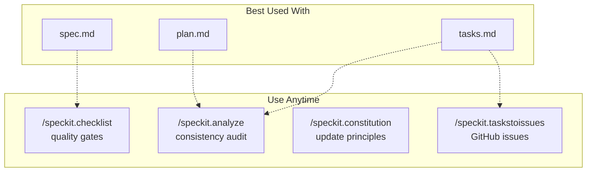
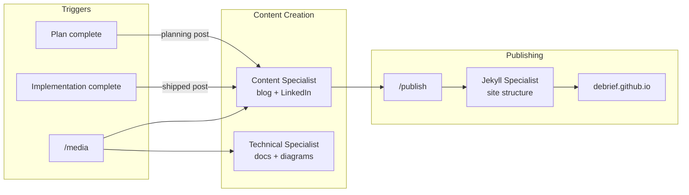
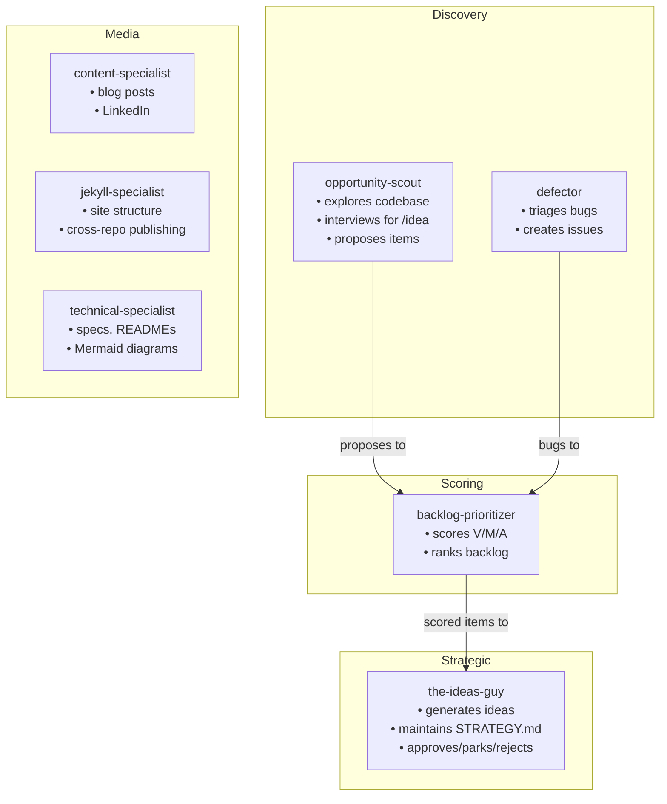

# Debrief

> *Getting analysis done, since 1995.*

Modernisation of Debrief maritime analysis platform (v4.x).

## Status

**Project phase:** Future Debrief — tracer bullet implementation

This is an active rebuild of the [legacy Debrief application](https://github.com/debrief/debrief) (v3.x, "Debrief NG"). The new version prioritises platform sustainability, Python-based extensibility, and reduced contractor dependency.

## What is Debrief?

Debrief is a maritime tactical analysis tool used for post-exercise reconstruction and analysis. Core capabilities include:

- Loading and visualising vessel tracks and sensor data
- Target Motion Analysis (TMA) for track reconstruction
- Temporal and spatial analysis of engagements
- Standardised reporting

## Why a Rebuild?

The legacy application is built on Eclipse RCP, a platform in decline. The modernisation:

- Replaces platform-locked architecture with platform-agnostic services
- Enables domain scientists to build Python tools without Java expertise
- Uses open standards (GeoJSON, STAC) for data portability
- Supports multiple frontends: VS Code extension, Electron apps, Jupyter notebooks

For the full strategic context, see [VISION.md](VISION.md).

## Documentation

| Document | Purpose |
|----------|---------|
| [VISION.md](VISION.md) | Strategic context — why we're rebuilding, value proposition, roadmap |
| [CONSTITUTION.md](CONSTITUTION.md) | Governing principles — the non-negotiable rules for all development |
| [ARCHITECTURE.md](ARCHITECTURE.md) | Technical design — component structure, technology choices |
| [CONTRIBUTING.md](CONTRIBUTING.md) | How to participate — code standards, review process |
| [CHANGELOG.md](CHANGELOG.md) | Version history |

## Architecture

Key principles:

- **Thick services, thin frontends** — domain logic in Python, frontends handle only orchestration
- **Schema-first** — LinkML master schemas generate Pydantic, JSON Schema, and TypeScript
- **STAC for storage** — plots stored as STAC Items with GeoJSON payloads
- **MCP for integration** — services exposed via Model Context Protocol

See [ARCHITECTURE.md](ARCHITECTURE.md) for full details.

## Repository Structure

```
debrief/
├── shared/            # Libraries consumed by other packages
│   ├── schemas/       # LinkML + generated Pydantic/JSON Schema/TypeScript
│   └── components/    # Shared React components (map, timeline, etc.)
├── services/          # Core services (stac, io, calc, config, mcp-common)
├── contrib/           # Organisation-specific extensions
├── apps/              # Electron loader, VS Code extension
└── docs/              # Detailed documentation
    └── plans/         # Implementation plans
```

## Current Plan

The tracer bullet implementation validates the architecture with a thin end-to-end thread. See [docs/plans/tracer-bullet.md](docs/plans/tracer-bullet.md) for details.

## Development Workflows

This project uses Claude Code with custom commands and agents. The workflows below show how to navigate from idea to shipped feature.

### 1. Idea to Approval



### 2. SpecKit Pipeline



### 3. SpecKit Helpers



### 4. Media & Publishing



### 5. Agent Roles



### Quick Reference

**Ideation & Strategy**

| Goal | Command/Agent |
|------|---------------|
| Capture new idea | `/idea` |
| Report a bug | `defector` agent |
| Explore for opportunities | `opportunity-scout` agent |
| Strategic review / approve items | `the-ideas-guy` agent |
| Score backlog items (V/M/A) | `backlog-prioritizer` agent |

**SpecKit Pipeline**

| Goal | Command/Agent |
|------|---------------|
| Start approved work | `/speckit.start {ID}` |
| Write specification | `/speckit.specify` |
| Resolve ambiguities | `/speckit.clarify` |
| Create implementation plan | `/speckit.plan` |
| Generate task list | `/speckit.tasks` |
| Execute tasks | `/speckit.implement` |
| Create PR + publish | `/speckit.pr` |

**SpecKit Helpers**

| Goal | Command/Agent |
|------|---------------|
| Generate quality checklist | `/speckit.checklist` |
| Audit cross-artifact consistency | `/speckit.analyze` |
| Update project principles | `/speckit.constitution` |
| Convert tasks to GitHub issues | `/speckit.taskstoissues` |

**Media & Utilities**

| Goal | Command/Agent |
|------|---------------|
| Write blog content | `/media` or `content-specialist` |
| Publish to website | `/publish` |
| Attach screenshot to issue | `/get-the-shot {issue}` |

## Getting Started

### Prerequisites

| Tool | Installation |
|------|--------------|
| Task | https://taskfile.dev/installation/ (or `brew install go-task`) |
| uv | `curl -LsSf https://astral.sh/uv/install.sh \| sh` |
| pnpm | `npm install -g pnpm` |
| Node.js | 18+ |
| Python | 3.11+ |

### Quick Start

```bash
git clone https://github.com/debrief/debrief-future.git
cd debrief-future
task install   # Install all dependencies
task test      # Run all tests
```

### Common Commands

| Command | Description |
|---------|-------------|
| `task install` | Install all dependencies (Python + Node.js) |
| `task test` | Run all tests |
| `task build` | Build all artifacts |
| `task dev` | Start development watch mode |
| `task lint` | Check code style |
| `task lint:fix` | Auto-fix style issues |
| `task clean` | Remove build artifacts |
| `task --list` | Show all available tasks |

All commands auto-install dependencies if needed. See [docs/quickstart.md](docs/quickstart.md) for details.

## Contributing

We welcome contributions. Please read:

1. [CONSTITUTION.md](CONSTITUTION.md) — understand the governing principles
2. [CONTRIBUTING.md](CONTRIBUTING.md) — learn how to participate

## License

Apache-2.0 — see [LICENSE](LICENSE).

## Links

- [Legacy Debrief (v3.x)](https://github.com/debrief/debrief)
- [Debrief website](https://www.debrief.info)
