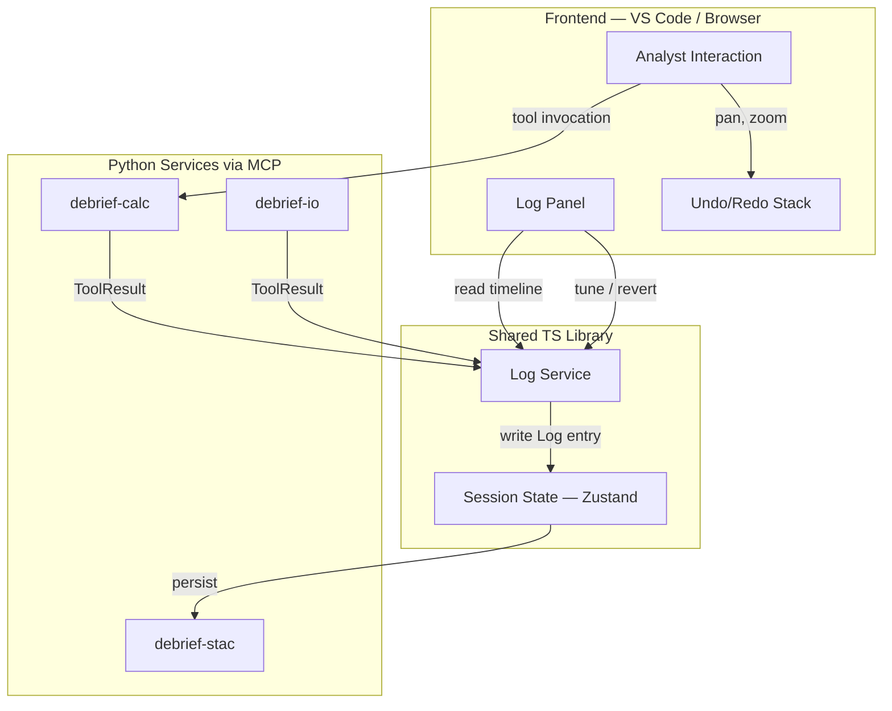
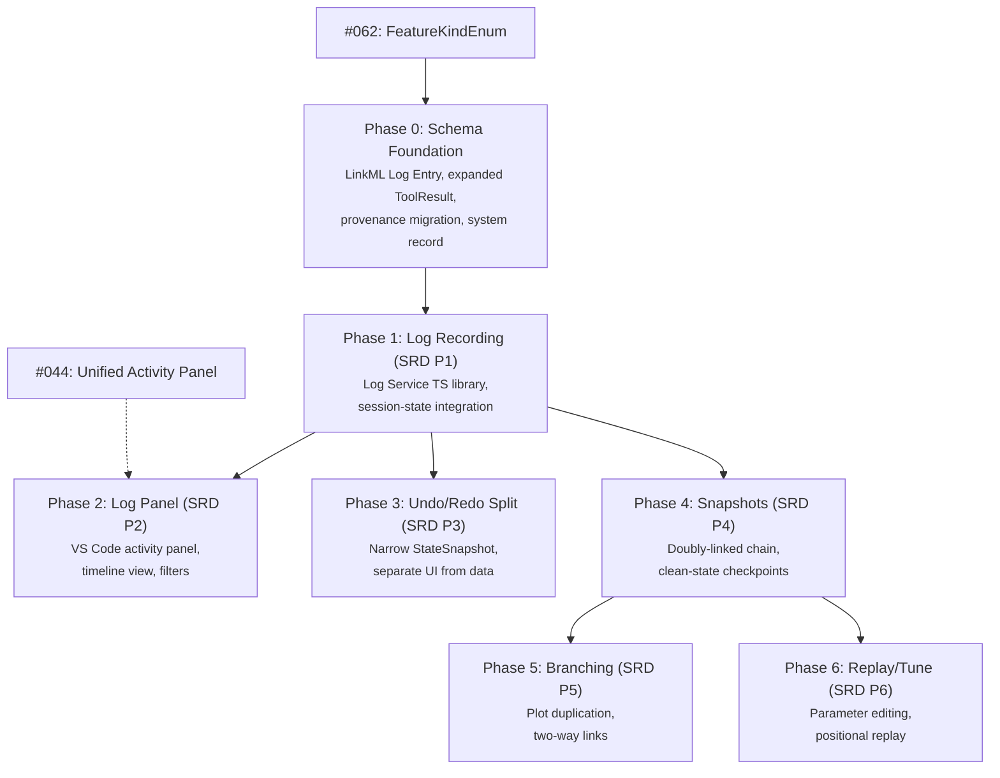

# PROV Logging Integration: Transition Plan

**Feature**: 069 — Plan PROV Logging Integration with Application State
**Date**: 2026-02-08
**Status**: Draft
**SRD References**: `docs/srd-prov-undo.md`, `docker/code-server/ux-log-panel.md`
**Constitution**: Articles I (Offline), III (Provenance), IV (Boundaries), XIV (Pre-Release Freedom)

---

## Table of Contents

1. [Executive Summary](#1-executive-summary)
2. [Methodology](#2-methodology)
3. [Codebase Inventory](#3-codebase-inventory)
4. [Area 1: ToolResult Contract Expansion](#4-area-1-toolresult-contract-expansion)
5. [Area 2: Log Service Design](#5-area-2-log-service-design)
6. [Area 3: Undo/Redo Split](#6-area-3-undoredo-split)
7. [Area 4: Provenance Schema Migration](#7-area-4-provenance-schema-migration)
8. [Area 5: System Record Feature](#8-area-5-system-record-feature)
9. [Area 6: Phased Implementation Sequence](#9-area-6-phased-implementation-sequence)
10. [Area 7: Session-State Integration Points](#10-area-7-session-state-integration-points)
11. [Breaking Change Inventory](#11-breaking-change-inventory)
12. [In-Flight Feature Guidance](#12-in-flight-feature-guidance)

---

## 1. Executive Summary

This document bridges the gap between the current Debrief codebase and the SRD provenance target defined in `docs/srd-prov-undo.md`. It covers 7 areas:

1. **ToolResult contract expansion** — adding structured change tracking to the Python tool output model
2. **Log Service design** — a new TypeScript library that wraps ToolResults in PROV-vocabulary Log entries
3. **Undo/redo split** — separating UI undo (viewport, time) from data-change history (the Log)
4. **Provenance schema migration** — replacing the current flat model with a PROV-aligned schema
5. **System record feature** — a null-geometry GeoJSON feature for snapshot and branch metadata
6. **Phased implementation sequence** — 7 phases mapping SRD priorities P1-P6 to concrete backlog items
7. **Session-state integration** — how the Log Service interacts with Zustand, dirty tracking, and persistence

The plan produces actionable backlog items for each phase. Article XIV (Pre-Release Freedom) permits all breaking changes described here.

---

## 2. Methodology

Each area follows the same structure:

- **Current State**: What exists today, with file paths and line numbers referencing the actual codebase
- **Target State**: What the SRD requires, with references to specific SRD sections and JSON examples
- **Gap Analysis**: The differences between current and target, and why they matter
- **Migration Steps**: Ordered list of changes, with files to modify and tests to update

All file paths are relative to the repository root. Line numbers are approximate and may shift as the codebase evolves.

---

## 3. Codebase Inventory

All files and interfaces affected by the PROV logging transition:

| File | Current Role | Affected By |
|------|-------------|-------------|
| `services/calc/debrief_calc/models.py` | ToolResult, Provenance, SourceRef, ToolError models | Area 1, Area 4 |
| `services/calc/debrief_calc/provenance.py` | `attach_provenance()` — writes `properties.provenance` | Area 4 |
| `services/calc/debrief_calc/executor.py` | `run()` — returns ToolResult, attaches provenance | Area 1 |
| `services/calc/debrief_calc/validation.py` | Validates provenance fields on features | Area 4 |
| `services/stac/src/debrief_stac/provenance.py` | `write_provenance()` — writes `properties.prov` | Area 4 |
| `services/session-state/src/store/index.ts` | Zustand store, undo/redo, StateSnapshot | Area 3, Area 7 |
| `services/session-state/src/store/middleware/undo.ts` | MAX_UNDO_STEPS, undo constants | Area 3 |
| `services/session-state/src/store/middleware/dirty.ts` | DIRTY_TRIGGER_FIELDS, `enableDirtyTracking()` | Area 7 |
| `services/session-state/src/store/middleware/partialize.ts` | EPHEMERAL_FIELDS | Area 3 |
| `services/session-state/src/types/index.ts` | SessionStore type composition | Area 3, Area 7 |
| `services/session-state/src/types/document.ts` | DocumentSlice, DocumentActions | Area 7 |
| `apps/vscode/src/types/tool.ts` | ToolProvenance, ToolExecutionResult, DebriefAnnotations | Area 1, Area 2 |
| `apps/vscode/src/services/calcService.ts` | MCP tool execution wrapper | Area 1, Area 2 |
| `apps/vscode/src/commands/executeTool.ts` | Tool execution command, routes results to stacService | Area 2 |
| `apps/vscode/src/services/stacService.ts` | `addFeatures()`, `addResultAsset()`, persistence | Area 5, Area 7 |
| `apps/web-shell/src/services/toolService.ts` | MCPToolResponse handling | Area 1 |
| `shared/schemas/src/linkml/tool-result.yaml` | ToolResultAnnotations LinkML schema | Unchanged |
| `shared/schemas/fixtures/tool-result/` | Valid/invalid MCP annotation fixtures | Area 4 |
| `services/calc/tests/test_provenance.py` | Tests for provenance attachment | Area 4 |
| `services/calc/tests/test_executor.py` | Tests for ToolResult fields | Area 1 |
| `services/calc/tests/test_models.py` | Tests for model validation | Area 1 |
| `services/stac/tests/test_provenance.py` | Tests for STAC provenance writes | Area 4 |
| `services/session-state/tests/unit/undo.test.ts` | Undo/redo middleware tests | Area 3 |
| `services/session-state/tests/unit/dirty.test.ts` | Dirty tracking tests | Area 7 |

---

## 4. Area 1: ToolResult Contract Expansion

### Current State

**File**: `services/calc/debrief_calc/models.py` (lines 115-137)

The current `ToolResult` is a flat model with 5 fields:

```python
class ToolResult(BaseModel):
    tool: str                              # Tool name
    success: bool                          # Pass/fail
    features: list[dict[str, Any]] | None  # Output GeoJSON features
    error: ToolError | None                # Error details
    duration_ms: float                     # Execution time in milliseconds
```

Supporting models:
- `Provenance` (lines 49-63): `{tool, version, timestamp, sources, parameters}` — flat lineage stamp
- `SourceRef` (lines 42-46): `{id, kind}` — reference to input features
- `ToolError` (lines 96-112): `{code, message, details}` — structured error

The executor (`executor.py:97`) returns ToolResult from `run()`. It attaches a `Provenance` object to each output feature via `attach_provenance()` (`provenance.py:69`).

**Consumers**:

| Consumer | File | How It Uses ToolResult |
|----------|------|----------------------|
| Python executor | `services/calc/debrief_calc/executor.py:97` | Creates and returns ToolResult |
| Python tests | `services/calc/tests/test_executor.py` | Asserts on `success`, `features`, `error`, `duration_ms` |
| Python model tests | `services/calc/tests/test_models.py` | Validates model constraints |
| MCP server | `services/calc/tests/mcp/test_server_tools_call.py` | Via `build_response()` and `build_mutation()` |
| TS calcService | `apps/vscode/src/services/calcService.ts` | Parses MCP response into `ToolExecutionResult` |
| TS executeTool | `apps/vscode/src/commands/executeTool.ts:78-157` | Routes features to `stacService.addFeatures()` |
| TS types | `apps/vscode/src/types/tool.ts:379-407` | `ToolExecutionResult` interface |
| Web shell | `apps/web-shell/src/services/toolService.ts:42-70` | Returns `MCPToolResponse` |

### Target State

**Source**: SRD Annex A.8

The expanded ToolResult must provide structured change tracking so the Log Service can construct meaningful Log entries:

```python
class ToolResult(BaseModel):
    tool: str                                          # Tool identifier (unchanged)
    toolVersion: str                                   # NEW: Semantic version
    success: bool                                      # Pass/fail (unchanged)
    features: list[dict[str, Any]] | None              # Output features (unchanged)
    modifiedFeatures: list[ModifiedFeature] | None     # NEW: IDs + changed properties
    createdFeatures: list[str] | None                  # NEW: References to new features
    createdAssets: list[CreatedAsset] | None            # NEW: Artifact files
    parameters: dict[str, ParameterValue] | None       # NEW: Full resolved params
    error: ToolError | None                            # Error details (unchanged)
    duration_ms: float                                 # Execution time (unchanged)
```

New supporting types:

```python
class ModifiedFeature(BaseModel):
    featureId: str
    changedProperties: dict[str, PropertyDelta]

class PropertyDelta(BaseModel):
    previousValue: Any
    newValue: Any

class CreatedAsset(BaseModel):
    resultId: str       # Stable logical identity (e.g., "bt_plot_001")
    path: str           # Full versioned path (e.g., "./results/bt_plot_001_v2.png")
    mimeType: str | None

class ParameterValue(BaseModel):
    value: Any
    default: bool = False
    tunable: bool = True
```

### Gap Analysis

| Aspect | Current | Target | Gap |
|--------|---------|--------|-----|
| Tool version | Not tracked | `toolVersion` field | Add field, populate from tool registry |
| Modified features | Not tracked | `modifiedFeatures` with property deltas | Add field, tools must report what they changed |
| Created features | Implicit in `features` list | Explicit `createdFeatures` references | Add field, separate from modified features |
| Created assets | Not tracked in ToolResult | `createdAssets` with resultId + path | Add field, artifact tools must report outputs |
| Parameters | Not in ToolResult (only in Provenance) | `parameters` with value/default/tunable | Add field, tools must report resolved params |

### Migration Steps

1. Add `ModifiedFeature`, `PropertyDelta`, `CreatedAsset`, `ParameterValue` models to `services/calc/debrief_calc/models.py`
2. Expand `ToolResult` with new optional fields (`toolVersion`, `modifiedFeatures`, `createdFeatures`, `createdAssets`, `parameters`)
3. Update `executor.py` `run()` to populate `toolVersion` and `parameters` from tool metadata
4. Update individual tool implementations to populate `modifiedFeatures`, `createdFeatures`, `createdAssets` as appropriate
5. Update `apps/vscode/src/types/tool.ts` `ToolExecutionResult` interface with new fields
6. Update `apps/vscode/src/services/calcService.ts` to parse new fields from MCP response
7. Update `apps/web-shell/src/services/toolService.ts` to handle new fields
8. Update all test files: `test_executor.py`, `test_models.py`, MCP server tests
9. Add LinkML schema for expanded ToolResult in `shared/schemas/src/linkml/`

---

## 5. Area 2: Log Service Design

### Current State

No Log Service exists. Tool execution flows directly from user action to result persistence:

```
User clicks "Run Tool"
  → executeTool.ts:78 calls calcService.executeTool()
    → calcService wraps MCP call, returns ToolExecutionResult
  → executeTool.ts:114-157 routes results:
    - Artifacts → stacService.addResultAsset()
    - Features → stacService.addFeatures()
```

There is no intermediate step that records the operation as a Log entry. The only provenance is the flat `Provenance` stamp attached by the Python executor.

### Target State

**Source**: SRD Annex A.2

A TypeScript Log Service wraps every ToolResult in a PROV-vocabulary Log entry and writes it to the affected features:

```
User clicks "Run Tool"
  → executeTool.ts calls calcService.executeTool()
    → Python service returns expanded ToolResult
  → executeTool.ts passes ToolResult to Log Service    ← NEW
    → Log Service assigns activityId, timestamp
    → Log Service creates Log entry per SRD Annex A.3
    → Log Service writes entry to feature.properties.provenance[]
    → Log Service updates session state (Zustand)
    → Dirty tracking triggers → stacService persists
```

**API Surface** (TypeScript):

```typescript
interface LogService {
  /** Wrap a ToolResult in Log entries, write to features, return the entries */
  recordToolResult(result: ExpandedToolResult): LogEntry[];

  /** Assemble global timeline from all features, sorted by timestamp */
  getTimeline(options?: { loadFromSnapshot?: string }): LogEntry[];

  /** Modify a parameter on a past entry and replay all subsequent entries */
  tuneEntry(activityId: string, parameter: string, newValue: unknown): Promise<void>;

  /** Permanently discard all entries after the given entry */
  revertTo(activityId: string): void;

  /** Soft-delete a single entry and replay subsequent entries */
  revertThis(activityId: string): Promise<void>;

  /** Save clean state, reset Log, create snapshot link */
  createSnapshot(): void;

  /** Create a new plot from state at a given entry */
  branchFrom(activityId: string): Promise<string>;
}
```

**Data flow diagram** (SRD Annex A.2):



### Gap Analysis

| Aspect | Current | Target | Gap |
|--------|---------|--------|-----|
| Log recording | None | Every data change recorded | New service required |
| Activity IDs | None | UUID per operation, shared across multi-feature ops | New concept |
| Timeline assembly | None | Runtime merge of per-feature entries, dedup on activityId | New algorithm |
| Tune/revert/replay | None | Full SRD P6 capability | New service methods |
| Snapshot management | None | Clean-state checkpoints, doubly-linked chain | New persistence logic |
| Branch creation | None | Duplicate plot from history point | New stacService integration |

### Migration Steps

1. Create Log Service package/module within `services/session-state/` (or sibling workspace member)
2. Define `LogEntry` TypeScript interface matching SRD Annex A.3
3. Implement `recordToolResult()`: assign activityId (UUID), timestamp, map ToolResult fields to Log entry, write to each affected feature's `properties.provenance[]` in the Zustand store
4. Implement `getTimeline()`: collect provenance arrays from all features, deduplicate on activityId, sort by timestamp
5. Update `apps/vscode/src/commands/executeTool.ts` to call `logService.recordToolResult()` after receiving ToolResult
6. Wire Log Service to Zustand store subscription for dirty tracking (see Area 7)
7. Add tests: unit tests for entry creation, timeline assembly, deduplication
8. Defer P3-P6 methods (tuneEntry, revertTo, revertThis, createSnapshot, branchFrom) to later phases — stub with `throw new Error("Not implemented")`

---

## 6. Area 3: Undo/Redo Split

### Current State

**File**: `services/session-state/src/store/index.ts` (lines 23-58)

The undo middleware snapshots 12 fields into a `StateSnapshot`:

```typescript
interface StateSnapshot {
  currentTime: SessionStore['currentTime'];
  timeRange: SessionStore['timeRange'];
  timeFilter: SessionStore['timeFilter'];
  stepSize: SessionStore['stepSize'];
  playbackRate: SessionStore['playbackRate'];
  displayMode: SessionStore['displayMode'];
  viewport: SessionStore['viewport'];
  rotation: SessionStore['rotation'];
  featureCollectionUri: SessionStore['featureCollectionUri'];
  selection: SessionStore['selection'];
  hiddenFeatureIds: SessionStore['hiddenFeatureIds'];
  savePath: SessionStore['savePath'];
}
```

History is limited to 50 steps (`MAX_UNDO_STEPS` in `services/session-state/src/store/middleware/undo.ts:12`). Smart recording skips duplicates and ephemeral fields (`playbackState`, `dirty`, `undoStack`, `redoStack`).

### Target State

**Source**: SRD Section 5

The SRD explicitly separates:
- **UI Undo/Redo**: Viewport, time controls, layer visibility — in-memory, 50-step stack
- **The Log**: Data changes — persisted on features, unlimited history with snapshot pagination

The StateSnapshot narrows to UI-only fields:

```typescript
interface StateSnapshot {
  currentTime: SessionStore['currentTime'];
  timeRange: SessionStore['timeRange'];
  timeFilter: SessionStore['timeFilter'];
  stepSize: SessionStore['stepSize'];
  playbackRate: SessionStore['playbackRate'];
  displayMode: SessionStore['displayMode'];
  viewport: SessionStore['viewport'];
  rotation: SessionStore['rotation'];
  selection: SessionStore['selection'];
  hiddenFeatureIds: SessionStore['hiddenFeatureIds'];
}
```

### Gap Analysis

Field-by-field analysis:

| Field | Current: In Undo | After Split | Rationale |
|-------|-----------------|-------------|-----------|
| `currentTime` | Yes | **Keep in UI Undo** | Display-only: SRD Section 5 lists "replay time" |
| `timeRange` | Yes | **Keep in UI Undo** | Display-only |
| `timeFilter` | Yes | **Keep in UI Undo** | Display-only |
| `stepSize` | Yes | **Keep in UI Undo** | Display-only |
| `playbackRate` | Yes | **Keep in UI Undo** | Display-only |
| `displayMode` | Yes | **Keep in UI Undo** | Display-only |
| `viewport` | Yes | **Keep in UI Undo** | SRD Section 5 lists "pan, zoom" |
| `rotation` | Yes | **Keep in UI Undo** | Display-only |
| `featureCollectionUri` | Yes | **Remove** | Data change: represents loaded features, handled by Log |
| `selection` | Yes | **Keep in UI Undo** | Display-only: which features are selected |
| `hiddenFeatureIds` | Yes | **Keep in UI Undo** | SRD Section 5 lists "layer visibility" |
| `savePath` | Yes | **Remove** | Metadata: not an undoable action |

**Key finding**: The split is clean. Only 2 of 12 fields move out of the undo snapshot. The undo middleware logic (50-step limit, duplicate suppression, smart recording) is unchanged.

### Migration Steps

1. Remove `featureCollectionUri` and `savePath` from `StateSnapshot` interface in `services/session-state/src/store/index.ts`
2. Update snapshot creation logic (same file, lines ~148-166) to exclude removed fields
3. Update snapshot restoration logic (undo/redo handlers, lines ~214-247) to not restore removed fields
4. Update `services/session-state/tests/unit/undo.test.ts` to reflect narrower snapshot
5. No changes to `DIRTY_TRIGGER_FIELDS` — `featureCollectionUri` dirty tracking moves to Area 7 (Log-triggered dirty)
6. No changes to the 50-step limit or ephemeral field list

---

## 7. Area 4: Provenance Schema Migration

### Current State

Two separate provenance implementations exist:

**1. debrief-calc provenance** (`services/calc/debrief_calc/provenance.py:69`)

Writes to `feature["properties"]["provenance"]`:

```json
{
  "tool": "calculate-range",
  "version": "1.0.0",
  "timestamp": "2026-01-15T10:30:00Z",
  "sources": [{"id": "track-a", "kind": "TRACK"}],
  "parameters": {"interval": 60}
}
```

Used by: `executor.py` (attaches after tool execution), `validation.py` (validates fields exist), `test_provenance.py` (tests attachment logic).

**2. debrief-stac provenance** (`services/stac/src/debrief_stac/provenance.py:35`)

Writes to `feature["properties"]["prov"]`:

```json
{
  "tool": "calculate-range",
  "version": "1.0.0",
  "timestamp": "2026-01-15T10:30:00Z",
  "sources": [{"id": "track-a", "kind": "TRACK"}],
  "parameters": {"interval": 60}
}
```

Used by: `test_provenance.py` in the stac service tests.

**Problems**:
- Two different property keys (`provenance` vs `prov`) for the same concept
- Both use a flat structure without activity IDs, typed parameters, or output tracking
- Neither supports tuning annotations or multi-feature operation linking

### Target State

**Source**: SRD Annex A.3

A single, unified PROV-aligned schema stored at `feature.properties.provenance` (array of entries):

**Tool invocation example**:

```json
{
  "activityId": "act-001",
  "timestamp": "2026-02-06T14:38:00Z",
  "wasGeneratedBy": {
    "tool": "calculate-range",
    "toolVersion": "1.2.0",
    "parameters": {
      "interval": { "value": "PT60S", "default": true, "tunable": true },
      "method": { "value": "linear", "default": false, "tunable": true }
    }
  },
  "used": ["feature-id-Neptune", "feature-id-alpha"],
  "generated": ["feature-id-range-result"],
  "executionDuration": "PT0.3S",
  "tune": null
}
```

**Property edit example** (built-in `set-property` tool):

```json
{
  "activityId": "act-002",
  "timestamp": "2026-02-06T14:35:00Z",
  "wasGeneratedBy": {
    "tool": "set-property",
    "toolVersion": "1.0.0",
    "parameters": {
      "property": { "value": "colour", "tunable": true },
      "newValue": { "value": "blue", "tunable": true },
      "previousValue": { "value": "red", "tunable": false }
    }
  },
  "used": ["feature-id-Neptune"],
  "generated": [],
  "executionDuration": "PT0.01S",
  "tune": null
}
```

**Artifact-producing tool example**:

```json
{
  "activityId": "act-003",
  "timestamp": "2026-02-06T14:45:00Z",
  "wasGeneratedBy": {
    "tool": "bearing-time-plot",
    "toolVersion": "1.0.0",
    "parameters": {
      "frequency": { "value": 1804, "default": false, "tunable": true }
    }
  },
  "used": ["feature-id-Neptune", "feature-id-alpha"],
  "generated": ["./results/bt_plot_001_v1.png"],
  "generatedResultId": "bt_plot_001",
  "executionDuration": "PT1.2S",
  "tune": null
}
```

### Gap Analysis

| Aspect | Current | Target |
|--------|---------|--------|
| Property key | `provenance` (calc) / `prov` (stac) | `provenance` (unified, array) |
| Identity | None | `activityId` (UUID, shared across features) |
| Tool info | `tool` + `version` | `wasGeneratedBy.tool` + `wasGeneratedBy.toolVersion` |
| Parameters | Flat `dict` | Typed `{value, default, tunable}` per param |
| Inputs | `sources: [{id, kind}]` | `used: [featureId]` |
| Outputs | Not tracked | `generated: [featureId or path]` |
| Duration | Not in provenance | `executionDuration` (ISO 8601) |
| Tuning | Not supported | `tune: {timestamp, parameter, previousValue, newValue}` |
| Cardinality | Single object | Array of entries (append-only) |

### Migration Steps

1. Define LinkML schema for Log Entry in `shared/schemas/src/linkml/log-entry.yaml` matching SRD Annex A.3 structure
2. Generate Pydantic model from LinkML for Python-side validation
3. Update `services/calc/debrief_calc/provenance.py`:
   - `create_provenance()` → `create_log_entry()` producing new format
   - `attach_provenance()` → `attach_log_entry()` appending to `properties.provenance[]` (array)
4. Update `services/calc/debrief_calc/validation.py` to validate new provenance schema
5. Remove `services/stac/src/debrief_stac/provenance.py` — no more dual format
6. Update `services/calc/tests/test_provenance.py` to test new format
7. Remove or update `services/stac/tests/test_provenance.py`
8. Update all fixture files in `shared/schemas/fixtures/` that reference provenance
9. Update any sample data files containing `properties.provenance` or `properties.prov`

---

## 8. Area 5: System Record Feature

### Current State

The `SYSTEM` featureType kind exists in the schema (added in feature 022, `specs/022-system-kind-discriminator/spec.md`), but no system record features are created in practice. There is no mechanism for storing plot-level metadata (snapshot links, branch records) on the GeoJSON data.

The existing `SYSTEM` kind is defined in the LinkML schema and supported by the feature type discriminator, but no code creates or reads system features.

### Target State

**Source**: SRD Annex A.4

Each plot's GeoJSON contains a system record — a Feature with `geometry: null` and `properties.featureType: "system"`:

```json
{
  "type": "Feature",
  "geometry": null,
  "properties": {
    "featureType": "system",
    "snapshotLinks": {
      "prev": {
        "asset": "plot-snapshot-2026-02-06T14-00.geojson",
        "provEntryCount": 12
      },
      "next": null
    },
    "branches": [
      {
        "branchId": "branch-alt-tma",
        "branchedFrom": "act-008",
        "branchedAt": "2026-02-06T16:00:00Z",
        "targetAsset": "plot-branch-alt-tma.geojson"
      }
    ],
    "provenance": [
      {
        "activityId": "file-001",
        "type": "snapshot",
        "timestamp": "2026-02-06T14:00:00Z",
        "asset": "plot-snapshot-2026-02-06T14-00.geojson"
      }
    ]
  }
}
```

The system record carries:
- **Snapshot links**: Doubly-linked list (`prev`/`next`) with entry counts for lazy loading
- **Branch records**: Which branches were created from this plot, with target asset references
- **File-level provenance**: Snapshot and branch events (distinct from feature-level Log entries)

### Gap Analysis

| Aspect | Current | Target |
|--------|---------|--------|
| SYSTEM kind | Schema exists | Schema exists (no change needed) |
| System feature creation | Not implemented | Created when plot is first created or first snapshot taken |
| Snapshot links | Not implemented | Doubly-linked list on system feature |
| Branch records | Not implemented | Array on system feature |
| File-level provenance | Not implemented | Snapshot/branch events on system feature |

### Migration Steps

1. Add LinkML schema for system record properties: `snapshotLinks`, `branches`, file-level provenance entries
2. Add system feature creation to plot initialisation logic (when a new plot is created via stacService)
3. Ensure `stacService.addFeatures()` correctly handles null-geometry features
4. Ensure existing renderers (map, feature list) skip or handle system features appropriately (e.g., by filtering on `featureType !== "system"`)
5. Add tests for system feature creation and persistence
6. Defer snapshot and branch logic to Phases 4 and 5 — Phase 0 only creates the empty system record structure

---

## 9. Area 6: Phased Implementation Sequence

### Dependency Graph



### SRD Priority Cross-Reference

| SRD Priority | Phase | Content | Prerequisites | Estimated Scope |
|-------------|-------|---------|---------------|-----------------|
| (Foundation) | Phase 0 | LinkML schemas, expanded ToolResult, provenance migration, system record | #062 FeatureKindEnum | High — touches Python models, schemas, fixtures |
| P1: Log Recording | Phase 1 | Log Service TS library, `recordToolResult()`, `getTimeline()`, session-state integration | Phase 0 | High — new library, integration with executeTool.ts |
| P2: Log Panel | Phase 2 | VS Code activity panel, timeline view, entry display, filter/search | Phase 1, optionally #044 | High — new UI panel |
| P3: Undo/Redo | Phase 3 | Narrow StateSnapshot, separate UI undo from data Log | Phase 1 | Low — remove 2 fields from snapshot |
| P4: Snapshots | Phase 4 | Doubly-linked chain, "Capture from here", snapshot assets in STAC | Phase 1 | Medium — new persistence logic |
| P5: Branching | Phase 5 | Branch creation, two-way links, plot duplication | Phase 4 | Medium — stacService extensions |
| P6: Replay/Tune | Phase 6 | Parameter editing, positional replay, cross-snapshot replay | Phase 1, Phase 4 | High — complex replay engine |

### Phase Descriptions

#### Phase 0: Schema Foundation

**Inputs**: Current `models.py`, `provenance.py`, `tool-result.yaml`, SRD Annex A.3/A.4/A.8

**Outputs**:
- LinkML schema for Log Entry (`shared/schemas/src/linkml/log-entry.yaml`)
- Expanded ToolResult Python model with new fields
- Updated provenance format (unified, PROV-aligned)
- System record schema and creation logic
- Updated fixtures and sample data

**Interfaces created/modified**:
- `services/calc/debrief_calc/models.py` — expanded ToolResult, new supporting types
- `services/calc/debrief_calc/provenance.py` — new Log Entry format
- `services/calc/debrief_calc/validation.py` — new validation rules
- `services/stac/src/debrief_stac/provenance.py` — removed
- `shared/schemas/src/linkml/log-entry.yaml` — new schema

**Tests required**:
- Unit tests for expanded ToolResult model validation
- Unit tests for new Log Entry format creation
- Golden fixture tests for LinkML-generated schemas
- Updated provenance attachment tests

**Acceptance criteria**:
- All existing calc tests pass with updated models
- LinkML schema generates valid Pydantic models
- New provenance format matches SRD Annex A.3 structure
- `properties.prov` no longer exists anywhere in codebase

**Prerequisites**: #062 (FeatureKindEnum values for tool migration)

**Backlog item template**:

| Field | Value |
|-------|-------|
| Title | Implement PROV schema foundation (Log Entry schema, expanded ToolResult, provenance migration) |
| Category | Infrastructure |
| V/M/A | 5/3/4 |
| Complexity | High |
| Dependencies | #062 |

---

#### Phase 1: Log Recording (SRD P1)

**Inputs**: Phase 0 schemas and models, SRD Annex A.2/A.9

**Outputs**:
- TypeScript Log Service library
- Integration with `executeTool.ts`
- Session-state Log entry writes
- Global timeline assembly

**Interfaces created/modified**:
- New: Log Service module in `services/session-state/` (or sibling package)
- `apps/vscode/src/commands/executeTool.ts` — route ToolResult through Log Service
- `apps/vscode/src/types/tool.ts` — expanded TypeScript ToolResult types
- `apps/vscode/src/services/calcService.ts` — parse expanded ToolResult
- `services/session-state/src/store/middleware/dirty.ts` — Log-triggered dirty

**Tests required**:
- Unit tests for Log entry creation from ToolResult
- Unit tests for timeline assembly (deduplication, sorting)
- Integration test: tool execution → Log entry on features → dirty → persist

**Acceptance criteria**:
- Every tool execution creates a Log entry on affected features
- `getTimeline()` returns entries sorted by timestamp, deduplicated on activityId
- Dirty tracking triggers when Log entries are written
- Existing tool execution workflow unchanged for the analyst

**Prerequisites**: Phase 0

**Backlog item template**:

| Field | Value |
|-------|-------|
| Title | Implement Log Recording service (SRD P1) |
| Category | Feature |
| V/M/A | 5/4/3 |
| Complexity | High |
| Dependencies | Phase 0 |

---

#### Phase 2: Log Panel (SRD P2)

**Inputs**: Phase 1 Log Service, SRD Section 3.3, `docker/code-server/ux-log-panel.md`

**Outputs**:
- VS Code activity panel with Log icon
- Timeline view (flat chronological, most recent at top)
- By-Feature view (grouped by feature type)
- Entry display in Compact/Normal/Detailed modes
- Filter/search row
- Feature highlight on entry selection

**Interfaces created/modified**:
- New: Log Panel VS Code webview (`apps/vscode/src/webview/logPanel.ts`)
- New: Log Panel React components in `shared/components/`
- `apps/vscode/src/extension.ts` — register activity panel

**Tests required**:
- Storybook stories for Log Panel components
- Unit tests for timeline rendering logic
- E2E test: open Log Panel, verify entries appear after tool execution

**Acceptance criteria**:
- Analyst can open Log Panel via activity bar icon
- Timeline shows all Log entries from current plot
- Selecting an entry highlights affected features on map
- Presentation mode (Compact/Normal/Detailed) persists across sessions

**Prerequisites**: Phase 1, optionally #044 (Unified Activity Panel)

**Backlog item template**:

| Field | Value |
|-------|-------|
| Title | Implement Log Panel (SRD P2) |
| Category | Feature |
| V/M/A | 5/5/3 |
| Complexity | High |
| Dependencies | Phase 1, optionally #044 |

---

#### Phase 3: Undo/Redo Split (SRD P3)

**Inputs**: Phase 1 Log Service (data changes now go through Log), SRD Section 5

**Outputs**:
- Narrowed StateSnapshot (remove `featureCollectionUri`, `savePath`)
- Updated undo/redo tests
- Clear documentation of the boundary

**Interfaces modified**:
- `services/session-state/src/store/index.ts` — StateSnapshot narrowed
- `services/session-state/tests/unit/undo.test.ts` — updated assertions

**Tests required**:
- Updated undo/redo tests verifying narrower snapshot
- Verify: running a tool then pressing Undo undoes the last UI action, not the tool

**Acceptance criteria**:
- Undo/redo only affects UI state (viewport, time, visibility, selection)
- Tool execution results are not undoable via Ctrl+Z (they go through the Log)
- All existing undo tests pass with updated snapshot

**Prerequisites**: Phase 1 (Log must be recording data changes before we remove them from undo)

**Backlog item template**:

| Field | Value |
|-------|-------|
| Title | Split undo/redo: UI-only undo, data changes via Log (SRD P3) |
| Category | Tech Debt |
| V/M/A | 4/2/5 |
| Complexity | Low |
| Dependencies | Phase 1 |

---

#### Phase 4: Snapshots (SRD P4)

**Inputs**: Phase 1 Log Service, SRD Sections 4.3-4.5, Annex A.5

**Outputs**:
- Snapshot creation (clean-state GeoJSON with Log entries stripped)
- Doubly-linked chain via system record
- "Show earlier history" in Log Panel (if Phase 2 complete)
- "Capture snapshot from here" action
- Snapshot assets stored in STAC Item

**Interfaces created/modified**:
- Log Service: `createSnapshot()` implementation
- System record: populate `snapshotLinks.prev`/`next`
- `apps/vscode/src/services/stacService.ts` — write snapshot GeoJSON as STAC asset
- Log Panel (if Phase 2 done): "Show earlier history" link

**Tests required**:
- Unit tests for snapshot creation and link maintenance
- Unit tests for cross-snapshot timeline assembly
- Integration test: create snapshot, verify clean file, verify links

**Acceptance criteria**:
- `createSnapshot()` saves clean GeoJSON (no Log entries on features)
- Working file and snapshot are doubly-linked via system record
- Log Panel shows "Show earlier history" when snapshot boundary exists
- Previous entries are loadable on demand

**Prerequisites**: Phase 1

**Backlog item template**:

| Field | Value |
|-------|-------|
| Title | Implement snapshots with doubly-linked chain (SRD P4) |
| Category | Feature |
| V/M/A | 5/3/3 |
| Complexity | Medium |
| Dependencies | Phase 1 |

---

#### Phase 5: Branching (SRD P5)

**Inputs**: Phase 4 (snapshot infrastructure), SRD Section 4.6

**Outputs**:
- Branch creation from any point in history
- Two-way links between source and branch plots
- New STAC Item for branch plot
- Branch records on system feature

**Interfaces created/modified**:
- Log Service: `branchFrom()` implementation
- System record: populate `branches[]` array
- `apps/vscode/src/services/stacService.ts` — create new Item for branch
- Log Panel: "Branch from here" action

**Tests required**:
- Unit tests for branch creation and link maintenance
- Integration test: branch from entry, verify new plot, verify bidirectional links

**Acceptance criteria**:
- `branchFrom(activityId)` creates a new plot with state at that point
- Source and branch plots both record the link in their system records
- Branch plot's Log is trimmed to the branch point

**Prerequisites**: Phase 4

**Backlog item template**:

| Field | Value |
|-------|-------|
| Title | Implement branching from history point (SRD P5) |
| Category | Feature |
| V/M/A | 4/3/3 |
| Complexity | Medium |
| Dependencies | Phase 4 |

---

#### Phase 6: Replay/Tune (SRD P6)

**Inputs**: Phase 1 (Log recording), Phase 4 (snapshots for cross-snapshot replay), SRD Sections 4.1-4.2, Annex A.6-A.7

**Outputs**:
- Parameter tuning: modify a value on a past entry, replay chain
- "Revert to here": permanent truncation
- "Revert this": soft-delete + replay
- Cross-snapshot replay (load snapshot, replay through boundaries)
- Typed parameter UI affordances in Log Panel

**Interfaces created/modified**:
- Log Service: `tuneEntry()`, `revertTo()`, `revertThis()` implementations
- Log Panel: parameter editing inline, replay progress indicator
- Replay engine: sequential re-invocation of tools via MCP

**Tests required**:
- Unit tests for replay logic (positional, cross-snapshot)
- Unit tests for soft-delete and restoration
- Integration test: tune parameter, verify all subsequent entries replay
- Version matching test: replay halts on tool version mismatch

**Acceptance criteria**:
- Tuning a parameter triggers immediate replay of all subsequent entries
- "Revert to here" permanently discards entries after the selected point
- "Revert this" soft-deletes one entry and replays the rest; halts if dependency fails
- Cross-snapshot replay loads the appropriate snapshot and replays through boundaries
- Tool version mismatch halts replay with a clear error

**Prerequisites**: Phase 1, Phase 4

**Backlog item template**:

| Field | Value |
|-------|-------|
| Title | Implement replay and parameter tuning (SRD P6) |
| Category | Feature |
| V/M/A | 5/4/2 |
| Complexity | High |
| Dependencies | Phase 1, Phase 4 |

---

## 10. Area 7: Session-State Integration Points

### Current State

**Dirty tracking** (`services/session-state/src/store/middleware/dirty.ts`):

Triggers on changes to 11 fields: `currentTime`, `timeRange`, `timeFilter`, `stepSize`, `playbackRate`, `displayMode`, `viewport`, `rotation`, `featureCollectionUri`, `selection`, `hiddenFeatureIds`.

The `enableDirtyTracking()` function (`dirty.ts:43-66`) subscribes to the store and sets `dirty: true` when any tracked field changes. `shouldTriggerDirty()` (`dirty.ts:32-37`) filters out ephemeral fields.

**Persistence** (`apps/vscode/src/services/stacService.ts`):

- `addFeatures()` (lines 957-1018): Appends new features to FeatureCollection, writes with `fs.writeFileSync`
- `addResultAsset()` (lines 704-748): Creates asset files, updates `item.json`
- Triggered after tool execution in `executeTool.ts:114-157`

**Current flow**:

```
Tool execution → ToolResult → executeTool.ts routes to:
  → stacService.addFeatures() (for new features)
  → stacService.addResultAsset() (for artifacts)
  → Zustand store update → dirty tracking → save indicator
```

### Target State

**Source**: SRD Annex A.2, A.9

The Log Service sits between tool execution and persistence:

```
Tool execution → ToolResult → Log Service:
  1. Creates Log entries (activityId, timestamp, PROV fields)
  2. Writes entries to feature.properties.provenance[] in Zustand store
  3. Zustand store change → dirty tracking → save-on-dirty → stacService persists
```

**Dirty tracking changes**:

The current `DIRTY_TRIGGER_FIELDS` track UI state changes. Log entry writes mutate features (which are in the store), but this mutation doesn't trigger the existing dirty mechanism because features are updated in-place (object identity doesn't change for the `featureCollectionUri` field).

**Solution**: The Log Service calls `markDirty()` directly after writing entries:

```typescript
// In Log Service, after writing entries to features:
const store = getSessionStore();
store.getState().markDirty();
```

This is simpler than adding a new tracked field because:
- The Log Service knows exactly when it has made a data change
- No need to detect feature mutations through subscriptions
- Direct and explicit: data changed → mark dirty

**Persistence changes**:

The existing `stacService.addFeatures()` appends features but doesn't update existing features. When the Log Service writes to `feature.properties.provenance[]`, the modified feature must be persisted. This requires either:
1. A save-on-dirty mechanism that writes the full GeoJSON (current approach — `stacService` saves the entire FeatureCollection when the user saves)
2. A new `updateFeatures()` method on stacService (more granular, future optimisation)

For the initial implementation, option 1 is sufficient: the analyst saves (Ctrl+S or File/Save), which writes the full FeatureCollection including any new Log entries. This matches the existing save workflow.

### Gap Analysis

| Aspect | Current | Target |
|--------|---------|--------|
| Dirty trigger | Field-level change detection | Field-level + explicit `markDirty()` from Log Service |
| Feature mutation | Only via addFeatures (append) | In-place via Log Service writing to properties |
| Persistence trigger | Save action (Ctrl+S) | Save action (unchanged — Log entries persist on save) |
| Feature updates | No update-in-place mechanism | Initial: save-on-dirty. Future: granular `updateFeatures()` |

### Migration Steps

1. In Log Service `recordToolResult()`, call `store.getState().markDirty()` after writing entries
2. Verify existing save workflow correctly writes full FeatureCollection (including modified `properties.provenance[]`) — this should work without changes since the GeoJSON is serialised from the Zustand store
3. Add test: tool execution → Log entry written → dirty flag set → save persists new provenance
4. Consider (future, not Phase 1): `stacService.updateFeatures()` for more efficient incremental saves

---

## 11. Breaking Change Inventory

### Breaking Changes by Phase

| Phase | File | Change | Consumers Affected |
|-------|------|--------|-------------------|
| **0** | `services/calc/debrief_calc/models.py` | Add 4 new types, expand ToolResult with 5 new fields | Executor, all tests, MCP server |
| **0** | `services/calc/debrief_calc/provenance.py` | Replace `Provenance` model with Log Entry format | Executor, test_provenance.py |
| **0** | `services/calc/debrief_calc/validation.py` | Update validation for new provenance schema | All tools using validation |
| **0** | `services/stac/src/debrief_stac/provenance.py` | **Remove entirely** | test_provenance.py in stac |
| **0** | `shared/schemas/fixtures/tool-result/` | Update all fixtures to new format | Schema adherence tests |
| **0** | `services/calc/tests/test_provenance.py` | Update assertions for new format | CI |
| **0** | `services/calc/tests/test_executor.py` | Update assertions for expanded ToolResult | CI |
| **0** | `services/stac/tests/test_provenance.py` | Remove or update | CI |
| **1** | `apps/vscode/src/types/tool.ts` | Add expanded ToolResult TypeScript types | calcService, executeTool, web-shell |
| **1** | `apps/vscode/src/services/calcService.ts` | Parse expanded ToolResult fields | executeTool |
| **1** | `apps/vscode/src/commands/executeTool.ts` | Route ToolResult through Log Service | Tool execution workflow |
| **1** | `services/session-state/src/store/middleware/dirty.ts` | Add Log-triggered dirty path | Dirty tracking tests |
| **1** | `apps/web-shell/src/services/toolService.ts` | Parse expanded ToolResult fields | Web shell tool execution |
| **3** | `services/session-state/src/store/index.ts` | Remove `featureCollectionUri`, `savePath` from StateSnapshot | Undo tests |
| **3** | `services/session-state/tests/unit/undo.test.ts` | Update snapshot assertions | CI |

### Migration Checklist per Phase

#### Phase 0 Migration Checklist

- [ ] Add `ModifiedFeature`, `PropertyDelta`, `CreatedAsset`, `ParameterValue` to `models.py`
- [ ] Add `toolVersion`, `modifiedFeatures`, `createdFeatures`, `createdAssets`, `parameters` to `ToolResult`
- [ ] Replace `create_provenance()` with `create_log_entry()` in `provenance.py`
- [ ] Replace `attach_provenance()` with `attach_log_entry()` in `provenance.py`
- [ ] Update `validation.py` provenance field checks
- [ ] Delete `services/stac/src/debrief_stac/provenance.py`
- [ ] Create `shared/schemas/src/linkml/log-entry.yaml`
- [ ] Update all fixtures in `shared/schemas/fixtures/tool-result/`
- [ ] Update `test_provenance.py` (calc)
- [ ] Update `test_executor.py` (calc)
- [ ] Remove or update `test_provenance.py` (stac)
- [ ] Run full test suite, fix all failures

#### Phase 1 Migration Checklist

- [ ] Create Log Service module
- [ ] Update `apps/vscode/src/types/tool.ts` with expanded types
- [ ] Update `apps/vscode/src/services/calcService.ts`
- [ ] Update `apps/vscode/src/commands/executeTool.ts`
- [ ] Update `apps/web-shell/src/services/toolService.ts`
- [ ] Add `markDirty()` call in Log Service
- [ ] Add Log Service tests
- [ ] Run full test suite, fix all failures

#### Phase 3 Migration Checklist

- [ ] Remove `featureCollectionUri` from `StateSnapshot` in `store/index.ts`
- [ ] Remove `savePath` from `StateSnapshot` in `store/index.ts`
- [ ] Update snapshot creation/restoration logic
- [ ] Update `tests/unit/undo.test.ts`
- [ ] Run full test suite, fix all failures

---

## 12. In-Flight Feature Guidance

Features currently in `implementing` status that may conflict with PROV changes:

| Feature | Status | Potential Conflict | Guidance |
|---------|--------|-------------------|----------|
| #049 Tool Documentation Model | implementing | Defines tool specs; PROV adds `toolVersion` and typed parameters | **Low risk**: #049 defines tool specs, not ToolResult. Merge #049 first, then Phase 0 can reference tool version from the spec |
| #028 stacService Unit Tests | implementing | Tests stacService which is modified in Phase 1 and Phase 4 | **Medium risk**: Merge #028 first. Phase 1 adds a new integration point; existing stacService tests should still pass |
| #019 needs-interview Status | implementing | Modifies BACKLOG.md workflow, not provenance | **No conflict** |

**General guidance**: Complete and merge in-flight features before starting Phase 0. Phase 0's breaking changes to `models.py` and `provenance.py` will cause merge conflicts with any feature that touches those files.
