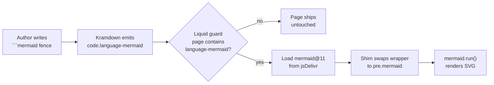

## What Changed

Future Debrief blog posts have been authoring ` ```mermaid ` fences since at least the **Generate Courses and Speeds Tool** post in February. The diagrams looked great in GitHub previews — and shipped to readers as raw text. The Jekyll `future-post` layout had no Mermaid wiring, so kramdown's `<pre><code class="language-mermaid">` blocks were never converted into anything renderable.

A ~12-line block in `_layouts/future-post.html` on `debrief.github.io` fixes it. The block loads `mermaid@11` from jsDelivr, but only on posts that contain a `language-mermaid` code class — non-diagram posts pay zero bytes. A small DOM shim swaps kramdown's nested wrapper (`<div class="highlighter-rouge"><div class="highlight"><pre><code class="language-mermaid">…</code></pre></div></div>`) for the `<pre class="mermaid">` form Mermaid's `run()` API expects, then runs the renderer.

## How the Pipeline Now Works



If you're reading this post on `debrief.github.io` and you can see the boxes-and-arrows diagram above, the cycle works end-to-end.

## What This Unlocks

Authors writing `shipped-post.md` in `debrief-future` no longer need to choose between "diagram that renders in GitHub previews but ships as text" and "screenshot that looks fine but can't be diffed in git". A single ` ```mermaid ` fence now does both.

The technical-specialist and content-specialist agent prompts have been updated to reflect this — Mermaid is now the recommended choice for explanatory diagrams in posts, not just an "if it renders, great" optimisation.

## Why CDN, Not Vendored

The original spike leaned toward vendoring `mermaid.min.js` into the website repo to satisfy the project's offline-by-default principle. That principle applies to *core platform functionality* — the services, the schemas, the file IO that has to keep working without a network. The public marketing site is explicitly an online-only surface, so vendoring would have added ~600 KB to git history per upgrade for no reader benefit. ADR-026 in `debrief-future` records that trade-off and the rejected alternatives (pre-rendering to SVG at publish time, custom Liquid tags).

## Related

- Layout patch: `debrief/debrief.github.io#90`
- Decision record: ADR-026 in `docs/project_notes/decisions.md`
- Research spike: `docs/project_notes/mermaid-in-blog-posts.md`
