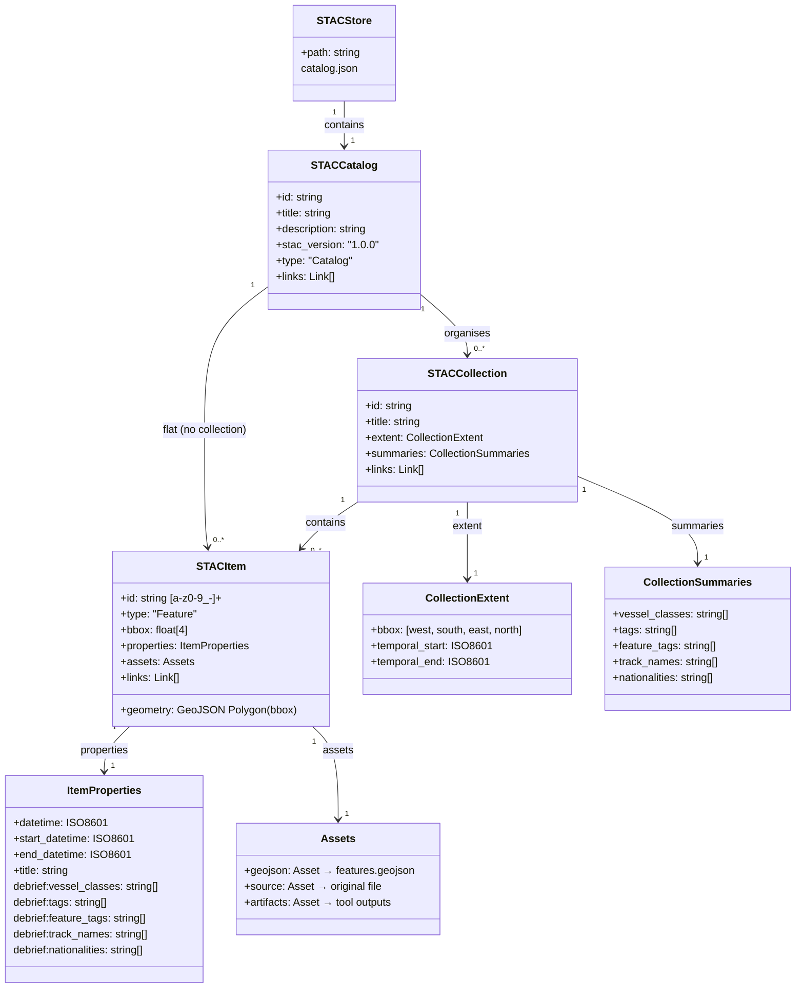
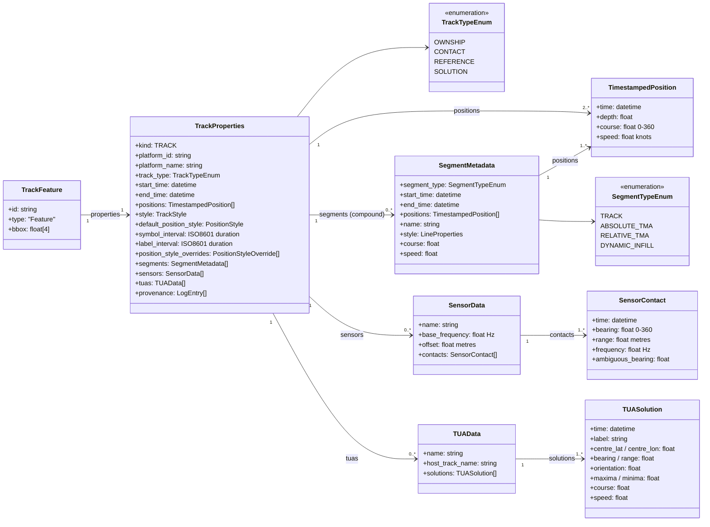
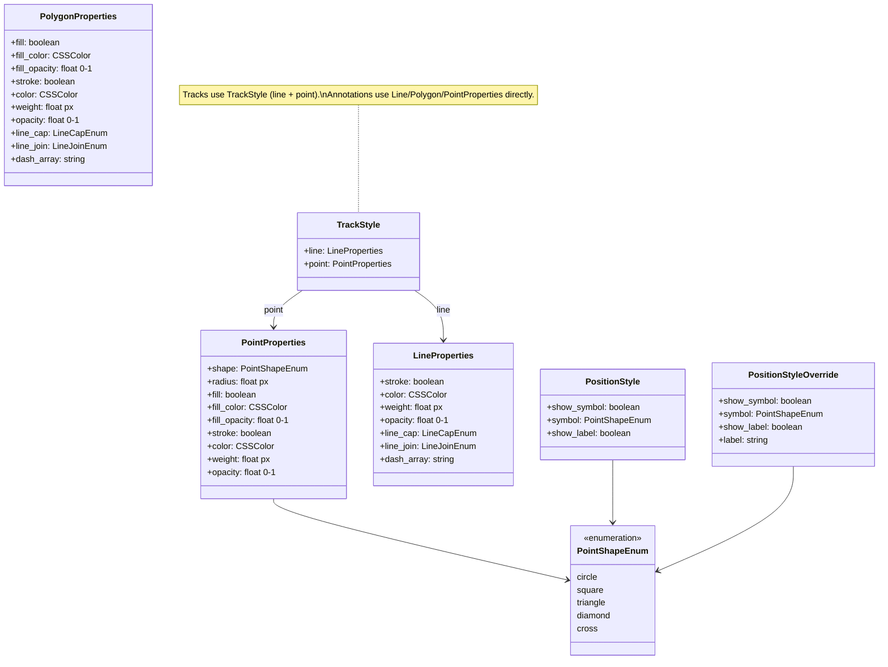
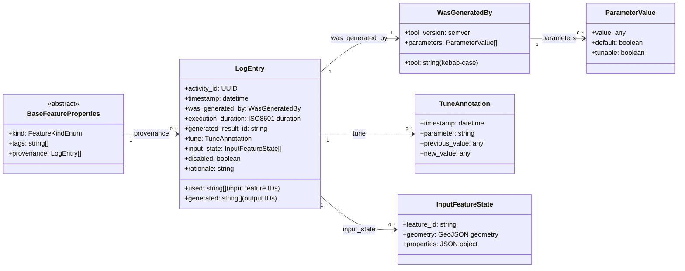
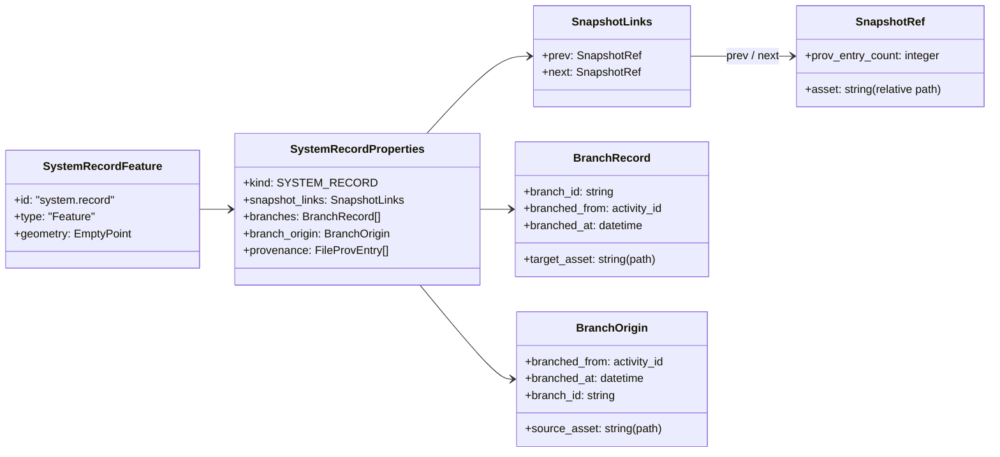
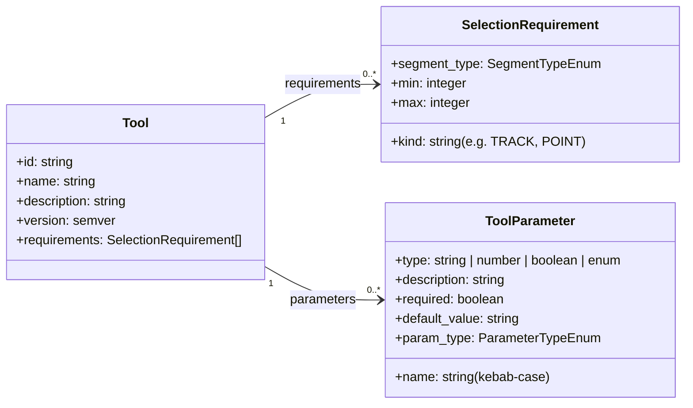
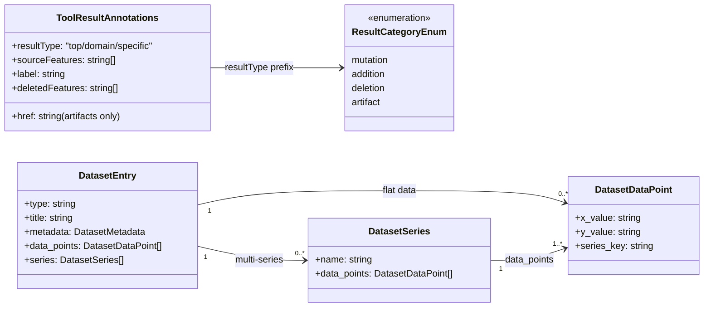
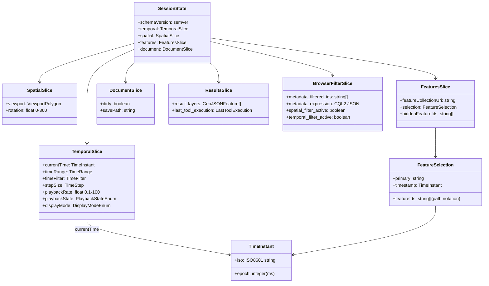
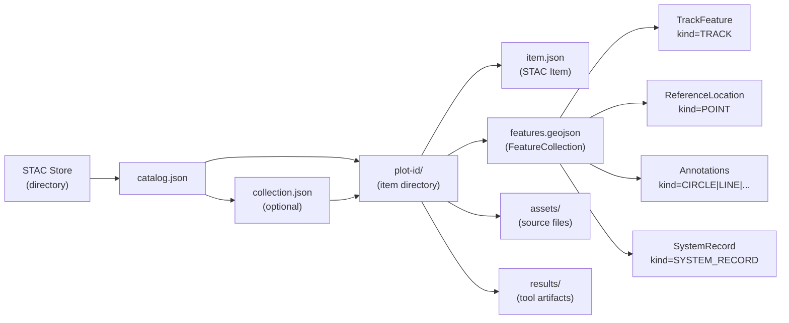

# Data Models

Visual reference for the Debrief v4.x data model, derived from the LinkML schemas in `shared/schemas/src/linkml/`.

## STAC Storage Hierarchy

How plots are organised on disk using STAC (SpatioTemporal Asset Catalog).



A STAC Store is a directory containing a root `catalog.json`. Items can live directly under the catalog (flat layout) or be grouped into collections. Each item's primary `geojson` asset points to a `features.geojson` file containing the plot's GeoJSON FeatureCollection.

### On-Disk Layout (Per-Item Folders)

Each STAC Item gets its own directory with sub-folders for source assets and tool output artifacts:

```
store-root/
├── catalog.json                       # Root STAC Catalog
├── exercise-alpha/                    # Item directory (named by plot ID)
│   ├── item.json                      # STAC Item metadata + asset refs
│   ├── features.geojson               # GeoJSON FeatureCollection (the plot)
│   ├── assets/                        # Original source files (provenance)
│   │   └── exercise-alpha.rep         # Imported REP file
│   └── results/                       # Tool output artifacts
│       ├── range-bearing-series.json  # Dataset from calc tool
│       └── bt_plot.png                # Generated chart image
└── training-run-1/
    ├── item.json
    ├── features.geojson
    └── assets/
        └── training-run-1.rep
```

- **`item.json`** contains STAC metadata, debrief: extension properties, and relative `href` links to assets
- **`features.geojson`** is the primary data asset (GeoJSON FeatureCollection with all domain features)
- **`assets/`** preserves original source files with provenance (source path, timestamp, tool version)
- **`results/`** stores computed artifacts from analysis tools (charts, reports, datasets)

## GeoJSON FeatureCollection (Plot Contents)

The `features.geojson` asset inside each STAC Item. All domain entities are GeoJSON Features discriminated by `properties.kind`.

```mermaid
classDiagram
    direction TB

    class FeatureCollection {
        +type: "FeatureCollection"
        +features: Feature[]
    }

    class Feature {
        <<abstract>>
        +type: "Feature"
        +id: string
        +geometry: Geometry
        +properties: BaseFeatureProperties
    }

    class BaseFeatureProperties {
        <<abstract>>
        +kind: FeatureKindEnum
        +tags: string[]
        +provenance: LogEntry[]
    }

    class TrackFeature {
        +geometry: LineString | MultiLineString
        +properties: TrackProperties
        kind = TRACK
    }

    class ReferenceLocation {
        +geometry: Point | MultiPoint
        +properties: ReferenceLocationProperties
        kind = POINT
    }

    class NarrativeEntry {
        +geometry: Point | null
        +properties: NarrativeEntryProperties
        kind = NARRATIVE
    }

    class CircleAnnotation {
        +geometry: Polygon
        +properties: CircleAnnotationProperties
        kind = CIRCLE
    }

    class RectangleAnnotation {
        +geometry: Polygon
        +properties: RectangleAnnotationProperties
        kind = RECTANGLE
    }

    class LineAnnotation {
        +geometry: LineString
        +properties: LineAnnotationProperties
        kind = LINE
    }

    class TextAnnotation {
        +geometry: Point
        +properties: TextAnnotationProperties
        kind = TEXT
    }

    class VectorAnnotation {
        +geometry: LineString
        +properties: VectorAnnotationProperties
        kind = VECTOR
    }

    class PolyAnnotation {
        +geometry: Polygon
        +properties: PolyAnnotationProperties
        kind = POLY
    }

    class MultiPointFeature {
        +geometry: MultiPoint
        +properties: MultiPointFeatureProperties
        kind = MULTI_POINT
    }

    class MultiPolygonFeature {
        +geometry: MultiPolygon
        +properties: MultiPolygonFeatureProperties
        kind = MULTI_POLYGON
    }

    class SystemState {
        +geometry: Point (empty coords)
        +properties: SystemStateProperties
        kind = SYSTEM
    }

    class SystemRecord {
        +geometry: Point (empty coords)
        +properties: SystemRecordProperties
        kind = SYSTEM_RECORD
    }

    FeatureCollection "1" --> "0..*" Feature : features
    Feature --> BaseFeatureProperties : properties
    Feature <|-- TrackFeature
    Feature <|-- ReferenceLocation
    Feature <|-- NarrativeEntry
    Feature <|-- CircleAnnotation
    Feature <|-- RectangleAnnotation
    Feature <|-- LineAnnotation
    Feature <|-- TextAnnotation
    Feature <|-- VectorAnnotation
    Feature <|-- PolyAnnotation
    Feature <|-- MultiPointFeature
    Feature <|-- MultiPolygonFeature
    Feature <|-- SystemState
    Feature <|-- SystemRecord
```



The `kind` property on each feature acts as a discriminator. Frontends use it to select the correct renderer and property panel.

> **Schema note:** Most properties classes inherit from `BaseFeatureProperties` via `is_a`. The exception is `SystemStateProperties`, which defines its own `provenance` field directly rather than inheriting. This is a minor inconsistency in the schema -- functionally equivalent but structurally divergent.

## TrackFeature Detail

Tracks are the richest feature type, supporting simple and compound (multi-segment) geometries, embedded sensor data, and TUA solutions.



**Simple vs compound tracks:** When `segments` is absent, geometry is `LineString` and the flat `positions` array maps 1:1 to coordinates. When `segments` is present, geometry is `MultiLineString` and each segment's `positions` maps to one LineString within the multi-geometry.

## Styling Model

All features carry styling properties following Leaflet naming conventions.



## Provenance (PROV-Aligned Logging)

Every feature carries an append-only provenance log recording tool operations.



## System Record (Plot-Level Metadata)

A special non-spatial feature per plot that carries snapshot chain links and branch records for versioning.



## Tool Metadata

Tools are analysis operations discovered via MCP, matched to the current selection.



## Tool Results

When a tool executes, its MCP response carries `ToolResultAnnotations` that tell the frontend how to apply the result. Results flow into `LogEntry.was_generated_by` on the affected features for provenance.



## Session State

Runtime state managed by the VS Code extension, persisted as JSON.



## STAC Extension Properties

Extension properties stored on STAC Items under the `debrief:` namespace, enabling discovery and filtering.

```mermaid
classDiagram
    direction TB

    class STACItem {
        +id: string
        +properties: ItemProperties
    }

    class StacExtensionProperties {
        +vessel_classes: string[]
        +tags: string[]
        +feature_tags: string[]
        +track_names: string[]
        +nationalities: string[]
    }

    class VesselClassPath {
        <<example>>
        "surface/warship/frigate/type23"
        "subsurface/submarine"
        "surface/auxiliary"
    }

    class VesselDomainEnum {
        <<enumeration>>
        surface
        subsurface
        unknown
    }

    class PlotSummary {
        +id: string
        +title: string
        +datetime: ISO8601
        +item_path: string
        +catalog_id: string
        +bbox: float[4]
        +time_extent: PlotTimeExtent
        +track_count: integer
        +location_count: integer
    }

    class StacItemSummary {
        +id: string
        +title: string
        +item_path: string
        +catalog_id: string
        +store_id: string
        +bbox: float[4]
        +start_datetime: ISO8601
        +end_datetime: ISO8601
        +vessel_classes: string[]
        +tags: string[]
        +nationalities: string[]
    }

    STACItem --> StacExtensionProperties : debrief:* properties
    StacExtensionProperties --> VesselDomainEnum
    VesselClassPath ..> StacExtensionProperties : vessel_classes
    PlotSummary ..> STACItem : derived from
    StacItemSummary ..> STACItem : derived from
```

## End-to-End: From Disk to Feature

How data flows from STAC storage through to individual GeoJSON features.


