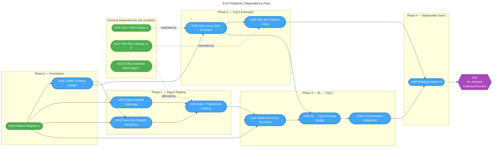

# Epic 10: NL-Assisted Catalog Discovery — Dependency Fishbone

## Dependency Summary

| Item | Depends On | Depended On By | Phase |
|------|-----------|----------------|-------|
| **#180** Platform Registry | — | #181, #182, #183, #187 | 0 |
| **#181** LinkML Schema Update | #180 | #183, #185 | 0 |
| **#182** Import Handler Warnings | #180 | #184 | 1 |
| **#183** Save-time Registry Resolution | #180, #181 | #184 | 1 |
| **#184** Nuke + Regenerate Catalog | #182, #183 | #187 | 1 |
| **#185** CQL2 `array_filter` Evaluator | #181 | #186, #188 | 2 |
| **#186** Filter Bar Platform Chips | #185 | #190 | 2 |
| **#187** Build-time Enum Extraction | #180, #184 | #188 | 3 |
| **#188** NL → CQL2 Prompt Design | #185, #187 | #189 | 3 |
| **#189** LLM Transport Integration | #188 | #190 | 3 |
| **#190** Stakeholder Demo UI | #186, #189 | — | 4 |

## Critical Path

**#180** → **#181** → **#183** → **#184** → **#187** → **#188** → **#189** → **#190**

This 8-item chain determines the minimum elapsed time. The critical path runs through Foundation → Import Pipeline → NL → CQL2 → Demo.

## Parallel Work Opportunities

- **#182** (Import Warnings) can start as soon as #180 is done (already complete)
- **#185** (CQL2 array_filter) can start as soon as #181 is done, independently of the Import Pipeline
- **#186** (Filter Bar Chips) and **#187** (Enum Extraction) can run in parallel once their respective prerequisites are met

## Legend

- 🟢 **Green (solid)** — Complete (E10 items)
- 🟢 **Green (dashed)** — Complete (external dependencies)
- 🔵 **Blue** — Proposed (not yet started)
- 🟣 **Purple** — Epic goal
