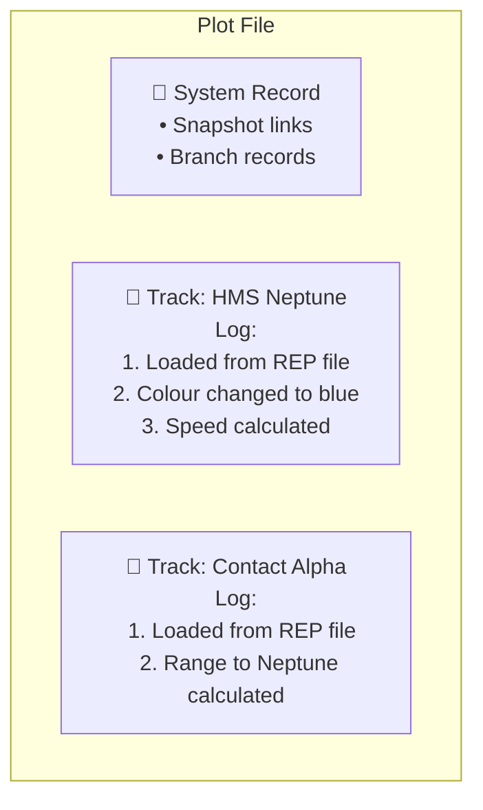
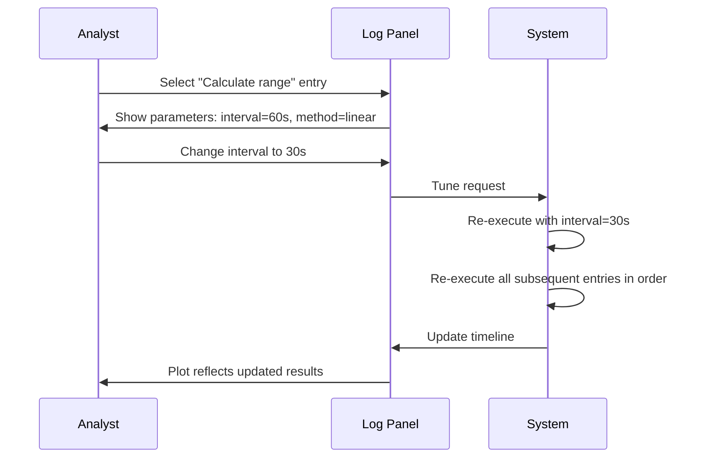
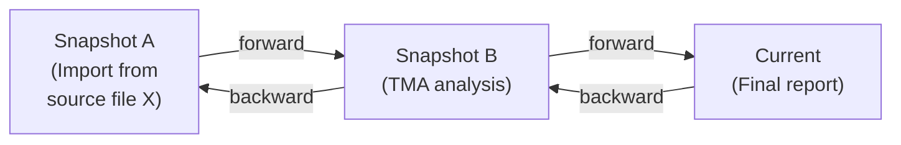
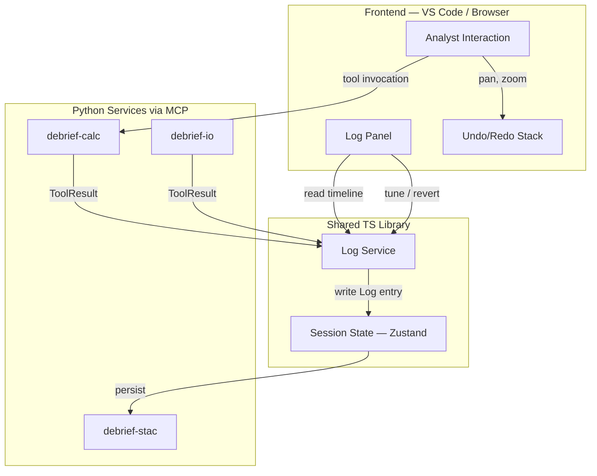
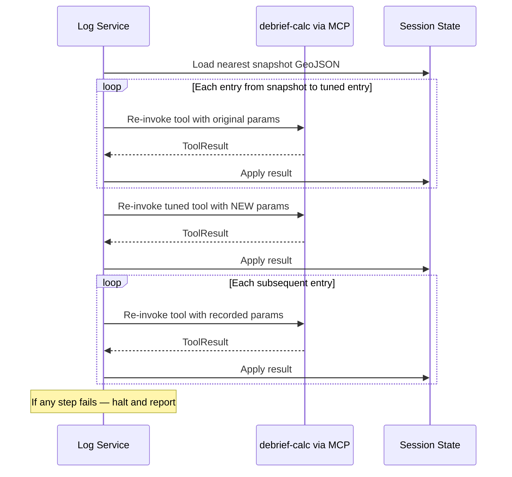

# Provenance & Undo in Future Debrief

---

## 1. Purpose

This document describes how Future Debrief will record the history of an analyst's work and let them navigate, refine, and branch that history. It covers two related but distinct capabilities:

- **The Log** — a persistent record of every data change to a plot, enabling audit, reproducibility, and parameter tuning
- **Undo/Redo** — reversing and reapplying user interface actions such as panning, zooming, and changing the replay time

---

## 2. Two Kinds of History

Future Debrief maintains two separate histories for different purposes.

```
┌─────────────────────────────────────────────────────────────┐
│                    Analyst's Session                        │
│                                                             │
│  ┌──────────────────────┐    ┌───────────────────────────┐  │
│  │   The Log             │    │   Undo/Redo Stack         │  │
│  │                       │    │                           │  │
│  │  • Tool invocations   │    │  • Pan / zoom             │  │
│  │  • File imports       │    │  • Replay time changes    │  │
│  │  • Property edits     │    │  • Layer visibility       │  │
│  │    (colour, label...) │    │  • UI-only state          │  │
│  │                       │    │                           │  │
│  │  Accessed via:        │    │  Accessed via:            │  │
│  │  Log Panel            │    │  Undo/Redo buttons        │  │
│  │  (opened on demand)   │    │                           │  │
│  │                       │    │                           │  │
│  │  Persisted to file    │    │  Session-only (except     │  │
│  │  with the plot        │    │  viewport & replay time   │  │
│  │                       │    │  saved on File/Save)      │  │
│  └──────────────────────┘    └───────────────────────────┘  │
└─────────────────────────────────────────────────────────────┘
```

**The rule is simple:** if an action changes the plot data, it goes in the Log. If it only changes how the data is displayed, it goes in the undo/redo stack.

---

## 3. The Log

### 3.1 What Gets Recorded

Every change to the plot's data is recorded as a Log entry:

| Action | Example | What's Recorded |
|--------|---------|-----------------|
| File import | Load a REP file | Source file, format, features created |
| Tool invocation | Calculate range between two tracks | Tool name, version, parameters, inputs, outputs |
| Property edit | Change a track's colour from red to blue | Feature, property, old value, new value |

From the Log's perspective, changing a track's colour is no different from running a bearing calculation — both are recorded operations that modify the plot.

### 3.2 Where Log Entries Live

Log entries are stored directly on the features they describe. Each track, contact, or result carries its own history.



A **system record** (not a real-world feature) carries plot-level history — snapshot links, branch records, and file lineage.

When a tool operates across multiple features (e.g. calculating range between two tracks), a Log entry is written to **each affected feature**, linked by a shared identifier. The Log Panel shows this as a single operation with drill-down to see which features were involved.

### 3.3 The Log Panel

The Log Panel is a dedicated view the analyst opens when they need to review or navigate analytical history. It assembles a global timeline from entries across all features, sorted by time.

```
┌─────────────────────────────────────────────────┐
│  Log Panel — Timeline                           │
├─────────────────────────────────────────────────┤
│                                                 │
│  14:32  Import REP file "exercise_042.rep"      │
│         → Created HMS Neptune, Contact Alpha   │
│                                                 │
│  14:35  Set property: HMS Neptune colour → blue│
│         [Tune] [Revert this] [Snapshot from here│
│                                                 │
│  14:38  Calculate range (Neptune ↔ Alpha)      │
│         interval=60s, method=linear             │
│         [Tune] [Revert this] [Snapshot from here│
│                                                 │
│  14:41  Calculate bearing (Neptune → Alpha)    │
│         frequency=1804Hz                        │
│         [Tune] [Revert this] [Snapshot from here│
│                                                 │
│  ──────── Snapshot boundary ────────            │
│  [Load more (8 earlier operations)]             │
│                                                 │
├─────────────────────────────────────────────────┤
│  [Revert to here ▾]  [Branch from here ▾]      │
└─────────────────────────────────────────────────┘
```

Selecting an entry shows drill-down detail: which features were affected, which properties changed, and the full parameter set used.

### 3.4 What a Log Entry Contains

Every Log entry records enough to fully reproduce the operation:

- **When** the operation occurred
- **What tool** (or built-in operation) ran, and which version
- **All parameters** including defaults — making the entry self-contained
- **Which features** were modified, and what changed
- **Any new outputs** created (features or result files)
- **How long** the operation took

---

## 4. Analyst Workflows

### 4.1 Tuning a Parameter

Tuning lets an analyst revisit a previous operation, change a parameter value, and see the effects ripple forward through all subsequent operations.



**Key behaviours:**

- Tuning triggers **immediate replay** — results update as soon as the parameter is changed
- **Everything after the tuned entry replays** — the system re-runs all subsequent operations in order, ensuring consistency
- All parameters are **tunable by default** — tool authors mark specific parameters as non-tunable only when changing them would be unsafe
- The Log preserves both the original and tuned values, maintaining full audit history

### 4.2 Reverting an Operation

The Log Panel offers two revert actions:

```
  "Revert to here"                    "Revert this"
  ─────────────────                   ───────────────

  Entry 1  ✓                          Entry 1  ✓
  Entry 2  ✓                          Entry 2  ✓
  Entry 3  ← revert point            Entry 3  ✗ ← removed
  Entry 4  ╳ discarded               Entry 4  ↻ replayed
  Entry 5  ╳ discarded               Entry 5  ↻ replayed
```

**Revert to here** — discards everything after the selected entry. The plot returns to the state at that point. This is **permanent**.

**Revert this** — surgically removes a single entry and replays all subsequent entries without it. This is **recoverable** — the removed entry can be restored if needed. If a subsequent entry fails because it depended on the removed one, the system halts and reports which entry failed and why.

### 4.3 Snapshots

Snapshots create save points in the analytical history. They bound the amount of history the system needs to process and give analysts meaningful waypoints.

```
  Snapshot A              Snapshot B              Current
  (clean file)            (clean file)            (file + Log)
  ┌──────────┐            ┌──────────┐            ┌──────────┐
  │ features │            │ features │            │ features │
  │          │◄──────────►│          │◄──────────►│ + Log    │
  │          │            │  (12 ops)│            │  (5 ops) │
  └──────────┘            └──────────┘            └──────────┘

  ◄──────────► = doubly-linked (navigate in either direction)
```

**How snapshots work:**

1. The current plot state is saved as a clean file with all Log entries removed
2. The working file starts fresh, linked to the snapshot in both directions
3. The link includes a count of entries, so the panel can show "12 earlier operations" without loading the file

**Snapshots are not the same as File/Save.** File/Save updates the current file in place, preserving accumulated Log entries. A snapshot is a deliberate archival action that starts a fresh Log.

**Creating a snapshot:** Analysts can take a snapshot via a menu action, or by selecting any entry in the Log Panel and choosing **"Capture snapshot from here."** This is useful immediately after an expensive operation (preserving a fast rollback point) or in preparation for branching.

**Why doubly-linked?** If source data is later found to be corrupted, an analyst can trace forward through the snapshot chain to identify all analysis products that relied on that data. Backward links enable history navigation; forward links enable impact assessment.

### 4.4 Navigating History Across Snapshots

On opening the Log Panel, only entries since the last snapshot are visible. The analyst can extend the view:

```
  ┌─────────────────────────────────────────────┐
  │              Log Panel                       │
  │                                              │
  │  ┌─ Current Log ───────────────────────┐     │
  │  │  14:32  Calc bearing                │     │
  │  │  14:28  Calc range                  │     │  ← Visible
  │  │  14:25  Set colour                  │     │    on open
  │  │  14:20  Import REP                  │     │
  │  └─────────────────────────────────────┘     │
  │                                              │
  │  [Load more (12 earlier operations)]         │
  │               │                              │
  │               ▼ click                        │
  │  ┌─ Previous Snapshot's Log ───────────┐     │
  │  │  13:55  TMA reconstruct             │     │
  │  │  13:48  Calc range                  │     │  ← Loaded
  │  │  ...8 more entries...               │     │    on demand
  │  └─────────────────────────────────────┘     │
  │                                              │
  │  [Load more (8 earlier operations)]          │
  │  [Load full history]                         │
  └─────────────────────────────────────────────┘
```

**"Load more"** follows the link to the previous snapshot and reveals its Log entries.

**"Load full history"** walks the entire chain back to the beginning.

### 4.5 Tuning Across Snapshot Boundaries

An analyst who has loaded earlier history can tune entries from before the current snapshot. The system reconstructs state by loading the appropriate snapshot, replaying from there through the tuned entry with the new parameter, and continuing through all subsequent entries — including crossing snapshot boundaries into the current file.

This may take noticeable time for long histories, but it preserves the analyst's ability to refine any past decision.

### 4.6 Branching

Branching lets an analyst explore an alternative analysis path without losing the current one.

```
  Original plot                              Branch plot
  ─────────────                              ───────────
  Entry 1: Import REP
  Entry 2: Set colour
  Entry 3: Calc range  ──── "Branch" ────►   Entry 1: Import REP
  Entry 4: Calc bearing                      Entry 2: Set colour
  Entry 5: TMA recon                         Entry 3: Calc range
                                             Entry 4: (analyst explores
       ◄──── two-way link ────►                       alternative...)
```

**How branching works:**

1. The analyst selects a point in the Log and chooses "Branch from here"
2. The system creates a new plot in the data store with the state at that point
3. The new plot's Log is trimmed to that point
4. Both the source plot and the branch record the link, providing two-way navigation
5. If the branch point is before the current snapshot, the system reconstructs the state from the appropriate snapshot

Source and branch are independent plots — changes to one do not affect the other — but the analyst can navigate between them and compare results.

---

## 5. Undo/Redo (UI State)

Undo/redo for user interface actions is completely separate from the Log.

| Aspect | Detail |
|--------|--------|
| **Scope** | Viewport (pan, zoom), replay time, layer visibility |
| **Access** | Standard undo/redo buttons in the toolbar |
| **Persistence** | In-memory only; viewport and replay time saved on File/Save |
| **Interaction with the Log** | None — undoing a pan does not affect analytical data |

Running a tool and then panning to inspect the results are independent actions — undoing the pan leaves the tool result in place.

---

## 6. Tracing Data Impact

The doubly-linked snapshot chain supports a critical defence requirement: tracing the impact of compromised data.



**Scenario:** Source file X is reported as containing errors after analysis is complete.

1. Analyst locates the import entry for source file X in the Log
2. Follows forward links through the snapshot chain
3. At each snapshot, reviews which operations used features derived from the import
4. Identifies all downstream results and reports that may be affected

Without forward links, this trace would require loading and searching every snapshot from the beginning — impractical for long-running analysis campaigns.

---

## 7. Priorities

Capabilities are ranked in implementation order:

| Priority | Capability | Description |
|----------|-----------|-------------|
| **P1** | Log Recording | Every data change recorded on features with full parameters |
| **P2** | Log Panel | Global timeline, drill-down, entry inspection |
| **P3** | Ephemeral Undo/Redo | Undo/redo for viewport, time, visibility |
| **P4** | Snapshots | Doubly-linked chain, "Load more", "Capture snapshot from here" |
| **P5** | Branching | Create new plot from any point in history |
| **P6** | Replay/Tune | Modify parameters, replay subsequent operations |

All capabilities are targeted for the March 2026 demonstration, though P5 and P6 may be shown as partial implementations.

---

## 8. Scenarios

### Scenario 1: Basic Analytical Session

1. Analyst imports a REP file → Log records the import on each created feature
2. Analyst changes Track Alpha's colour to blue → Log records the property edit
3. Analyst calculates range between Track Alpha and Track Bravo (interval=60s) → Log records the tool invocation on both tracks
4. Analyst pans the map to inspect the result → undo/redo stack records the pan
5. Analyst presses Undo → the **pan** is undone; the range calculation remains
6. Analyst opens the Log Panel → sees three entries: import, colour change, range calculation

### Scenario 2: Tuning a Parameter

1. Analyst opens the Log Panel and selects the "Calculate range" entry
2. Panel shows: interval=60s, method=linear
3. Analyst changes interval to 30s
4. System immediately re-executes the range calculation with the new value, then replays all subsequent entries
5. The plot updates to show the new results
6. The Log entry shows both the original and tuned values

### Scenario 3: Reverting a Mistake

1. Analyst accidentally runs the wrong tool
2. Opens the Log Panel, finds the erroneous entry
3. Clicks "Revert this"
4. System removes the entry and replays subsequent entries without it
5. If a subsequent entry fails, the system halts and reports which one and why
6. The reverted entry remains recoverable

### Scenario 4: Long Session with Snapshots

1. Analyst works through a complex analysis, accumulating 30 Log entries
2. Reaches a stable point and takes a snapshot
3. Continues working, accumulating 10 more entries
4. Later, wants to revisit an early decision — clicks "Load more (30 earlier operations)"
5. Previous entries appear in the timeline
6. Tunes a parameter from the earlier phase → system replays through the snapshot boundary

### Scenario 5: Branching to Explore Alternatives

1. Analyst has completed an analysis and wants to try a different approach from step 3
2. Selects step 3 in the Log Panel and clicks "Branch from here"
3. A new plot appears in the data store with state matching step 3
4. Analyst works the alternative on the branch
5. Both plots link to each other — analyst can switch between them to compare

### Scenario 6: Tracing Corrupted Source Data

1. A source file used weeks ago is reported as containing errors
2. Analyst opens the original plot, locates the import entry in the Log
3. Follows forward links through snapshots to identify all operations that used the imported features
4. Identifies the three plots (original plus two branches) that contain results derived from the corrupted data
5. Reports which analyses need to be re-run with corrected data

---

## Annex A: Technical Architecture

### A.1 Two Mechanisms, Two Implementations

| Concern | The Log | Undo/Redo |
|---------|---------|-----------|
| **What** | Data changes (GeoJSON mutations) | UI state (viewport, time, visibility) |
| **Mechanism** | Log entries on feature properties | Command pattern (before/after snapshots) |
| **Storage** | Persisted inline in GeoJSON | In-memory; viewport/time saved on File/Save |
| **Interface** | Log Panel (on demand) | Toolbar undo/redo buttons |
| **Implementation** | TypeScript shared library in `/shared/components` | Frontend-specific (VS Code, browser) |

### A.2 Service Architecture

The Log service is a TypeScript library, not a Python service. This is a deliberate departure from the "domain logic in Python" pattern because the Log is a session-state concern tightly coupled to frontend orchestration. Python services remain focused on pure data transformation — they return results and have no knowledge of the Log.



Python services return a **ToolResult** after each operation, containing:

- Features modified (IDs + which properties changed)
- New features/assets created (references to outputs)
- Tool identity and version
- Full resolved parameter set (including defaults)
- Execution duration

The Log service wraps each ToolResult in a Log entry with timestamp and activity ID, then writes it to the appropriate features in session state.

When Python code runs inside VS Code (e.g. a DSTL scientist's script), the session-state wrapper accepts a description string in the `set` call and wraps it in a Log entry automatically.

### A.3 Log Entry Data Model

Log entries use vocabulary inspired by W3C PROV, defined in the project's LinkML schema. This provides conceptual alignment with the established provenance standard without being constrained by the W3C PROV-JSON serialisation format. A future export to PROV-JSON is possible via LinkML's multi-target generation.

Example Log entry as stored in `feature.properties.provenance`:

```json
{
  "activityId": "act-001",
  "timestamp": "2026-02-06T14:38:00Z",
  "wasGeneratedBy": {
    "tool": "calculate-range",
    "toolVersion": "1.2.0",
    "parameters": {
      "interval": { "value": "PT60S", "default": true, "tunable": true },
      "method": { "value": "linear", "default": false, "tunable": true }
    }
  },
  "used": ["feature-id-Neptune", "feature-id-alpha"],
  "generated": ["feature-id-range-result"],
  "executionDuration": "PT0.3S",
  "tune": null
}
```

A **tune annotation** is appended when a parameter is modified:

```json
{
  "tune": {
    "timestamp": "2026-02-06T15:10:00Z",
    "parameter": "interval",
    "previousValue": "PT60S",
    "newValue": "PT30S"
  }
}
```

Property edits are modelled as invocations of a built-in `set-property` tool:

```json
{
  "activityId": "act-002",
  "timestamp": "2026-02-06T14:35:00Z",
  "wasGeneratedBy": {
    "tool": "set-property",
    "toolVersion": "1.0.0",
    "parameters": {
      "property": { "value": "colour", "tunable": true },
      "newValue": { "value": "blue", "tunable": true },
      "previousValue": { "value": "red", "tunable": false }
    }
  },
  "used": ["feature-id-Neptune"],
  "generated": [],
  "executionDuration": "PT0.01S",
  "tune": null
}
```

### A.4 System Record Structure

Each plot's GeoJSON contains a system feature (null geometry) carrying file-level metadata:

```json
{
  "type": "Feature",
  "geometry": null,
  "properties": {
    "featureType": "system",
    "snapshotLinks": {
      "prev": {
        "asset": "plot-snapshot-2026-02-06T14-00.geojson",
        "provEntryCount": 12
      },
      "next": null
    },
    "branches": [
      {
        "branchId": "branch-alt-tma",
        "branchedFrom": "act-008",
        "branchedAt": "2026-02-06T16:00:00Z",
        "targetAsset": "plot-branch-alt-tma.geojson"
      }
    ],
    "provenance": [
      {
        "activityId": "file-001",
        "type": "snapshot",
        "timestamp": "2026-02-06T14:00:00Z",
        "asset": "plot-snapshot-2026-02-06T14-00.geojson"
      },
      {
        "activityId": "file-002",
        "type": "branch",
        "timestamp": "2026-02-06T16:00:00Z",
        "branchId": "branch-alt-tma",
        "direction": "source"
      }
    ]
  }
}
```

The corresponding snapshot file's system record carries the reciprocal link:

```json
{
  "snapshotLinks": {
    "prev": {
      "asset": "plot-snapshot-2026-02-06T13-00.geojson",
      "provEntryCount": 8
    },
    "next": {
      "asset": "plot.geojson",
      "provEntryCount": 5
    }
  }
}
```

### A.5 Snapshot Chain

Snapshots form a doubly-linked list through the system record. Each file knows both its predecessor and its successor:

```
  Snapshot A              Snapshot B              Current
  ┌────────────────┐      ┌────────────────┐      ┌────────────────┐
  │ prev: nil      │◄────►│ prev: A        │◄────►│ prev: B        │
  │ next: B        │      │ next: Current  │      │ next: nil      │
  │ 8 Log entries  │      │ 12 Log entries │      │ 5 Log entries  │
  └────────────────┘      └────────────────┘      └────────────────┘

  ◄── backward: history navigation ("Load more")
  ──► forward: impact tracing (corrupted data)
```

When a snapshot is taken:
1. Current plot state is saved as a new clean GeoJSON file (all Log entries stripped from features)
2. The snapshot's system record gets `next` pointing to the current working file and `prev` pointing to the previous snapshot
3. The working file's system record gets `prev` pointing to the new snapshot, `next` set to null
4. The previous snapshot's `next` is updated to point to the new snapshot

**"Capture snapshot from here"** (from the Log Panel) works identically but reconstructs the state at the selected entry before saving the clean file. Entries after the selected point remain in the working file's Log.

STAC integration: all snapshot files are stored as assets within the same STAC Item as the working plot file:

```
STAC Catalog
└── Exercise 042 (Collection)
    └── Plot Alpha (Item)
    │   ├── plot.geojson              ← current state + Log entries
    │   ├── plot-snap-001.geojson     ← snapshot (clean, doubly-linked)
    │   ├── plot-snap-002.geojson     ← snapshot (clean, doubly-linked)
    │   └── exercise_042.rep          ← source file (preserved)
    └── Plot Alpha — Branch TMA (Item)
        ├── plot.geojson              ← branched state + Log entries
        └── ...
```

### A.6 Replay Mechanics

Replay is **positional** — all entries after the tuned entry in the assembled timeline are re-executed in order.



**Cross-snapshot replay:** When the tuned entry is from a previous snapshot, the system loads that snapshot's GeoJSON, replays its Log entries up to and including the tuned entry (with new params), continues through the remaining entries in that snapshot's chain, then crosses each snapshot boundary — loading the next file's Log entries and replaying those — until the current working file is fully reconstructed.

**Tool version matching is strict** — if the currently installed tool version does not match the version recorded in the Log entry, replay halts and the analyst must resolve the mismatch before continuing. Resolution may include updating the tool or accepting the mismatch.

**Revert-this mechanics:** The removed entry is marked as soft-deleted (not physically removed). Replay skips the deleted entry and continues with subsequent entries. If a subsequent entry fails (because it depended on the removed entry's output), replay halts with a report identifying the failing entry and the dependency. The analyst can then recover the soft-deleted entry or remove the failing entry too.

### A.7 Typed Parameters

Tool parameters carry rich type information defined in the LinkML schema, enabling the Log Panel to present appropriate editing affordances during tuning:

| Type | Validation Constraints | Panel Affordance |
|------|----------------------|-----------------|
| `Float` | min, max | Numeric input with bounds |
| `Integer` | min, max | Numeric input with bounds |
| `Duration` | min, max | Duration picker (ISO 8601) |
| `Enum` | allowed values | Dropdown |
| `Boolean` | — | Toggle |
| `String` | pattern (regex) | Text input with validation |

All parameters are **tunable by default**. Tool authors opt out specific parameters by setting `tunable: false` in the tool definition — this is appropriate when replay with different values would be unsafe or meaningless (e.g. a file path reference, or a parameter that was auto-detected from the data).

Invalid parameter values are rejected with descriptive messages before replay begins, preventing wasted computation on a doomed replay chain.

### A.8 ToolResult Contract

The ToolResult is the contract between Python services and the Log service. Every tool invocation (including the built-in `set-property`) must return a ToolResult containing:

| Field | Description |
|-------|-------------|
| `modifiedFeatures` | List of feature IDs + which properties changed on each |
| `createdFeatures` | References to any new features added to the plot |
| `createdAssets` | References to any new result files (e.g. exported reports) |
| `tool` | Tool identifier string |
| `toolVersion` | Semantic version of the tool |
| `parameters` | Full resolved parameter set including defaults |
| `executionDuration` | Wall-clock time for the operation |

The Log service adds `activityId` and `timestamp`, then distributes the entry to the appropriate features.

### A.9 Global Timeline Assembly

The Log Panel assembles the global timeline at runtime by:

1. Collecting `feature.properties.provenance` arrays from all features in the current GeoJSON
2. Merging entries, deduplicating on `activityId` (multi-feature operations appear once)
3. Sorting by `timestamp`
4. If "Load more" is active, repeating steps 1–3 for each loaded snapshot and concatenating

The timeline is a runtime view, not a persisted structure. This avoids synchronisation issues between the distributed per-feature entries and a central index.

### A.10 Jupyter Notebooks

The Log service is a TypeScript library, so Jupyter notebooks do not currently participate in logging. This is a future consideration — a Python Log library could be developed to provide equivalent recording for notebook workflows, writing the same entry structure to feature properties.

---

## Annex B: Architectural Alignment

### B.1 Constitutional Compliance

| Constitutional Principle | How the Log Addresses It |
|--------------------------|-------------------------|
| **Art. I: Reproducibility** — "given the same inputs and tool versions, analysis must produce identical results" | Full parameter recording (including defaults) + strict version matching ensures any Log entry can be independently reproduced |
| **Art. III: Provenance always** — "every transformation must record lineage: source file → method/version → output" | Every GeoJSON mutation generates a Log entry with complete lineage |
| **Art. III: Audit trail immutable** — "provenance records cannot be modified after creation" | Log entries are append-only; tunes are recorded as annotations, not modifications to original entries |
| **Art. III: Source preservation** — "original files are always retained as STAC assets" | File import Log entries reference the preserved source asset |
| **Art. IV: Services never touch UI** — "Python services return data only" | Python tools return ToolResults; the TS Log service handles recording and presentation |
| **Art. IV: Frontends never persist** — "all data writes go through services" | Log entries are written to session state and persisted via debrief-stac |

### B.2 Architectural Boundary: Why TypeScript?

The Log service being TypeScript rather than Python is a considered departure from the "thick services, thin frontends" principle. The rationale:

- The Log is fundamentally a **session-state concern** — it observes what the frontend orchestrates and records it
- Python services are **stateless transformations** — they take inputs, produce outputs, and have no concept of "session" or "history"
- The Log service needs tight integration with **Zustand session state** and **frontend event handling**
- Placing it in Python would require the frontend to relay every operation to a Python service for recording, adding latency and complexity for no architectural benefit

The Python services remain thick: they contain all domain logic, validation, and computation. The Log service is thin: it wraps ToolResults in timestamped entries and manages the timeline. This is consistent with the frontier's role as the orchestration layer.

---

## Annex C: Glossary

| Term | Definition |
|------|-----------|
| **Activity ID** | Unique identifier for an operation. Shared across features when one operation affects multiple features. |
| **Branch** | A new plot created from a point in another plot's history. Two-way linked to the source. |
| **Capture snapshot from here** | Log Panel action to create a snapshot at any entry — useful after expensive operations or before branching. |
| **Load more** | Log Panel action to reveal earlier history by following the snapshot chain backward. |
| **Log** | The persistent record of all data changes to a plot, stored on the features themselves. |
| **Log entry** | A single recorded operation: timestamp, tool, parameters, inputs, outputs. |
| **Log Panel** | The analyst's on-demand interface for reviewing, tuning, and reverting the analytical timeline. |
| **Positional replay** | Re-executing all entries after a tuned entry in timeline order. |
| **Revert this** | Remove a single entry and replay subsequent entries. Recoverable. Halts on downstream failure. |
| **Revert to here** | Discard everything after the selected entry. Permanent. |
| **Snapshot** | A clean copy of the plot with Log entries removed, forming a waypoint in the history chain. Doubly-linked for both history navigation and impact tracing. |
| **System record** | A non-spatial record in the plot file carrying snapshot links, branch records, and file-level history. |
| **Tune** | Modify a parameter on a Log entry and replay all subsequent entries with the updated value. |
