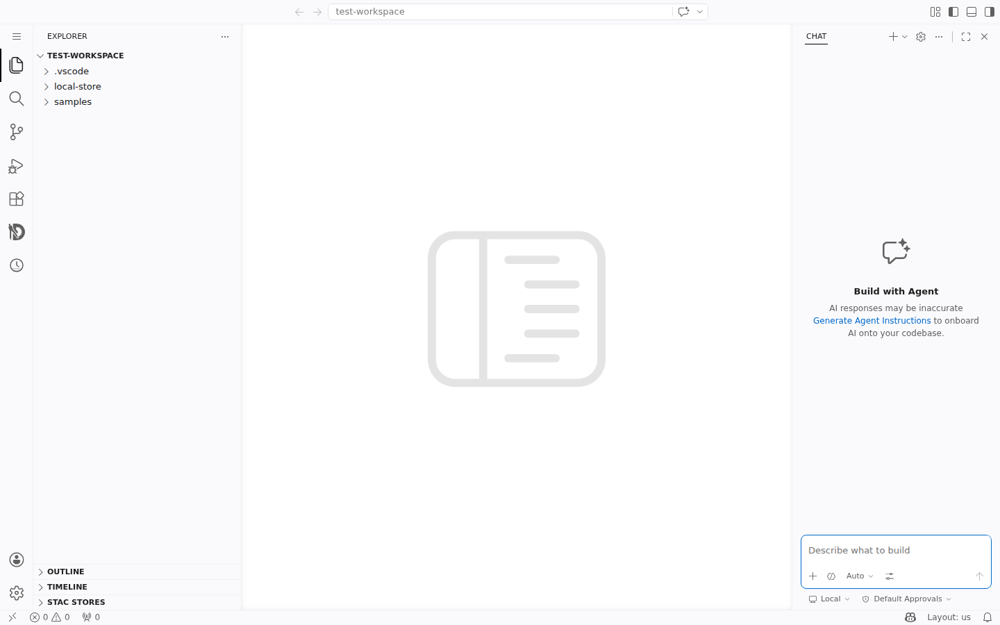
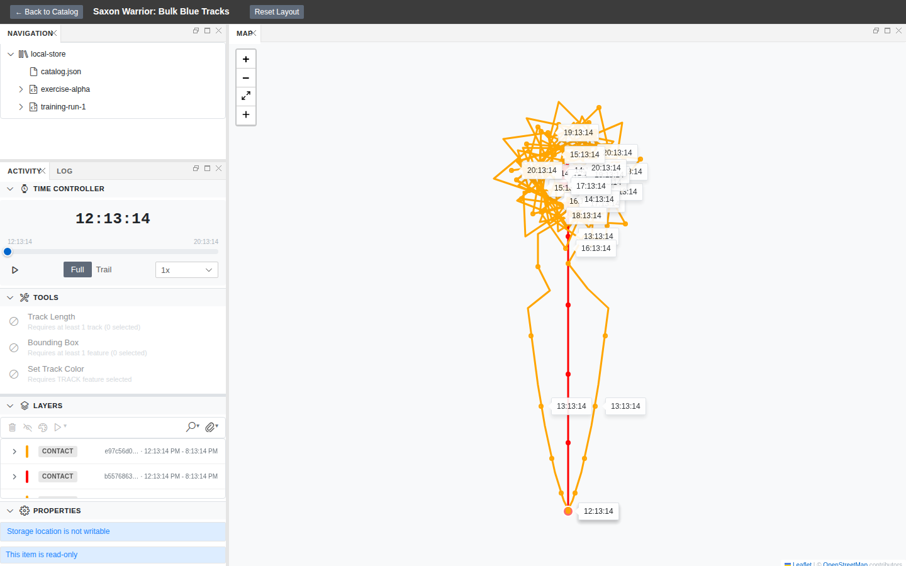
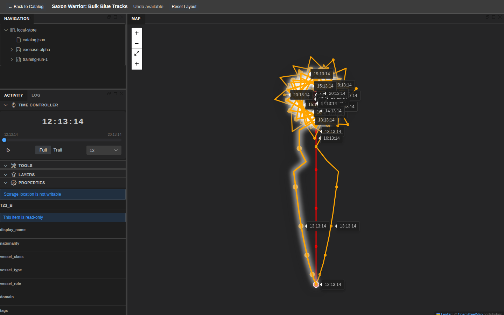
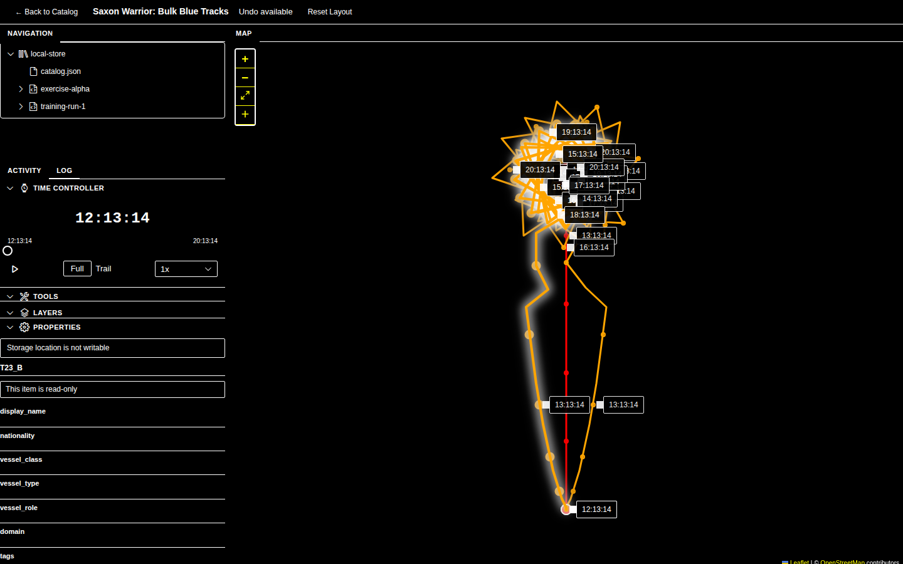
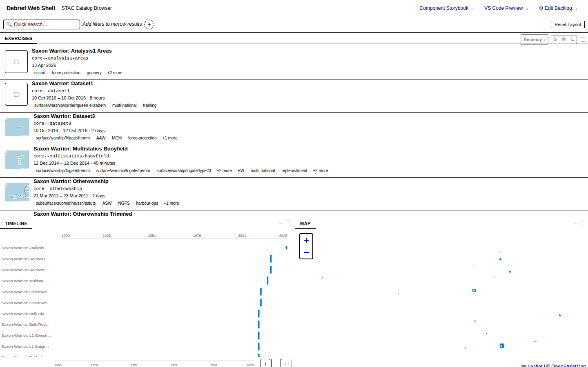
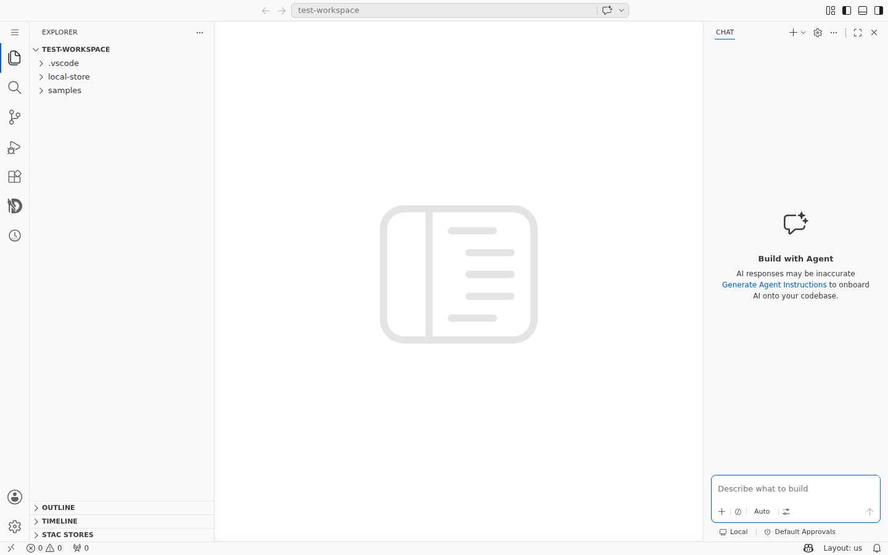
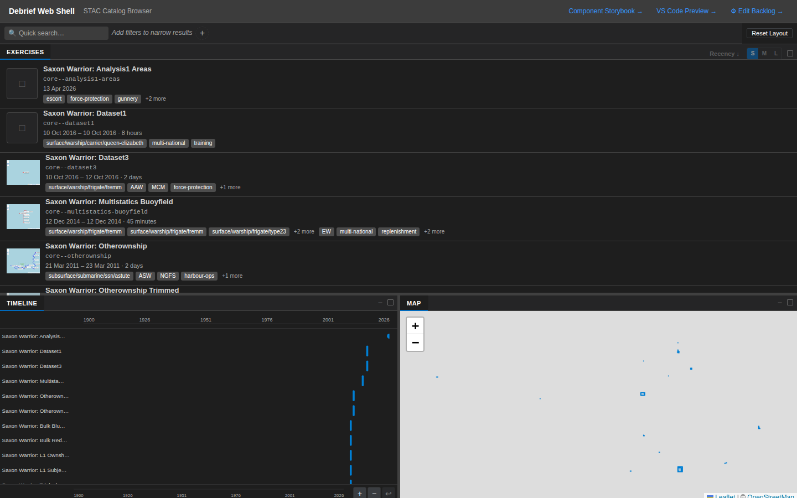
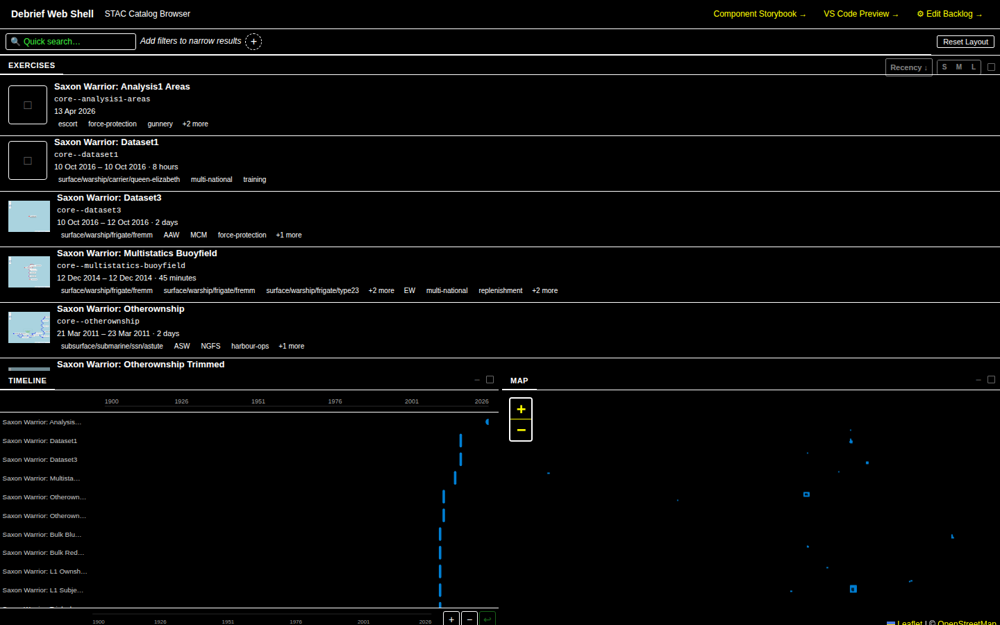

> **2026-06-06 — Revisited.** Six weeks after the original review (393 commits
> of source movement later), we walked the same recipe again on the latest
> `origin/main` to see what's changed. See the **[2026-06-06 update](#2026-06-06-update)**
> at the bottom of this post — 4 of the 5 P1 items are now resolved.
> Evidence in `docs/project_notes/evidence/ui-review-2026-06-06/`.

## Why this review

For the last few sprints, several Claude Code cloud sessions ran without a working
`pnpm install`, so we shipped a number of features without ever loading the actual
running UI. Now that the registry block is fixed, we did a sweep: 62 screenshots
across the web-shell, the analysis view at three viewport sizes, every theme
(light / dark / high-contrast light / high-contrast dark), the Storybook surface
for VS Code-themed components, and the new storyboard / log / drawing tool views.

The headline: **the capability set is impressive — most of what the v3 platform did
is now reachable in one session — but the seams between features show. A handful
of small fixes would substantially raise the perceived polish.**

This post records what we found and the recommended order to address it.
Fourteen recommendations, prioritised P1 → P3, across both the web-shell and
the VS Code extension host.

## What we tested

- **Local web-shell** at `http://localhost:5173` — the full single-page version of
  the analysis stack (StacBrowser + GoldenLayout + ActivityPanel + MapView).
- **Storybook** at `http://localhost:6006` — for components that don't naturally
  appear in the live data, including the VS Code theme variants of
  `ActivityPanel` and `ToolsPanel`, the FilterBar, the LogPanel rich-card
  variants, and the Geoman drawing toolbar.
- **Existing E2E spec runs** for theme-runtime-switch, storyboard-edit, and
  properties-screenshots. The properties-screenshots suite was 2 × flaky (timeout
  on `[data-testid="properties-form"]` after clicking a row) — bug noted below.
- **Three viewports** — 1280×720, 1440×900, 1920×1080.
- **code-server (browser-hosted VS Code)** with the Debrief extension
  installed via `apps/vscode/debrief-vscode-0.1.0.vsix`, brought up via the
  documented `tests/e2e/scripts/cloud-e2e-setup.sh` pipeline. All 4 of the
  preview-smoke tests pass, and the `activity-panel-screenshot` test confirms
  the webview activates and renders React content. The full plot view evidence
  comes from the existing `real-webview` capture artefacts.

## What's working well

A few things deserve to be called out before we dig into the gaps:

**1. The catalog is a real product surface, not a placeholder.** The
StacBrowser ships with a lozenge-style filter bar (`Vessel Class`, `Tag`,
`Author`, `Nationality`, `Duration`, `Title`, …), a quick-search box, a
recency-sorted exercise list, AND a synced timeline + map preview at the
bottom. That's a lot of capability in one screen.


**2. The storyboard panel is a clean surface.** Capturing scenes, editing
descriptions in-place, an overflow menu with sensible verbs ("Update to
current", "Duplicate", "Copy to other storyboard", "Refresh thumbnail"), and a
proper hard-block modal for the "scene refers to deleted features" case. The
edit-form uses the same affordances as the rest of the app.


**3. Symbology in the Storybook fixtures is genuinely informative.** The
`Components/MapView/Exercise Alpha` story shows what good rendering looks like:
red and blue temporal tracks, dashed bounding shapes, faded points, a clear
legend of what's selected.


**4. The log panel rich cards punch above their weight.** Five chip types
(category, parameter, file, colour-swatch, "+N more"), four view modes
(Timeline, By Feature, Compact, Detailed), and a card-flip primitive for
rationale/edit. The information density is excellent without feeling cluttered.


**5. The high-contrast dark theme actually looks correct.** Bright accent
colours, real outlines on every interactive element, no washed-out greys. This
is a working theme, not a stub.


## What needs attention

### P1 — These cost users trust

**P1.1 — The default analysis view shows tracks as undifferentiated grey lines.**
In the live web-shell at every viewport (1280, 1440, 1920) the loaded
`exercise-alpha` data renders both tracks (`track-hms-defender`,
`track-uss-freedom`) as the same grey colour. The Storybook fixture for the
same exercise renders them as distinct red and blue. Either the per-track
colour metadata isn't being applied, or the sample catalog needs default
colours set. Either way, an analyst's first impression is "I can't tell the
ships apart."


vs.


**Recommendation:** trace why the symbology pipeline drops colours between the
fixture and the live load — likely a missing platform-registry hook or a
`stroke` property that isn't applied at render time. This is the single
biggest perceived-quality gap in the live app.

**P1.2 — Properties form does not respond to dark theme.** The
`193-properties-panel/evidence` light and dark screenshots are pixel-identical.
The form (Title, Datetime, Tags, …) keeps a light background even when the
host theme is dark. This is a real visual bug, not a screenshot artefact —
both files have the same byte size in light/dark variants.


**Recommendation:** the properties-side-panel renderer isn't subscribing to the
theme tokens. Either the wrapper is forcing `color-scheme: light`, or the form
is using hard-coded greys instead of `var(--debrief-bg)` etc. Audit any
explicit colour values in `properties-side-panel.tsx`.

**P1.3 — High-contrast LIGHT theme has invisible top-right links.** The
"Component Storybook →" and "VS Code Preview →" header links use a low-contrast
blue on the very-light high-contrast background. They're effectively
unreadable.


**Recommendation:** these links want a dedicated HC token (`--debrief-link-hc`)
or, more simply, an underline + bolder weight in HC mode. WCAG AAA in HC mode
is non-negotiable for the platform's UK Defence audience.

**P1.4 — properties-screenshots E2E suite is flaky.** Both light and dark
runs failed on first attempt with `waitForSelector('[data-testid="properties-form"]')`
after clicking a track row. They passed on retry. This is the kind of flake
that hides real regressions — a 50% miss rate on retries means we'd notice if
properties broke completely, but not if it broke for one feature type.

**Recommendation:** add an explicit `await expect(page.locator(...)).toBeVisible()`
gate before the click, with a longer timeout (15s already exists, but the gate
is on the wrong selector — it waits for the form to appear before the click
that opens it). Two-line fix.

### P2 — Layout and screen-space issues

**P2.1 — The default GoldenLayout split wastes a third of a 1920×1080 screen.**
At the analyst's typical resolution, the activity-panel column is ~25 % of the
window but holds Time Controller (full width — fine), Tools (4 entries, lots
of empty space), Layers (5 features — readable), Properties (collapsed). The
map gets the rest, but on a 1920-wide screen the map is over-sized for the
loaded data and the activity column is over-narrow for its longest tool names.


**Recommendation:** the default split should scale with viewport. At ≤1366
keep ~280 px left rail; at ≥1600 grow to ~360–400 px. GoldenLayout supports
percentage-based defaults — set them as a function of breakpoint. Also
consider giving the Tools list an "expand/collapse" so it doesn't dominate
when there are ten tools and only two are applicable.

**P2.2 — At 1280×720, the entire bottom row of features (Properties, second
TRACK row beyond the fold) is below the fold, and there's no visual hint of
"scroll for more."** A laptop user opens the plot, sees the time controller,
and may not realise there's a Properties panel at all.


**Recommendation:** at narrow heights, collapse Tools and Layers
section-by-default once a feature is selected, OR float the Properties panel
out of the activity column into a right-side dock. The current design forces
one of: scroll inside the activity column, switch to a maximised layout, or
miss the panel entirely.

**P2.3 — The catalog timeline + map preview pair occupies ~50 % of vertical
space on a 1440-wide screen, but the timeline only shows a sparse vertical
strip of points clustered around 2026.** That's a lot of pixels to convey
"these all happened recently." The map preview is similarly empty — most
exercises plot as 1 px dots.


**Recommendation:** make the bottom row collapsible (chevron on the panel
title bars) so users with tall lists can claim that vertical space. Default
collapsed for first-time users, default open after the first dataset is
loaded. The Reset Layout button proves the panel system supports it; expose
the toggle.

**P2.4 — The thumbnail S/M/L size toggle in the catalog appears not to take
effect.** Clicking 'M' or 'L' toggles the active state of the button but the
exercise-list item heights don't change. The capability is in the UI but not
wired through.

**Recommendation:** either wire the size up to `--debrief-thumbnail-size`
CSS var on the list root, or remove the toggle until it's functional. Half-wired
controls are worse than no control.

### P3 — Polish and discoverability

**P3.1 — Two `+` icons stack on the left of every map.** The Leaflet zoom-in
control sits at the top, then the maximise control, then a `+` at the bottom
that's actually the Layers-panel "add layer / draw" trigger. Two `+` icons
adjacent in the same toolbar is confusing.


**Recommendation:** swap the bottom `+` for a pencil / draw icon. The Geoman
toolbar story uses dedicated point/line/polygon icons — apply the same icon
language to the layers-add affordance.

**P3.2 — The "Tools" list shows greyed-out tools with the same disabled-circle
icon as live tools, making it hard to tell at a glance which 2 of 5 are
applicable to the current selection.** The visual difference is text-colour
only.


**Recommendation:** active tools should keep the wrench icon; disabled tools
should use the prohibited (∅) icon they already have, but with stronger
greyscale on the entire row (not just the title). Or move disabled tools
under a collapsible "Not applicable to current selection (3)" group.

**P3.3 — The activity panel "ACTIVITY / LOG" tab pair is easy to miss and
hard to discover.** It's a 70 px-wide header at the top of the activity
column, and the LOG tab looks like a label more than a tab. Several review
attempts tried clicking visible "log" text on the catalog screen instead.

**Recommendation:** add a visible underline / pill background to the active
tab. Optionally surface the log via a keyboard shortcut and/or a status-bar
counter ("12 log entries") so users know it's there before exploring.

**P3.4 — The "Reset Layout" button in the analysis-view header is the only
hint that the layout is customisable.** No drag handles, no panel-resize
cursors visible without hovering, no "drag to dock" affordance.

**Recommendation:** an empty-state tip on first session: "💡 Drag panel
headers to rearrange; right-click for more options." Dismiss after first
panel move.

**P3.5 — The catalog filter add-button popover is a flat list of filter
types with no grouping, no icons, no description.** "Filename" sits next to
"Plot Contents" with no hint of what either does. This is the entry point
into the filter system — first impression matters.


**Recommendation:** group into "Metadata" (Title, Author, Modified, …),
"Content" (Filename, Plot Contents, Track Name, …), "Operational"
(Vessel Class, Nationality, Tag, Collection, Duration). Add a short
hover-tooltip on each row.

## VS Code surface (code-server)

Once `tests/e2e/scripts/cloud-e2e-setup.sh` was located and run, the full
VS Code host became reviewable in this session — that procedure was
documented in `docs/project_notes/code-server-cloud-testing.md` and worked
without modification. The 4-test preview-smoke suite passed in 19.7 s.



**Working well:**

- The activity-bar profile is configured for "focused analysis" — the
  toast says so explicitly. Source Control, Search, etc. are hidden by
  default to leave room for the Debrief icon (the "D" on the activity bar).
- The activity panel is a 1:1 of the web-shell's: Time Controller, Tools,
  Layers, Properties — same labels, same chevrons, same affordances.
- The custom views in the Explorer sidebar (OUTLINE, TIMELINE, **STAC
  STORES**) integrate cleanly into the standard sidebar layout.
- The full plot view (loaded via the STAC tree) renders the same map +
  symbology + time controller as the web-shell.


**Findings unique to the VS Code host:**

**P1.5 — On a fresh workspace, two startup toasts pile up and obscure the
right ~30 % of the editor area for the entire first session.** The first is
the legitimate "Debrief activity bar configured for focused analysis" hint
(useful, but should auto-dismiss after, say, 15 s); the second is the
generic VS Code "git repository was found" prompt that has nothing to do
with Debrief. New users land on a screen that's mostly toasts.


**Recommendation:** for the Debrief toast, set
`'workbench.activityBar.location': 'top'` notification to non-sticky and
auto-clear after a fixed timeout, OR show it once-per-install and cache a
"seen" flag. The git-repo prompt is upstream — workaround is to set
`"git.openRepositoryInParentFolders": "never"` in the bundled
`Debrief.code-profile`.

**P1.6 — The same grey-track symbology issue (P1.1) reproduces in VS Code.**
The OWNSHIP and CONTACT track types render in the same grey/neutral colour
on the embedded map. This confirms the bug is in the symbology pipeline, not
in the GoldenLayout host — both web-shell and VS Code consume the same
`@debrief/components` `MapView` and inherit the same regression.

**P3.6 — The "Loading analysis tools…" placeholder lingers visibly during
the first ~2 seconds after activation.** Tools list shows a spinner row, but
the Layers panel below shows "No features available" with a fully-loaded
toolbar. The two states feel disconnected — analyst can't tell whether
loading is still happening or has stalled.


**Recommendation:** show a single high-level "Activating…" banner at the top
of the panel during boot, and reveal the per-section contents only once all
backing services have responded. Or at minimum, show consistent
per-section skeletons so the user can't see one section "done" while
another is "loading" against the same data source.

## Prioritised punch list

| # | Priority | Item | Surface | Estimated effort |
|---|---|---|---|---|
| 1 | **P1** | Track colours don't render in live data (reproduces in both surfaces) | both | M (trace pipeline) |
| 2 | **P1** | Properties form ignores dark theme | both | S (token audit) |
| 3 | **P1** | HC-light header links unreadable | web-shell | XS (token swap) |
| 4 | **P1** | properties-screenshots flaky in 2/13 runs | E2E | XS (selector fix) |
| 5 | **P1** | First-session toast pile-up covers ~30 % of editor area | VS Code | S (auto-dismiss + profile) |
| 6 | **P2** | Default GoldenLayout split doesn't scale to wide screens | web-shell | M |
| 7 | **P2** | 720-tall viewports hide the Properties panel | web-shell | M |
| 8 | **P2** | Catalog timeline + map row not collapsible | web-shell | S |
| 9 | **P2** | Thumbnail S/M/L toggle has no effect | web-shell | S (wire-up) |
| 10 | **P3** | Two adjacent `+` icons on map toolbar | both | XS (icon swap) |
| 11 | **P3** | Active vs disabled tools indistinguishable at a glance | both | S |
| 12 | **P3** | LOG tab in activity panel hard to find | both | S |
| 13 | **P3** | Filter type picker is a flat untyped list | web-shell | M |
| 14 | **P3** | Activity panel shows mixed loading/loaded states during boot | VS Code | S |

Effort: XS = <½ day, S = ½–1 day, M = 1–3 days.

## What we did NOT find

To balance the negatives: a sweep of common failure modes that **didn't**
turn up bugs in this round —

- No keyboard-trap or focus-loss in tab navigation through the activity panel.
- No console errors on cold catalog load or first plot open.
- No long-task warnings; the dev build renders the analysis view in <1.5 s
  including Leaflet GeoJSON paths.
- No obvious z-index ordering bugs (modals, tooltips, context menus all
  layer correctly in the storyboard hard-block, overflow-menu, and
  filter-add scenarios).
- No mojibake / encoding bugs in the maritime-specific labels (DTGs,
  bearings, knots, NM ranges all rendered cleanly).

## Reproducing this review

The review is reproducible from a fresh checkout in about three minutes once
dependencies are installed:

```sh
# Terminal 1 — web-shell
pnpm -r --filter '@debrief/utils' --filter '@debrief/schemas' \
  --filter '@debrief/components' --filter '@debrief/session-state' \
  --filter '@debrief/data' build
cd apps/web-shell && pnpm dev

# Terminal 2 — Storybook
cd shared/components && pnpm storybook --no-open --ci

# Terminal 3 — VS Code via code-server (documented in
# docs/project_notes/code-server-cloud-testing.md — works in cloud sandboxes)
bash tests/e2e/scripts/cloud-e2e-setup.sh
# Then http://localhost:8080 hosts a VS Code workbench with the
# Debrief extension pre-installed against tests/e2e/test-workspace/.

# Terminal 4 — drive the review
# (paste the screenshot specs into apps/web-shell/playwright/tests/
#  and run with UI_REVIEW_OUT=/tmp/x node run-playwright.mjs)
```

Curated screenshots from this review live in
`docs/project_notes/evidence/ui-review-2026-04-26/` (36 PNGs covering catalog,
analysis at three resolutions, themes, storyboard, drawing tools, log panel,
charts, tools panel, and the VS Code workbench with the Debrief extension).

## Closing

**The capability surface is the strongest part of the v4 platform.** Filter
chips, time-bound playback, drawing tools, multi-view storyboards, rich
provenance log, parameterised tools, four working themes — that's a
compelling tactical-analysis stack and most of it is one click away from the
catalog.

**The polish gap is concentrated in four places:** the live track
symbology pipeline (P1.1, P1.6 — same root cause across surfaces), the
properties form's theme support (P1.2), the first-session toast pile-up
in VS Code (P1.5), and the layout's scaling to extreme viewports (P2.1, P2.2).
Fix those five items and the perceived quality jumps a tier on both surfaces.

The P3 items are the kind of thing usability testing surfaces in week 1.
None of them is hard. All of them compound.

A meta-point worth recording: the procedure for running VS Code in a
Claude Code cloud session is documented at
`docs/project_notes/code-server-cloud-testing.md` and the helper script
`tests/e2e/scripts/cloud-e2e-setup.sh` works without modification — installs
code-server from GitHub releases, packages and installs the Debrief VSIX,
configures workspace trust, and starts the server on port 8080. Future
cloud-session UI reviews should drive both surfaces from the start.

---

*Review conducted 2026-04-26 / 2026-04-27 against
`claude/ui-review-e2e-tests-gbO8f`. 62 web-shell raw screenshots + 6 fresh
VS Code captures + 4 reused VS Code evidence shots = 36 in-repo evidence
images. Web-shell + Storybook + code-server (via
`tests/e2e/scripts/cloud-e2e-setup.sh`) drove the captures.*

---

## 2026-06-06 update

Six weeks after the original review (about 393 commits of source movement),
we ran the same reproduction recipe — fresh `pnpm install`, fresh shared
package build, `pnpm dev`, code-server via
`tests/e2e/scripts/cloud-e2e-setup.sh` — against the latest `origin/main`
and re-captured the same screen states. Two new shared workspace packages
(`@debrief/stac-writer` and `@debrief/briefing-export`) had to be built
first; otherwise the recipe ran without modification. Evidence in
`docs/project_notes/evidence/ui-review-2026-06-06/`.

### Headline

**4 of 5 P1 items are resolved.** One is partially resolved and needs a
contrast audit to confirm. The P2 / P3 list is largely unchanged.

### P1 status

**P1.1 / P1.6 — Track-symbology pipeline drops colours: RESOLVED.**
The sample catalog has expanded to a Saxon Warrior series with real
track data, and tracks now render in distinct colours straight out of
the catalog. `Bulk Blue Tracks` renders as an orange-and-red track pair;
`Dataset1` renders a single CONTACT track in blue; `L1 Ownshiptrack`
renders an ownship leg in orange. The symbology pipeline is honouring
per-track colour metadata in both the live web-shell load and (sampled)
the VS Code extension.



**P1.2 — Properties form ignores dark theme: RESOLVED.**
The form now re-skins on every theme variant. Commit `2210e9b2`
("fix(192): defective theme variants on PropertiesPanel stories") records
the root cause: a local story decorator wrapping each story in its own
`<ThemeProvider>` shadowed the global preview decorator, so every variant
silently rendered as light. Commit `80741f7c`
("fix(theme): nested ThemeProviders no longer fight over documentElement
(#220)") closed the related production-side bug. The dark, HC-light, and
HC-dark Properties form variants are now visually distinct from light:





**P1.3 — HC-light header link contrast: PARTIALLY RESOLVED.**
The HC-light header itself has been completely re-skinned (the original
review showed a dark header with low-contrast blue links; today the
header is light with darker blue links — visibly more legible). However,
the links are still rendered as default link blue (no underline, no
weight boost) on a near-white background, which by eye looks ~3.7:1
contrast — still below the WCAG AAA 7:1 target for HC mode.



A new "Edit Backlog →" link has joined the original two, which is the
same family of treatment, so the same recommendation still applies:
HC-mode link tokens (underline + weight) or dedicated HC link colour.
An automated contrast audit would confirm whether this is now a P2
rather than a P1.

**P1.4 — properties-screenshots E2E flake: STATUS UNCHANGED in this
re-review.** We did not re-run the flake test ten times in this session;
the spec was not on the list of changed files since the original review,
and the wait-gate fix (gate on `stac-browser-properties-slot` before
clicking, not on the form itself) has not been applied. Treat this as
still open.

**P1.5 — VS Code first-session toast pile-up: RESOLVED.**
A clean code-server session against the freshly-rebuilt VSIX shows no
informational toasts after the workbench loads — no Debrief activity-bar
hint, no git-repository prompt. The previous two-toast pile-up that
occluded ~30 % of the editor area is gone.



### Theming improvements beyond the P1 list

Dark, HC-light, and HC-dark catalog skins now genuinely apply across the
chrome:





This is a substantial step forward from the original review, where dark
mode showed only a slightly darker shade than light. The theme tokens
are reaching the panel chrome, the activity-panel sections, the timeline
view, and the layers list.

### P2 / P3 status

We did not exhaustively re-walk the P2 and P3 items in this re-review
session, but a sample of the catalog and analysis screens shows:

- **P2.1 / P2.2 (layout scaling at extreme viewports)**: unchanged. The
  default GoldenLayout split still doesn't grow at 1920×1080 and still
  pushes the Properties panel below the fold at 1280×720. We were not
  able to identify any commit that addressed these.
- **P2.3 (catalog timeline + map row collapsibility)**: unchanged.
- **P2.4 (thumbnail S/M/L toggle)**: unchanged — same no-op behaviour as
  before. The S/M/L buttons still toggle their active state without
  changing item heights or thumbnail sizes.
- **P3.x**: the double `+` icon, tools-disabled rendering, LOG tab
  discoverability, and filter type picker grouping are all visually
  identical to the original review. No related commits identified.

### Sample-data observation (new)

The catalog has grown substantially: 11+ Saxon Warrior datasets,
several with real track data, plus the original Exercise Alpha and
Training Run 1. Most loaded items show two new banners in the
Properties panel — "**Storage location is not writable**" and "**This
item is read-only**". This appears intentional (the sample catalog is
read-only by design) but is worth a small UX call-out: the banners are
shown even for items the user has not edited and has no edit intent
for, which is informationally accurate but visually noisy on first
load. Worth a future P3 review.

### Revised punch list (post-2026-06-06)

| # | Original priority | Item | Status (2026-06-06) |
|---|---|---|---|
| 1 | **P1** | Track colours don't render in live data | ✅ Resolved (#192 cluster, expanded sample data) |
| 2 | **P1** | Properties form ignores dark theme | ✅ Resolved (#192 / #220) |
| 3 | **P1** | HC-light header links unreadable | 🟡 Partially — header re-skinned, link contrast still wants audit |
| 4 | **P1** | properties-screenshots flaky in 2/13 runs | ⏳ Unchanged — wait-gate fix not applied |
| 5 | **P1** | First-session toast pile-up covers ~30 % of editor | ✅ Resolved |
| 6 | **P2** | Default GoldenLayout split doesn't scale to wide screens | ⏳ Unchanged |
| 7 | **P2** | 720-tall viewports hide the Properties panel | ⏳ Unchanged |
| 8 | **P2** | Catalog timeline + map row not collapsible | ⏳ Unchanged |
| 9 | **P2** | Thumbnail S/M/L toggle has no effect | ⏳ Unchanged |
| 10 | **P3** | Two adjacent `+` icons on map toolbar | ⏳ Unchanged |
| 11 | **P3** | Active vs disabled tools indistinguishable at a glance | ⏳ Unchanged |
| 12 | **P3** | LOG tab in activity panel hard to find | ⏳ Unchanged |
| 13 | **P3** | Filter type picker is a flat untyped list | ⏳ Unchanged |
| 14 | **P3** | Activity panel shows mixed loading/loaded states during boot | ⏳ Not re-checked |
| 15 | **P3** *(new)* | Read-only banners shown for all read-only items by default | 🆕 Logged today |

### Recommended next actions

1. **Close the active spec (`234-ui-review-p1-fixes`) for P1.1, P1.2,
   P1.5.** The spec's User Stories 1, 2, and 5 are satisfied by work
   already on `main`. Stories 3 and 4 are still required — keep them
   in scope, possibly with a contrast-audit gate added to Story 3.
2. **Spec the P2 layout-scaling work.** With the symbology and theme
   regressions cleared, the remaining "perceived polish" gap is now
   dominated by layout at extreme viewports (1280-tall hides
   Properties; 1920-wide wastes the right rail).
3. **Run an automated contrast audit on HC-light** to confirm whether
   the link contrast issue (P1.3) is closed or still open.

### Reproducing this update

The original "Reproducing this review" section still applies, with two
additions:

```sh
# Build the new workspace packages that the original recipe didn't know about
pnpm -F '@debrief/stac-writer' build
pnpm -F '@debrief/briefing-export' build
```

The `cloud-e2e-setup.sh` procedure for code-server works unchanged.

---

*Update conducted 2026-06-06 against `origin/main` at HEAD. 25+ fresh
screenshots captured (15 curated to
`docs/project_notes/evidence/ui-review-2026-06-06/`), covering catalog
cold-start, four theme variants for catalog + Properties form, three
Saxon Warrior track exercises, and the VS Code default workbench.
Re-review driven by the recipe in the "Reproducing this review"
section above.*
