## Why this review

For the last few sprints, several Claude Code cloud sessions ran without a working
`pnpm install`, so we shipped a number of features without ever loading the actual
running UI. Now that the registry block is fixed, we did a sweep: 62 screenshots
across the web-shell, the analysis view at three viewport sizes, every theme
(light / dark / high-contrast light / high-contrast dark), the Storybook surface
for VS Code-themed components, and the new storyboard / log / drawing tool views.

The headline: **the capability set is impressive — most of what the v3 platform did
is now reachable in one session — but the seams between features show. A handful
of small fixes would substantially raise the perceived polish.**

This post records what we found and the recommended order to address it. Twelve
recommendations, prioritised P1 → P3.

## What we tested

- **Local web-shell** at `http://localhost:5173` — the full single-page version of
  the analysis stack (StacBrowser + GoldenLayout + ActivityPanel + MapView).
- **Storybook** at `http://localhost:6006` — for components that don't naturally
  appear in the live data, including the VS Code theme variants of
  `ActivityPanel` and `ToolsPanel`, the FilterBar, the LogPanel rich-card
  variants, and the Geoman drawing toolbar.
- **Existing E2E spec runs** for theme-runtime-switch, storyboard-edit, and
  properties-screenshots. The properties-screenshots suite was 2 × flaky (timeout
  on `[data-testid="properties-form"]` after clicking a row) — bug noted below.
- **Three viewports** — 1280×720, 1440×900, 1920×1080.

We did **not** drive openvscode-server; the VS Code extension surface was
covered indirectly via the `vs-code-theme` Storybook variants that share the
same React components.

## What's working well

A few things deserve to be called out before we dig into the gaps:

**1. The catalog is a real product surface, not a placeholder.** The
StacBrowser ships with a lozenge-style filter bar (`Vessel Class`, `Tag`,
`Author`, `Nationality`, `Duration`, `Title`, …), a quick-search box, a
recency-sorted exercise list, AND a synced timeline + map preview at the
bottom. That's a lot of capability in one screen.

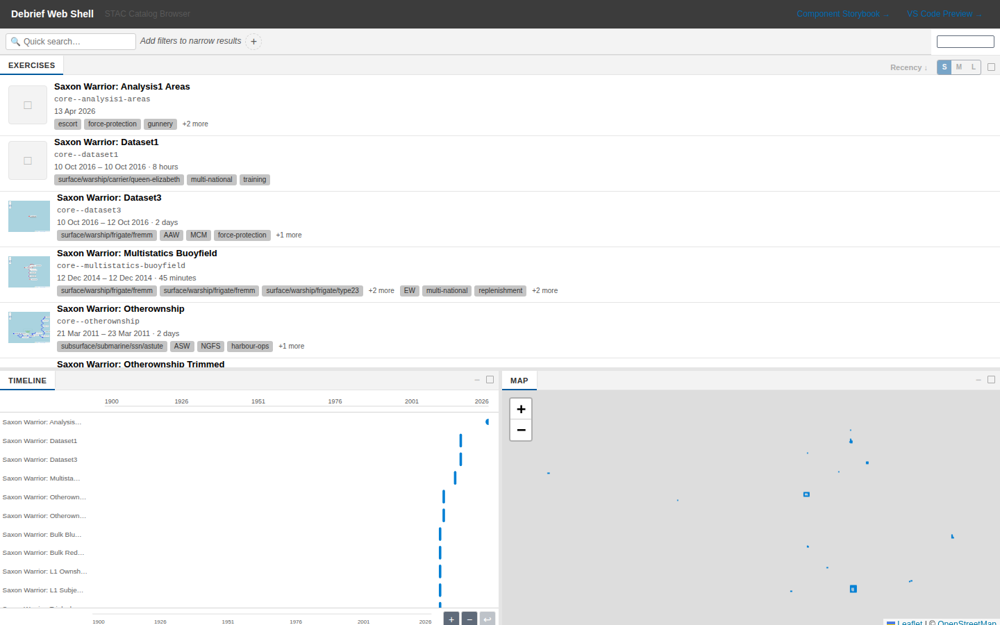

**2. The storyboard panel is a clean surface.** Capturing scenes, editing
descriptions in-place, an overflow menu with sensible verbs ("Update to
current", "Duplicate", "Copy to other storyboard", "Refresh thumbnail"), and a
proper hard-block modal for the "scene refers to deleted features" case. The
edit-form uses the same affordances as the rest of the app.

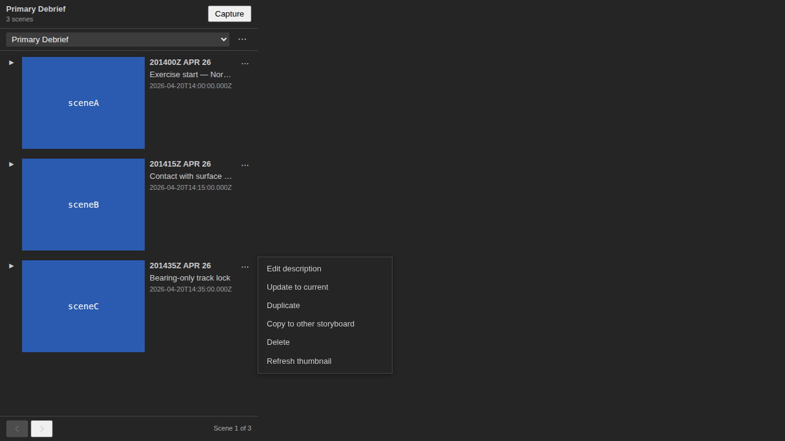

**3. Symbology in the Storybook fixtures is genuinely informative.** The
`Components/MapView/Exercise Alpha` story shows what good rendering looks like:
red and blue temporal tracks, dashed bounding shapes, faded points, a clear
legend of what's selected.

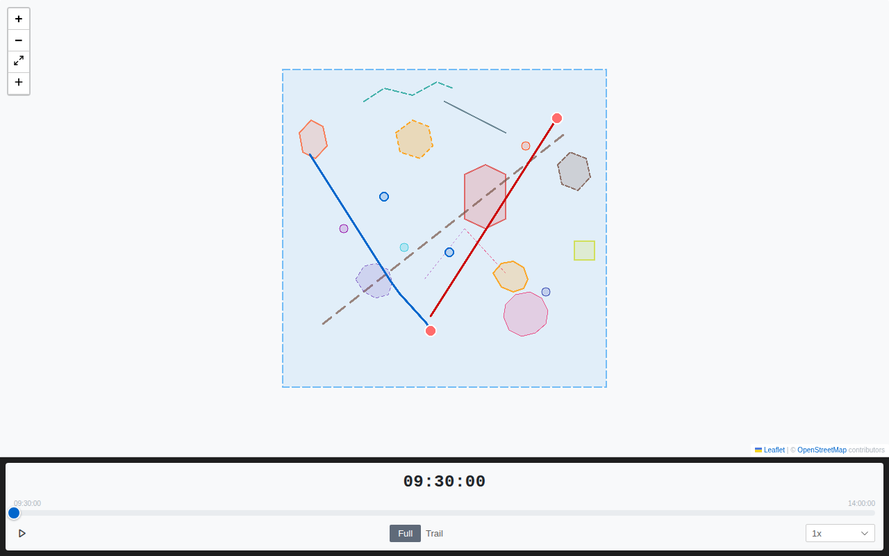

**4. The log panel rich cards punch above their weight.** Five chip types
(category, parameter, file, colour-swatch, "+N more"), four view modes
(Timeline, By Feature, Compact, Detailed), and a card-flip primitive for
rationale/edit. The information density is excellent without feeling cluttered.

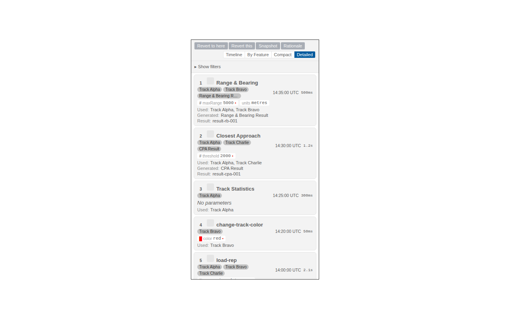

**5. The high-contrast dark theme actually looks correct.** Bright accent
colours, real outlines on every interactive element, no washed-out greys. This
is a working theme, not a stub.

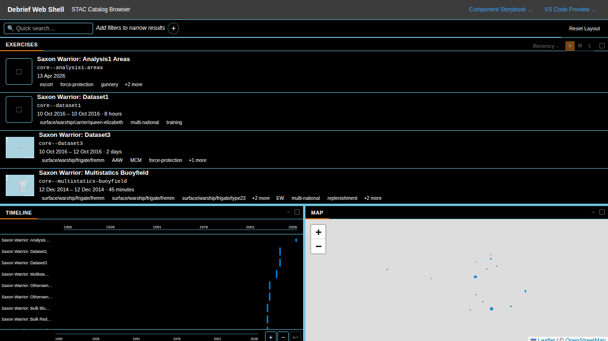

## What needs attention

### P1 — These cost users trust

**P1.1 — The default analysis view shows tracks as undifferentiated grey lines.**
In the live web-shell at every viewport (1280, 1440, 1920) the loaded
`exercise-alpha` data renders both tracks (`track-hms-defender`,
`track-uss-freedom`) as the same grey colour. The Storybook fixture for the
same exercise renders them as distinct red and blue. Either the per-track
colour metadata isn't being applied, or the sample catalog needs default
colours set. Either way, an analyst's first impression is "I can't tell the
ships apart."

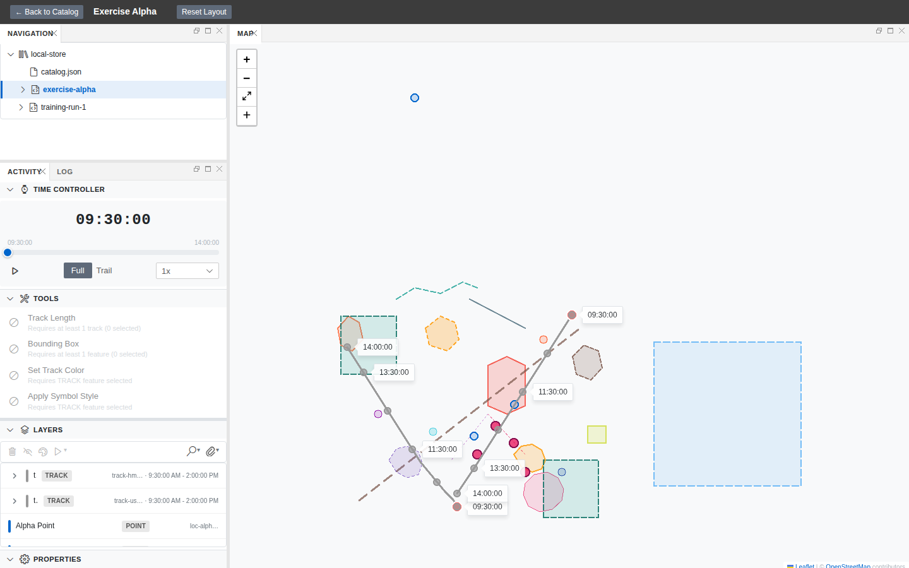

vs.


**Recommendation:** trace why the symbology pipeline drops colours between the
fixture and the live load — likely a missing platform-registry hook or a
`stroke` property that isn't applied at render time. This is the single
biggest perceived-quality gap in the live app.

**P1.2 — Properties form does not respond to dark theme.** The
`193-properties-panel/evidence` light and dark screenshots are pixel-identical.
The form (Title, Datetime, Tags, …) keeps a light background even when the
host theme is dark. This is a real visual bug, not a screenshot artefact —
both files have the same byte size in light/dark variants.

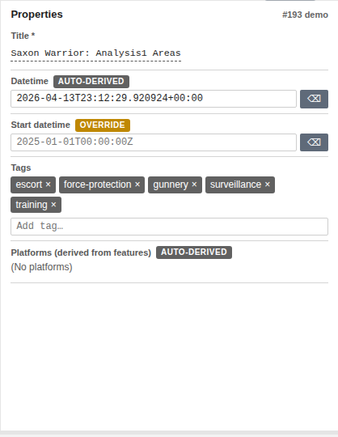

**Recommendation:** the properties-side-panel renderer isn't subscribing to the
theme tokens. Either the wrapper is forcing `color-scheme: light`, or the form
is using hard-coded greys instead of `var(--debrief-bg)` etc. Audit any
explicit colour values in `properties-side-panel.tsx`.

**P1.3 — High-contrast LIGHT theme has invisible top-right links.** The
"Component Storybook →" and "VS Code Preview →" header links use a low-contrast
blue on the very-light high-contrast background. They're effectively
unreadable.

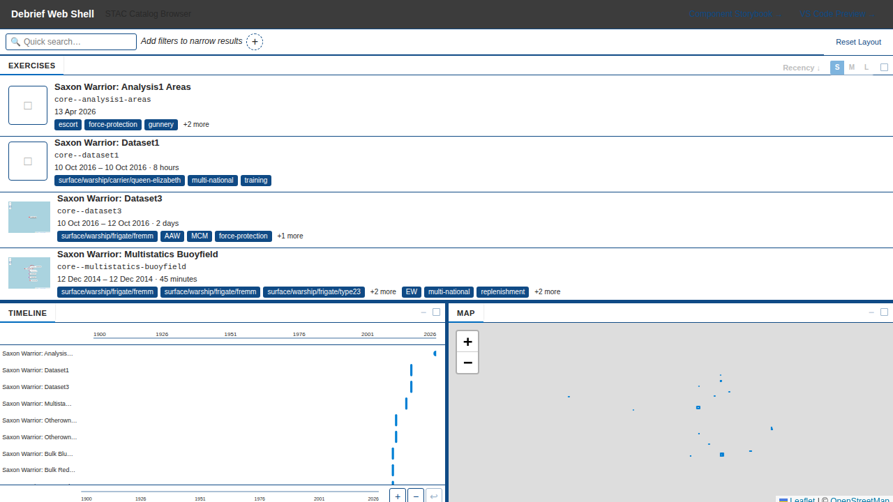

**Recommendation:** these links want a dedicated HC token (`--debrief-link-hc`)
or, more simply, an underline + bolder weight in HC mode. WCAG AAA in HC mode
is non-negotiable for the platform's UK Defence audience.

**P1.4 — properties-screenshots E2E suite is flaky.** Both light and dark
runs failed on first attempt with `waitForSelector('[data-testid="properties-form"]')`
after clicking a track row. They passed on retry. This is the kind of flake
that hides real regressions — a 50% miss rate on retries means we'd notice if
properties broke completely, but not if it broke for one feature type.

**Recommendation:** add an explicit `await expect(page.locator(...)).toBeVisible()`
gate before the click, with a longer timeout (15s already exists, but the gate
is on the wrong selector — it waits for the form to appear before the click
that opens it). Two-line fix.

### P2 — Layout and screen-space issues

**P2.1 — The default GoldenLayout split wastes a third of a 1920×1080 screen.**
At the analyst's typical resolution, the activity-panel column is ~25 % of the
window but holds Time Controller (full width — fine), Tools (4 entries, lots
of empty space), Layers (5 features — readable), Properties (collapsed). The
map gets the rest, but on a 1920-wide screen the map is over-sized for the
loaded data and the activity column is over-narrow for its longest tool names.

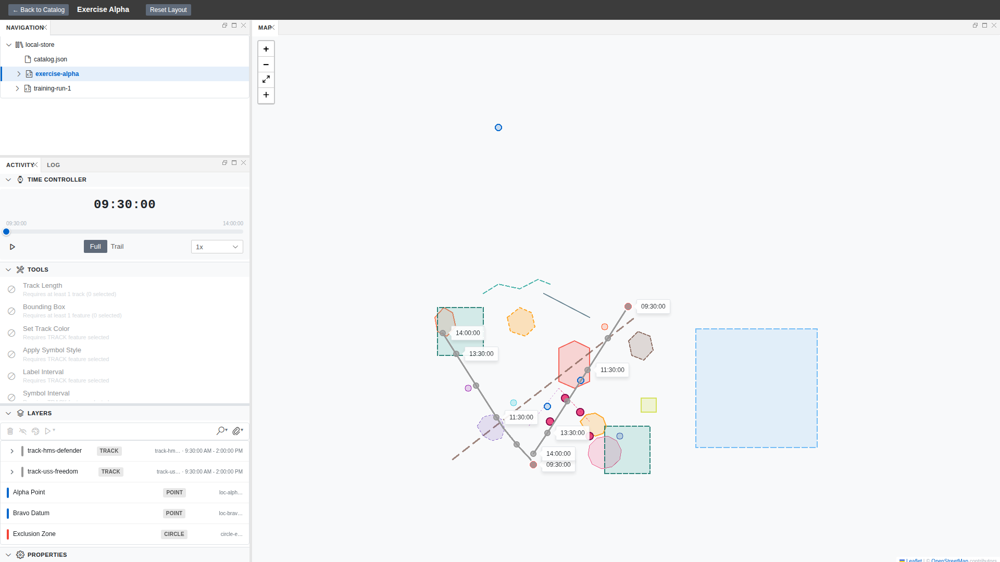

**Recommendation:** the default split should scale with viewport. At ≤1366
keep ~280 px left rail; at ≥1600 grow to ~360–400 px. GoldenLayout supports
percentage-based defaults — set them as a function of breakpoint. Also
consider giving the Tools list an "expand/collapse" so it doesn't dominate
when there are ten tools and only two are applicable.

**P2.2 — At 1280×720, the entire bottom row of features (Properties, second
TRACK row beyond the fold) is below the fold, and there's no visual hint of
"scroll for more."** A laptop user opens the plot, sees the time controller,
and may not realise there's a Properties panel at all.

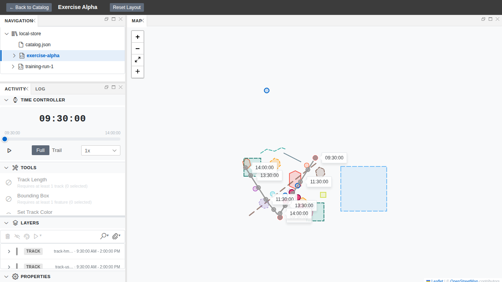

**Recommendation:** at narrow heights, collapse Tools and Layers
section-by-default once a feature is selected, OR float the Properties panel
out of the activity column into a right-side dock. The current design forces
one of: scroll inside the activity column, switch to a maximised layout, or
miss the panel entirely.

**P2.3 — The catalog timeline + map preview pair occupies ~50 % of vertical
space on a 1440-wide screen, but the timeline only shows a sparse vertical
strip of points clustered around 2026.** That's a lot of pixels to convey
"these all happened recently." The map preview is similarly empty — most
exercises plot as 1 px dots.


**Recommendation:** make the bottom row collapsible (chevron on the panel
title bars) so users with tall lists can claim that vertical space. Default
collapsed for first-time users, default open after the first dataset is
loaded. The Reset Layout button proves the panel system supports it; expose
the toggle.

**P2.4 — The thumbnail S/M/L size toggle in the catalog appears not to take
effect.** Clicking 'M' or 'L' toggles the active state of the button but the
exercise-list item heights don't change. The capability is in the UI but not
wired through.

**Recommendation:** either wire the size up to `--debrief-thumbnail-size`
CSS var on the list root, or remove the toggle until it's functional. Half-wired
controls are worse than no control.

### P3 — Polish and discoverability

**P3.1 — Two `+` icons stack on the left of every map.** The Leaflet zoom-in
control sits at the top, then the maximise control, then a `+` at the bottom
that's actually the Layers-panel "add layer / draw" trigger. Two `+` icons
adjacent in the same toolbar is confusing.

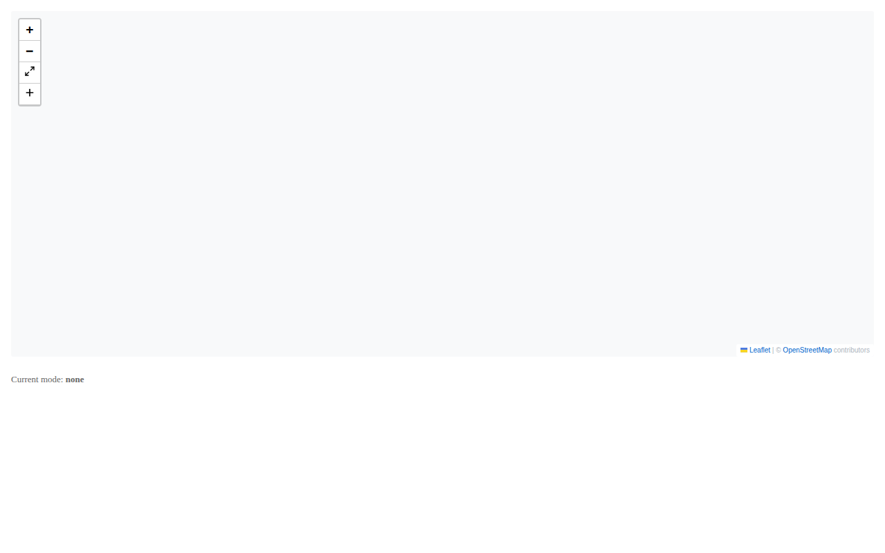

**Recommendation:** swap the bottom `+` for a pencil / draw icon. The Geoman
toolbar story uses dedicated point/line/polygon icons — apply the same icon
language to the layers-add affordance.

**P3.2 — The "Tools" list shows greyed-out tools with the same disabled-circle
icon as live tools, making it hard to tell at a glance which 2 of 5 are
applicable to the current selection.** The visual difference is text-colour
only.

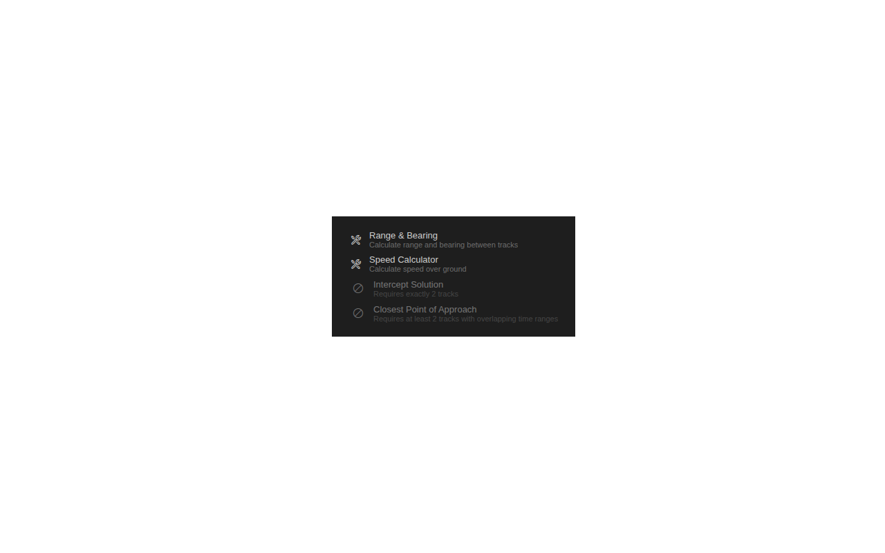

**Recommendation:** active tools should keep the wrench icon; disabled tools
should use the prohibited (∅) icon they already have, but with stronger
greyscale on the entire row (not just the title). Or move disabled tools
under a collapsible "Not applicable to current selection (3)" group.

**P3.3 — The activity panel "ACTIVITY / LOG" tab pair is easy to miss and
hard to discover.** It's a 70 px-wide header at the top of the activity
column, and the LOG tab looks like a label more than a tab. Several review
attempts tried clicking visible "log" text on the catalog screen instead.

**Recommendation:** add a visible underline / pill background to the active
tab. Optionally surface the log via a keyboard shortcut and/or a status-bar
counter ("12 log entries") so users know it's there before exploring.

**P3.4 — The "Reset Layout" button in the analysis-view header is the only
hint that the layout is customisable.** No drag handles, no panel-resize
cursors visible without hovering, no "drag to dock" affordance.

**Recommendation:** an empty-state tip on first session: "💡 Drag panel
headers to rearrange; right-click for more options." Dismiss after first
panel move.

**P3.5 — The catalog filter add-button popover is a flat list of filter
types with no grouping, no icons, no description.** "Filename" sits next to
"Plot Contents" with no hint of what either does. This is the entry point
into the filter system — first impression matters.

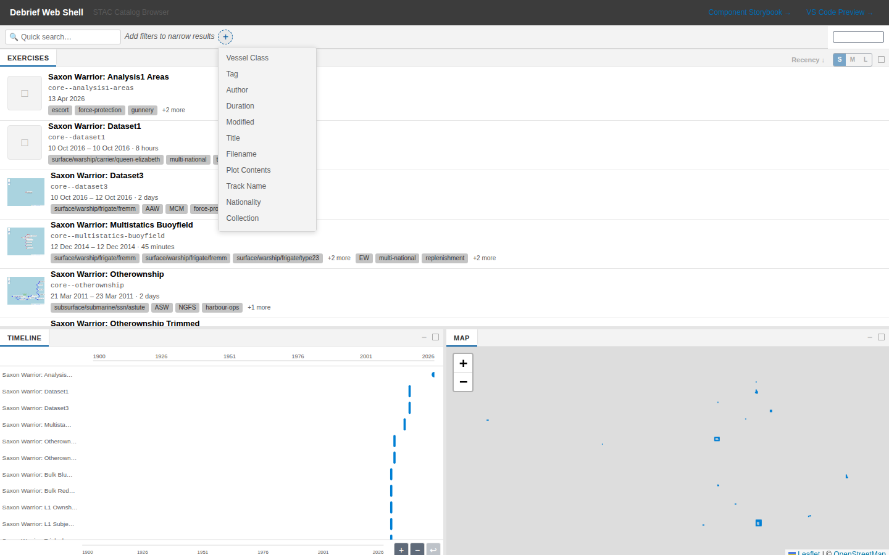

**Recommendation:** group into "Metadata" (Title, Author, Modified, …),
"Content" (Filename, Plot Contents, Track Name, …), "Operational"
(Vessel Class, Nationality, Tag, Collection, Duration). Add a short
hover-tooltip on each row.

## Prioritised punch list

| # | Priority | Item | Estimated effort |
|---|---|---|---|
| 1 | **P1** | Track colours don't render in live data | M (trace pipeline) |
| 2 | **P1** | Properties form ignores dark theme | S (token audit) |
| 3 | **P1** | HC-light header links unreadable | XS (token swap) |
| 4 | **P1** | properties-screenshots flaky in 2/13 runs | XS (selector fix) |
| 5 | **P2** | Default GoldenLayout split doesn't scale to wide screens | M |
| 6 | **P2** | 720-tall viewports hide the Properties panel | M |
| 7 | **P2** | Catalog timeline + map row not collapsible | S |
| 8 | **P2** | Thumbnail S/M/L toggle has no effect | S (wire-up) |
| 9 | **P3** | Two adjacent `+` icons on map toolbar | XS (icon swap) |
| 10 | **P3** | Active vs disabled tools indistinguishable at a glance | S |
| 11 | **P3** | LOG tab in activity panel hard to find | S |
| 12 | **P3** | Filter type picker is a flat untyped list | M |

Effort: XS = <½ day, S = ½–1 day, M = 1–3 days.

## What we did NOT find

To balance the negatives: a sweep of common failure modes that **didn't**
turn up bugs in this round —

- No keyboard-trap or focus-loss in tab navigation through the activity panel.
- No console errors on cold catalog load or first plot open.
- No long-task warnings; the dev build renders the analysis view in <1.5 s
  including Leaflet GeoJSON paths.
- No obvious z-index ordering bugs (modals, tooltips, context menus all
  layer correctly in the storyboard hard-block, overflow-menu, and
  filter-add scenarios).
- No mojibake / encoding bugs in the maritime-specific labels (DTGs,
  bearings, knots, NM ranges all rendered cleanly).

## Reproducing this review

The review is reproducible from a fresh checkout in about three minutes once
dependencies are installed:

```sh
# Terminal 1 — web-shell
pnpm -r --filter '@debrief/utils' --filter '@debrief/schemas' \
  --filter '@debrief/components' --filter '@debrief/session-state' \
  --filter '@debrief/data' build
cd apps/web-shell && pnpm dev

# Terminal 2 — Storybook
cd shared/components && pnpm storybook --no-open --ci

# Terminal 3 — drive the review
# (paste the screenshot specs into apps/web-shell/playwright/tests/
#  and run with UI_REVIEW_OUT=/tmp/x node run-playwright.mjs)
```

Curated screenshots from this review live in
`docs/project_notes/evidence/ui-review-2026-04-26/` (32 PNGs covering catalog,
analysis at three resolutions, themes, storyboard, drawing tools, log panel,
charts, tools panel).

## Closing

**The capability surface is the strongest part of the v4 platform.** Filter
chips, time-bound playback, drawing tools, multi-view storyboards, rich
provenance log, parameterised tools, four working themes — that's a
compelling tactical-analysis stack and most of it is one click away from the
catalog.

**The polish gap is concentrated in three places:** the live track
symbology pipeline (P1.1), the properties form's theme support (P1.2), and
the layout's scaling to extreme viewports (P2.1, P2.2). Fix those four
items and the perceived quality jumps a tier.

The P3 items are the kind of thing usability testing surfaces in week 1.
None of them is hard. All of them compound.

---

*Review conducted 2026-04-26 against `claude/ui-review-e2e-tests-gbO8f`
@ `ce4a2d4`. 62 raw screenshots, 32 in-repo evidence images. Web-shell + Storybook drove the
captures; openvscode-server was not available in this session, so VS Code
specifics were inferred from the shared-component VS Code theme variants.*
