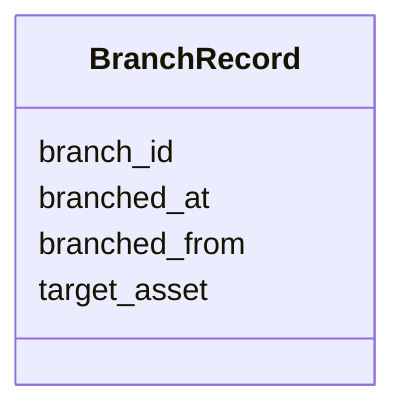

# Class: BranchRecord 


_Reference to a branched plot._


URI: [debrief:class/BranchRecord](https://debrief.info/schemas/class/BranchRecord)





<!-- no inheritance hierarchy -->


## Slots

| Name | Cardinality and Range | Description | Inheritance |
| ---  | --- | --- | --- |
| [branch_id](../slots/branch_id.md) | 1 <br/> [String](../types/String.md) | Unique branch identifier | direct |
| [branched_from](../slots/branched_from.md) | 1 <br/> [String](../types/String.md) | Activity ID of the branch point | direct |
| [branched_at](../slots/branched_at.md) | 1 <br/> [datetime](../slots/datetime.md) | When the branch was created (ISO 8601 with timezone) | direct |
| [target_asset](../slots/target_asset.md) | 1 <br/> [String](../types/String.md) | Relative path to the branched plot file | direct |


## Usages

| used by | used in | type | used |
| ---  | --- | --- | --- |
| [SystemRecordProperties](../classes/SystemRecordProperties.md) | [branches](../slots/branches.md) | range | [BranchRecord](../classes/BranchRecord.md) |


## Identifier and Mapping Information


### Schema Source


* from schema: https://debrief.info/schemas/debrief


## Mappings

| Mapping Type | Mapped Value |
| ---  | ---  |
| self | debrief:BranchRecord |
| native | debrief:BranchRecord |


## LinkML Source

<!-- TODO: investigate https://stackoverflow.com/questions/37606292/how-to-create-tabbed-code-blocks-in-mkdocs-or-sphinx -->

### Direct

<details>
```yaml
name: BranchRecord
description: Reference to a branched plot.
from_schema: https://debrief.info/schemas/debrief
attributes:
  branch_id:
    name: branch_id
    description: Unique branch identifier.
    from_schema: https://debrief.info/schemas/system-record
    rank: 1000
    domain_of:
    - BranchRecord
    - BranchOrigin
    - FileProvEntry
    range: string
    required: true
  branched_from:
    name: branched_from
    description: Activity ID of the branch point.
    from_schema: https://debrief.info/schemas/system-record
    rank: 1000
    domain_of:
    - BranchRecord
    - BranchOrigin
    range: string
    required: true
  branched_at:
    name: branched_at
    description: When the branch was created (ISO 8601 with timezone).
    from_schema: https://debrief.info/schemas/system-record
    rank: 1000
    domain_of:
    - BranchRecord
    - BranchOrigin
    range: datetime
    required: true
  target_asset:
    name: target_asset
    description: Relative path to the branched plot file.
    from_schema: https://debrief.info/schemas/system-record
    rank: 1000
    domain_of:
    - BranchRecord
    range: string
    required: true

```
</details>

### Induced

<details>
```yaml
name: BranchRecord
description: Reference to a branched plot.
from_schema: https://debrief.info/schemas/debrief
attributes:
  branch_id:
    name: branch_id
    description: Unique branch identifier.
    from_schema: https://debrief.info/schemas/system-record
    rank: 1000
    alias: branch_id
    owner: BranchRecord
    domain_of:
    - BranchRecord
    - BranchOrigin
    - FileProvEntry
    range: string
    required: true
  branched_from:
    name: branched_from
    description: Activity ID of the branch point.
    from_schema: https://debrief.info/schemas/system-record
    rank: 1000
    alias: branched_from
    owner: BranchRecord
    domain_of:
    - BranchRecord
    - BranchOrigin
    range: string
    required: true
  branched_at:
    name: branched_at
    description: When the branch was created (ISO 8601 with timezone).
    from_schema: https://debrief.info/schemas/system-record
    rank: 1000
    alias: branched_at
    owner: BranchRecord
    domain_of:
    - BranchRecord
    - BranchOrigin
    range: datetime
    required: true
  target_asset:
    name: target_asset
    description: Relative path to the branched plot file.
    from_schema: https://debrief.info/schemas/system-record
    rank: 1000
    alias: target_asset
    owner: BranchRecord
    domain_of:
    - BranchRecord
    range: string
    required: true

```
</details>