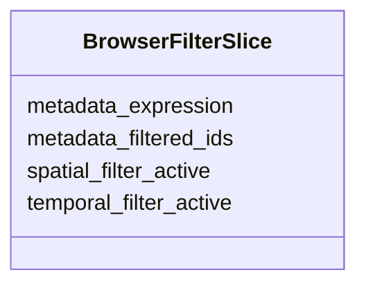

# Class: BrowserFilterSlice 


_Multi-axis filter state for the STAC browser panel. Manages the metadata filter expression plus active flags for spatial (viewport) and temporal (timeline) filter axes. Feature 132-three-view-sync. Note: spatial bounds and temporal range live in SpatialSlice/TemporalSlice; this slice only tracks the metadata expression and axis-activation flags._

__


URI: [debrief:class/BrowserFilterSlice](https://debrief.info/schemas/class/BrowserFilterSlice)





<!-- no inheritance hierarchy -->


## Slots

| Name | Cardinality and Range | Description | Inheritance |
| ---  | --- | --- | --- |
| [metadata_filtered_ids](../slots/metadata_filtered_ids.md) | * <br/> [String](../types/String.md) | Set of exercise IDs passing the current metadata filter | direct |
| [metadata_expression](../slots/metadata_expression.md) | 0..1 <br/> [String](../types/String.md) | Serialised CQL2 filter expression from the filter bar, stored as an opaque JS... | direct |
| [spatial_filter_active](../slots/spatial_filter_active.md) | 1 <br/> [Boolean](../types/Boolean.md) | Whether the map viewport is used as a spatial filter | direct |
| [temporal_filter_active](../slots/temporal_filter_active.md) | 1 <br/> [Boolean](../types/Boolean.md) | Whether the timeline range is used as a temporal filter | direct |


## Identifier and Mapping Information


### Schema Source


* from schema: https://debrief.info/schemas/debrief


## Mappings

| Mapping Type | Mapped Value |
| ---  | ---  |
| self | debrief:BrowserFilterSlice |
| native | debrief:BrowserFilterSlice |


## LinkML Source

<!-- TODO: investigate https://stackoverflow.com/questions/37606292/how-to-create-tabbed-code-blocks-in-mkdocs-or-sphinx -->

### Direct

<details>
```yaml
name: BrowserFilterSlice
description: 'Multi-axis filter state for the STAC browser panel. Manages the metadata
  filter expression plus active flags for spatial (viewport) and temporal (timeline)
  filter axes. Feature 132-three-view-sync. Note: spatial bounds and temporal range
  live in SpatialSlice/TemporalSlice; this slice only tracks the metadata expression
  and axis-activation flags.

  '
from_schema: https://debrief.info/schemas/debrief
attributes:
  metadata_filtered_ids:
    name: metadata_filtered_ids
    description: 'Set of exercise IDs passing the current metadata filter. Absent/null
      means all items pass (no filter applied).

      '
    from_schema: https://debrief.info/schemas/session-state
    rank: 1000
    domain_of:
    - BrowserFilterSlice
    range: string
    required: false
    multivalued: true
  metadata_expression:
    name: metadata_expression
    description: 'Serialised CQL2 filter expression from the filter bar, stored as
      an opaque JSON object (Record<string, unknown>). Absent/null means no filter
      is active. Stored for debugging and round-trip serialisation.

      '
    from_schema: https://debrief.info/schemas/session-state
    rank: 1000
    domain_of:
    - BrowserFilterSlice
    range: string
    required: false
  spatial_filter_active:
    name: spatial_filter_active
    description: Whether the map viewport is used as a spatial filter
    from_schema: https://debrief.info/schemas/session-state
    rank: 1000
    domain_of:
    - BrowserFilterSlice
    range: boolean
    required: true
  temporal_filter_active:
    name: temporal_filter_active
    description: Whether the timeline range is used as a temporal filter
    from_schema: https://debrief.info/schemas/session-state
    rank: 1000
    domain_of:
    - BrowserFilterSlice
    range: boolean
    required: true

```
</details>

### Induced

<details>
```yaml
name: BrowserFilterSlice
description: 'Multi-axis filter state for the STAC browser panel. Manages the metadata
  filter expression plus active flags for spatial (viewport) and temporal (timeline)
  filter axes. Feature 132-three-view-sync. Note: spatial bounds and temporal range
  live in SpatialSlice/TemporalSlice; this slice only tracks the metadata expression
  and axis-activation flags.

  '
from_schema: https://debrief.info/schemas/debrief
attributes:
  metadata_filtered_ids:
    name: metadata_filtered_ids
    description: 'Set of exercise IDs passing the current metadata filter. Absent/null
      means all items pass (no filter applied).

      '
    from_schema: https://debrief.info/schemas/session-state
    rank: 1000
    alias: metadata_filtered_ids
    owner: BrowserFilterSlice
    domain_of:
    - BrowserFilterSlice
    range: string
    required: false
    multivalued: true
  metadata_expression:
    name: metadata_expression
    description: 'Serialised CQL2 filter expression from the filter bar, stored as
      an opaque JSON object (Record<string, unknown>). Absent/null means no filter
      is active. Stored for debugging and round-trip serialisation.

      '
    from_schema: https://debrief.info/schemas/session-state
    rank: 1000
    alias: metadata_expression
    owner: BrowserFilterSlice
    domain_of:
    - BrowserFilterSlice
    range: string
    required: false
  spatial_filter_active:
    name: spatial_filter_active
    description: Whether the map viewport is used as a spatial filter
    from_schema: https://debrief.info/schemas/session-state
    rank: 1000
    alias: spatial_filter_active
    owner: BrowserFilterSlice
    domain_of:
    - BrowserFilterSlice
    range: boolean
    required: true
  temporal_filter_active:
    name: temporal_filter_active
    description: Whether the timeline range is used as a temporal filter
    from_schema: https://debrief.info/schemas/session-state
    rank: 1000
    alias: temporal_filter_active
    owner: BrowserFilterSlice
    domain_of:
    - BrowserFilterSlice
    range: boolean
    required: true

```
</details>