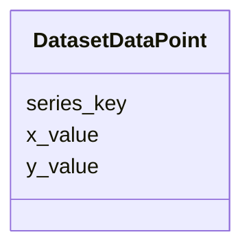

# Class: DatasetDataPoint 


_A single structured data record within a series or flat dataset. Fields are open-ended (the axes are described by DatasetMetadata) to accommodate any combination of x/y/series-key values produced by tools. At minimum one of x_value or y_value is expected, but additional domain-specific fields (e.g., "zone", "bearing", "time") are allowed._

__


URI: [debrief:class/DatasetDataPoint](https://debrief.info/schemas/class/DatasetDataPoint)





<!-- no inheritance hierarchy -->


## Slots

| Name | Cardinality and Range | Description | Inheritance |
| ---  | --- | --- | --- |
| [x_value](../slots/x_value.md) | 0..1 <br/> [String](../types/String.md) | Primary independent-axis value serialised as a string | direct |
| [y_value](../slots/y_value.md) | 0..1 <br/> [String](../types/String.md) | Primary dependent-axis value serialised as a string (decimal or label) | direct |
| [series_key](../slots/series_key.md) | 0..1 <br/> [String](../types/String.md) | Series discriminator for multi-series datasets (e | direct |


## Usages

| used by | used in | type | used |
| ---  | --- | --- | --- |
| [DatasetSeries](../classes/DatasetSeries.md) | [data_points](../slots/data_points.md) | range | [DatasetDataPoint](../classes/DatasetDataPoint.md) |
| [DatasetEntry](../classes/DatasetEntry.md) | [data_points](../slots/data_points.md) | range | [DatasetDataPoint](../classes/DatasetDataPoint.md) |


## Identifier and Mapping Information


### Schema Source


* from schema: https://debrief.info/schemas/debrief


## Mappings

| Mapping Type | Mapped Value |
| ---  | ---  |
| self | debrief:DatasetDataPoint |
| native | debrief:DatasetDataPoint |


## LinkML Source

<!-- TODO: investigate https://stackoverflow.com/questions/37606292/how-to-create-tabbed-code-blocks-in-mkdocs-or-sphinx -->

### Direct

<details>
```yaml
name: DatasetDataPoint
description: 'A single structured data record within a series or flat dataset. Fields
  are open-ended (the axes are described by DatasetMetadata) to accommodate any combination
  of x/y/series-key values produced by tools. At minimum one of x_value or y_value
  is expected, but additional domain-specific fields (e.g., "zone", "bearing", "time")
  are allowed.

  '
from_schema: https://debrief.info/schemas/debrief
attributes:
  x_value:
    name: x_value
    description: 'Primary independent-axis value serialised as a string. For temporal
      axes this is an ISO 8601 datetime; for quantitative axes it is a decimal string;
      for nominal/ordinal axes it is the category label.

      '
    from_schema: https://debrief.com/schemas/tool-result
    rank: 1000
    domain_of:
    - DatasetDataPoint
    range: string
    required: false
  y_value:
    name: y_value
    description: 'Primary dependent-axis value serialised as a string (decimal or
      label).

      '
    from_schema: https://debrief.com/schemas/tool-result
    rank: 1000
    domain_of:
    - DatasetDataPoint
    range: string
    required: false
  series_key:
    name: series_key
    description: 'Series discriminator for multi-series datasets (e.g., track name).
      Absent for single-series (flat) datasets.

      '
    from_schema: https://debrief.com/schemas/tool-result
    rank: 1000
    domain_of:
    - DatasetDataPoint
    range: string
    required: false

```
</details>

### Induced

<details>
```yaml
name: DatasetDataPoint
description: 'A single structured data record within a series or flat dataset. Fields
  are open-ended (the axes are described by DatasetMetadata) to accommodate any combination
  of x/y/series-key values produced by tools. At minimum one of x_value or y_value
  is expected, but additional domain-specific fields (e.g., "zone", "bearing", "time")
  are allowed.

  '
from_schema: https://debrief.info/schemas/debrief
attributes:
  x_value:
    name: x_value
    description: 'Primary independent-axis value serialised as a string. For temporal
      axes this is an ISO 8601 datetime; for quantitative axes it is a decimal string;
      for nominal/ordinal axes it is the category label.

      '
    from_schema: https://debrief.com/schemas/tool-result
    rank: 1000
    alias: x_value
    owner: DatasetDataPoint
    domain_of:
    - DatasetDataPoint
    range: string
    required: false
  y_value:
    name: y_value
    description: 'Primary dependent-axis value serialised as a string (decimal or
      label).

      '
    from_schema: https://debrief.com/schemas/tool-result
    rank: 1000
    alias: y_value
    owner: DatasetDataPoint
    domain_of:
    - DatasetDataPoint
    range: string
    required: false
  series_key:
    name: series_key
    description: 'Series discriminator for multi-series datasets (e.g., track name).
      Absent for single-series (flat) datasets.

      '
    from_schema: https://debrief.com/schemas/tool-result
    rank: 1000
    alias: series_key
    owner: DatasetDataPoint
    domain_of:
    - DatasetDataPoint
    range: string
    required: false

```
</details>