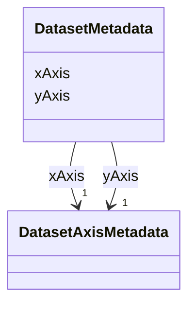

# Class: DatasetMetadata 


_Chart metadata for a dataset entry_


URI: [debrief:class/DatasetMetadata](https://debrief.info/schemas/class/DatasetMetadata)





<!-- no inheritance hierarchy -->


## Slots

| Name | Cardinality and Range | Description | Inheritance |
| ---  | --- | --- | --- |
| [xAxis](../slots/xAxis.md) | 1 <br/> [DatasetAxisMetadata](../classes/DatasetAxisMetadata.md) | X-axis metadata | direct |
| [yAxis](../slots/yAxis.md) | 1 <br/> [DatasetAxisMetadata](../classes/DatasetAxisMetadata.md) | Y-axis metadata | direct |


## Usages

| used by | used in | type | used |
| ---  | --- | --- | --- |
| [DatasetEntry](../classes/DatasetEntry.md) | [metadata](../slots/metadata.md) | range | [DatasetMetadata](../classes/DatasetMetadata.md) |


## Identifier and Mapping Information


### Schema Source


* from schema: https://debrief.info/schemas/debrief


## Mappings

| Mapping Type | Mapped Value |
| ---  | ---  |
| self | debrief:DatasetMetadata |
| native | debrief:DatasetMetadata |


## LinkML Source

<!-- TODO: investigate https://stackoverflow.com/questions/37606292/how-to-create-tabbed-code-blocks-in-mkdocs-or-sphinx -->

### Direct

<details>
```yaml
name: DatasetMetadata
description: Chart metadata for a dataset entry
from_schema: https://debrief.info/schemas/debrief
attributes:
  xAxis:
    name: xAxis
    description: X-axis metadata
    from_schema: https://debrief.com/schemas/tool-result
    rank: 1000
    domain_of:
    - DatasetMetadata
    range: DatasetAxisMetadata
    required: true
  yAxis:
    name: yAxis
    description: Y-axis metadata
    from_schema: https://debrief.com/schemas/tool-result
    rank: 1000
    domain_of:
    - DatasetMetadata
    range: DatasetAxisMetadata
    required: true

```
</details>

### Induced

<details>
```yaml
name: DatasetMetadata
description: Chart metadata for a dataset entry
from_schema: https://debrief.info/schemas/debrief
attributes:
  xAxis:
    name: xAxis
    description: X-axis metadata
    from_schema: https://debrief.com/schemas/tool-result
    rank: 1000
    alias: xAxis
    owner: DatasetMetadata
    domain_of:
    - DatasetMetadata
    range: DatasetAxisMetadata
    required: true
  yAxis:
    name: yAxis
    description: Y-axis metadata
    from_schema: https://debrief.com/schemas/tool-result
    rank: 1000
    alias: yAxis
    owner: DatasetMetadata
    domain_of:
    - DatasetMetadata
    range: DatasetAxisMetadata
    required: true

```
</details>