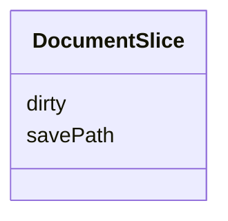

# Class: DocumentSlice 


_Editor lifecycle state including dirty tracking and undo history_


URI: [debrief:class/DocumentSlice](https://debrief.info/schemas/class/DocumentSlice)





<!-- no inheritance hierarchy -->


## Slots

| Name | Cardinality and Range | Description | Inheritance |
| ---  | --- | --- | --- |
| [dirty](../slots/dirty.md) | 1 <br/> [Boolean](../types/Boolean.md) | Unsaved changes exist - ephemeral (FR-020) | direct |
| [savePath](../slots/savePath.md) | 0..1 <br/> [String](../types/String.md) | Last save location | direct |


## Usages

| used by | used in | type | used |
| ---  | --- | --- | --- |
| [SessionState](../classes/SessionState.md) | [document](../slots/document.md) | range | [DocumentSlice](../classes/DocumentSlice.md) |


## Identifier and Mapping Information


### Schema Source


* from schema: https://debrief.info/schemas/debrief


## Mappings

| Mapping Type | Mapped Value |
| ---  | ---  |
| self | debrief:DocumentSlice |
| native | debrief:DocumentSlice |


## LinkML Source

<!-- TODO: investigate https://stackoverflow.com/questions/37606292/how-to-create-tabbed-code-blocks-in-mkdocs-or-sphinx -->

### Direct

<details>
```yaml
name: DocumentSlice
description: Editor lifecycle state including dirty tracking and undo history
from_schema: https://debrief.info/schemas/debrief
attributes:
  dirty:
    name: dirty
    description: Unsaved changes exist - ephemeral (FR-020)
    from_schema: https://debrief.info/schemas/session-state
    rank: 1000
    domain_of:
    - DocumentSlice
    range: boolean
    required: true
  savePath:
    name: savePath
    description: Last save location
    from_schema: https://debrief.info/schemas/session-state
    rank: 1000
    domain_of:
    - DocumentSlice
    range: string

```
</details>

### Induced

<details>
```yaml
name: DocumentSlice
description: Editor lifecycle state including dirty tracking and undo history
from_schema: https://debrief.info/schemas/debrief
attributes:
  dirty:
    name: dirty
    description: Unsaved changes exist - ephemeral (FR-020)
    from_schema: https://debrief.info/schemas/session-state
    rank: 1000
    alias: dirty
    owner: DocumentSlice
    domain_of:
    - DocumentSlice
    range: boolean
    required: true
  savePath:
    name: savePath
    description: Last save location
    from_schema: https://debrief.info/schemas/session-state
    rank: 1000
    alias: savePath
    owner: DocumentSlice
    domain_of:
    - DocumentSlice
    range: string

```
</details>