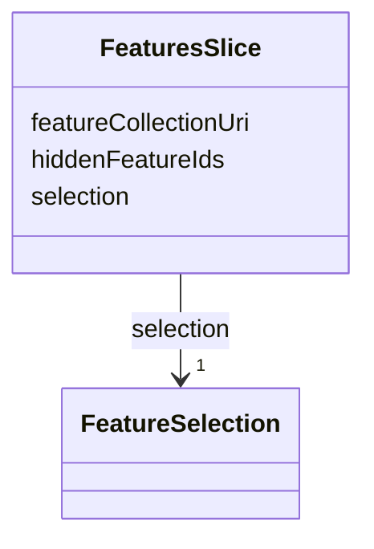

# Class: FeaturesSlice 


_Feature selection and visibility state_


URI: [debrief:class/FeaturesSlice](https://debrief.info/schemas/class/FeaturesSlice)





<!-- no inheritance hierarchy -->


## Slots

| Name | Cardinality and Range | Description | Inheritance |
| ---  | --- | --- | --- |
| [featureCollectionUri](../slots/featureCollectionUri.md) | 0..1 <br/> [String](../types/String.md) | Reference to external feature collection (FR-016) | direct |
| [selection](../slots/selection.md) | 1 <br/> [FeatureSelection](../classes/FeatureSelection.md) | Currently selected features (FR-017) | direct |
| [hiddenFeatureIds](../slots/hiddenFeatureIds.md) | * <br/> [String](../types/String.md) | Features hidden from display (FR-018) | direct |


## Usages

| used by | used in | type | used |
| ---  | --- | --- | --- |
| [SessionState](../classes/SessionState.md) | [features](../slots/features.md) | range | [FeaturesSlice](../classes/FeaturesSlice.md) |
| [SessionFile](../classes/SessionFile.md) | [features](../slots/features.md) | range | [FeaturesSlice](../classes/FeaturesSlice.md) |


## Identifier and Mapping Information


### Schema Source


* from schema: https://debrief.info/schemas/debrief


## Mappings

| Mapping Type | Mapped Value |
| ---  | ---  |
| self | debrief:FeaturesSlice |
| native | debrief:FeaturesSlice |


## LinkML Source

<!-- TODO: investigate https://stackoverflow.com/questions/37606292/how-to-create-tabbed-code-blocks-in-mkdocs-or-sphinx -->

### Direct

<details>
```yaml
name: FeaturesSlice
description: Feature selection and visibility state
from_schema: https://debrief.info/schemas/debrief
attributes:
  featureCollectionUri:
    name: featureCollectionUri
    description: Reference to external feature collection (FR-016)
    from_schema: https://debrief.info/schemas/session-state
    rank: 1000
    domain_of:
    - FeaturesSlice
    range: string
  selection:
    name: selection
    description: Currently selected features (FR-017)
    from_schema: https://debrief.info/schemas/session-state
    rank: 1000
    domain_of:
    - FeaturesSlice
    range: FeatureSelection
    required: true
  hiddenFeatureIds:
    name: hiddenFeatureIds
    description: Features hidden from display (FR-018)
    from_schema: https://debrief.info/schemas/session-state
    rank: 1000
    domain_of:
    - FeaturesSlice
    range: string
    multivalued: true

```
</details>

### Induced

<details>
```yaml
name: FeaturesSlice
description: Feature selection and visibility state
from_schema: https://debrief.info/schemas/debrief
attributes:
  featureCollectionUri:
    name: featureCollectionUri
    description: Reference to external feature collection (FR-016)
    from_schema: https://debrief.info/schemas/session-state
    rank: 1000
    alias: featureCollectionUri
    owner: FeaturesSlice
    domain_of:
    - FeaturesSlice
    range: string
  selection:
    name: selection
    description: Currently selected features (FR-017)
    from_schema: https://debrief.info/schemas/session-state
    rank: 1000
    alias: selection
    owner: FeaturesSlice
    domain_of:
    - FeaturesSlice
    range: FeatureSelection
    required: true
  hiddenFeatureIds:
    name: hiddenFeatureIds
    description: Features hidden from display (FR-018)
    from_schema: https://debrief.info/schemas/session-state
    rank: 1000
    alias: hiddenFeatureIds
    owner: FeaturesSlice
    domain_of:
    - FeaturesSlice
    range: string
    multivalued: true

```
</details>