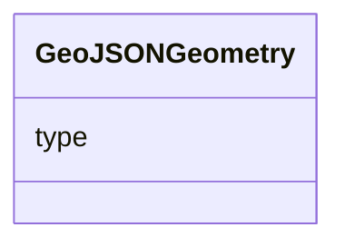

# Class: GeoJSONGeometry 


_GeoJSON geometry object (type + coordinates pair)_


URI: [debrief:class/GeoJSONGeometry](https://debrief.info/schemas/class/GeoJSONGeometry)





<!-- no inheritance hierarchy -->


## Slots

| Name | Cardinality and Range | Description | Inheritance |
| ---  | --- | --- | --- |
| [type](../slots/type.md) | 1 <br/> [String](../types/String.md) | GeoJSON geometry type (e | direct |


## Usages

| used by | used in | type | used |
| ---  | --- | --- | --- |
| [GeoJSONFeature](../classes/GeoJSONFeature.md) | [geometry](../slots/geometry.md) | range | [GeoJSONGeometry](../classes/GeoJSONGeometry.md) |


## Identifier and Mapping Information


### Schema Source


* from schema: https://debrief.info/schemas/debrief


## Mappings

| Mapping Type | Mapped Value |
| ---  | ---  |
| self | debrief:GeoJSONGeometry |
| native | debrief:GeoJSONGeometry |


## LinkML Source

<!-- TODO: investigate https://stackoverflow.com/questions/37606292/how-to-create-tabbed-code-blocks-in-mkdocs-or-sphinx -->

### Direct

<details>
```yaml
name: GeoJSONGeometry
description: GeoJSON geometry object (type + coordinates pair)
from_schema: https://debrief.info/schemas/debrief
attributes:
  type:
    name: type
    description: GeoJSON geometry type (e.g., Point, LineString, Polygon)
    from_schema: https://debrief.info/schemas/session-state
    domain_of:
    - GeoJSONPoint
    - GeoJSONEmptyPoint
    - GeoJSONLineString
    - GeoJSONPolygon
    - GeoJSONMultiPoint
    - GeoJSONMultiLineString
    - GeoJSONMultiPolygon
    - TrackFeature
    - ReferenceLocation
    - SystemState
    - MultiPointFeature
    - MultiPolygonFeature
    - NarrativeEntry
    - CircleAnnotation
    - RectangleAnnotation
    - LineAnnotation
    - TextAnnotation
    - VectorAnnotation
    - PolyAnnotation
    - ToolParameter
    - FileProvEntry
    - GeoJSONGeometry
    - GeoJSONFeature
    - DatasetAxisMetadata
    - DatasetEntry
    range: string
    required: true

```
</details>

### Induced

<details>
```yaml
name: GeoJSONGeometry
description: GeoJSON geometry object (type + coordinates pair)
from_schema: https://debrief.info/schemas/debrief
attributes:
  type:
    name: type
    description: GeoJSON geometry type (e.g., Point, LineString, Polygon)
    from_schema: https://debrief.info/schemas/session-state
    alias: type
    owner: GeoJSONGeometry
    domain_of:
    - GeoJSONPoint
    - GeoJSONEmptyPoint
    - GeoJSONLineString
    - GeoJSONPolygon
    - GeoJSONMultiPoint
    - GeoJSONMultiLineString
    - GeoJSONMultiPolygon
    - TrackFeature
    - ReferenceLocation
    - SystemState
    - MultiPointFeature
    - MultiPolygonFeature
    - NarrativeEntry
    - CircleAnnotation
    - RectangleAnnotation
    - LineAnnotation
    - TextAnnotation
    - VectorAnnotation
    - PolyAnnotation
    - ToolParameter
    - FileProvEntry
    - GeoJSONGeometry
    - GeoJSONFeature
    - DatasetAxisMetadata
    - DatasetEntry
    range: string
    required: true

```
</details>