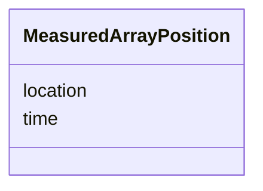

# Class: MeasuredArrayPosition 


_Timestamped geographic position of a towed array centre. Used by MEASURED array centre mode for bearing line origin interpolation._


URI: [debrief:class/MeasuredArrayPosition](https://debrief.info/schemas/class/MeasuredArrayPosition)





<!-- no inheritance hierarchy -->


## Slots

| Name | Cardinality and Range | Description | Inheritance |
| ---  | --- | --- | --- |
| [time](../slots/time.md) | 1 <br/> [datetime](../slots/datetime.md) | Position timestamp (ISO8601) | direct |
| [location](../slots/location.md) | 1..* <br/> [Float](../types/Float.md) | Array centre position [longitude, latitude] (GeoJSON coordinate order) | direct |


## Usages

| used by | used in | type | used |
| ---  | --- | --- | --- |
| [SensorData](../classes/SensorData.md) | [measured_positions](../slots/measured_positions.md) | range | [MeasuredArrayPosition](../classes/MeasuredArrayPosition.md) |


## Identifier and Mapping Information


### Schema Source


* from schema: https://debrief.info/schemas/debrief


## Mappings

| Mapping Type | Mapped Value |
| ---  | ---  |
| self | debrief:MeasuredArrayPosition |
| native | debrief:MeasuredArrayPosition |


## LinkML Source

<!-- TODO: investigate https://stackoverflow.com/questions/37606292/how-to-create-tabbed-code-blocks-in-mkdocs-or-sphinx -->

### Direct

<details>
```yaml
name: MeasuredArrayPosition
description: Timestamped geographic position of a towed array centre. Used by MEASURED
  array centre mode for bearing line origin interpolation.
from_schema: https://debrief.info/schemas/debrief
attributes:
  time:
    name: time
    description: Position timestamp (ISO8601)
    from_schema: https://debrief.info/schemas/geojson
    domain_of:
    - TimestampedPosition
    - MeasuredArrayPosition
    - SensorContact
    - TUASolution
    - NarrativeEntryProperties
    range: datetime
    required: true
  location:
    name: location
    description: Array centre position [longitude, latitude] (GeoJSON coordinate order)
    from_schema: https://debrief.info/schemas/geojson
    rank: 1000
    domain_of:
    - MeasuredArrayPosition
    range: float
    required: true
    multivalued: true
    minimum_cardinality: 2
    maximum_cardinality: 2

```
</details>

### Induced

<details>
```yaml
name: MeasuredArrayPosition
description: Timestamped geographic position of a towed array centre. Used by MEASURED
  array centre mode for bearing line origin interpolation.
from_schema: https://debrief.info/schemas/debrief
attributes:
  time:
    name: time
    description: Position timestamp (ISO8601)
    from_schema: https://debrief.info/schemas/geojson
    alias: time
    owner: MeasuredArrayPosition
    domain_of:
    - TimestampedPosition
    - MeasuredArrayPosition
    - SensorContact
    - TUASolution
    - NarrativeEntryProperties
    range: datetime
    required: true
  location:
    name: location
    description: Array centre position [longitude, latitude] (GeoJSON coordinate order)
    from_schema: https://debrief.info/schemas/geojson
    rank: 1000
    alias: location
    owner: MeasuredArrayPosition
    domain_of:
    - MeasuredArrayPosition
    range: float
    required: true
    multivalued: true
    minimum_cardinality: 2
    maximum_cardinality: 2

```
</details>