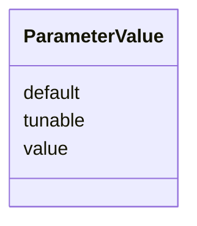

# Class: ParameterValue 


_A typed parameter value with replay metadata._


URI: [debrief:class/ParameterValue](https://debrief.info/schemas/class/ParameterValue)





<!-- no inheritance hierarchy -->


## Slots

| Name | Cardinality and Range | Description | Inheritance |
| ---  | --- | --- | --- |
| [value](../slots/value.md) | 1 <br/> [String](../types/String.md) | The parameter value (any JSON type) | direct |
| [default](../slots/default.md) | 0..1 <br/> [Boolean](../types/Boolean.md) | Whether this is the default value | direct |
| [tunable](../slots/tunable.md) | 0..1 <br/> [Boolean](../types/Boolean.md) | Whether this parameter can be modified during replay | direct |


## Usages

| used by | used in | type | used |
| ---  | --- | --- | --- |
| [WasGeneratedBy](../classes/WasGeneratedBy.md) | [parameters](../slots/parameters.md) | range | [ParameterValue](../classes/ParameterValue.md) |


## Identifier and Mapping Information


### Schema Source


* from schema: https://debrief.info/schemas/debrief


## Mappings

| Mapping Type | Mapped Value |
| ---  | ---  |
| self | debrief:ParameterValue |
| native | debrief:ParameterValue |


## LinkML Source

<!-- TODO: investigate https://stackoverflow.com/questions/37606292/how-to-create-tabbed-code-blocks-in-mkdocs-or-sphinx -->

### Direct

<details>
```yaml
name: ParameterValue
description: A typed parameter value with replay metadata.
from_schema: https://debrief.info/schemas/debrief
attributes:
  value:
    name: value
    description: The parameter value (any JSON type).
    from_schema: https://debrief.info/schemas/log-entry
    rank: 1000
    domain_of:
    - ParameterValue
    - TimeStep
    range: string
    required: true
  default:
    name: default
    description: Whether this is the default value.
    from_schema: https://debrief.info/schemas/log-entry
    rank: 1000
    ifabsent: 'false'
    domain_of:
    - ParameterValue
    range: boolean
    required: false
  tunable:
    name: tunable
    description: Whether this parameter can be modified during replay.
    from_schema: https://debrief.info/schemas/log-entry
    rank: 1000
    ifabsent: 'true'
    domain_of:
    - ParameterValue
    range: boolean
    required: false

```
</details>

### Induced

<details>
```yaml
name: ParameterValue
description: A typed parameter value with replay metadata.
from_schema: https://debrief.info/schemas/debrief
attributes:
  value:
    name: value
    description: The parameter value (any JSON type).
    from_schema: https://debrief.info/schemas/log-entry
    rank: 1000
    alias: value
    owner: ParameterValue
    domain_of:
    - ParameterValue
    - TimeStep
    range: string
    required: true
  default:
    name: default
    description: Whether this is the default value.
    from_schema: https://debrief.info/schemas/log-entry
    rank: 1000
    ifabsent: 'false'
    alias: default
    owner: ParameterValue
    domain_of:
    - ParameterValue
    range: boolean
    required: false
  tunable:
    name: tunable
    description: Whether this parameter can be modified during replay.
    from_schema: https://debrief.info/schemas/log-entry
    rank: 1000
    ifabsent: 'true'
    alias: tunable
    owner: ParameterValue
    domain_of:
    - ParameterValue
    range: boolean
    required: false

```
</details>