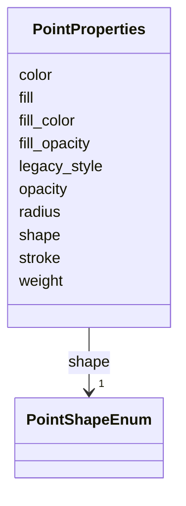

# Class: PointProperties 


_Styling schema for Point and MultiPoint geometries. Follows Leaflet CircleMarker options naming conventions._


URI: [debrief:class/PointProperties](https://debrief.info/schemas/class/PointProperties)





<!-- no inheritance hierarchy -->


## Slots

| Name | Cardinality and Range | Description | Inheritance |
| ---  | --- | --- | --- |
| [shape](../slots/shape.md) | 1 <br/> [PointShapeEnum](../enums/PointShapeEnum.md) | Marker shape | direct |
| [radius](../slots/radius.md) | 1 <br/> [Float](../types/Float.md) | Marker radius in pixels | direct |
| [fill](../slots/fill.md) | 0..1 <br/> [Boolean](../types/Boolean.md) | Whether to fill the shape | direct |
| [fill_color](../slots/fill_color.md) | 1 <br/> [CSSColor](../types/CSSColor.md) | Fill color (CSS color string) | direct |
| [fill_opacity](../slots/fill_opacity.md) | 0..1 <br/> [Float](../types/Float.md) | Fill transparency (0-1) | direct |
| [stroke](../slots/stroke.md) | 0..1 <br/> [Boolean](../types/Boolean.md) | Whether to draw outline | direct |
| [color](../slots/color.md) | 1 <br/> [CSSColor](../types/CSSColor.md) | Stroke color (CSS color string) | direct |
| [weight](../slots/weight.md) | 0..1 <br/> [Float](../types/Float.md) | Stroke width in pixels | direct |
| [opacity](../slots/opacity.md) | 0..1 <br/> [Float](../types/Float.md) | Stroke transparency (0-1) | direct |
| [legacy_style](../slots/legacy_style.md) | 0..1 <br/> [String](../types/String.md) | Legacy symbol name from Debrief symbology (e | direct |


## Usages

| used by | used in | type | used |
| ---  | --- | --- | --- |
| [TrackStyle](../classes/TrackStyle.md) | [point](../slots/point.md) | range | [PointProperties](../classes/PointProperties.md) |
| [ReferenceLocationProperties](../classes/ReferenceLocationProperties.md) | [style](../slots/style.md) | range | [PointProperties](../classes/PointProperties.md) |
| [MultiPointFeatureProperties](../classes/MultiPointFeatureProperties.md) | [style](../slots/style.md) | range | [PointProperties](../classes/PointProperties.md) |
| [NarrativeEntryProperties](../classes/NarrativeEntryProperties.md) | [style](../slots/style.md) | range | [PointProperties](../classes/PointProperties.md) |
| [TextAnnotationProperties](../classes/TextAnnotationProperties.md) | [style](../slots/style.md) | range | [PointProperties](../classes/PointProperties.md) |


## Identifier and Mapping Information


### Schema Source


* from schema: https://debrief.info/schemas/debrief


## Mappings

| Mapping Type | Mapped Value |
| ---  | ---  |
| self | debrief:PointProperties |
| native | debrief:PointProperties |


## LinkML Source

<!-- TODO: investigate https://stackoverflow.com/questions/37606292/how-to-create-tabbed-code-blocks-in-mkdocs-or-sphinx -->

### Direct

<details>
```yaml
name: PointProperties
description: Styling schema for Point and MultiPoint geometries. Follows Leaflet CircleMarker
  options naming conventions.
from_schema: https://debrief.info/schemas/debrief
attributes:
  shape:
    name: shape
    description: Marker shape
    from_schema: https://debrief.info/schemas/styling
    rank: 1000
    domain_of:
    - PointProperties
    range: PointShapeEnum
    required: true
  radius:
    name: radius
    description: Marker radius in pixels
    from_schema: https://debrief.info/schemas/styling
    rank: 1000
    domain_of:
    - PointProperties
    - CircleAnnotationProperties
    range: float
    required: true
    minimum_value: 0
  fill:
    name: fill
    description: Whether to fill the shape
    from_schema: https://debrief.info/schemas/styling
    rank: 1000
    domain_of:
    - PointProperties
    - PolygonProperties
    range: boolean
  fill_color:
    name: fill_color
    description: Fill color (CSS color string)
    from_schema: https://debrief.info/schemas/styling
    rank: 1000
    domain_of:
    - PointProperties
    - PolygonProperties
    range: CSSColor
    required: true
  fill_opacity:
    name: fill_opacity
    description: Fill transparency (0-1)
    from_schema: https://debrief.info/schemas/styling
    rank: 1000
    domain_of:
    - PointProperties
    - PolygonProperties
    range: float
    minimum_value: 0
    maximum_value: 1
  stroke:
    name: stroke
    description: Whether to draw outline
    from_schema: https://debrief.info/schemas/styling
    rank: 1000
    domain_of:
    - PointProperties
    - LineProperties
    - PolygonProperties
    range: boolean
  color:
    name: color
    description: Stroke color (CSS color string)
    from_schema: https://debrief.info/schemas/styling
    rank: 1000
    domain_of:
    - PointProperties
    - LineProperties
    - PolygonProperties
    - SensorContact
    - SensorData
    range: CSSColor
    required: true
  weight:
    name: weight
    description: Stroke width in pixels
    from_schema: https://debrief.info/schemas/styling
    rank: 1000
    domain_of:
    - PointProperties
    - LineProperties
    - PolygonProperties
    range: float
    minimum_value: 0
  opacity:
    name: opacity
    description: Stroke transparency (0-1)
    from_schema: https://debrief.info/schemas/styling
    rank: 1000
    domain_of:
    - PointProperties
    - LineProperties
    - PolygonProperties
    range: float
    minimum_value: 0
    maximum_value: 1
  legacy_style:
    name: legacy_style
    description: Legacy symbol name from Debrief symbology (e.g., 'Aircraft', 'torpedo').
      Preserved for future icon rendering support.
    from_schema: https://debrief.info/schemas/styling
    rank: 1000
    domain_of:
    - PointProperties
    range: string

```
</details>

### Induced

<details>
```yaml
name: PointProperties
description: Styling schema for Point and MultiPoint geometries. Follows Leaflet CircleMarker
  options naming conventions.
from_schema: https://debrief.info/schemas/debrief
attributes:
  shape:
    name: shape
    description: Marker shape
    from_schema: https://debrief.info/schemas/styling
    rank: 1000
    alias: shape
    owner: PointProperties
    domain_of:
    - PointProperties
    range: PointShapeEnum
    required: true
  radius:
    name: radius
    description: Marker radius in pixels
    from_schema: https://debrief.info/schemas/styling
    rank: 1000
    alias: radius
    owner: PointProperties
    domain_of:
    - PointProperties
    - CircleAnnotationProperties
    range: float
    required: true
    minimum_value: 0
  fill:
    name: fill
    description: Whether to fill the shape
    from_schema: https://debrief.info/schemas/styling
    rank: 1000
    alias: fill
    owner: PointProperties
    domain_of:
    - PointProperties
    - PolygonProperties
    range: boolean
  fill_color:
    name: fill_color
    description: Fill color (CSS color string)
    from_schema: https://debrief.info/schemas/styling
    rank: 1000
    alias: fill_color
    owner: PointProperties
    domain_of:
    - PointProperties
    - PolygonProperties
    range: CSSColor
    required: true
  fill_opacity:
    name: fill_opacity
    description: Fill transparency (0-1)
    from_schema: https://debrief.info/schemas/styling
    rank: 1000
    alias: fill_opacity
    owner: PointProperties
    domain_of:
    - PointProperties
    - PolygonProperties
    range: float
    minimum_value: 0
    maximum_value: 1
  stroke:
    name: stroke
    description: Whether to draw outline
    from_schema: https://debrief.info/schemas/styling
    rank: 1000
    alias: stroke
    owner: PointProperties
    domain_of:
    - PointProperties
    - LineProperties
    - PolygonProperties
    range: boolean
  color:
    name: color
    description: Stroke color (CSS color string)
    from_schema: https://debrief.info/schemas/styling
    rank: 1000
    alias: color
    owner: PointProperties
    domain_of:
    - PointProperties
    - LineProperties
    - PolygonProperties
    - SensorContact
    - SensorData
    range: CSSColor
    required: true
  weight:
    name: weight
    description: Stroke width in pixels
    from_schema: https://debrief.info/schemas/styling
    rank: 1000
    alias: weight
    owner: PointProperties
    domain_of:
    - PointProperties
    - LineProperties
    - PolygonProperties
    range: float
    minimum_value: 0
  opacity:
    name: opacity
    description: Stroke transparency (0-1)
    from_schema: https://debrief.info/schemas/styling
    rank: 1000
    alias: opacity
    owner: PointProperties
    domain_of:
    - PointProperties
    - LineProperties
    - PolygonProperties
    range: float
    minimum_value: 0
    maximum_value: 1
  legacy_style:
    name: legacy_style
    description: Legacy symbol name from Debrief symbology (e.g., 'Aircraft', 'torpedo').
      Preserved for future icon rendering support.
    from_schema: https://debrief.info/schemas/styling
    rank: 1000
    alias: legacy_style
    owner: PointProperties
    domain_of:
    - PointProperties
    range: string

```
</details>