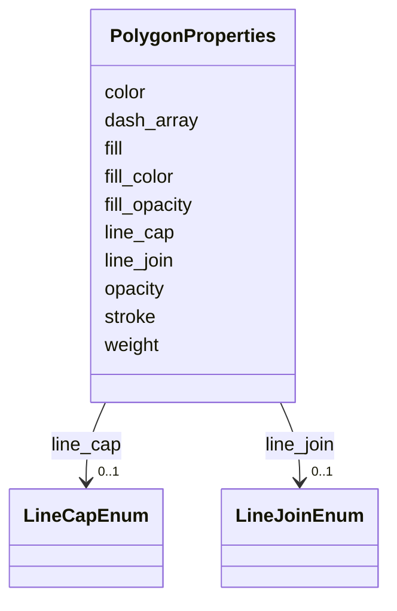

# Class: PolygonProperties 


_Styling schema for Polygon and MultiPolygon geometries. Follows Leaflet Polygon options naming conventions._


URI: [debrief:class/PolygonProperties](https://debrief.info/schemas/class/PolygonProperties)





<!-- no inheritance hierarchy -->


## Slots

| Name | Cardinality and Range | Description | Inheritance |
| ---  | --- | --- | --- |
| [fill](../slots/fill.md) | 0..1 <br/> [Boolean](../types/Boolean.md) | Whether to fill the polygon | direct |
| [fill_color](../slots/fill_color.md) | 1 <br/> [CSSColor](../types/CSSColor.md) | Fill color (CSS color string) | direct |
| [fill_opacity](../slots/fill_opacity.md) | 0..1 <br/> [Float](../types/Float.md) | Fill transparency (0-1) | direct |
| [stroke](../slots/stroke.md) | 0..1 <br/> [Boolean](../types/Boolean.md) | Whether to draw border | direct |
| [color](../slots/color.md) | 1 <br/> [CSSColor](../types/CSSColor.md) | Border color (CSS color string) | direct |
| [weight](../slots/weight.md) | 0..1 <br/> [Float](../types/Float.md) | Border width in pixels | direct |
| [opacity](../slots/opacity.md) | 0..1 <br/> [Float](../types/Float.md) | Border transparency (0-1) | direct |
| [line_cap](../slots/line_cap.md) | 0..1 <br/> [LineCapEnum](../enums/LineCapEnum.md) | Border endpoint style | direct |
| [line_join](../slots/line_join.md) | 0..1 <br/> [LineJoinEnum](../enums/LineJoinEnum.md) | Border join style | direct |
| [dash_array](../slots/dash_array.md) | 0..1 <br/> [String](../types/String.md) | Border dash pattern (SVG format, e | direct |


## Usages

| used by | used in | type | used |
| ---  | --- | --- | --- |
| [MultiPolygonFeatureProperties](../classes/MultiPolygonFeatureProperties.md) | [style](../slots/style.md) | range | [PolygonProperties](../classes/PolygonProperties.md) |
| [CircleAnnotationProperties](../classes/CircleAnnotationProperties.md) | [style](../slots/style.md) | range | [PolygonProperties](../classes/PolygonProperties.md) |
| [RectangleAnnotationProperties](../classes/RectangleAnnotationProperties.md) | [style](../slots/style.md) | range | [PolygonProperties](../classes/PolygonProperties.md) |
| [PolyAnnotationProperties](../classes/PolyAnnotationProperties.md) | [style](../slots/style.md) | range | [PolygonProperties](../classes/PolygonProperties.md) |


## Identifier and Mapping Information


### Schema Source


* from schema: https://debrief.info/schemas/debrief


## Mappings

| Mapping Type | Mapped Value |
| ---  | ---  |
| self | debrief:PolygonProperties |
| native | debrief:PolygonProperties |


## LinkML Source

<!-- TODO: investigate https://stackoverflow.com/questions/37606292/how-to-create-tabbed-code-blocks-in-mkdocs-or-sphinx -->

### Direct

<details>
```yaml
name: PolygonProperties
description: Styling schema for Polygon and MultiPolygon geometries. Follows Leaflet
  Polygon options naming conventions.
from_schema: https://debrief.info/schemas/debrief
attributes:
  fill:
    name: fill
    description: Whether to fill the polygon
    from_schema: https://debrief.info/schemas/styling
    domain_of:
    - PointProperties
    - PolygonProperties
    range: boolean
  fill_color:
    name: fill_color
    description: Fill color (CSS color string)
    from_schema: https://debrief.info/schemas/styling
    domain_of:
    - PointProperties
    - PolygonProperties
    range: CSSColor
    required: true
  fill_opacity:
    name: fill_opacity
    description: Fill transparency (0-1)
    from_schema: https://debrief.info/schemas/styling
    domain_of:
    - PointProperties
    - PolygonProperties
    range: float
    minimum_value: 0
    maximum_value: 1
  stroke:
    name: stroke
    description: Whether to draw border
    from_schema: https://debrief.info/schemas/styling
    domain_of:
    - PointProperties
    - LineProperties
    - PolygonProperties
    range: boolean
  color:
    name: color
    description: Border color (CSS color string)
    from_schema: https://debrief.info/schemas/styling
    domain_of:
    - PointProperties
    - LineProperties
    - PolygonProperties
    - SensorContact
    - SensorData
    range: CSSColor
    required: true
  weight:
    name: weight
    description: Border width in pixels
    from_schema: https://debrief.info/schemas/styling
    domain_of:
    - PointProperties
    - LineProperties
    - PolygonProperties
    range: float
    minimum_value: 0
  opacity:
    name: opacity
    description: Border transparency (0-1)
    from_schema: https://debrief.info/schemas/styling
    domain_of:
    - PointProperties
    - LineProperties
    - PolygonProperties
    range: float
    minimum_value: 0
    maximum_value: 1
  line_cap:
    name: line_cap
    description: Border endpoint style
    from_schema: https://debrief.info/schemas/styling
    domain_of:
    - LineProperties
    - PolygonProperties
    range: LineCapEnum
  line_join:
    name: line_join
    description: Border join style
    from_schema: https://debrief.info/schemas/styling
    domain_of:
    - LineProperties
    - PolygonProperties
    range: LineJoinEnum
  dash_array:
    name: dash_array
    description: Border dash pattern (SVG format, e.g., "5, 10")
    from_schema: https://debrief.info/schemas/styling
    domain_of:
    - LineProperties
    - PolygonProperties
    range: string

```
</details>

### Induced

<details>
```yaml
name: PolygonProperties
description: Styling schema for Polygon and MultiPolygon geometries. Follows Leaflet
  Polygon options naming conventions.
from_schema: https://debrief.info/schemas/debrief
attributes:
  fill:
    name: fill
    description: Whether to fill the polygon
    from_schema: https://debrief.info/schemas/styling
    alias: fill
    owner: PolygonProperties
    domain_of:
    - PointProperties
    - PolygonProperties
    range: boolean
  fill_color:
    name: fill_color
    description: Fill color (CSS color string)
    from_schema: https://debrief.info/schemas/styling
    alias: fill_color
    owner: PolygonProperties
    domain_of:
    - PointProperties
    - PolygonProperties
    range: CSSColor
    required: true
  fill_opacity:
    name: fill_opacity
    description: Fill transparency (0-1)
    from_schema: https://debrief.info/schemas/styling
    alias: fill_opacity
    owner: PolygonProperties
    domain_of:
    - PointProperties
    - PolygonProperties
    range: float
    minimum_value: 0
    maximum_value: 1
  stroke:
    name: stroke
    description: Whether to draw border
    from_schema: https://debrief.info/schemas/styling
    alias: stroke
    owner: PolygonProperties
    domain_of:
    - PointProperties
    - LineProperties
    - PolygonProperties
    range: boolean
  color:
    name: color
    description: Border color (CSS color string)
    from_schema: https://debrief.info/schemas/styling
    alias: color
    owner: PolygonProperties
    domain_of:
    - PointProperties
    - LineProperties
    - PolygonProperties
    - SensorContact
    - SensorData
    range: CSSColor
    required: true
  weight:
    name: weight
    description: Border width in pixels
    from_schema: https://debrief.info/schemas/styling
    alias: weight
    owner: PolygonProperties
    domain_of:
    - PointProperties
    - LineProperties
    - PolygonProperties
    range: float
    minimum_value: 0
  opacity:
    name: opacity
    description: Border transparency (0-1)
    from_schema: https://debrief.info/schemas/styling
    alias: opacity
    owner: PolygonProperties
    domain_of:
    - PointProperties
    - LineProperties
    - PolygonProperties
    range: float
    minimum_value: 0
    maximum_value: 1
  line_cap:
    name: line_cap
    description: Border endpoint style
    from_schema: https://debrief.info/schemas/styling
    alias: line_cap
    owner: PolygonProperties
    domain_of:
    - LineProperties
    - PolygonProperties
    range: LineCapEnum
  line_join:
    name: line_join
    description: Border join style
    from_schema: https://debrief.info/schemas/styling
    alias: line_join
    owner: PolygonProperties
    domain_of:
    - LineProperties
    - PolygonProperties
    range: LineJoinEnum
  dash_array:
    name: dash_array
    description: Border dash pattern (SVG format, e.g., "5, 10")
    from_schema: https://debrief.info/schemas/styling
    alias: dash_array
    owner: PolygonProperties
    domain_of:
    - LineProperties
    - PolygonProperties
    range: string

```
</details>