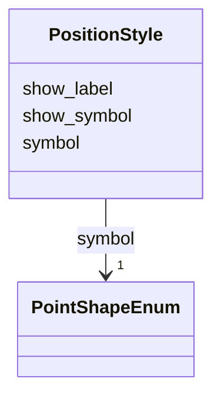

# Class: PositionStyle 


_Default styling configuration for track positions. Applied as baseline before interval rules and overrides._


URI: [debrief:class/PositionStyle](https://debrief.info/schemas/class/PositionStyle)





<!-- no inheritance hierarchy -->


## Slots

| Name | Cardinality and Range | Description | Inheritance |
| ---  | --- | --- | --- |
| [show_symbol](../slots/show_symbol.md) | 1 <br/> [Boolean](../types/Boolean.md) | Whether to display a symbol at positions | direct |
| [symbol](../slots/symbol.md) | 1 <br/> [PointShapeEnum](../enums/PointShapeEnum.md) | Shape to use for position symbols | direct |
| [show_label](../slots/show_label.md) | 1 <br/> [Boolean](../types/Boolean.md) | Whether to display labels at positions | direct |


## Usages

| used by | used in | type | used |
| ---  | --- | --- | --- |
| [TrackProperties](../classes/TrackProperties.md) | [default_position_style](../slots/default_position_style.md) | range | [PositionStyle](../classes/PositionStyle.md) |


## Identifier and Mapping Information


### Schema Source


* from schema: https://debrief.info/schemas/debrief


## Mappings

| Mapping Type | Mapped Value |
| ---  | ---  |
| self | debrief:PositionStyle |
| native | debrief:PositionStyle |


## LinkML Source

<!-- TODO: investigate https://stackoverflow.com/questions/37606292/how-to-create-tabbed-code-blocks-in-mkdocs-or-sphinx -->

### Direct

<details>
```yaml
name: PositionStyle
description: Default styling configuration for track positions. Applied as baseline
  before interval rules and overrides.
from_schema: https://debrief.info/schemas/debrief
attributes:
  show_symbol:
    name: show_symbol
    description: Whether to display a symbol at positions
    from_schema: https://debrief.info/schemas/styling
    rank: 1000
    domain_of:
    - PositionStyle
    - PositionStyleOverride
    range: boolean
    required: true
  symbol:
    name: symbol
    description: Shape to use for position symbols
    from_schema: https://debrief.info/schemas/styling
    rank: 1000
    domain_of:
    - PositionStyle
    - PositionStyleOverride
    - ReferenceLocationProperties
    - NarrativeEntryProperties
    - CircleAnnotationProperties
    - RectangleAnnotationProperties
    - LineAnnotationProperties
    - TextAnnotationProperties
    - VectorAnnotationProperties
    - PolyAnnotationProperties
    range: PointShapeEnum
    required: true
  show_label:
    name: show_label
    description: Whether to display labels at positions
    from_schema: https://debrief.info/schemas/styling
    rank: 1000
    domain_of:
    - PositionStyle
    - PositionStyleOverride
    - SensorContact
    range: boolean
    required: true

```
</details>

### Induced

<details>
```yaml
name: PositionStyle
description: Default styling configuration for track positions. Applied as baseline
  before interval rules and overrides.
from_schema: https://debrief.info/schemas/debrief
attributes:
  show_symbol:
    name: show_symbol
    description: Whether to display a symbol at positions
    from_schema: https://debrief.info/schemas/styling
    rank: 1000
    alias: show_symbol
    owner: PositionStyle
    domain_of:
    - PositionStyle
    - PositionStyleOverride
    range: boolean
    required: true
  symbol:
    name: symbol
    description: Shape to use for position symbols
    from_schema: https://debrief.info/schemas/styling
    rank: 1000
    alias: symbol
    owner: PositionStyle
    domain_of:
    - PositionStyle
    - PositionStyleOverride
    - ReferenceLocationProperties
    - NarrativeEntryProperties
    - CircleAnnotationProperties
    - RectangleAnnotationProperties
    - LineAnnotationProperties
    - TextAnnotationProperties
    - VectorAnnotationProperties
    - PolyAnnotationProperties
    range: PointShapeEnum
    required: true
  show_label:
    name: show_label
    description: Whether to display labels at positions
    from_schema: https://debrief.info/schemas/styling
    rank: 1000
    alias: show_label
    owner: PositionStyle
    domain_of:
    - PositionStyle
    - PositionStyleOverride
    - SensorContact
    range: boolean
    required: true

```
</details>