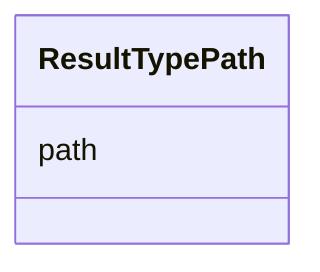

# Class: ResultTypePath 


_Slash-delimited hierarchical type path. Format: {top_type}/{domain}/{specific_type} Example: mutation/track/smoothed_

__


URI: [debrief:class/ResultTypePath](https://debrief.info/schemas/class/ResultTypePath)





<!-- no inheritance hierarchy -->


## Slots

| Name | Cardinality and Range | Description | Inheritance |
| ---  | --- | --- | --- |
| [path](../slots/path.md) | 1 <br/> [String](../types/String.md) | Full hierarchical path | direct |


## Identifier and Mapping Information


### Schema Source


* from schema: https://debrief.info/schemas/debrief


## Mappings

| Mapping Type | Mapped Value |
| ---  | ---  |
| self | debrief:ResultTypePath |
| native | debrief:ResultTypePath |


## LinkML Source

<!-- TODO: investigate https://stackoverflow.com/questions/37606292/how-to-create-tabbed-code-blocks-in-mkdocs-or-sphinx -->

### Direct

<details>
```yaml
name: ResultTypePath
description: 'Slash-delimited hierarchical type path. Format: {top_type}/{domain}/{specific_type}
  Example: mutation/track/smoothed

  '
from_schema: https://debrief.info/schemas/debrief
attributes:
  path:
    name: path
    description: Full hierarchical path
    from_schema: https://debrief.com/schemas/tool-result
    rank: 1000
    domain_of:
    - ResultTypePath
    range: string
    required: true
    pattern: ^(mutation|addition|deletion|artifact)/[a-z_]+/[a-z_]+$

```
</details>

### Induced

<details>
```yaml
name: ResultTypePath
description: 'Slash-delimited hierarchical type path. Format: {top_type}/{domain}/{specific_type}
  Example: mutation/track/smoothed

  '
from_schema: https://debrief.info/schemas/debrief
attributes:
  path:
    name: path
    description: Full hierarchical path
    from_schema: https://debrief.com/schemas/tool-result
    rank: 1000
    alias: path
    owner: ResultTypePath
    domain_of:
    - ResultTypePath
    range: string
    required: true
    pattern: ^(mutation|addition|deletion|artifact)/[a-z_]+/[a-z_]+$

```
</details>