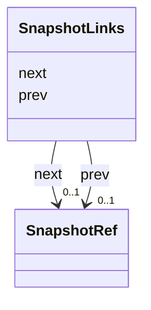

# Class: SnapshotLinks 


_Doubly-linked references to adjacent snapshots._


URI: [debrief:class/SnapshotLinks](https://debrief.info/schemas/class/SnapshotLinks)





<!-- no inheritance hierarchy -->


## Slots

| Name | Cardinality and Range | Description | Inheritance |
| ---  | --- | --- | --- |
| [prev](../slots/prev.md) | 0..1 <br/> [SnapshotRef](../classes/SnapshotRef.md) | Link to previous snapshot | direct |
| [next](../slots/next.md) | 0..1 <br/> [SnapshotRef](../classes/SnapshotRef.md) | Link to next snapshot | direct |


## Usages

| used by | used in | type | used |
| ---  | --- | --- | --- |
| [SystemRecordProperties](../classes/SystemRecordProperties.md) | [snapshot_links](../slots/snapshot_links.md) | range | [SnapshotLinks](../classes/SnapshotLinks.md) |


## Identifier and Mapping Information


### Schema Source


* from schema: https://debrief.info/schemas/debrief


## Mappings

| Mapping Type | Mapped Value |
| ---  | ---  |
| self | debrief:SnapshotLinks |
| native | debrief:SnapshotLinks |


## LinkML Source

<!-- TODO: investigate https://stackoverflow.com/questions/37606292/how-to-create-tabbed-code-blocks-in-mkdocs-or-sphinx -->

### Direct

<details>
```yaml
name: SnapshotLinks
description: Doubly-linked references to adjacent snapshots.
from_schema: https://debrief.info/schemas/debrief
attributes:
  prev:
    name: prev
    description: Link to previous snapshot. Null if this is the first snapshot.
    from_schema: https://debrief.info/schemas/system-record
    rank: 1000
    domain_of:
    - SnapshotLinks
    range: SnapshotRef
    required: false
  next:
    name: next
    description: Link to next snapshot. Null if this is the current working file.
    from_schema: https://debrief.info/schemas/system-record
    rank: 1000
    domain_of:
    - SnapshotLinks
    range: SnapshotRef
    required: false

```
</details>

### Induced

<details>
```yaml
name: SnapshotLinks
description: Doubly-linked references to adjacent snapshots.
from_schema: https://debrief.info/schemas/debrief
attributes:
  prev:
    name: prev
    description: Link to previous snapshot. Null if this is the first snapshot.
    from_schema: https://debrief.info/schemas/system-record
    rank: 1000
    alias: prev
    owner: SnapshotLinks
    domain_of:
    - SnapshotLinks
    range: SnapshotRef
    required: false
  next:
    name: next
    description: Link to next snapshot. Null if this is the current working file.
    from_schema: https://debrief.info/schemas/system-record
    rank: 1000
    alias: next
    owner: SnapshotLinks
    domain_of:
    - SnapshotLinks
    range: SnapshotRef
    required: false

```
</details>