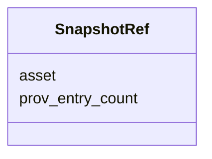

# Class: SnapshotRef 


_Reference to a snapshot file._


URI: [debrief:class/SnapshotRef](https://debrief.info/schemas/class/SnapshotRef)





<!-- no inheritance hierarchy -->


## Slots

| Name | Cardinality and Range | Description | Inheritance |
| ---  | --- | --- | --- |
| [asset](../slots/asset.md) | 1 <br/> [String](../types/String.md) | Relative path to snapshot GeoJSON file | direct |
| [prov_entry_count](../slots/prov_entry_count.md) | 1 <br/> [Integer](../types/Integer.md) | Number of provenance entries in the snapshot | direct |


## Usages

| used by | used in | type | used |
| ---  | --- | --- | --- |
| [SnapshotLinks](../classes/SnapshotLinks.md) | [prev](../slots/prev.md) | range | [SnapshotRef](../classes/SnapshotRef.md) |
| [SnapshotLinks](../classes/SnapshotLinks.md) | [next](../slots/next.md) | range | [SnapshotRef](../classes/SnapshotRef.md) |


## Identifier and Mapping Information


### Schema Source


* from schema: https://debrief.info/schemas/debrief


## Mappings

| Mapping Type | Mapped Value |
| ---  | ---  |
| self | debrief:SnapshotRef |
| native | debrief:SnapshotRef |


## LinkML Source

<!-- TODO: investigate https://stackoverflow.com/questions/37606292/how-to-create-tabbed-code-blocks-in-mkdocs-or-sphinx -->

### Direct

<details>
```yaml
name: SnapshotRef
description: Reference to a snapshot file.
from_schema: https://debrief.info/schemas/debrief
attributes:
  asset:
    name: asset
    description: Relative path to snapshot GeoJSON file.
    from_schema: https://debrief.info/schemas/system-record
    rank: 1000
    domain_of:
    - SnapshotRef
    - FileProvEntry
    range: string
    required: true
  prov_entry_count:
    name: prov_entry_count
    description: Number of provenance entries in the snapshot.
    from_schema: https://debrief.info/schemas/system-record
    rank: 1000
    domain_of:
    - SnapshotRef
    range: integer
    required: true
    minimum_value: 0

```
</details>

### Induced

<details>
```yaml
name: SnapshotRef
description: Reference to a snapshot file.
from_schema: https://debrief.info/schemas/debrief
attributes:
  asset:
    name: asset
    description: Relative path to snapshot GeoJSON file.
    from_schema: https://debrief.info/schemas/system-record
    rank: 1000
    alias: asset
    owner: SnapshotRef
    domain_of:
    - SnapshotRef
    - FileProvEntry
    range: string
    required: true
  prov_entry_count:
    name: prov_entry_count
    description: Number of provenance entries in the snapshot.
    from_schema: https://debrief.info/schemas/system-record
    rank: 1000
    alias: prov_entry_count
    owner: SnapshotRef
    domain_of:
    - SnapshotRef
    range: integer
    required: true
    minimum_value: 0

```
</details>