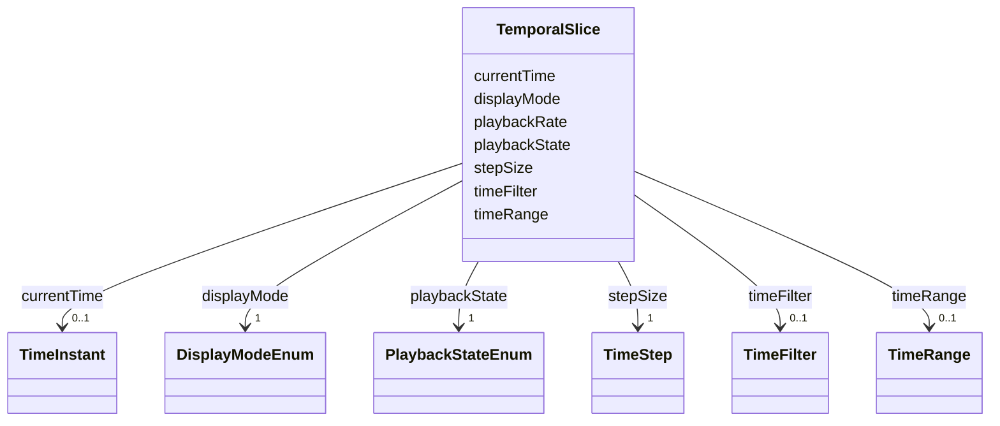

# Class: TemporalSlice 


_Time-related state including navigation, playback, and filtering_


URI: [debrief:class/TemporalSlice](https://debrief.info/schemas/class/TemporalSlice)





<!-- no inheritance hierarchy -->


## Slots

| Name | Cardinality and Range | Description | Inheritance |
| ---  | --- | --- | --- |
| [currentTime](../slots/currentTime.md) | 0..1 <br/> [TimeInstant](../classes/TimeInstant.md) | Current playback/display time (FR-005) | direct |
| [timeRange](../slots/timeRange.md) | 0..1 <br/> [TimeRange](../classes/TimeRange.md) | Full temporal extent of loaded data (FR-006) | direct |
| [timeFilter](../slots/timeFilter.md) | 0..1 <br/> [TimeFilter](../classes/TimeFilter.md) | Optional visible time window constraint (FR-007) | direct |
| [stepSize](../slots/stepSize.md) | 1 <br/> [TimeStep](../classes/TimeStep.md) | Step size for discrete navigation (FR-008) | direct |
| [playbackRate](../slots/playbackRate.md) | 1 <br/> [Float](../types/Float.md) | Playback speed multiplier 0 | direct |
| [playbackState](../slots/playbackState.md) | 1 <br/> [PlaybackStateEnum](../enums/PlaybackStateEnum.md) | Current playback state - ephemeral (FR-010) | direct |
| [displayMode](../slots/displayMode.md) | 1 <br/> [DisplayModeEnum](../enums/DisplayModeEnum.md) | Track visualization mode (FR-011) | direct |


## Usages

| used by | used in | type | used |
| ---  | --- | --- | --- |
| [SessionState](../classes/SessionState.md) | [temporal](../slots/temporal.md) | range | [TemporalSlice](../classes/TemporalSlice.md) |
| [SessionFile](../classes/SessionFile.md) | [temporal](../slots/temporal.md) | range | [TemporalSlice](../classes/TemporalSlice.md) |


## Identifier and Mapping Information


### Schema Source


* from schema: https://debrief.info/schemas/debrief


## Mappings

| Mapping Type | Mapped Value |
| ---  | ---  |
| self | debrief:TemporalSlice |
| native | debrief:TemporalSlice |


## LinkML Source

<!-- TODO: investigate https://stackoverflow.com/questions/37606292/how-to-create-tabbed-code-blocks-in-mkdocs-or-sphinx -->

### Direct

<details>
```yaml
name: TemporalSlice
description: Time-related state including navigation, playback, and filtering
from_schema: https://debrief.info/schemas/debrief
attributes:
  currentTime:
    name: currentTime
    description: Current playback/display time (FR-005)
    from_schema: https://debrief.info/schemas/session-state
    rank: 1000
    domain_of:
    - TemporalSlice
    range: TimeInstant
  timeRange:
    name: timeRange
    description: Full temporal extent of loaded data (FR-006)
    from_schema: https://debrief.info/schemas/session-state
    rank: 1000
    domain_of:
    - TemporalSlice
    range: TimeRange
  timeFilter:
    name: timeFilter
    description: Optional visible time window constraint (FR-007)
    from_schema: https://debrief.info/schemas/session-state
    rank: 1000
    domain_of:
    - TemporalSlice
    range: TimeFilter
  stepSize:
    name: stepSize
    description: Step size for discrete navigation (FR-008)
    from_schema: https://debrief.info/schemas/session-state
    rank: 1000
    domain_of:
    - TemporalSlice
    range: TimeStep
    required: true
  playbackRate:
    name: playbackRate
    description: Playback speed multiplier 0.1-100x (FR-009)
    from_schema: https://debrief.info/schemas/session-state
    rank: 1000
    domain_of:
    - TemporalSlice
    range: float
    required: true
    minimum_value: 0.1
    maximum_value: 100.0
  playbackState:
    name: playbackState
    description: Current playback state - ephemeral (FR-010)
    from_schema: https://debrief.info/schemas/session-state
    rank: 1000
    domain_of:
    - TemporalSlice
    range: PlaybackStateEnum
    required: true
  displayMode:
    name: displayMode
    description: Track visualization mode (FR-011)
    from_schema: https://debrief.info/schemas/session-state
    rank: 1000
    domain_of:
    - TemporalSlice
    range: DisplayModeEnum
    required: true

```
</details>

### Induced

<details>
```yaml
name: TemporalSlice
description: Time-related state including navigation, playback, and filtering
from_schema: https://debrief.info/schemas/debrief
attributes:
  currentTime:
    name: currentTime
    description: Current playback/display time (FR-005)
    from_schema: https://debrief.info/schemas/session-state
    rank: 1000
    alias: currentTime
    owner: TemporalSlice
    domain_of:
    - TemporalSlice
    range: TimeInstant
  timeRange:
    name: timeRange
    description: Full temporal extent of loaded data (FR-006)
    from_schema: https://debrief.info/schemas/session-state
    rank: 1000
    alias: timeRange
    owner: TemporalSlice
    domain_of:
    - TemporalSlice
    range: TimeRange
  timeFilter:
    name: timeFilter
    description: Optional visible time window constraint (FR-007)
    from_schema: https://debrief.info/schemas/session-state
    rank: 1000
    alias: timeFilter
    owner: TemporalSlice
    domain_of:
    - TemporalSlice
    range: TimeFilter
  stepSize:
    name: stepSize
    description: Step size for discrete navigation (FR-008)
    from_schema: https://debrief.info/schemas/session-state
    rank: 1000
    alias: stepSize
    owner: TemporalSlice
    domain_of:
    - TemporalSlice
    range: TimeStep
    required: true
  playbackRate:
    name: playbackRate
    description: Playback speed multiplier 0.1-100x (FR-009)
    from_schema: https://debrief.info/schemas/session-state
    rank: 1000
    alias: playbackRate
    owner: TemporalSlice
    domain_of:
    - TemporalSlice
    range: float
    required: true
    minimum_value: 0.1
    maximum_value: 100.0
  playbackState:
    name: playbackState
    description: Current playback state - ephemeral (FR-010)
    from_schema: https://debrief.info/schemas/session-state
    rank: 1000
    alias: playbackState
    owner: TemporalSlice
    domain_of:
    - TemporalSlice
    range: PlaybackStateEnum
    required: true
  displayMode:
    name: displayMode
    description: Track visualization mode (FR-011)
    from_schema: https://debrief.info/schemas/session-state
    rank: 1000
    alias: displayMode
    owner: TemporalSlice
    domain_of:
    - TemporalSlice
    range: DisplayModeEnum
    required: true

```
</details>