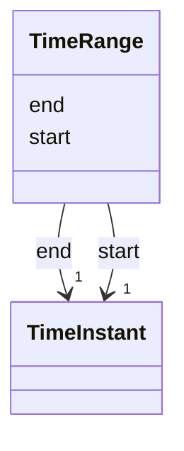

# Class: TimeRange 


_A temporal interval with inclusive start and end_


URI: [debrief:class/TimeRange](https://debrief.info/schemas/class/TimeRange)





<!-- no inheritance hierarchy -->


## Slots

| Name | Cardinality and Range | Description | Inheritance |
| ---  | --- | --- | --- |
| [start](../slots/start.md) | 1 <br/> [TimeInstant](../classes/TimeInstant.md) | Start of interval | direct |
| [end](../slots/end.md) | 1 <br/> [TimeInstant](../classes/TimeInstant.md) | End of interval | direct |


## Usages

| used by | used in | type | used |
| ---  | --- | --- | --- |
| [TemporalSlice](../classes/TemporalSlice.md) | [timeRange](../slots/timeRange.md) | range | [TimeRange](../classes/TimeRange.md) |


## Rules


### 

| Rule Applied | Preconditions | Postconditions | Elseconditions |
|--------------|---------------|----------------|----------------|| description | |```Start must be less than or equal to end``` | |


## Identifier and Mapping Information


### Schema Source


* from schema: https://debrief.info/schemas/debrief


## Mappings

| Mapping Type | Mapped Value |
| ---  | ---  |
| self | debrief:TimeRange |
| native | debrief:TimeRange |


## LinkML Source

<!-- TODO: investigate https://stackoverflow.com/questions/37606292/how-to-create-tabbed-code-blocks-in-mkdocs-or-sphinx -->

### Direct

<details>
```yaml
name: TimeRange
description: A temporal interval with inclusive start and end
from_schema: https://debrief.info/schemas/debrief
attributes:
  start:
    name: start
    description: Start of interval
    from_schema: https://debrief.info/schemas/session-state
    domain_of:
    - PlotTimeExtent
    - TimeRange
    - TimeFilter
    range: TimeInstant
    required: true
  end:
    name: end
    description: End of interval
    from_schema: https://debrief.info/schemas/session-state
    domain_of:
    - PlotTimeExtent
    - TimeRange
    - TimeFilter
    range: TimeInstant
    required: true
rules:
- postconditions:
    description: Start must be less than or equal to end

```
</details>

### Induced

<details>
```yaml
name: TimeRange
description: A temporal interval with inclusive start and end
from_schema: https://debrief.info/schemas/debrief
attributes:
  start:
    name: start
    description: Start of interval
    from_schema: https://debrief.info/schemas/session-state
    alias: start
    owner: TimeRange
    domain_of:
    - PlotTimeExtent
    - TimeRange
    - TimeFilter
    range: TimeInstant
    required: true
  end:
    name: end
    description: End of interval
    from_schema: https://debrief.info/schemas/session-state
    alias: end
    owner: TimeRange
    domain_of:
    - PlotTimeExtent
    - TimeRange
    - TimeFilter
    range: TimeInstant
    required: true
rules:
- postconditions:
    description: Start must be less than or equal to end

```
</details>