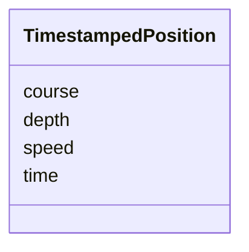

# Class: TimestampedPosition 


_Temporal and kinematic metadata for a single track position. Coordinates are NOT stored here - they live in geometry.coordinates[i]. Position metadata at index i corresponds to coordinate at index i._


URI: [debrief:class/TimestampedPosition](https://debrief.info/schemas/class/TimestampedPosition)





<!-- no inheritance hierarchy -->


## Slots

| Name | Cardinality and Range | Description | Inheritance |
| ---  | --- | --- | --- |
| [time](../slots/time.md) | 1 <br/> [datetime](../slots/datetime.md) | Position timestamp (ISO8601) | direct |
| [depth](../slots/depth.md) | 0..1 <br/> [Float](../types/Float.md) | Depth in meters (negative = below surface) | direct |
| [course](../slots/course.md) | 0..1 <br/> [Float](../types/Float.md) | Course in degrees (0-360) | direct |
| [speed](../slots/speed.md) | 0..1 <br/> [Float](../types/Float.md) | Speed in knots | direct |


## Usages

| used by | used in | type | used |
| ---  | --- | --- | --- |
| [SegmentMetadata](../classes/SegmentMetadata.md) | [positions](../slots/positions.md) | range | [TimestampedPosition](../classes/TimestampedPosition.md) |
| [TrackProperties](../classes/TrackProperties.md) | [positions](../slots/positions.md) | range | [TimestampedPosition](../classes/TimestampedPosition.md) |


## Identifier and Mapping Information


### Schema Source


* from schema: https://debrief.info/schemas/debrief


## Mappings

| Mapping Type | Mapped Value |
| ---  | ---  |
| self | debrief:TimestampedPosition |
| native | debrief:TimestampedPosition |


## LinkML Source

<!-- TODO: investigate https://stackoverflow.com/questions/37606292/how-to-create-tabbed-code-blocks-in-mkdocs-or-sphinx -->

### Direct

<details>
```yaml
name: TimestampedPosition
description: Temporal and kinematic metadata for a single track position. Coordinates
  are NOT stored here - they live in geometry.coordinates[i]. Position metadata at
  index i corresponds to coordinate at index i.
from_schema: https://debrief.info/schemas/debrief
attributes:
  time:
    name: time
    description: Position timestamp (ISO8601)
    from_schema: https://debrief.info/schemas/common
    rank: 1000
    domain_of:
    - TimestampedPosition
    - MeasuredArrayPosition
    - SensorContact
    - TUASolution
    - NarrativeEntryProperties
    range: datetime
    required: true
  depth:
    name: depth
    description: Depth in meters (negative = below surface)
    from_schema: https://debrief.info/schemas/common
    rank: 1000
    domain_of:
    - TimestampedPosition
    - TUASolution
    range: float
  course:
    name: course
    description: Course in degrees (0-360)
    from_schema: https://debrief.info/schemas/common
    rank: 1000
    domain_of:
    - TimestampedPosition
    - SegmentMetadata
    - TUASolution
    range: float
    minimum_value: 0
    maximum_value: 360
  speed:
    name: speed
    description: Speed in knots
    from_schema: https://debrief.info/schemas/common
    rank: 1000
    domain_of:
    - TimestampedPosition
    - SegmentMetadata
    - TUASolution
    range: float
    minimum_value: 0

```
</details>

### Induced

<details>
```yaml
name: TimestampedPosition
description: Temporal and kinematic metadata for a single track position. Coordinates
  are NOT stored here - they live in geometry.coordinates[i]. Position metadata at
  index i corresponds to coordinate at index i.
from_schema: https://debrief.info/schemas/debrief
attributes:
  time:
    name: time
    description: Position timestamp (ISO8601)
    from_schema: https://debrief.info/schemas/common
    rank: 1000
    alias: time
    owner: TimestampedPosition
    domain_of:
    - TimestampedPosition
    - MeasuredArrayPosition
    - SensorContact
    - TUASolution
    - NarrativeEntryProperties
    range: datetime
    required: true
  depth:
    name: depth
    description: Depth in meters (negative = below surface)
    from_schema: https://debrief.info/schemas/common
    rank: 1000
    alias: depth
    owner: TimestampedPosition
    domain_of:
    - TimestampedPosition
    - TUASolution
    range: float
  course:
    name: course
    description: Course in degrees (0-360)
    from_schema: https://debrief.info/schemas/common
    rank: 1000
    alias: course
    owner: TimestampedPosition
    domain_of:
    - TimestampedPosition
    - SegmentMetadata
    - TUASolution
    range: float
    minimum_value: 0
    maximum_value: 360
  speed:
    name: speed
    description: Speed in knots
    from_schema: https://debrief.info/schemas/common
    rank: 1000
    alias: speed
    owner: TimestampedPosition
    domain_of:
    - TimestampedPosition
    - SegmentMetadata
    - TUASolution
    range: float
    minimum_value: 0

```
</details>