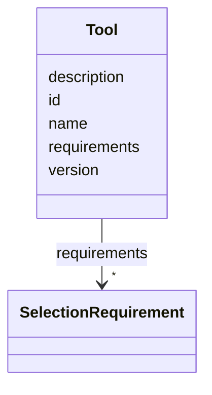

# Class: Tool 


_An analysis operation with a name, description, version, and selection requirements. Tools are discovered from debrief-calc via MCP and matched to analyst selections._


URI: [debrief:class/Tool](https://debrief.info/schemas/class/Tool)





<!-- no inheritance hierarchy -->


## Slots

| Name | Cardinality and Range | Description | Inheritance |
| ---  | --- | --- | --- |
| [id](../slots/id.md) | 1 <br/> [String](../types/String.md) | Unique identifier for the tool | direct |
| [name](../slots/name.md) | 1 <br/> [String](../types/String.md) | Human-readable name displayed in menus and panels | direct |
| [description](../slots/description.md) | 0..1 <br/> [String](../types/String.md) | Brief description of what the tool does | direct |
| [version](../slots/version.md) | 0..1 <br/> [String](../types/String.md) | Tool version string for provenance tracking | direct |
| [requirements](../slots/requirements.md) | * <br/> [SelectionRequirement](../classes/SelectionRequirement.md) | List of selection requirements | direct |


## Identifier and Mapping Information


### Schema Source


* from schema: https://debrief.info/schemas/debrief


## Mappings

| Mapping Type | Mapped Value |
| ---  | ---  |
| self | debrief:Tool |
| native | debrief:Tool |


## LinkML Source

<!-- TODO: investigate https://stackoverflow.com/questions/37606292/how-to-create-tabbed-code-blocks-in-mkdocs-or-sphinx -->

### Direct

<details>
```yaml
name: Tool
description: An analysis operation with a name, description, version, and selection
  requirements. Tools are discovered from debrief-calc via MCP and matched to analyst
  selections.
from_schema: https://debrief.info/schemas/debrief
attributes:
  id:
    name: id
    description: Unique identifier for the tool. Used for execution and deduplication.
      Should be stable across versions.
    from_schema: https://debrief.info/schemas/tool
    identifier: true
    domain_of:
    - TrackFeature
    - ReferenceLocation
    - SystemState
    - MultiPointFeature
    - MultiPolygonFeature
    - NarrativeEntry
    - CircleAnnotation
    - RectangleAnnotation
    - LineAnnotation
    - TextAnnotation
    - VectorAnnotation
    - PolyAnnotation
    - Tool
    - PlatformRecord
    - PlotSummary
    - StacItemSummary
    - GeoJSONFeature
    range: string
    required: true
  name:
    name: name
    description: Human-readable name displayed in menus and panels. Should be concise
      (2-4 words).
    from_schema: https://debrief.info/schemas/tool
    domain_of:
    - SegmentMetadata
    - SensorData
    - TUAData
    - PointMetadataEntry
    - ReferenceLocationProperties
    - Tool
    - ToolParameter
    - PlatformRecord
    - LevelDefinition
    - DatasetSeries
    range: string
    required: true
  description:
    name: description
    description: Brief description of what the tool does. Displayed in tooltips and
      help text. Should be one sentence.
    from_schema: https://debrief.info/schemas/tool
    domain_of:
    - ReferenceLocationProperties
    - MultiPointFeatureProperties
    - MultiPolygonFeatureProperties
    - Tool
    - ToolParameter
    - LevelDefinition
    range: string
    required: false
  version:
    name: version
    description: Tool version string for provenance tracking. Follows semantic versioning
      (e.g., "1.0.0").
    from_schema: https://debrief.info/schemas/tool
    rank: 1000
    domain_of:
    - Tool
    - SessionFile
    range: string
    required: false
  requirements:
    name: requirements
    description: List of selection requirements. Tool is active when ALL requirements
      are satisfied by the current selection. Empty list means tool accepts any selection.
    from_schema: https://debrief.info/schemas/tool
    rank: 1000
    domain_of:
    - Tool
    range: SelectionRequirement
    required: false
    multivalued: true
    inlined: true
    inlined_as_list: true

```
</details>

### Induced

<details>
```yaml
name: Tool
description: An analysis operation with a name, description, version, and selection
  requirements. Tools are discovered from debrief-calc via MCP and matched to analyst
  selections.
from_schema: https://debrief.info/schemas/debrief
attributes:
  id:
    name: id
    description: Unique identifier for the tool. Used for execution and deduplication.
      Should be stable across versions.
    from_schema: https://debrief.info/schemas/tool
    identifier: true
    alias: id
    owner: Tool
    domain_of:
    - TrackFeature
    - ReferenceLocation
    - SystemState
    - MultiPointFeature
    - MultiPolygonFeature
    - NarrativeEntry
    - CircleAnnotation
    - RectangleAnnotation
    - LineAnnotation
    - TextAnnotation
    - VectorAnnotation
    - PolyAnnotation
    - Tool
    - PlatformRecord
    - PlotSummary
    - StacItemSummary
    - GeoJSONFeature
    range: string
    required: true
  name:
    name: name
    description: Human-readable name displayed in menus and panels. Should be concise
      (2-4 words).
    from_schema: https://debrief.info/schemas/tool
    alias: name
    owner: Tool
    domain_of:
    - SegmentMetadata
    - SensorData
    - TUAData
    - PointMetadataEntry
    - ReferenceLocationProperties
    - Tool
    - ToolParameter
    - PlatformRecord
    - LevelDefinition
    - DatasetSeries
    range: string
    required: true
  description:
    name: description
    description: Brief description of what the tool does. Displayed in tooltips and
      help text. Should be one sentence.
    from_schema: https://debrief.info/schemas/tool
    alias: description
    owner: Tool
    domain_of:
    - ReferenceLocationProperties
    - MultiPointFeatureProperties
    - MultiPolygonFeatureProperties
    - Tool
    - ToolParameter
    - LevelDefinition
    range: string
    required: false
  version:
    name: version
    description: Tool version string for provenance tracking. Follows semantic versioning
      (e.g., "1.0.0").
    from_schema: https://debrief.info/schemas/tool
    rank: 1000
    alias: version
    owner: Tool
    domain_of:
    - Tool
    - SessionFile
    range: string
    required: false
  requirements:
    name: requirements
    description: List of selection requirements. Tool is active when ALL requirements
      are satisfied by the current selection. Empty list means tool accepts any selection.
    from_schema: https://debrief.info/schemas/tool
    rank: 1000
    alias: requirements
    owner: Tool
    domain_of:
    - Tool
    range: SelectionRequirement
    required: false
    multivalued: true
    inlined: true
    inlined_as_list: true

```
</details>