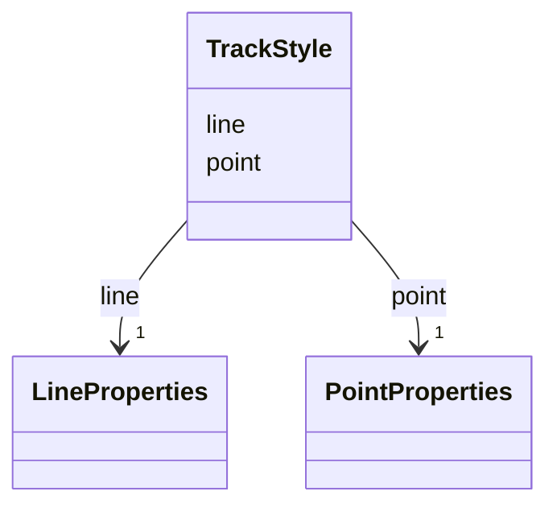

# Class: TrackStyle 


_Composite styling for TrackFeature, supporting both line path and position markers._


URI: [debrief:class/TrackStyle](https://debrief.info/schemas/class/TrackStyle)





<!-- no inheritance hierarchy -->


## Slots

| Name | Cardinality and Range | Description | Inheritance |
| ---  | --- | --- | --- |
| [line](../slots/line.md) | 1 <br/> [LineProperties](../classes/LineProperties.md) | Styling for the track line path | direct |
| [point](../slots/point.md) | 1 <br/> [PointProperties](../classes/PointProperties.md) | Styling for position markers | direct |


## Usages

| used by | used in | type | used |
| ---  | --- | --- | --- |
| [TrackProperties](../classes/TrackProperties.md) | [style](../slots/style.md) | range | [TrackStyle](../classes/TrackStyle.md) |


## Identifier and Mapping Information


### Schema Source


* from schema: https://debrief.info/schemas/debrief


## Mappings

| Mapping Type | Mapped Value |
| ---  | ---  |
| self | debrief:TrackStyle |
| native | debrief:TrackStyle |


## LinkML Source

<!-- TODO: investigate https://stackoverflow.com/questions/37606292/how-to-create-tabbed-code-blocks-in-mkdocs-or-sphinx -->

### Direct

<details>
```yaml
name: TrackStyle
description: Composite styling for TrackFeature, supporting both line path and position
  markers.
from_schema: https://debrief.info/schemas/debrief
attributes:
  line:
    name: line
    description: Styling for the track line path
    from_schema: https://debrief.info/schemas/styling
    rank: 1000
    domain_of:
    - TrackStyle
    range: LineProperties
    required: true
  point:
    name: point
    description: Styling for position markers
    from_schema: https://debrief.info/schemas/styling
    rank: 1000
    domain_of:
    - TrackStyle
    range: PointProperties
    required: true

```
</details>

### Induced

<details>
```yaml
name: TrackStyle
description: Composite styling for TrackFeature, supporting both line path and position
  markers.
from_schema: https://debrief.info/schemas/debrief
attributes:
  line:
    name: line
    description: Styling for the track line path
    from_schema: https://debrief.info/schemas/styling
    rank: 1000
    alias: line
    owner: TrackStyle
    domain_of:
    - TrackStyle
    range: LineProperties
    required: true
  point:
    name: point
    description: Styling for position markers
    from_schema: https://debrief.info/schemas/styling
    rank: 1000
    alias: point
    owner: TrackStyle
    domain_of:
    - TrackStyle
    range: PointProperties
    required: true

```
</details>