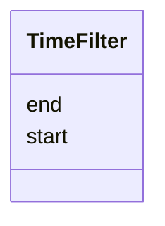

# Class: TimeFilter 


_Constraints on the visible time window (epoch milliseconds; null = unbounded)_


URI: [debrief:class/TimeFilter](https://debrief.info/schemas/class/TimeFilter)





<!-- no inheritance hierarchy -->


## Slots

| Name | Cardinality and Range | Description | Inheritance |
| ---  | --- | --- | --- |
| [start](../slots/start.md) | 0..1 <br/> [Integer](../types/Integer.md) | Filter start as epoch milliseconds (null/missing = unbounded on the start) | direct |
| [end](../slots/end.md) | 0..1 <br/> [Integer](../types/Integer.md) | Filter end as epoch milliseconds (null/missing = unbounded on the end) | direct |


## Usages

| used by | used in | type | used |
| ---  | --- | --- | --- |
| [TemporalSlice](../classes/TemporalSlice.md) | [timeFilter](../slots/timeFilter.md) | range | [TimeFilter](../classes/TimeFilter.md) |


## Identifier and Mapping Information


### Schema Source


* from schema: https://debrief.info/schemas/debrief


## Mappings

| Mapping Type | Mapped Value |
| ---  | ---  |
| self | debrief:TimeFilter |
| native | debrief:TimeFilter |


## LinkML Source

<!-- TODO: investigate https://stackoverflow.com/questions/37606292/how-to-create-tabbed-code-blocks-in-mkdocs-or-sphinx -->

### Direct

<details>
```yaml
name: TimeFilter
description: Constraints on the visible time window (epoch milliseconds; null = unbounded)
from_schema: https://debrief.info/schemas/debrief
attributes:
  start:
    name: start
    description: Filter start as epoch milliseconds (null/missing = unbounded on the
      start)
    from_schema: https://debrief.info/schemas/session-state
    domain_of:
    - PlotTimeExtent
    - TimeRange
    - TimeFilter
    range: integer
    required: false
  end:
    name: end
    description: Filter end as epoch milliseconds (null/missing = unbounded on the
      end)
    from_schema: https://debrief.info/schemas/session-state
    domain_of:
    - PlotTimeExtent
    - TimeRange
    - TimeFilter
    range: integer
    required: false

```
</details>

### Induced

<details>
```yaml
name: TimeFilter
description: Constraints on the visible time window (epoch milliseconds; null = unbounded)
from_schema: https://debrief.info/schemas/debrief
attributes:
  start:
    name: start
    description: Filter start as epoch milliseconds (null/missing = unbounded on the
      start)
    from_schema: https://debrief.info/schemas/session-state
    alias: start
    owner: TimeFilter
    domain_of:
    - PlotTimeExtent
    - TimeRange
    - TimeFilter
    range: integer
    required: false
  end:
    name: end
    description: Filter end as epoch milliseconds (null/missing = unbounded on the
      end)
    from_schema: https://debrief.info/schemas/session-state
    alias: end
    owner: TimeFilter
    domain_of:
    - PlotTimeExtent
    - TimeRange
    - TimeFilter
    range: integer
    required: false

```
</details>