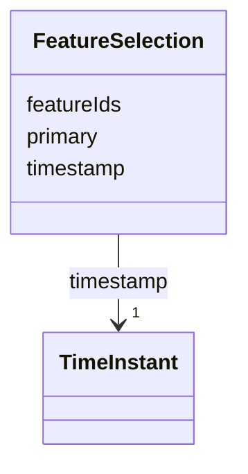

# Class: FeatureSelection 


_Set of selected feature identifiers with metadata (FR-017). featureIds accepts selection path strings: forward-slash-separated segments following RFC 6901 escaping. A single-segment path is a flat feature ID (backward compatible). Feature 053._


URI: [debrief:class/FeatureSelection](https://debrief.info/schemas/class/FeatureSelection)





<!-- no inheritance hierarchy -->


## Slots

| Name | Cardinality and Range | Description | Inheritance |
| ---  | --- | --- | --- |
| [featureIds](../slots/featureIds.md) | 1..* <br/> [String](../types/String.md) | Selected feature paths | direct |
| [primary](../slots/primary.md) | 0..1 <br/> [String](../types/String.md) | Primary selection path for properties display | direct |
| [timestamp](../slots/timestamp.md) | 1 <br/> [TimeInstant](../classes/TimeInstant.md) | When selection was made | direct |


## Usages

| used by | used in | type | used |
| ---  | --- | --- | --- |
| [FeaturesSlice](../classes/FeaturesSlice.md) | [selection](../slots/selection.md) | range | [FeatureSelection](../classes/FeatureSelection.md) |


## Identifier and Mapping Information


### Schema Source


* from schema: https://debrief.info/schemas/debrief


## Mappings

| Mapping Type | Mapped Value |
| ---  | ---  |
| self | debrief:FeatureSelection |
| native | debrief:FeatureSelection |


## LinkML Source

<!-- TODO: investigate https://stackoverflow.com/questions/37606292/how-to-create-tabbed-code-blocks-in-mkdocs-or-sphinx -->

### Direct

<details>
```yaml
name: FeatureSelection
description: 'Set of selected feature identifiers with metadata (FR-017). featureIds
  accepts selection path strings: forward-slash-separated segments following RFC 6901
  escaping. A single-segment path is a flat feature ID (backward compatible). Feature
  053.'
from_schema: https://debrief.info/schemas/debrief
attributes:
  featureIds:
    name: featureIds
    description: Selected feature paths. Each entry is a forward-slash-separated selection
      path (e.g. "track-001/positions/4") or a flat feature ID.
    from_schema: https://debrief.info/schemas/session-state
    rank: 1000
    domain_of:
    - FeatureSelection
    range: string
    required: true
    multivalued: true
  primary:
    name: primary
    description: Primary selection path for properties display
    from_schema: https://debrief.info/schemas/session-state
    rank: 1000
    domain_of:
    - FeatureSelection
    range: string
  timestamp:
    name: timestamp
    description: When selection was made
    from_schema: https://debrief.info/schemas/session-state
    domain_of:
    - LogEntry
    - TuneAnnotation
    - FileProvEntry
    - PropertiesProvenanceEntry
    - FeatureSelection
    - SceneProperties
    range: TimeInstant
    required: true

```
</details>

### Induced

<details>
```yaml
name: FeatureSelection
description: 'Set of selected feature identifiers with metadata (FR-017). featureIds
  accepts selection path strings: forward-slash-separated segments following RFC 6901
  escaping. A single-segment path is a flat feature ID (backward compatible). Feature
  053.'
from_schema: https://debrief.info/schemas/debrief
attributes:
  featureIds:
    name: featureIds
    description: Selected feature paths. Each entry is a forward-slash-separated selection
      path (e.g. "track-001/positions/4") or a flat feature ID.
    from_schema: https://debrief.info/schemas/session-state
    rank: 1000
    alias: featureIds
    owner: FeatureSelection
    domain_of:
    - FeatureSelection
    range: string
    required: true
    multivalued: true
  primary:
    name: primary
    description: Primary selection path for properties display
    from_schema: https://debrief.info/schemas/session-state
    rank: 1000
    alias: primary
    owner: FeatureSelection
    domain_of:
    - FeatureSelection
    range: string
  timestamp:
    name: timestamp
    description: When selection was made
    from_schema: https://debrief.info/schemas/session-state
    alias: timestamp
    owner: FeatureSelection
    domain_of:
    - LogEntry
    - TuneAnnotation
    - FileProvEntry
    - PropertiesProvenanceEntry
    - FeatureSelection
    - SceneProperties
    range: TimeInstant
    required: true

```
</details>