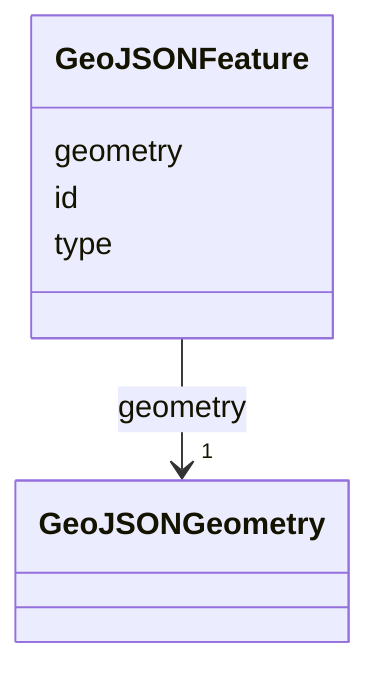

# Class: GeoJSONFeature 


_GeoJSON Feature representation used for tool result layers. Feature 109-unify-result-layer-lifecycle._

__


URI: [debrief:class/GeoJSONFeature](https://debrief.info/schemas/class/GeoJSONFeature)





<!-- no inheritance hierarchy -->


## Slots

| Name | Cardinality and Range | Description | Inheritance |
| ---  | --- | --- | --- |
| [type](../slots/type.md) | 1 <br/> [String](../types/String.md) | GeoJSON object type — always "Feature" | direct |
| [id](../slots/id.md) | 0..1 <br/> [String](../types/String.md) | Optional feature identifier (string or numeric, stored as string) | direct |
| [geometry](../slots/geometry.md) | 1 <br/> [GeoJSONGeometry](../classes/GeoJSONGeometry.md) | GeoJSON geometry object | direct |


## Usages

| used by | used in | type | used |
| ---  | --- | --- | --- |
| [ResultsSlice](../classes/ResultsSlice.md) | [result_layers](../slots/result_layers.md) | range | [GeoJSONFeature](../classes/GeoJSONFeature.md) |


## Identifier and Mapping Information


### Schema Source


* from schema: https://debrief.info/schemas/debrief


## Mappings

| Mapping Type | Mapped Value |
| ---  | ---  |
| self | debrief:GeoJSONFeature |
| native | debrief:GeoJSONFeature |


## LinkML Source

<!-- TODO: investigate https://stackoverflow.com/questions/37606292/how-to-create-tabbed-code-blocks-in-mkdocs-or-sphinx -->

### Direct

<details>
```yaml
name: GeoJSONFeature
description: 'GeoJSON Feature representation used for tool result layers. Feature
  109-unify-result-layer-lifecycle.

  '
from_schema: https://debrief.info/schemas/debrief
attributes:
  type:
    name: type
    description: GeoJSON object type — always "Feature"
    from_schema: https://debrief.info/schemas/session-state
    domain_of:
    - GeoJSONPoint
    - GeoJSONEmptyPoint
    - GeoJSONLineString
    - GeoJSONPolygon
    - GeoJSONMultiPoint
    - GeoJSONMultiLineString
    - GeoJSONMultiPolygon
    - TrackFeature
    - ReferenceLocation
    - SystemState
    - MultiPointFeature
    - MultiPolygonFeature
    - NarrativeEntry
    - CircleAnnotation
    - RectangleAnnotation
    - LineAnnotation
    - TextAnnotation
    - VectorAnnotation
    - PolyAnnotation
    - ToolParameter
    - FileProvEntry
    - GeoJSONGeometry
    - GeoJSONFeature
    - DatasetAxisMetadata
    - DatasetEntry
    - StoryboardFeature
    - SceneFeature
    range: string
    required: true
  id:
    name: id
    description: Optional feature identifier (string or numeric, stored as string)
    from_schema: https://debrief.info/schemas/session-state
    domain_of:
    - TrackFeature
    - ReferenceLocation
    - SystemState
    - MultiPointFeature
    - MultiPolygonFeature
    - NarrativeEntry
    - CircleAnnotation
    - RectangleAnnotation
    - LineAnnotation
    - TextAnnotation
    - VectorAnnotation
    - PolyAnnotation
    - Tool
    - PlatformRecord
    - PlotSummary
    - StacItemSummary
    - GeoJSONFeature
    - StoryboardProperties
    - SceneProperties
    - StoryboardFeature
    - SceneFeature
    range: string
    required: false
  geometry:
    name: geometry
    description: GeoJSON geometry object
    from_schema: https://debrief.info/schemas/session-state
    domain_of:
    - TrackFeature
    - ReferenceLocation
    - SystemState
    - MultiPointFeature
    - MultiPolygonFeature
    - InputFeatureState
    - NarrativeEntry
    - CircleAnnotation
    - RectangleAnnotation
    - LineAnnotation
    - TextAnnotation
    - VectorAnnotation
    - PolyAnnotation
    - GeoJSONFeature
    - StoryboardFeature
    - SceneFeature
    range: GeoJSONGeometry
    required: true

```
</details>

### Induced

<details>
```yaml
name: GeoJSONFeature
description: 'GeoJSON Feature representation used for tool result layers. Feature
  109-unify-result-layer-lifecycle.

  '
from_schema: https://debrief.info/schemas/debrief
attributes:
  type:
    name: type
    description: GeoJSON object type — always "Feature"
    from_schema: https://debrief.info/schemas/session-state
    alias: type
    owner: GeoJSONFeature
    domain_of:
    - GeoJSONPoint
    - GeoJSONEmptyPoint
    - GeoJSONLineString
    - GeoJSONPolygon
    - GeoJSONMultiPoint
    - GeoJSONMultiLineString
    - GeoJSONMultiPolygon
    - TrackFeature
    - ReferenceLocation
    - SystemState
    - MultiPointFeature
    - MultiPolygonFeature
    - NarrativeEntry
    - CircleAnnotation
    - RectangleAnnotation
    - LineAnnotation
    - TextAnnotation
    - VectorAnnotation
    - PolyAnnotation
    - ToolParameter
    - FileProvEntry
    - GeoJSONGeometry
    - GeoJSONFeature
    - DatasetAxisMetadata
    - DatasetEntry
    - StoryboardFeature
    - SceneFeature
    range: string
    required: true
  id:
    name: id
    description: Optional feature identifier (string or numeric, stored as string)
    from_schema: https://debrief.info/schemas/session-state
    alias: id
    owner: GeoJSONFeature
    domain_of:
    - TrackFeature
    - ReferenceLocation
    - SystemState
    - MultiPointFeature
    - MultiPolygonFeature
    - NarrativeEntry
    - CircleAnnotation
    - RectangleAnnotation
    - LineAnnotation
    - TextAnnotation
    - VectorAnnotation
    - PolyAnnotation
    - Tool
    - PlatformRecord
    - PlotSummary
    - StacItemSummary
    - GeoJSONFeature
    - StoryboardProperties
    - SceneProperties
    - StoryboardFeature
    - SceneFeature
    range: string
    required: false
  geometry:
    name: geometry
    description: GeoJSON geometry object
    from_schema: https://debrief.info/schemas/session-state
    alias: geometry
    owner: GeoJSONFeature
    domain_of:
    - TrackFeature
    - ReferenceLocation
    - SystemState
    - MultiPointFeature
    - MultiPolygonFeature
    - InputFeatureState
    - NarrativeEntry
    - CircleAnnotation
    - RectangleAnnotation
    - LineAnnotation
    - TextAnnotation
    - VectorAnnotation
    - PolyAnnotation
    - GeoJSONFeature
    - StoryboardFeature
    - SceneFeature
    range: GeoJSONGeometry
    required: true

```
</details>