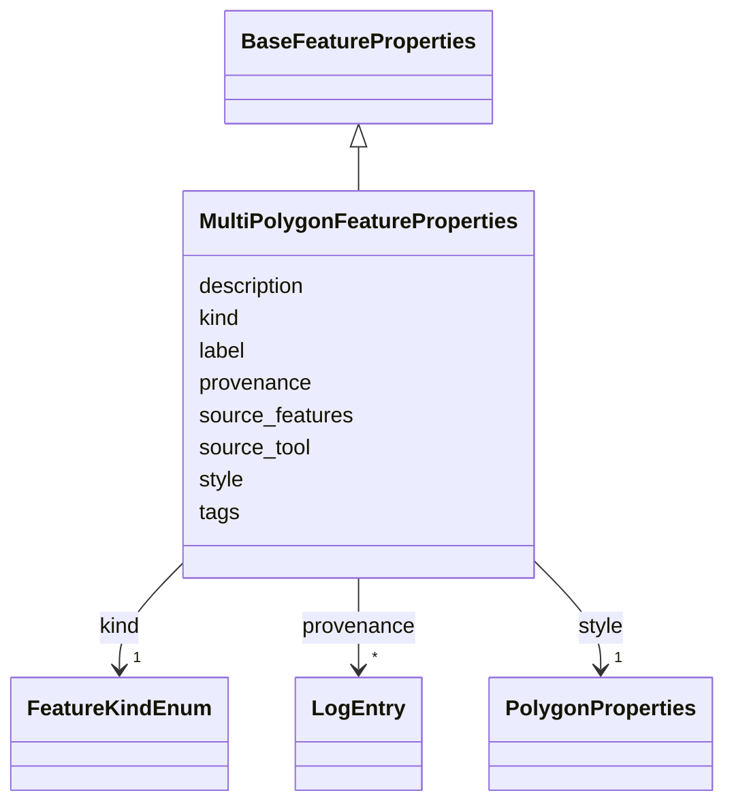

# Class: MultiPolygonFeatureProperties 


_Properties for a MultiPolygonFeature (multi-polygon tool results)_


URI: [debrief:class/MultiPolygonFeatureProperties](https://debrief.info/schemas/class/MultiPolygonFeatureProperties)





## Inheritance
* [BaseFeatureProperties](../classes/BaseFeatureProperties.md)
    * **MultiPolygonFeatureProperties**


## Slots

| Name | Cardinality and Range | Description | Inheritance |
| ---  | --- | --- | --- |
| [kind](../slots/kind.md) | 1 <br/> [FeatureKindEnum](../enums/FeatureKindEnum.md) | Feature type discriminator | direct |
| [label](../slots/label.md) | 1 <br/> [String](../types/String.md) | Human-readable result label | direct |
| [style](../slots/style.md) | 1 <br/> [PolygonProperties](../classes/PolygonProperties.md) | Polygon styling for all regions | direct |
| [source_tool](../slots/source_tool.md) | 0..1 <br/> [String](../types/String.md) | Name of calculation tool that produced this result | direct |
| [source_features](../slots/source_features.md) | * <br/> [String](../types/String.md) | IDs of input features used to generate this result | direct |
| [description](../slots/description.md) | 0..1 <br/> [String](../types/String.md) | Additional description or notes | direct |
| [tags](../slots/tags.md) | * <br/> [String](../types/String.md) | Free-text labels assigned to this feature by the analyst | [BaseFeatureProperties](../classes/BaseFeatureProperties.md) |
| [provenance](../slots/provenance.md) | * <br/> [LogEntry](../classes/LogEntry.md) | PROV-aligned provenance records (append-only log of tool operations) | [BaseFeatureProperties](../classes/BaseFeatureProperties.md) |


## Usages

| used by | used in | type | used |
| ---  | --- | --- | --- |
| [MultiPolygonFeature](../classes/MultiPolygonFeature.md) | [properties](../slots/properties.md) | range | [MultiPolygonFeatureProperties](../classes/MultiPolygonFeatureProperties.md) |


## Identifier and Mapping Information


### Schema Source


* from schema: https://debrief.info/schemas/debrief


## Mappings

| Mapping Type | Mapped Value |
| ---  | ---  |
| self | debrief:MultiPolygonFeatureProperties |
| native | debrief:MultiPolygonFeatureProperties |


## LinkML Source

<!-- TODO: investigate https://stackoverflow.com/questions/37606292/how-to-create-tabbed-code-blocks-in-mkdocs-or-sphinx -->

### Direct

<details>
```yaml
name: MultiPolygonFeatureProperties
description: Properties for a MultiPolygonFeature (multi-polygon tool results)
from_schema: https://debrief.info/schemas/debrief
is_a: BaseFeatureProperties
attributes:
  kind:
    name: kind
    description: Feature type discriminator
    from_schema: https://debrief.info/schemas/geojson
    domain_of:
    - BaseFeatureProperties
    - TrackProperties
    - ReferenceLocationProperties
    - SystemStateProperties
    - MultiPointFeatureProperties
    - MultiPolygonFeatureProperties
    - NarrativeEntryProperties
    - CircleAnnotationProperties
    - RectangleAnnotationProperties
    - LineAnnotationProperties
    - TextAnnotationProperties
    - VectorAnnotationProperties
    - PolyAnnotationProperties
    - SelectionRequirement
    - SystemRecordProperties
    - StoryboardProperties
    - SceneProperties
    range: FeatureKindEnum
    required: true
    equals_string: MULTI_POLYGON
  label:
    name: label
    description: Human-readable result label
    from_schema: https://debrief.info/schemas/geojson
    domain_of:
    - PositionStyleOverride
    - SensorContact
    - TUASolution
    - MultiPointFeatureProperties
    - MultiPolygonFeatureProperties
    - CircleAnnotationProperties
    - RectangleAnnotationProperties
    - LineAnnotationProperties
    - VectorAnnotationProperties
    - PolyAnnotationProperties
    - ToolResultAnnotations
    - DatasetAxisMetadata
    required: true
  style:
    name: style
    description: Polygon styling for all regions
    from_schema: https://debrief.info/schemas/geojson
    domain_of:
    - SegmentMetadata
    - TrackProperties
    - ReferenceLocationProperties
    - MultiPointFeatureProperties
    - MultiPolygonFeatureProperties
    - NarrativeEntryProperties
    - CircleAnnotationProperties
    - RectangleAnnotationProperties
    - LineAnnotationProperties
    - TextAnnotationProperties
    - VectorAnnotationProperties
    - PolyAnnotationProperties
    range: PolygonProperties
    required: true
  source_tool:
    name: source_tool
    description: Name of calculation tool that produced this result
    from_schema: https://debrief.info/schemas/geojson
    domain_of:
    - MultiPointFeatureProperties
    - MultiPolygonFeatureProperties
  source_features:
    name: source_features
    description: IDs of input features used to generate this result
    from_schema: https://debrief.info/schemas/geojson
    domain_of:
    - MultiPointFeatureProperties
    - MultiPolygonFeatureProperties
    range: string
    multivalued: true
  description:
    name: description
    description: Additional description or notes
    from_schema: https://debrief.info/schemas/geojson
    domain_of:
    - ReferenceLocationProperties
    - MultiPointFeatureProperties
    - MultiPolygonFeatureProperties
    - Tool
    - ToolParameter
    - LevelDefinition
    - StoryboardProperties
    - SceneProperties

```
</details>

### Induced

<details>
```yaml
name: MultiPolygonFeatureProperties
description: Properties for a MultiPolygonFeature (multi-polygon tool results)
from_schema: https://debrief.info/schemas/debrief
is_a: BaseFeatureProperties
attributes:
  kind:
    name: kind
    description: Feature type discriminator
    from_schema: https://debrief.info/schemas/geojson
    alias: kind
    owner: MultiPolygonFeatureProperties
    domain_of:
    - BaseFeatureProperties
    - TrackProperties
    - ReferenceLocationProperties
    - SystemStateProperties
    - MultiPointFeatureProperties
    - MultiPolygonFeatureProperties
    - NarrativeEntryProperties
    - CircleAnnotationProperties
    - RectangleAnnotationProperties
    - LineAnnotationProperties
    - TextAnnotationProperties
    - VectorAnnotationProperties
    - PolyAnnotationProperties
    - SelectionRequirement
    - SystemRecordProperties
    - StoryboardProperties
    - SceneProperties
    range: FeatureKindEnum
    required: true
    equals_string: MULTI_POLYGON
  label:
    name: label
    description: Human-readable result label
    from_schema: https://debrief.info/schemas/geojson
    alias: label
    owner: MultiPolygonFeatureProperties
    domain_of:
    - PositionStyleOverride
    - SensorContact
    - TUASolution
    - MultiPointFeatureProperties
    - MultiPolygonFeatureProperties
    - CircleAnnotationProperties
    - RectangleAnnotationProperties
    - LineAnnotationProperties
    - VectorAnnotationProperties
    - PolyAnnotationProperties
    - ToolResultAnnotations
    - DatasetAxisMetadata
    range: string
    required: true
  style:
    name: style
    description: Polygon styling for all regions
    from_schema: https://debrief.info/schemas/geojson
    alias: style
    owner: MultiPolygonFeatureProperties
    domain_of:
    - SegmentMetadata
    - TrackProperties
    - ReferenceLocationProperties
    - MultiPointFeatureProperties
    - MultiPolygonFeatureProperties
    - NarrativeEntryProperties
    - CircleAnnotationProperties
    - RectangleAnnotationProperties
    - LineAnnotationProperties
    - TextAnnotationProperties
    - VectorAnnotationProperties
    - PolyAnnotationProperties
    range: PolygonProperties
    required: true
  source_tool:
    name: source_tool
    description: Name of calculation tool that produced this result
    from_schema: https://debrief.info/schemas/geojson
    alias: source_tool
    owner: MultiPolygonFeatureProperties
    domain_of:
    - MultiPointFeatureProperties
    - MultiPolygonFeatureProperties
    range: string
  source_features:
    name: source_features
    description: IDs of input features used to generate this result
    from_schema: https://debrief.info/schemas/geojson
    alias: source_features
    owner: MultiPolygonFeatureProperties
    domain_of:
    - MultiPointFeatureProperties
    - MultiPolygonFeatureProperties
    range: string
    multivalued: true
  description:
    name: description
    description: Additional description or notes
    from_schema: https://debrief.info/schemas/geojson
    alias: description
    owner: MultiPolygonFeatureProperties
    domain_of:
    - ReferenceLocationProperties
    - MultiPointFeatureProperties
    - MultiPolygonFeatureProperties
    - Tool
    - ToolParameter
    - LevelDefinition
    - StoryboardProperties
    - SceneProperties
    range: string
  tags:
    name: tags
    description: Free-text labels assigned to this feature by the analyst
    from_schema: https://debrief.info/schemas/common
    rank: 1000
    alias: tags
    owner: MultiPolygonFeatureProperties
    domain_of:
    - BaseFeatureProperties
    - StacExtensionProperties
    - StacItemSummary
    range: string
    required: false
    multivalued: true
  provenance:
    name: provenance
    description: PROV-aligned provenance records (append-only log of tool operations)
    from_schema: https://debrief.info/schemas/common
    rank: 1000
    alias: provenance
    owner: MultiPolygonFeatureProperties
    domain_of:
    - BaseFeatureProperties
    - SystemStateProperties
    - SystemRecordProperties
    range: LogEntry
    multivalued: true
    inlined: true
    inlined_as_list: true

```
</details>