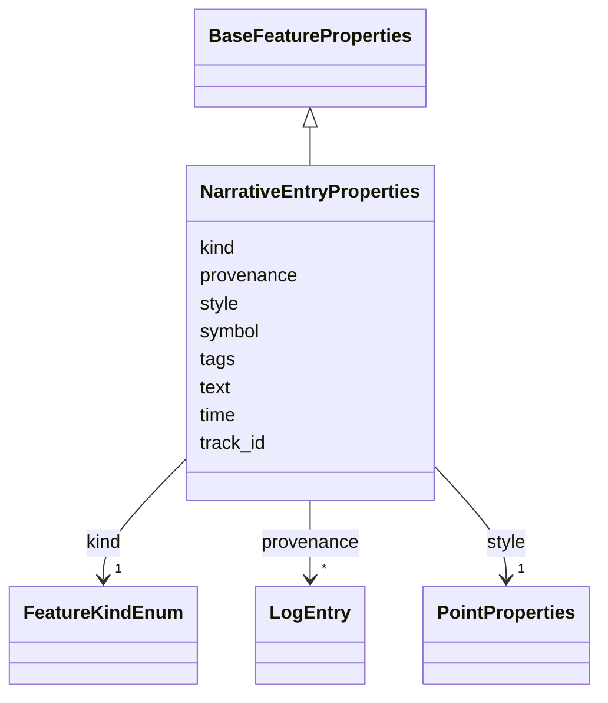

# Class: NarrativeEntryProperties 


_Properties for a NarrativeEntry annotation_


URI: [debrief:class/NarrativeEntryProperties](https://debrief.info/schemas/class/NarrativeEntryProperties)





## Inheritance
* [BaseFeatureProperties](../classes/BaseFeatureProperties.md)
    * **NarrativeEntryProperties**


## Slots

| Name | Cardinality and Range | Description | Inheritance |
| ---  | --- | --- | --- |
| [kind](../slots/kind.md) | 1 <br/> [FeatureKindEnum](../enums/FeatureKindEnum.md) | Feature type discriminator | direct |
| [time](../slots/time.md) | 1 <br/> [datetime](../slots/datetime.md) | Narrative timestamp (ISO8601) | direct |
| [text](../slots/text.md) | 1 <br/> [String](../types/String.md) | Narrative text content | direct |
| [track_id](../slots/track_id.md) | 0..1 <br/> [String](../types/String.md) | Associated track identifier (optional) | direct |
| [symbol](../slots/symbol.md) | 0..1 <br/> [String](../types/String.md) | Display symbol code from REP file | direct |
| [style](../slots/style.md) | 1 <br/> [PointProperties](../classes/PointProperties.md) | Point styling properties for display position | direct |
| [tags](../slots/tags.md) | * <br/> [String](../types/String.md) | Free-text labels assigned to this feature by the analyst | [BaseFeatureProperties](../classes/BaseFeatureProperties.md) |
| [provenance](../slots/provenance.md) | * <br/> [LogEntry](../classes/LogEntry.md) | PROV-aligned provenance records (append-only log of tool operations) | [BaseFeatureProperties](../classes/BaseFeatureProperties.md) |


## Usages

| used by | used in | type | used |
| ---  | --- | --- | --- |
| [NarrativeEntry](../classes/NarrativeEntry.md) | [properties](../slots/properties.md) | range | [NarrativeEntryProperties](../classes/NarrativeEntryProperties.md) |


## Identifier and Mapping Information


### Schema Source


* from schema: https://debrief.info/schemas/debrief


## Mappings

| Mapping Type | Mapped Value |
| ---  | ---  |
| self | debrief:NarrativeEntryProperties |
| native | debrief:NarrativeEntryProperties |


## LinkML Source

<!-- TODO: investigate https://stackoverflow.com/questions/37606292/how-to-create-tabbed-code-blocks-in-mkdocs-or-sphinx -->

### Direct

<details>
```yaml
name: NarrativeEntryProperties
description: Properties for a NarrativeEntry annotation
from_schema: https://debrief.info/schemas/debrief
is_a: BaseFeatureProperties
attributes:
  kind:
    name: kind
    description: Feature type discriminator
    from_schema: https://debrief.info/schemas/annotations
    domain_of:
    - BaseFeatureProperties
    - TrackProperties
    - ReferenceLocationProperties
    - SystemStateProperties
    - MultiPointFeatureProperties
    - MultiPolygonFeatureProperties
    - NarrativeEntryProperties
    - CircleAnnotationProperties
    - RectangleAnnotationProperties
    - LineAnnotationProperties
    - TextAnnotationProperties
    - VectorAnnotationProperties
    - PolyAnnotationProperties
    - SelectionRequirement
    - SystemRecordProperties
    - StoryboardProperties
    - SceneProperties
    range: FeatureKindEnum
    required: true
    equals_string: NARRATIVE
  time:
    name: time
    description: Narrative timestamp (ISO8601)
    from_schema: https://debrief.info/schemas/annotations
    domain_of:
    - TimestampedPosition
    - MeasuredArrayPosition
    - SensorContact
    - TUASolution
    - NarrativeEntryProperties
    range: datetime
    required: true
  text:
    name: text
    description: Narrative text content
    from_schema: https://debrief.info/schemas/annotations
    rank: 1000
    domain_of:
    - NarrativeEntryProperties
    - TextAnnotationProperties
    required: true
  track_id:
    name: track_id
    description: Associated track identifier (optional)
    from_schema: https://debrief.info/schemas/annotations
    rank: 1000
    domain_of:
    - NarrativeEntryProperties
  symbol:
    name: symbol
    description: Display symbol code from REP file
    from_schema: https://debrief.info/schemas/annotations
    domain_of:
    - PositionStyle
    - PositionStyleOverride
    - ReferenceLocationProperties
    - NarrativeEntryProperties
    - CircleAnnotationProperties
    - RectangleAnnotationProperties
    - LineAnnotationProperties
    - TextAnnotationProperties
    - VectorAnnotationProperties
    - PolyAnnotationProperties
  style:
    name: style
    description: Point styling properties for display position
    from_schema: https://debrief.info/schemas/annotations
    domain_of:
    - SegmentMetadata
    - TrackProperties
    - ReferenceLocationProperties
    - MultiPointFeatureProperties
    - MultiPolygonFeatureProperties
    - NarrativeEntryProperties
    - CircleAnnotationProperties
    - RectangleAnnotationProperties
    - LineAnnotationProperties
    - TextAnnotationProperties
    - VectorAnnotationProperties
    - PolyAnnotationProperties
    range: PointProperties
    required: true

```
</details>

### Induced

<details>
```yaml
name: NarrativeEntryProperties
description: Properties for a NarrativeEntry annotation
from_schema: https://debrief.info/schemas/debrief
is_a: BaseFeatureProperties
attributes:
  kind:
    name: kind
    description: Feature type discriminator
    from_schema: https://debrief.info/schemas/annotations
    alias: kind
    owner: NarrativeEntryProperties
    domain_of:
    - BaseFeatureProperties
    - TrackProperties
    - ReferenceLocationProperties
    - SystemStateProperties
    - MultiPointFeatureProperties
    - MultiPolygonFeatureProperties
    - NarrativeEntryProperties
    - CircleAnnotationProperties
    - RectangleAnnotationProperties
    - LineAnnotationProperties
    - TextAnnotationProperties
    - VectorAnnotationProperties
    - PolyAnnotationProperties
    - SelectionRequirement
    - SystemRecordProperties
    - StoryboardProperties
    - SceneProperties
    range: FeatureKindEnum
    required: true
    equals_string: NARRATIVE
  time:
    name: time
    description: Narrative timestamp (ISO8601)
    from_schema: https://debrief.info/schemas/annotations
    alias: time
    owner: NarrativeEntryProperties
    domain_of:
    - TimestampedPosition
    - MeasuredArrayPosition
    - SensorContact
    - TUASolution
    - NarrativeEntryProperties
    range: datetime
    required: true
  text:
    name: text
    description: Narrative text content
    from_schema: https://debrief.info/schemas/annotations
    rank: 1000
    alias: text
    owner: NarrativeEntryProperties
    domain_of:
    - NarrativeEntryProperties
    - TextAnnotationProperties
    range: string
    required: true
  track_id:
    name: track_id
    description: Associated track identifier (optional)
    from_schema: https://debrief.info/schemas/annotations
    rank: 1000
    alias: track_id
    owner: NarrativeEntryProperties
    domain_of:
    - NarrativeEntryProperties
    range: string
  symbol:
    name: symbol
    description: Display symbol code from REP file
    from_schema: https://debrief.info/schemas/annotations
    alias: symbol
    owner: NarrativeEntryProperties
    domain_of:
    - PositionStyle
    - PositionStyleOverride
    - ReferenceLocationProperties
    - NarrativeEntryProperties
    - CircleAnnotationProperties
    - RectangleAnnotationProperties
    - LineAnnotationProperties
    - TextAnnotationProperties
    - VectorAnnotationProperties
    - PolyAnnotationProperties
    range: string
  style:
    name: style
    description: Point styling properties for display position
    from_schema: https://debrief.info/schemas/annotations
    alias: style
    owner: NarrativeEntryProperties
    domain_of:
    - SegmentMetadata
    - TrackProperties
    - ReferenceLocationProperties
    - MultiPointFeatureProperties
    - MultiPolygonFeatureProperties
    - NarrativeEntryProperties
    - CircleAnnotationProperties
    - RectangleAnnotationProperties
    - LineAnnotationProperties
    - TextAnnotationProperties
    - VectorAnnotationProperties
    - PolyAnnotationProperties
    range: PointProperties
    required: true
  tags:
    name: tags
    description: Free-text labels assigned to this feature by the analyst
    from_schema: https://debrief.info/schemas/common
    rank: 1000
    alias: tags
    owner: NarrativeEntryProperties
    domain_of:
    - BaseFeatureProperties
    - StacExtensionProperties
    - StacItemSummary
    range: string
    required: false
    multivalued: true
  provenance:
    name: provenance
    description: PROV-aligned provenance records (append-only log of tool operations)
    from_schema: https://debrief.info/schemas/common
    rank: 1000
    alias: provenance
    owner: NarrativeEntryProperties
    domain_of:
    - BaseFeatureProperties
    - SystemStateProperties
    - SystemRecordProperties
    range: LogEntry
    multivalued: true
    inlined: true
    inlined_as_list: true

```
</details>