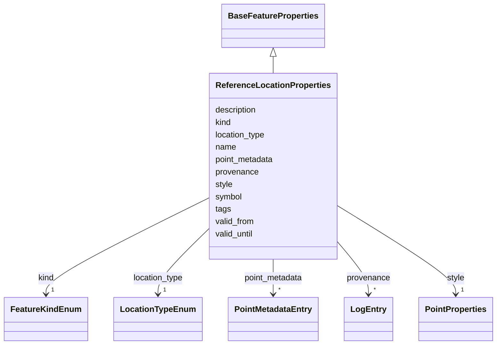

# Class: ReferenceLocationProperties 


_Properties for a ReferenceLocation_


URI: [debrief:class/ReferenceLocationProperties](https://debrief.info/schemas/class/ReferenceLocationProperties)





## Inheritance
* [BaseFeatureProperties](../classes/BaseFeatureProperties.md)
    * **ReferenceLocationProperties**


## Slots

| Name | Cardinality and Range | Description | Inheritance |
| ---  | --- | --- | --- |
| [kind](../slots/kind.md) | 1 <br/> [FeatureKindEnum](../enums/FeatureKindEnum.md) | Feature type discriminator | direct |
| [name](../slots/name.md) | 1 <br/> [String](../types/String.md) | Reference location name | direct |
| [location_type](../slots/location_type.md) | 1 <br/> [LocationTypeEnum](../enums/LocationTypeEnum.md) | Type of reference | direct |
| [description](../slots/description.md) | 0..1 <br/> [String](../types/String.md) | Additional description | direct |
| [symbol](../slots/symbol.md) | 0..1 <br/> [String](../types/String.md) | Map symbol identifier | direct |
| [style](../slots/style.md) | 1 <br/> [PointProperties](../classes/PointProperties.md) | Point styling properties for display | direct |
| [valid_from](../slots/valid_from.md) | 0..1 <br/> [datetime](../slots/datetime.md) | Start of validity period | direct |
| [valid_until](../slots/valid_until.md) | 0..1 <br/> [datetime](../slots/datetime.md) | End of validity period | direct |
| [point_metadata](../slots/point_metadata.md) | * <br/> [PointMetadataEntry](../classes/PointMetadataEntry.md) | Per-point metadata array, parallel to MultiPoint coordinates | direct |
| [tags](../slots/tags.md) | * <br/> [String](../types/String.md) | Free-text labels assigned to this feature by the analyst | [BaseFeatureProperties](../classes/BaseFeatureProperties.md) |
| [provenance](../slots/provenance.md) | * <br/> [LogEntry](../classes/LogEntry.md) | PROV-aligned provenance records (append-only log of tool operations) | [BaseFeatureProperties](../classes/BaseFeatureProperties.md) |


## Usages

| used by | used in | type | used |
| ---  | --- | --- | --- |
| [ReferenceLocation](../classes/ReferenceLocation.md) | [properties](../slots/properties.md) | range | [ReferenceLocationProperties](../classes/ReferenceLocationProperties.md) |


## Identifier and Mapping Information


### Schema Source


* from schema: https://debrief.info/schemas/debrief


## Mappings

| Mapping Type | Mapped Value |
| ---  | ---  |
| self | debrief:ReferenceLocationProperties |
| native | debrief:ReferenceLocationProperties |


## LinkML Source

<!-- TODO: investigate https://stackoverflow.com/questions/37606292/how-to-create-tabbed-code-blocks-in-mkdocs-or-sphinx -->

### Direct

<details>
```yaml
name: ReferenceLocationProperties
description: Properties for a ReferenceLocation
from_schema: https://debrief.info/schemas/debrief
is_a: BaseFeatureProperties
attributes:
  kind:
    name: kind
    description: Feature type discriminator
    from_schema: https://debrief.info/schemas/geojson
    domain_of:
    - BaseFeatureProperties
    - TrackProperties
    - ReferenceLocationProperties
    - SystemStateProperties
    - MultiPointFeatureProperties
    - MultiPolygonFeatureProperties
    - NarrativeEntryProperties
    - CircleAnnotationProperties
    - RectangleAnnotationProperties
    - LineAnnotationProperties
    - TextAnnotationProperties
    - VectorAnnotationProperties
    - PolyAnnotationProperties
    - SelectionRequirement
    - SystemRecordProperties
    - StoryboardProperties
    - SceneProperties
    range: FeatureKindEnum
    required: true
    equals_string: POINT
  name:
    name: name
    description: Reference location name
    from_schema: https://debrief.info/schemas/geojson
    domain_of:
    - SegmentMetadata
    - SensorData
    - TUAData
    - PointMetadataEntry
    - ReferenceLocationProperties
    - Tool
    - ToolParameter
    - PlatformRecord
    - LevelDefinition
    - DatasetSeries
    - StoryboardProperties
    required: true
  location_type:
    name: location_type
    description: Type of reference
    from_schema: https://debrief.info/schemas/geojson
    rank: 1000
    domain_of:
    - ReferenceLocationProperties
    range: LocationTypeEnum
    required: true
  description:
    name: description
    description: Additional description
    from_schema: https://debrief.info/schemas/geojson
    rank: 1000
    domain_of:
    - ReferenceLocationProperties
    - MultiPointFeatureProperties
    - MultiPolygonFeatureProperties
    - Tool
    - ToolParameter
    - LevelDefinition
    - StoryboardProperties
    - SceneProperties
  symbol:
    name: symbol
    description: Map symbol identifier
    from_schema: https://debrief.info/schemas/geojson
    domain_of:
    - PositionStyle
    - PositionStyleOverride
    - ReferenceLocationProperties
    - NarrativeEntryProperties
    - CircleAnnotationProperties
    - RectangleAnnotationProperties
    - LineAnnotationProperties
    - TextAnnotationProperties
    - VectorAnnotationProperties
    - PolyAnnotationProperties
  style:
    name: style
    description: Point styling properties for display
    from_schema: https://debrief.info/schemas/geojson
    domain_of:
    - SegmentMetadata
    - TrackProperties
    - ReferenceLocationProperties
    - MultiPointFeatureProperties
    - MultiPolygonFeatureProperties
    - NarrativeEntryProperties
    - CircleAnnotationProperties
    - RectangleAnnotationProperties
    - LineAnnotationProperties
    - TextAnnotationProperties
    - VectorAnnotationProperties
    - PolyAnnotationProperties
    range: PointProperties
    required: true
  valid_from:
    name: valid_from
    description: Start of validity period
    from_schema: https://debrief.info/schemas/geojson
    rank: 1000
    domain_of:
    - ReferenceLocationProperties
    range: datetime
  valid_until:
    name: valid_until
    description: End of validity period
    from_schema: https://debrief.info/schemas/geojson
    rank: 1000
    domain_of:
    - ReferenceLocationProperties
    range: datetime
  point_metadata:
    name: point_metadata
    description: Per-point metadata array, parallel to MultiPoint coordinates. Each
      entry contains at minimum an index and name. Downstream tools extend entries
      with zone/color fields.
    from_schema: https://debrief.info/schemas/geojson
    rank: 1000
    domain_of:
    - ReferenceLocationProperties
    range: PointMetadataEntry
    multivalued: true
    inlined: true
    inlined_as_list: true

```
</details>

### Induced

<details>
```yaml
name: ReferenceLocationProperties
description: Properties for a ReferenceLocation
from_schema: https://debrief.info/schemas/debrief
is_a: BaseFeatureProperties
attributes:
  kind:
    name: kind
    description: Feature type discriminator
    from_schema: https://debrief.info/schemas/geojson
    alias: kind
    owner: ReferenceLocationProperties
    domain_of:
    - BaseFeatureProperties
    - TrackProperties
    - ReferenceLocationProperties
    - SystemStateProperties
    - MultiPointFeatureProperties
    - MultiPolygonFeatureProperties
    - NarrativeEntryProperties
    - CircleAnnotationProperties
    - RectangleAnnotationProperties
    - LineAnnotationProperties
    - TextAnnotationProperties
    - VectorAnnotationProperties
    - PolyAnnotationProperties
    - SelectionRequirement
    - SystemRecordProperties
    - StoryboardProperties
    - SceneProperties
    range: FeatureKindEnum
    required: true
    equals_string: POINT
  name:
    name: name
    description: Reference location name
    from_schema: https://debrief.info/schemas/geojson
    alias: name
    owner: ReferenceLocationProperties
    domain_of:
    - SegmentMetadata
    - SensorData
    - TUAData
    - PointMetadataEntry
    - ReferenceLocationProperties
    - Tool
    - ToolParameter
    - PlatformRecord
    - LevelDefinition
    - DatasetSeries
    - StoryboardProperties
    range: string
    required: true
  location_type:
    name: location_type
    description: Type of reference
    from_schema: https://debrief.info/schemas/geojson
    rank: 1000
    alias: location_type
    owner: ReferenceLocationProperties
    domain_of:
    - ReferenceLocationProperties
    range: LocationTypeEnum
    required: true
  description:
    name: description
    description: Additional description
    from_schema: https://debrief.info/schemas/geojson
    rank: 1000
    alias: description
    owner: ReferenceLocationProperties
    domain_of:
    - ReferenceLocationProperties
    - MultiPointFeatureProperties
    - MultiPolygonFeatureProperties
    - Tool
    - ToolParameter
    - LevelDefinition
    - StoryboardProperties
    - SceneProperties
    range: string
  symbol:
    name: symbol
    description: Map symbol identifier
    from_schema: https://debrief.info/schemas/geojson
    alias: symbol
    owner: ReferenceLocationProperties
    domain_of:
    - PositionStyle
    - PositionStyleOverride
    - ReferenceLocationProperties
    - NarrativeEntryProperties
    - CircleAnnotationProperties
    - RectangleAnnotationProperties
    - LineAnnotationProperties
    - TextAnnotationProperties
    - VectorAnnotationProperties
    - PolyAnnotationProperties
    range: string
  style:
    name: style
    description: Point styling properties for display
    from_schema: https://debrief.info/schemas/geojson
    alias: style
    owner: ReferenceLocationProperties
    domain_of:
    - SegmentMetadata
    - TrackProperties
    - ReferenceLocationProperties
    - MultiPointFeatureProperties
    - MultiPolygonFeatureProperties
    - NarrativeEntryProperties
    - CircleAnnotationProperties
    - RectangleAnnotationProperties
    - LineAnnotationProperties
    - TextAnnotationProperties
    - VectorAnnotationProperties
    - PolyAnnotationProperties
    range: PointProperties
    required: true
  valid_from:
    name: valid_from
    description: Start of validity period
    from_schema: https://debrief.info/schemas/geojson
    rank: 1000
    alias: valid_from
    owner: ReferenceLocationProperties
    domain_of:
    - ReferenceLocationProperties
    range: datetime
  valid_until:
    name: valid_until
    description: End of validity period
    from_schema: https://debrief.info/schemas/geojson
    rank: 1000
    alias: valid_until
    owner: ReferenceLocationProperties
    domain_of:
    - ReferenceLocationProperties
    range: datetime
  point_metadata:
    name: point_metadata
    description: Per-point metadata array, parallel to MultiPoint coordinates. Each
      entry contains at minimum an index and name. Downstream tools extend entries
      with zone/color fields.
    from_schema: https://debrief.info/schemas/geojson
    rank: 1000
    alias: point_metadata
    owner: ReferenceLocationProperties
    domain_of:
    - ReferenceLocationProperties
    range: PointMetadataEntry
    multivalued: true
    inlined: true
    inlined_as_list: true
  tags:
    name: tags
    description: Free-text labels assigned to this feature by the analyst
    from_schema: https://debrief.info/schemas/common
    rank: 1000
    alias: tags
    owner: ReferenceLocationProperties
    domain_of:
    - BaseFeatureProperties
    - StacExtensionProperties
    - StacItemSummary
    range: string
    required: false
    multivalued: true
  provenance:
    name: provenance
    description: PROV-aligned provenance records (append-only log of tool operations)
    from_schema: https://debrief.info/schemas/common
    rank: 1000
    alias: provenance
    owner: ReferenceLocationProperties
    domain_of:
    - BaseFeatureProperties
    - SystemStateProperties
    - SystemRecordProperties
    range: LogEntry
    multivalued: true
    inlined: true
    inlined_as_list: true

```
</details>