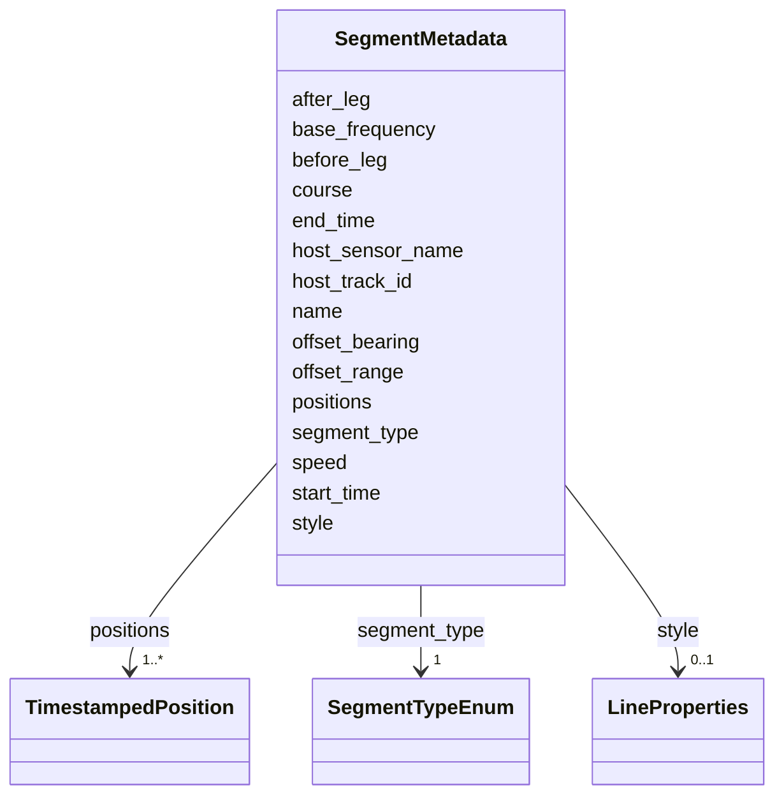

# Class: SegmentMetadata 


_Per-segment metadata for compound tracks. Each segment corresponds to one LineString within a MultiLineString geometry. segments[i] describes geometry.coordinates[i]._


URI: [debrief:class/SegmentMetadata](https://debrief.info/schemas/class/SegmentMetadata)





<!-- no inheritance hierarchy -->


## Slots

| Name | Cardinality and Range | Description | Inheritance |
| ---  | --- | --- | --- |
| [segment_type](../slots/segment_type.md) | 1 <br/> [SegmentTypeEnum](../enums/SegmentTypeEnum.md) | Segment type discriminator | direct |
| [start_time](../slots/start_time.md) | 1 <br/> [datetime](../slots/datetime.md) | Segment start timestamp (ISO8601) | direct |
| [end_time](../slots/end_time.md) | 1 <br/> [datetime](../slots/datetime.md) | Segment end timestamp (ISO8601) | direct |
| [positions](../slots/positions.md) | 1..* <br/> [TimestampedPosition](../classes/TimestampedPosition.md) | Per-position metadata (parallel to coordinates) | direct |
| [name](../slots/name.md) | 0..1 <br/> [String](../types/String.md) | Human-readable segment name | direct |
| [style](../slots/style.md) | 0..1 <br/> [LineProperties](../classes/LineProperties.md) | Per-segment line styling override | direct |
| [course](../slots/course.md) | 0..1 <br/> [Float](../types/Float.md) | Estimated course in degrees (TMA segments) | direct |
| [speed](../slots/speed.md) | 0..1 <br/> [Float](../types/Float.md) | Estimated speed in knots (TMA segments) | direct |
| [base_frequency](../slots/base_frequency.md) | 0..1 <br/> [Float](../types/Float.md) | Base frequency in Hz (TMA segments) | direct |
| [host_track_id](../slots/host_track_id.md) | 0..1 <br/> [String](../types/String.md) | ID of track this solution is relative to (RELATIVE_TMA) | direct |
| [host_sensor_name](../slots/host_sensor_name.md) | 0..1 <br/> [String](../types/String.md) | Towed array sensor name (RELATIVE_TMA) | direct |
| [offset_bearing](../slots/offset_bearing.md) | 0..1 <br/> [Float](../types/Float.md) | Bearing offset in degrees (RELATIVE_TMA) | direct |
| [offset_range](../slots/offset_range.md) | 0..1 <br/> [Float](../types/Float.md) | Range offset in metres (RELATIVE_TMA) | direct |
| [before_leg](../slots/before_leg.md) | 0..1 <br/> [String](../types/String.md) | Name of preceding TMA leg (DYNAMIC_INFILL) | direct |
| [after_leg](../slots/after_leg.md) | 0..1 <br/> [String](../types/String.md) | Name of following TMA leg (DYNAMIC_INFILL) | direct |


## Usages

| used by | used in | type | used |
| ---  | --- | --- | --- |
| [TrackProperties](../classes/TrackProperties.md) | [segments](../slots/segments.md) | range | [SegmentMetadata](../classes/SegmentMetadata.md) |


## Identifier and Mapping Information


### Schema Source


* from schema: https://debrief.info/schemas/debrief


## Mappings

| Mapping Type | Mapped Value |
| ---  | ---  |
| self | debrief:SegmentMetadata |
| native | debrief:SegmentMetadata |


## LinkML Source

<!-- TODO: investigate https://stackoverflow.com/questions/37606292/how-to-create-tabbed-code-blocks-in-mkdocs-or-sphinx -->

### Direct

<details>
```yaml
name: SegmentMetadata
description: Per-segment metadata for compound tracks. Each segment corresponds to
  one LineString within a MultiLineString geometry. segments[i] describes geometry.coordinates[i].
from_schema: https://debrief.info/schemas/debrief
attributes:
  segment_type:
    name: segment_type
    description: Segment type discriminator
    from_schema: https://debrief.info/schemas/geojson
    rank: 1000
    domain_of:
    - SegmentMetadata
    - SelectionRequirement
    range: SegmentTypeEnum
    required: true
  start_time:
    name: start_time
    description: Segment start timestamp (ISO8601)
    from_schema: https://debrief.info/schemas/geojson
    rank: 1000
    domain_of:
    - SegmentMetadata
    - TrackProperties
    - SystemStateProperties
    range: datetime
    required: true
  end_time:
    name: end_time
    description: Segment end timestamp (ISO8601)
    from_schema: https://debrief.info/schemas/geojson
    rank: 1000
    domain_of:
    - SegmentMetadata
    - TrackProperties
    - SystemStateProperties
    range: datetime
    required: true
  positions:
    name: positions
    description: Per-position metadata (parallel to coordinates)
    from_schema: https://debrief.info/schemas/geojson
    rank: 1000
    domain_of:
    - SegmentMetadata
    - TrackProperties
    range: TimestampedPosition
    required: true
    multivalued: true
    inlined: true
    inlined_as_list: true
  name:
    name: name
    description: Human-readable segment name
    from_schema: https://debrief.info/schemas/geojson
    rank: 1000
    domain_of:
    - SegmentMetadata
    - SensorData
    - TUAData
    - PointMetadataEntry
    - ReferenceLocationProperties
    - Tool
    - ToolParameter
    - PlatformRecord
    - LevelDefinition
    - DatasetSeries
    - StoryboardProperties
  style:
    name: style
    description: Per-segment line styling override
    from_schema: https://debrief.info/schemas/geojson
    rank: 1000
    domain_of:
    - SegmentMetadata
    - TrackProperties
    - ReferenceLocationProperties
    - MultiPointFeatureProperties
    - MultiPolygonFeatureProperties
    - NarrativeEntryProperties
    - CircleAnnotationProperties
    - RectangleAnnotationProperties
    - LineAnnotationProperties
    - TextAnnotationProperties
    - VectorAnnotationProperties
    - PolyAnnotationProperties
    range: LineProperties
  course:
    name: course
    description: Estimated course in degrees (TMA segments)
    from_schema: https://debrief.info/schemas/geojson
    domain_of:
    - TimestampedPosition
    - SegmentMetadata
    - TUASolution
    range: float
    minimum_value: 0
    maximum_value: 360
  speed:
    name: speed
    description: Estimated speed in knots (TMA segments)
    from_schema: https://debrief.info/schemas/geojson
    domain_of:
    - TimestampedPosition
    - SegmentMetadata
    - TUASolution
    range: float
    minimum_value: 0
  base_frequency:
    name: base_frequency
    description: Base frequency in Hz (TMA segments)
    from_schema: https://debrief.info/schemas/geojson
    rank: 1000
    domain_of:
    - SegmentMetadata
    - SensorData
    range: float
  host_track_id:
    name: host_track_id
    description: ID of track this solution is relative to (RELATIVE_TMA)
    from_schema: https://debrief.info/schemas/geojson
    rank: 1000
    domain_of:
    - SegmentMetadata
  host_sensor_name:
    name: host_sensor_name
    description: Towed array sensor name (RELATIVE_TMA)
    from_schema: https://debrief.info/schemas/geojson
    rank: 1000
    domain_of:
    - SegmentMetadata
  offset_bearing:
    name: offset_bearing
    description: Bearing offset in degrees (RELATIVE_TMA)
    from_schema: https://debrief.info/schemas/geojson
    rank: 1000
    domain_of:
    - SegmentMetadata
    range: float
    minimum_value: 0
    maximum_value: 360
  offset_range:
    name: offset_range
    description: Range offset in metres (RELATIVE_TMA)
    from_schema: https://debrief.info/schemas/geojson
    rank: 1000
    domain_of:
    - SegmentMetadata
    range: float
    minimum_value: 0
  before_leg:
    name: before_leg
    description: Name of preceding TMA leg (DYNAMIC_INFILL)
    from_schema: https://debrief.info/schemas/geojson
    rank: 1000
    domain_of:
    - SegmentMetadata
  after_leg:
    name: after_leg
    description: Name of following TMA leg (DYNAMIC_INFILL)
    from_schema: https://debrief.info/schemas/geojson
    rank: 1000
    domain_of:
    - SegmentMetadata

```
</details>

### Induced

<details>
```yaml
name: SegmentMetadata
description: Per-segment metadata for compound tracks. Each segment corresponds to
  one LineString within a MultiLineString geometry. segments[i] describes geometry.coordinates[i].
from_schema: https://debrief.info/schemas/debrief
attributes:
  segment_type:
    name: segment_type
    description: Segment type discriminator
    from_schema: https://debrief.info/schemas/geojson
    rank: 1000
    alias: segment_type
    owner: SegmentMetadata
    domain_of:
    - SegmentMetadata
    - SelectionRequirement
    range: SegmentTypeEnum
    required: true
  start_time:
    name: start_time
    description: Segment start timestamp (ISO8601)
    from_schema: https://debrief.info/schemas/geojson
    rank: 1000
    alias: start_time
    owner: SegmentMetadata
    domain_of:
    - SegmentMetadata
    - TrackProperties
    - SystemStateProperties
    range: datetime
    required: true
  end_time:
    name: end_time
    description: Segment end timestamp (ISO8601)
    from_schema: https://debrief.info/schemas/geojson
    rank: 1000
    alias: end_time
    owner: SegmentMetadata
    domain_of:
    - SegmentMetadata
    - TrackProperties
    - SystemStateProperties
    range: datetime
    required: true
  positions:
    name: positions
    description: Per-position metadata (parallel to coordinates)
    from_schema: https://debrief.info/schemas/geojson
    rank: 1000
    alias: positions
    owner: SegmentMetadata
    domain_of:
    - SegmentMetadata
    - TrackProperties
    range: TimestampedPosition
    required: true
    multivalued: true
    inlined: true
    inlined_as_list: true
  name:
    name: name
    description: Human-readable segment name
    from_schema: https://debrief.info/schemas/geojson
    rank: 1000
    alias: name
    owner: SegmentMetadata
    domain_of:
    - SegmentMetadata
    - SensorData
    - TUAData
    - PointMetadataEntry
    - ReferenceLocationProperties
    - Tool
    - ToolParameter
    - PlatformRecord
    - LevelDefinition
    - DatasetSeries
    - StoryboardProperties
    range: string
  style:
    name: style
    description: Per-segment line styling override
    from_schema: https://debrief.info/schemas/geojson
    rank: 1000
    alias: style
    owner: SegmentMetadata
    domain_of:
    - SegmentMetadata
    - TrackProperties
    - ReferenceLocationProperties
    - MultiPointFeatureProperties
    - MultiPolygonFeatureProperties
    - NarrativeEntryProperties
    - CircleAnnotationProperties
    - RectangleAnnotationProperties
    - LineAnnotationProperties
    - TextAnnotationProperties
    - VectorAnnotationProperties
    - PolyAnnotationProperties
    range: LineProperties
  course:
    name: course
    description: Estimated course in degrees (TMA segments)
    from_schema: https://debrief.info/schemas/geojson
    alias: course
    owner: SegmentMetadata
    domain_of:
    - TimestampedPosition
    - SegmentMetadata
    - TUASolution
    range: float
    minimum_value: 0
    maximum_value: 360
  speed:
    name: speed
    description: Estimated speed in knots (TMA segments)
    from_schema: https://debrief.info/schemas/geojson
    alias: speed
    owner: SegmentMetadata
    domain_of:
    - TimestampedPosition
    - SegmentMetadata
    - TUASolution
    range: float
    minimum_value: 0
  base_frequency:
    name: base_frequency
    description: Base frequency in Hz (TMA segments)
    from_schema: https://debrief.info/schemas/geojson
    rank: 1000
    alias: base_frequency
    owner: SegmentMetadata
    domain_of:
    - SegmentMetadata
    - SensorData
    range: float
  host_track_id:
    name: host_track_id
    description: ID of track this solution is relative to (RELATIVE_TMA)
    from_schema: https://debrief.info/schemas/geojson
    rank: 1000
    alias: host_track_id
    owner: SegmentMetadata
    domain_of:
    - SegmentMetadata
    range: string
  host_sensor_name:
    name: host_sensor_name
    description: Towed array sensor name (RELATIVE_TMA)
    from_schema: https://debrief.info/schemas/geojson
    rank: 1000
    alias: host_sensor_name
    owner: SegmentMetadata
    domain_of:
    - SegmentMetadata
    range: string
  offset_bearing:
    name: offset_bearing
    description: Bearing offset in degrees (RELATIVE_TMA)
    from_schema: https://debrief.info/schemas/geojson
    rank: 1000
    alias: offset_bearing
    owner: SegmentMetadata
    domain_of:
    - SegmentMetadata
    range: float
    minimum_value: 0
    maximum_value: 360
  offset_range:
    name: offset_range
    description: Range offset in metres (RELATIVE_TMA)
    from_schema: https://debrief.info/schemas/geojson
    rank: 1000
    alias: offset_range
    owner: SegmentMetadata
    domain_of:
    - SegmentMetadata
    range: float
    minimum_value: 0
  before_leg:
    name: before_leg
    description: Name of preceding TMA leg (DYNAMIC_INFILL)
    from_schema: https://debrief.info/schemas/geojson
    rank: 1000
    alias: before_leg
    owner: SegmentMetadata
    domain_of:
    - SegmentMetadata
    range: string
  after_leg:
    name: after_leg
    description: Name of following TMA leg (DYNAMIC_INFILL)
    from_schema: https://debrief.info/schemas/geojson
    rank: 1000
    alias: after_leg
    owner: SegmentMetadata
    domain_of:
    - SegmentMetadata
    range: string

```
</details>