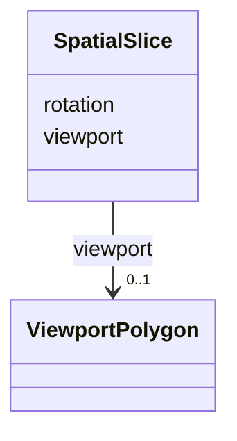

# Class: SpatialSlice 


_Geographic view state for the map display_


URI: [debrief:class/SpatialSlice](https://debrief.info/schemas/class/SpatialSlice)





<!-- no inheritance hierarchy -->


## Slots

| Name | Cardinality and Range | Description | Inheritance |
| ---  | --- | --- | --- |
| [viewport](../slots/viewport.md) | 0..1 <br/> [ViewportPolygon](../classes/ViewportPolygon.md) | Visible map area as 4-corner polygon (FR-012) | direct |
| [rotation](../slots/rotation.md) | 1 <br/> [Float](../types/Float.md) | Map rotation in degrees 0-360 (FR-013) | direct |


## Usages

| used by | used in | type | used |
| ---  | --- | --- | --- |
| [SessionState](../classes/SessionState.md) | [spatial](../slots/spatial.md) | range | [SpatialSlice](../classes/SpatialSlice.md) |
| [SessionFile](../classes/SessionFile.md) | [spatial](../slots/spatial.md) | range | [SpatialSlice](../classes/SpatialSlice.md) |


## Identifier and Mapping Information


### Schema Source


* from schema: https://debrief.info/schemas/debrief


## Mappings

| Mapping Type | Mapped Value |
| ---  | ---  |
| self | debrief:SpatialSlice |
| native | debrief:SpatialSlice |


## LinkML Source

<!-- TODO: investigate https://stackoverflow.com/questions/37606292/how-to-create-tabbed-code-blocks-in-mkdocs-or-sphinx -->

### Direct

<details>
```yaml
name: SpatialSlice
description: Geographic view state for the map display
from_schema: https://debrief.info/schemas/debrief
attributes:
  viewport:
    name: viewport
    description: Visible map area as 4-corner polygon (FR-012)
    from_schema: https://debrief.info/schemas/session-state
    rank: 1000
    domain_of:
    - SpatialSlice
    - SceneProperties
    range: ViewportPolygon
  rotation:
    name: rotation
    description: Map rotation in degrees 0-360 (FR-013)
    from_schema: https://debrief.info/schemas/session-state
    rank: 1000
    domain_of:
    - SpatialSlice
    range: float
    required: true
    minimum_value: 0
    maximum_value: 360

```
</details>

### Induced

<details>
```yaml
name: SpatialSlice
description: Geographic view state for the map display
from_schema: https://debrief.info/schemas/debrief
attributes:
  viewport:
    name: viewport
    description: Visible map area as 4-corner polygon (FR-012)
    from_schema: https://debrief.info/schemas/session-state
    rank: 1000
    alias: viewport
    owner: SpatialSlice
    domain_of:
    - SpatialSlice
    - SceneProperties
    range: ViewportPolygon
  rotation:
    name: rotation
    description: Map rotation in degrees 0-360 (FR-013)
    from_schema: https://debrief.info/schemas/session-state
    rank: 1000
    alias: rotation
    owner: SpatialSlice
    domain_of:
    - SpatialSlice
    range: float
    required: true
    minimum_value: 0
    maximum_value: 360

```
</details>