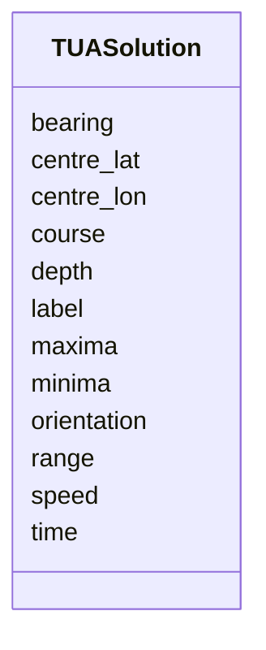

# Class: TUASolution 


_Single Target Uncertainty Area estimate. Has either absolute positioning (centre_lat/centre_lon) or relative positioning (bearing/range), plus optional ellipse and kinematics._


URI: [debrief:class/TUASolution](https://debrief.info/schemas/class/TUASolution)





<!-- no inheritance hierarchy -->


## Slots

| Name | Cardinality and Range | Description | Inheritance |
| ---  | --- | --- | --- |
| [time](../slots/time.md) | 1 <br/> [datetime](../slots/datetime.md) | Solution timestamp (ISO8601) | direct |
| [label](../slots/label.md) | 1 <br/> [String](../types/String.md) | Solution label | direct |
| [centre_lat](../slots/centre_lat.md) | 0..1 <br/> [Float](../types/Float.md) | Absolute latitude (mutual exclusive with bearing/range) | direct |
| [centre_lon](../slots/centre_lon.md) | 0..1 <br/> [Float](../types/Float.md) | Absolute longitude (mutual exclusive with bearing/range) | direct |
| [bearing](../slots/bearing.md) | 0..1 <br/> [Float](../types/Float.md) | Relative bearing from host track in degrees | direct |
| [range](../slots/range.md) | 0..1 <br/> [Float](../types/Float.md) | Relative range from host track in metres | direct |
| [orientation](../slots/orientation.md) | 0..1 <br/> [Float](../types/Float.md) | Ellipse orientation from north in degrees | direct |
| [maxima](../slots/maxima.md) | 0..1 <br/> [Float](../types/Float.md) | Semi-major axis in metres | direct |
| [minima](../slots/minima.md) | 0..1 <br/> [Float](../types/Float.md) | Semi-minor axis in metres | direct |
| [course](../slots/course.md) | 0..1 <br/> [Float](../types/Float.md) | Estimated course in degrees | direct |
| [speed](../slots/speed.md) | 0..1 <br/> [Float](../types/Float.md) | Estimated speed in knots | direct |
| [depth](../slots/depth.md) | 0..1 <br/> [Float](../types/Float.md) | Estimated depth in metres | direct |


## Usages

| used by | used in | type | used |
| ---  | --- | --- | --- |
| [TUAData](../classes/TUAData.md) | [solutions](../slots/solutions.md) | range | [TUASolution](../classes/TUASolution.md) |


## Identifier and Mapping Information


### Schema Source


* from schema: https://debrief.info/schemas/debrief


## Mappings

| Mapping Type | Mapped Value |
| ---  | ---  |
| self | debrief:TUASolution |
| native | debrief:TUASolution |


## LinkML Source

<!-- TODO: investigate https://stackoverflow.com/questions/37606292/how-to-create-tabbed-code-blocks-in-mkdocs-or-sphinx -->

### Direct

<details>
```yaml
name: TUASolution
description: Single Target Uncertainty Area estimate. Has either absolute positioning
  (centre_lat/centre_lon) or relative positioning (bearing/range), plus optional ellipse
  and kinematics.
from_schema: https://debrief.info/schemas/debrief
attributes:
  time:
    name: time
    description: Solution timestamp (ISO8601)
    from_schema: https://debrief.info/schemas/geojson
    domain_of:
    - TimestampedPosition
    - MeasuredArrayPosition
    - SensorContact
    - TUASolution
    - NarrativeEntryProperties
    range: datetime
    required: true
  label:
    name: label
    description: Solution label
    from_schema: https://debrief.info/schemas/geojson
    domain_of:
    - PositionStyleOverride
    - SensorContact
    - TUASolution
    - MultiPointFeatureProperties
    - MultiPolygonFeatureProperties
    - CircleAnnotationProperties
    - RectangleAnnotationProperties
    - LineAnnotationProperties
    - VectorAnnotationProperties
    - PolyAnnotationProperties
    - ToolResultAnnotations
    - DatasetAxisMetadata
    required: true
  centre_lat:
    name: centre_lat
    description: Absolute latitude (mutual exclusive with bearing/range)
    from_schema: https://debrief.info/schemas/geojson
    rank: 1000
    domain_of:
    - TUASolution
    range: float
  centre_lon:
    name: centre_lon
    description: Absolute longitude (mutual exclusive with bearing/range)
    from_schema: https://debrief.info/schemas/geojson
    rank: 1000
    domain_of:
    - TUASolution
    range: float
  bearing:
    name: bearing
    description: Relative bearing from host track in degrees
    from_schema: https://debrief.info/schemas/geojson
    domain_of:
    - SensorContact
    - TUASolution
    - VectorAnnotationProperties
    - Viewport
    range: float
    minimum_value: 0
    maximum_value: 360
  range:
    name: range
    description: Relative range from host track in metres
    from_schema: https://debrief.info/schemas/geojson
    domain_of:
    - SensorContact
    - TUASolution
    - VectorAnnotationProperties
    range: float
    minimum_value: 0
  orientation:
    name: orientation
    description: Ellipse orientation from north in degrees
    from_schema: https://debrief.info/schemas/geojson
    rank: 1000
    domain_of:
    - TUASolution
    range: float
    minimum_value: 0
    maximum_value: 360
  maxima:
    name: maxima
    description: Semi-major axis in metres
    from_schema: https://debrief.info/schemas/geojson
    rank: 1000
    domain_of:
    - TUASolution
    range: float
    minimum_value: 0
  minima:
    name: minima
    description: Semi-minor axis in metres
    from_schema: https://debrief.info/schemas/geojson
    rank: 1000
    domain_of:
    - TUASolution
    range: float
    minimum_value: 0
  course:
    name: course
    description: Estimated course in degrees
    from_schema: https://debrief.info/schemas/geojson
    domain_of:
    - TimestampedPosition
    - SegmentMetadata
    - TUASolution
    range: float
    minimum_value: 0
    maximum_value: 360
  speed:
    name: speed
    description: Estimated speed in knots
    from_schema: https://debrief.info/schemas/geojson
    domain_of:
    - TimestampedPosition
    - SegmentMetadata
    - TUASolution
    range: float
    minimum_value: 0
  depth:
    name: depth
    description: Estimated depth in metres
    from_schema: https://debrief.info/schemas/geojson
    domain_of:
    - TimestampedPosition
    - TUASolution
    range: float

```
</details>

### Induced

<details>
```yaml
name: TUASolution
description: Single Target Uncertainty Area estimate. Has either absolute positioning
  (centre_lat/centre_lon) or relative positioning (bearing/range), plus optional ellipse
  and kinematics.
from_schema: https://debrief.info/schemas/debrief
attributes:
  time:
    name: time
    description: Solution timestamp (ISO8601)
    from_schema: https://debrief.info/schemas/geojson
    alias: time
    owner: TUASolution
    domain_of:
    - TimestampedPosition
    - MeasuredArrayPosition
    - SensorContact
    - TUASolution
    - NarrativeEntryProperties
    range: datetime
    required: true
  label:
    name: label
    description: Solution label
    from_schema: https://debrief.info/schemas/geojson
    alias: label
    owner: TUASolution
    domain_of:
    - PositionStyleOverride
    - SensorContact
    - TUASolution
    - MultiPointFeatureProperties
    - MultiPolygonFeatureProperties
    - CircleAnnotationProperties
    - RectangleAnnotationProperties
    - LineAnnotationProperties
    - VectorAnnotationProperties
    - PolyAnnotationProperties
    - ToolResultAnnotations
    - DatasetAxisMetadata
    range: string
    required: true
  centre_lat:
    name: centre_lat
    description: Absolute latitude (mutual exclusive with bearing/range)
    from_schema: https://debrief.info/schemas/geojson
    rank: 1000
    alias: centre_lat
    owner: TUASolution
    domain_of:
    - TUASolution
    range: float
  centre_lon:
    name: centre_lon
    description: Absolute longitude (mutual exclusive with bearing/range)
    from_schema: https://debrief.info/schemas/geojson
    rank: 1000
    alias: centre_lon
    owner: TUASolution
    domain_of:
    - TUASolution
    range: float
  bearing:
    name: bearing
    description: Relative bearing from host track in degrees
    from_schema: https://debrief.info/schemas/geojson
    alias: bearing
    owner: TUASolution
    domain_of:
    - SensorContact
    - TUASolution
    - VectorAnnotationProperties
    - Viewport
    range: float
    minimum_value: 0
    maximum_value: 360
  range:
    name: range
    description: Relative range from host track in metres
    from_schema: https://debrief.info/schemas/geojson
    alias: range
    owner: TUASolution
    domain_of:
    - SensorContact
    - TUASolution
    - VectorAnnotationProperties
    range: float
    minimum_value: 0
  orientation:
    name: orientation
    description: Ellipse orientation from north in degrees
    from_schema: https://debrief.info/schemas/geojson
    rank: 1000
    alias: orientation
    owner: TUASolution
    domain_of:
    - TUASolution
    range: float
    minimum_value: 0
    maximum_value: 360
  maxima:
    name: maxima
    description: Semi-major axis in metres
    from_schema: https://debrief.info/schemas/geojson
    rank: 1000
    alias: maxima
    owner: TUASolution
    domain_of:
    - TUASolution
    range: float
    minimum_value: 0
  minima:
    name: minima
    description: Semi-minor axis in metres
    from_schema: https://debrief.info/schemas/geojson
    rank: 1000
    alias: minima
    owner: TUASolution
    domain_of:
    - TUASolution
    range: float
    minimum_value: 0
  course:
    name: course
    description: Estimated course in degrees
    from_schema: https://debrief.info/schemas/geojson
    alias: course
    owner: TUASolution
    domain_of:
    - TimestampedPosition
    - SegmentMetadata
    - TUASolution
    range: float
    minimum_value: 0
    maximum_value: 360
  speed:
    name: speed
    description: Estimated speed in knots
    from_schema: https://debrief.info/schemas/geojson
    alias: speed
    owner: TUASolution
    domain_of:
    - TimestampedPosition
    - SegmentMetadata
    - TUASolution
    range: float
    minimum_value: 0
  depth:
    name: depth
    description: Estimated depth in metres
    from_schema: https://debrief.info/schemas/geojson
    alias: depth
    owner: TUASolution
    domain_of:
    - TimestampedPosition
    - TUASolution
    range: float

```
</details>