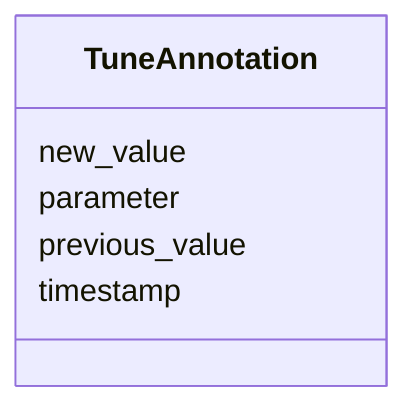

# Class: TuneAnnotation 


_Records a parameter modification (appended, not replacing original)._


URI: [debrief:class/TuneAnnotation](https://debrief.info/schemas/class/TuneAnnotation)





<!-- no inheritance hierarchy -->


## Slots

| Name | Cardinality and Range | Description | Inheritance |
| ---  | --- | --- | --- |
| [timestamp](../slots/timestamp.md) | 1 <br/> [datetime](../slots/datetime.md) | When the tuning occurred (ISO 8601 with timezone) | direct |
| [parameter](../slots/parameter.md) | 1 <br/> [String](../types/String.md) | Name of the parameter that was changed | direct |
| [previous_value](../slots/previous_value.md) | 1 <br/> [String](../types/String.md) | Value before tuning | direct |
| [new_value](../slots/new_value.md) | 1 <br/> [String](../types/String.md) | Value after tuning | direct |


## Usages

| used by | used in | type | used |
| ---  | --- | --- | --- |
| [LogEntry](../classes/LogEntry.md) | [tune](../slots/tune.md) | range | [TuneAnnotation](../classes/TuneAnnotation.md) |


## Identifier and Mapping Information


### Schema Source


* from schema: https://debrief.info/schemas/debrief


## Mappings

| Mapping Type | Mapped Value |
| ---  | ---  |
| self | debrief:TuneAnnotation |
| native | debrief:TuneAnnotation |


## LinkML Source

<!-- TODO: investigate https://stackoverflow.com/questions/37606292/how-to-create-tabbed-code-blocks-in-mkdocs-or-sphinx -->

### Direct

<details>
```yaml
name: TuneAnnotation
description: Records a parameter modification (appended, not replacing original).
from_schema: https://debrief.info/schemas/debrief
attributes:
  timestamp:
    name: timestamp
    description: When the tuning occurred (ISO 8601 with timezone).
    from_schema: https://debrief.info/schemas/log-entry
    domain_of:
    - LogEntry
    - TuneAnnotation
    - FileProvEntry
    - PropertiesProvenanceEntry
    - FeatureSelection
    - SceneProperties
    range: datetime
    required: true
  parameter:
    name: parameter
    description: Name of the parameter that was changed.
    from_schema: https://debrief.info/schemas/log-entry
    rank: 1000
    domain_of:
    - TuneAnnotation
    range: string
    required: true
  previous_value:
    name: previous_value
    description: Value before tuning.
    from_schema: https://debrief.info/schemas/log-entry
    rank: 1000
    domain_of:
    - TuneAnnotation
    range: string
    required: true
  new_value:
    name: new_value
    description: Value after tuning.
    from_schema: https://debrief.info/schemas/log-entry
    rank: 1000
    domain_of:
    - TuneAnnotation
    range: string
    required: true

```
</details>

### Induced

<details>
```yaml
name: TuneAnnotation
description: Records a parameter modification (appended, not replacing original).
from_schema: https://debrief.info/schemas/debrief
attributes:
  timestamp:
    name: timestamp
    description: When the tuning occurred (ISO 8601 with timezone).
    from_schema: https://debrief.info/schemas/log-entry
    alias: timestamp
    owner: TuneAnnotation
    domain_of:
    - LogEntry
    - TuneAnnotation
    - FileProvEntry
    - PropertiesProvenanceEntry
    - FeatureSelection
    - SceneProperties
    range: datetime
    required: true
  parameter:
    name: parameter
    description: Name of the parameter that was changed.
    from_schema: https://debrief.info/schemas/log-entry
    rank: 1000
    alias: parameter
    owner: TuneAnnotation
    domain_of:
    - TuneAnnotation
    range: string
    required: true
  previous_value:
    name: previous_value
    description: Value before tuning.
    from_schema: https://debrief.info/schemas/log-entry
    rank: 1000
    alias: previous_value
    owner: TuneAnnotation
    domain_of:
    - TuneAnnotation
    range: string
    required: true
  new_value:
    name: new_value
    description: Value after tuning.
    from_schema: https://debrief.info/schemas/log-entry
    rank: 1000
    alias: new_value
    owner: TuneAnnotation
    domain_of:
    - TuneAnnotation
    range: string
    required: true

```
</details>