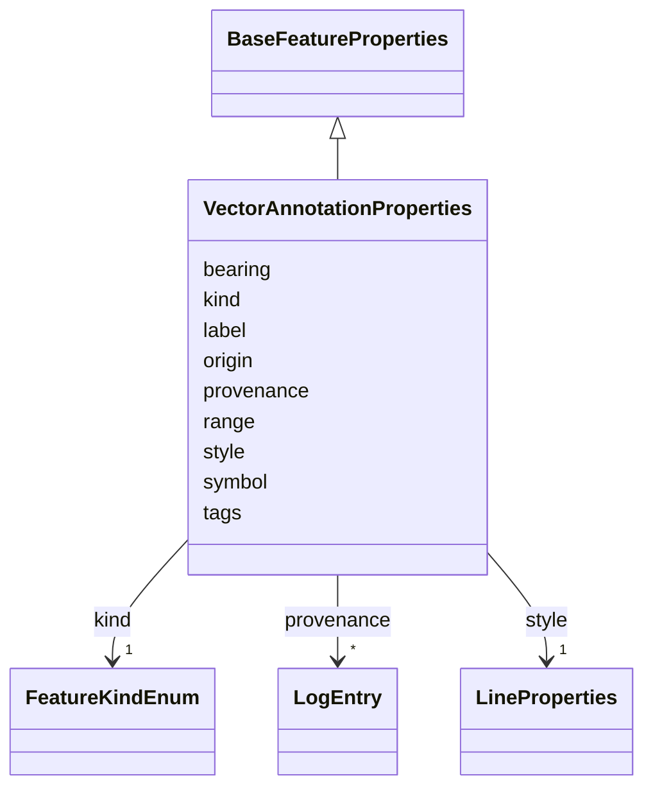

# Class: VectorAnnotationProperties 


_Properties for a VectorAnnotation_


URI: [debrief:class/VectorAnnotationProperties](https://debrief.info/schemas/class/VectorAnnotationProperties)





## Inheritance
* [BaseFeatureProperties](../classes/BaseFeatureProperties.md)
    * **VectorAnnotationProperties**


## Slots

| Name | Cardinality and Range | Description | Inheritance |
| ---  | --- | --- | --- |
| [kind](../slots/kind.md) | 1 <br/> [FeatureKindEnum](../enums/FeatureKindEnum.md) | Feature type discriminator | direct |
| [origin](../slots/origin.md) | 1..* <br/> [Float](../types/Float.md) | Vector origin as [longitude, latitude] for precise reconstruction | direct |
| [range](../slots/range.md) | 1 <br/> [Float](../types/Float.md) | Vector length/range in meters for precise reconstruction | direct |
| [bearing](../slots/bearing.md) | 1 <br/> [Float](../types/Float.md) | Vector bearing in degrees (0-360, from north) for precise reconstruction | direct |
| [label](../slots/label.md) | 0..1 <br/> [String](../types/String.md) | Annotation label text | direct |
| [symbol](../slots/symbol.md) | 0..1 <br/> [String](../types/String.md) | Display symbol code from REP file | direct |
| [style](../slots/style.md) | 1 <br/> [LineProperties](../classes/LineProperties.md) | Line styling properties for the vector | direct |
| [tags](../slots/tags.md) | * <br/> [String](../types/String.md) | Free-text labels assigned to this feature by the analyst | [BaseFeatureProperties](../classes/BaseFeatureProperties.md) |
| [provenance](../slots/provenance.md) | * <br/> [LogEntry](../classes/LogEntry.md) | PROV-aligned provenance records (append-only log of tool operations) | [BaseFeatureProperties](../classes/BaseFeatureProperties.md) |


## Usages

| used by | used in | type | used |
| ---  | --- | --- | --- |
| [VectorAnnotation](../classes/VectorAnnotation.md) | [properties](../slots/properties.md) | range | [VectorAnnotationProperties](../classes/VectorAnnotationProperties.md) |


## Identifier and Mapping Information


### Schema Source


* from schema: https://debrief.info/schemas/debrief


## Mappings

| Mapping Type | Mapped Value |
| ---  | ---  |
| self | debrief:VectorAnnotationProperties |
| native | debrief:VectorAnnotationProperties |


## LinkML Source

<!-- TODO: investigate https://stackoverflow.com/questions/37606292/how-to-create-tabbed-code-blocks-in-mkdocs-or-sphinx -->

### Direct

<details>
```yaml
name: VectorAnnotationProperties
description: Properties for a VectorAnnotation
from_schema: https://debrief.info/schemas/debrief
is_a: BaseFeatureProperties
attributes:
  kind:
    name: kind
    description: Feature type discriminator
    from_schema: https://debrief.info/schemas/annotations
    domain_of:
    - BaseFeatureProperties
    - TrackProperties
    - ReferenceLocationProperties
    - SystemStateProperties
    - MultiPointFeatureProperties
    - MultiPolygonFeatureProperties
    - NarrativeEntryProperties
    - CircleAnnotationProperties
    - RectangleAnnotationProperties
    - LineAnnotationProperties
    - TextAnnotationProperties
    - VectorAnnotationProperties
    - PolyAnnotationProperties
    - SelectionRequirement
    - SystemRecordProperties
    - StoryboardProperties
    - SceneProperties
    range: FeatureKindEnum
    required: true
    equals_string: VECTOR
  origin:
    name: origin
    description: Vector origin as [longitude, latitude] for precise reconstruction
    from_schema: https://debrief.info/schemas/annotations
    domain_of:
    - SensorContact
    - VectorAnnotationProperties
    range: float
    required: true
    multivalued: true
    minimum_cardinality: 2
    maximum_cardinality: 2
  range:
    name: range
    description: Vector length/range in meters for precise reconstruction
    from_schema: https://debrief.info/schemas/annotations
    domain_of:
    - SensorContact
    - TUASolution
    - VectorAnnotationProperties
    range: float
    required: true
    minimum_value: 0
  bearing:
    name: bearing
    description: Vector bearing in degrees (0-360, from north) for precise reconstruction
    from_schema: https://debrief.info/schemas/annotations
    domain_of:
    - SensorContact
    - TUASolution
    - VectorAnnotationProperties
    - Viewport
    range: float
    required: true
    minimum_value: 0
    maximum_value: 360
  label:
    name: label
    description: Annotation label text
    from_schema: https://debrief.info/schemas/annotations
    domain_of:
    - PositionStyleOverride
    - SensorContact
    - TUASolution
    - MultiPointFeatureProperties
    - MultiPolygonFeatureProperties
    - CircleAnnotationProperties
    - RectangleAnnotationProperties
    - LineAnnotationProperties
    - VectorAnnotationProperties
    - PolyAnnotationProperties
    - ToolResultAnnotations
    - DatasetAxisMetadata
  symbol:
    name: symbol
    description: Display symbol code from REP file
    from_schema: https://debrief.info/schemas/annotations
    domain_of:
    - PositionStyle
    - PositionStyleOverride
    - ReferenceLocationProperties
    - NarrativeEntryProperties
    - CircleAnnotationProperties
    - RectangleAnnotationProperties
    - LineAnnotationProperties
    - TextAnnotationProperties
    - VectorAnnotationProperties
    - PolyAnnotationProperties
  style:
    name: style
    description: Line styling properties for the vector
    from_schema: https://debrief.info/schemas/annotations
    domain_of:
    - SegmentMetadata
    - TrackProperties
    - ReferenceLocationProperties
    - MultiPointFeatureProperties
    - MultiPolygonFeatureProperties
    - NarrativeEntryProperties
    - CircleAnnotationProperties
    - RectangleAnnotationProperties
    - LineAnnotationProperties
    - TextAnnotationProperties
    - VectorAnnotationProperties
    - PolyAnnotationProperties
    range: LineProperties
    required: true

```
</details>

### Induced

<details>
```yaml
name: VectorAnnotationProperties
description: Properties for a VectorAnnotation
from_schema: https://debrief.info/schemas/debrief
is_a: BaseFeatureProperties
attributes:
  kind:
    name: kind
    description: Feature type discriminator
    from_schema: https://debrief.info/schemas/annotations
    alias: kind
    owner: VectorAnnotationProperties
    domain_of:
    - BaseFeatureProperties
    - TrackProperties
    - ReferenceLocationProperties
    - SystemStateProperties
    - MultiPointFeatureProperties
    - MultiPolygonFeatureProperties
    - NarrativeEntryProperties
    - CircleAnnotationProperties
    - RectangleAnnotationProperties
    - LineAnnotationProperties
    - TextAnnotationProperties
    - VectorAnnotationProperties
    - PolyAnnotationProperties
    - SelectionRequirement
    - SystemRecordProperties
    - StoryboardProperties
    - SceneProperties
    range: FeatureKindEnum
    required: true
    equals_string: VECTOR
  origin:
    name: origin
    description: Vector origin as [longitude, latitude] for precise reconstruction
    from_schema: https://debrief.info/schemas/annotations
    alias: origin
    owner: VectorAnnotationProperties
    domain_of:
    - SensorContact
    - VectorAnnotationProperties
    range: float
    required: true
    multivalued: true
    minimum_cardinality: 2
    maximum_cardinality: 2
  range:
    name: range
    description: Vector length/range in meters for precise reconstruction
    from_schema: https://debrief.info/schemas/annotations
    alias: range
    owner: VectorAnnotationProperties
    domain_of:
    - SensorContact
    - TUASolution
    - VectorAnnotationProperties
    range: float
    required: true
    minimum_value: 0
  bearing:
    name: bearing
    description: Vector bearing in degrees (0-360, from north) for precise reconstruction
    from_schema: https://debrief.info/schemas/annotations
    alias: bearing
    owner: VectorAnnotationProperties
    domain_of:
    - SensorContact
    - TUASolution
    - VectorAnnotationProperties
    - Viewport
    range: float
    required: true
    minimum_value: 0
    maximum_value: 360
  label:
    name: label
    description: Annotation label text
    from_schema: https://debrief.info/schemas/annotations
    alias: label
    owner: VectorAnnotationProperties
    domain_of:
    - PositionStyleOverride
    - SensorContact
    - TUASolution
    - MultiPointFeatureProperties
    - MultiPolygonFeatureProperties
    - CircleAnnotationProperties
    - RectangleAnnotationProperties
    - LineAnnotationProperties
    - VectorAnnotationProperties
    - PolyAnnotationProperties
    - ToolResultAnnotations
    - DatasetAxisMetadata
    range: string
  symbol:
    name: symbol
    description: Display symbol code from REP file
    from_schema: https://debrief.info/schemas/annotations
    alias: symbol
    owner: VectorAnnotationProperties
    domain_of:
    - PositionStyle
    - PositionStyleOverride
    - ReferenceLocationProperties
    - NarrativeEntryProperties
    - CircleAnnotationProperties
    - RectangleAnnotationProperties
    - LineAnnotationProperties
    - TextAnnotationProperties
    - VectorAnnotationProperties
    - PolyAnnotationProperties
    range: string
  style:
    name: style
    description: Line styling properties for the vector
    from_schema: https://debrief.info/schemas/annotations
    alias: style
    owner: VectorAnnotationProperties
    domain_of:
    - SegmentMetadata
    - TrackProperties
    - ReferenceLocationProperties
    - MultiPointFeatureProperties
    - MultiPolygonFeatureProperties
    - NarrativeEntryProperties
    - CircleAnnotationProperties
    - RectangleAnnotationProperties
    - LineAnnotationProperties
    - TextAnnotationProperties
    - VectorAnnotationProperties
    - PolyAnnotationProperties
    range: LineProperties
    required: true
  tags:
    name: tags
    description: Free-text labels assigned to this feature by the analyst
    from_schema: https://debrief.info/schemas/common
    rank: 1000
    alias: tags
    owner: VectorAnnotationProperties
    domain_of:
    - BaseFeatureProperties
    - StacExtensionProperties
    - StacItemSummary
    range: string
    required: false
    multivalued: true
  provenance:
    name: provenance
    description: PROV-aligned provenance records (append-only log of tool operations)
    from_schema: https://debrief.info/schemas/common
    rank: 1000
    alias: provenance
    owner: VectorAnnotationProperties
    domain_of:
    - BaseFeatureProperties
    - SystemStateProperties
    - SystemRecordProperties
    range: LogEntry
    multivalued: true
    inlined: true
    inlined_as_list: true

```
</details>