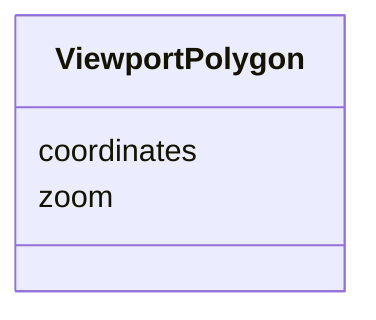

# Class: ViewportPolygon 


_Geographic area as a 4-corner polygon supporting rotated views (FR-012, FR-013)_


URI: [debrief:class/ViewportPolygon](https://debrief.info/schemas/class/ViewportPolygon)





<!-- no inheritance hierarchy -->


## Slots

| Name | Cardinality and Range | Description | Inheritance |
| ---  | --- | --- | --- |
| [coordinates](../slots/coordinates.md) | 1..* <br/> [Coordinate](../classes/Coordinate.md) | Four corners in clockwise order [NW, NE, SE, SW] | direct |
| [zoom](../slots/zoom.md) | 0..1 <br/> [Float](../types/Float.md) | Map zoom level for restoring the view (optional) | direct |


## Usages

| used by | used in | type | used |
| ---  | --- | --- | --- |
| [SpatialSlice](../classes/SpatialSlice.md) | [viewport](../slots/viewport.md) | range | [ViewportPolygon](../classes/ViewportPolygon.md) |


## Identifier and Mapping Information


### Schema Source


* from schema: https://debrief.info/schemas/debrief


## Mappings

| Mapping Type | Mapped Value |
| ---  | ---  |
| self | debrief:ViewportPolygon |
| native | debrief:ViewportPolygon |


## LinkML Source

<!-- TODO: investigate https://stackoverflow.com/questions/37606292/how-to-create-tabbed-code-blocks-in-mkdocs-or-sphinx -->

### Direct

<details>
```yaml
name: ViewportPolygon
description: Geographic area as a 4-corner polygon supporting rotated views (FR-012,
  FR-013)
from_schema: https://debrief.info/schemas/debrief
attributes:
  coordinates:
    name: coordinates
    description: Four corners in clockwise order [NW, NE, SE, SW]
    from_schema: https://debrief.info/schemas/session-state
    domain_of:
    - GeoJSONPoint
    - GeoJSONEmptyPoint
    - GeoJSONLineString
    - GeoJSONPolygon
    - GeoJSONMultiPoint
    - GeoJSONMultiLineString
    - GeoJSONMultiPolygon
    - ViewportPolygon
    range: Coordinate
    required: true
    multivalued: true
    minimum_cardinality: 4
    maximum_cardinality: 4
  zoom:
    name: zoom
    description: Map zoom level for restoring the view (optional)
    from_schema: https://debrief.info/schemas/session-state
    domain_of:
    - SystemStateProperties
    - ViewportPolygon
    - Viewport
    range: float
    required: false

```
</details>

### Induced

<details>
```yaml
name: ViewportPolygon
description: Geographic area as a 4-corner polygon supporting rotated views (FR-012,
  FR-013)
from_schema: https://debrief.info/schemas/debrief
attributes:
  coordinates:
    name: coordinates
    description: Four corners in clockwise order [NW, NE, SE, SW]
    from_schema: https://debrief.info/schemas/session-state
    alias: coordinates
    owner: ViewportPolygon
    domain_of:
    - GeoJSONPoint
    - GeoJSONEmptyPoint
    - GeoJSONLineString
    - GeoJSONPolygon
    - GeoJSONMultiPoint
    - GeoJSONMultiLineString
    - GeoJSONMultiPolygon
    - ViewportPolygon
    range: Coordinate
    required: true
    multivalued: true
    minimum_cardinality: 4
    maximum_cardinality: 4
  zoom:
    name: zoom
    description: Map zoom level for restoring the view (optional)
    from_schema: https://debrief.info/schemas/session-state
    alias: zoom
    owner: ViewportPolygon
    domain_of:
    - SystemStateProperties
    - ViewportPolygon
    - Viewport
    range: float
    required: false

```
</details>