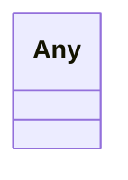

# Class: Any 


_Permissive wildcard class used for free-form JSON object ranges (e.g., RawGeoJSONFeature.properties). Maps to dict[str, object] in Pydantic and Record<string, unknown> in TypeScript after generator post-processing. This is the LinkML idiom for RFC 7946 §3.2 free-form properties and is NOT a violation of Article XV — see docs/project_notes/decisions.md (RawGeoJSONFeature ADR)._


URI: [linkml:Any](https://w3id.org/linkml/Any)





<!-- no inheritance hierarchy -->


## Slots

| Name | Cardinality and Range | Description | Inheritance |
| ---  | --- | --- | --- |


## Usages

| used by | used in | type | used |
| ---  | --- | --- | --- |
| [RawGeoJSONFeature](../classes/RawGeoJSONFeature.md) | [properties](../slots/properties.md) | range | [Any](../classes/Any.md) |


## Identifier and Mapping Information


### Schema Source


* from schema: https://debrief.info/schemas/debrief


## Mappings

| Mapping Type | Mapped Value |
| ---  | ---  |
| self | linkml:Any |
| native | debrief:Any |


## LinkML Source

<!-- TODO: investigate https://stackoverflow.com/questions/37606292/how-to-create-tabbed-code-blocks-in-mkdocs-or-sphinx -->

### Direct

<details>
```yaml
name: Any
description: Permissive wildcard class used for free-form JSON object ranges (e.g.,
  RawGeoJSONFeature.properties). Maps to dict[str, object] in Pydantic and Record<string,
  unknown> in TypeScript after generator post-processing. This is the LinkML idiom
  for RFC 7946 §3.2 free-form properties and is NOT a violation of Article XV — see
  docs/project_notes/decisions.md (RawGeoJSONFeature ADR).
from_schema: https://debrief.info/schemas/debrief
class_uri: linkml:Any

```
</details>

### Induced

<details>
```yaml
name: Any
description: Permissive wildcard class used for free-form JSON object ranges (e.g.,
  RawGeoJSONFeature.properties). Maps to dict[str, object] in Pydantic and Record<string,
  unknown> in TypeScript after generator post-processing. This is the LinkML idiom
  for RFC 7946 §3.2 free-form properties and is NOT a violation of Article XV — see
  docs/project_notes/decisions.md (RawGeoJSONFeature ADR).
from_schema: https://debrief.info/schemas/debrief
class_uri: linkml:Any

```
</details>