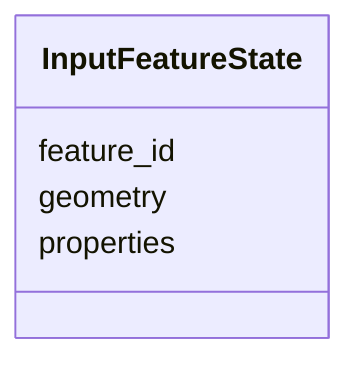

# Class: InputFeatureState 


_Pre-operation state of a feature captured before a coordinate-mutating tool executes. Enables correct replay by providing the original geometry as the anchor for re-computation with modified parameters._


URI: [debrief:class/InputFeatureState](https://debrief.info/schemas/class/InputFeatureState)





<!-- no inheritance hierarchy -->


## Slots

| Name | Cardinality and Range | Description | Inheritance |
| ---  | --- | --- | --- |
| [feature_id](../slots/feature_id.md) | 1 <br/> [String](../types/String.md) | ID of the feature whose pre-operation state is captured | direct |
| [geometry](../slots/geometry.md) | 1 <br/> [String](../types/String.md) | Full GeoJSON geometry object (type + coordinates) as it was immediately befor... | direct |
| [properties](../slots/properties.md) | 0..1 <br/> [String](../types/String.md) | Kind-specific spatial properties captured before the operation | direct |


## Usages

| used by | used in | type | used |
| ---  | --- | --- | --- |
| [LogEntry](../classes/LogEntry.md) | [input_state](../slots/input_state.md) | range | [InputFeatureState](../classes/InputFeatureState.md) |


## Identifier and Mapping Information


### Schema Source


* from schema: https://debrief.info/schemas/debrief


## Mappings

| Mapping Type | Mapped Value |
| ---  | ---  |
| self | debrief:InputFeatureState |
| native | debrief:InputFeatureState |


## LinkML Source

<!-- TODO: investigate https://stackoverflow.com/questions/37606292/how-to-create-tabbed-code-blocks-in-mkdocs-or-sphinx -->

### Direct

<details>
```yaml
name: InputFeatureState
description: Pre-operation state of a feature captured before a coordinate-mutating
  tool executes. Enables correct replay by providing the original geometry as the
  anchor for re-computation with modified parameters.
from_schema: https://debrief.info/schemas/debrief
attributes:
  feature_id:
    name: feature_id
    description: ID of the feature whose pre-operation state is captured.
    from_schema: https://debrief.info/schemas/log-entry
    rank: 1000
    domain_of:
    - InputFeatureState
    range: string
    required: true
  geometry:
    name: geometry
    description: Full GeoJSON geometry object (type + coordinates) as it was immediately
      before the operation. Stored as a JSON object.
    notes:
    - Typed as string in LinkML but serialized as a JSON object in practice. GeoJSON
      geometry is polymorphic (Point, Polygon, LineString, etc.) and LinkML does not
      have a native geometry type.
    from_schema: https://debrief.info/schemas/log-entry
    domain_of:
    - TrackFeature
    - ReferenceLocation
    - SystemState
    - MultiPointFeature
    - MultiPolygonFeature
    - InputFeatureState
    - NarrativeEntry
    - CircleAnnotation
    - RectangleAnnotation
    - LineAnnotation
    - TextAnnotation
    - VectorAnnotation
    - PolyAnnotation
    - RawGeoJSONFeature
    - StoryboardFeature
    - SceneFeature
    range: string
    required: true
  properties:
    name: properties
    description: Kind-specific spatial properties captured before the operation. Excludes
      provenance (which is append-only). Null if no spatial properties need capturing.
    notes:
    - Typed as string in LinkML but serialized as a JSON object in practice. Contains
      keys like "center", "origin", "radius_km" etc.
    from_schema: https://debrief.info/schemas/log-entry
    domain_of:
    - TrackFeature
    - ReferenceLocation
    - SystemState
    - MultiPointFeature
    - MultiPolygonFeature
    - InputFeatureState
    - NarrativeEntry
    - CircleAnnotation
    - RectangleAnnotation
    - LineAnnotation
    - TextAnnotation
    - VectorAnnotation
    - PolyAnnotation
    - RawGeoJSONFeature
    - StoryboardFeature
    - SceneFeature
    range: string
    required: false

```
</details>

### Induced

<details>
```yaml
name: InputFeatureState
description: Pre-operation state of a feature captured before a coordinate-mutating
  tool executes. Enables correct replay by providing the original geometry as the
  anchor for re-computation with modified parameters.
from_schema: https://debrief.info/schemas/debrief
attributes:
  feature_id:
    name: feature_id
    description: ID of the feature whose pre-operation state is captured.
    from_schema: https://debrief.info/schemas/log-entry
    rank: 1000
    alias: feature_id
    owner: InputFeatureState
    domain_of:
    - InputFeatureState
    range: string
    required: true
  geometry:
    name: geometry
    description: Full GeoJSON geometry object (type + coordinates) as it was immediately
      before the operation. Stored as a JSON object.
    notes:
    - Typed as string in LinkML but serialized as a JSON object in practice. GeoJSON
      geometry is polymorphic (Point, Polygon, LineString, etc.) and LinkML does not
      have a native geometry type.
    from_schema: https://debrief.info/schemas/log-entry
    alias: geometry
    owner: InputFeatureState
    domain_of:
    - TrackFeature
    - ReferenceLocation
    - SystemState
    - MultiPointFeature
    - MultiPolygonFeature
    - InputFeatureState
    - NarrativeEntry
    - CircleAnnotation
    - RectangleAnnotation
    - LineAnnotation
    - TextAnnotation
    - VectorAnnotation
    - PolyAnnotation
    - RawGeoJSONFeature
    - StoryboardFeature
    - SceneFeature
    range: string
    required: true
  properties:
    name: properties
    description: Kind-specific spatial properties captured before the operation. Excludes
      provenance (which is append-only). Null if no spatial properties need capturing.
    notes:
    - Typed as string in LinkML but serialized as a JSON object in practice. Contains
      keys like "center", "origin", "radius_km" etc.
    from_schema: https://debrief.info/schemas/log-entry
    alias: properties
    owner: InputFeatureState
    domain_of:
    - TrackFeature
    - ReferenceLocation
    - SystemState
    - MultiPointFeature
    - MultiPolygonFeature
    - InputFeatureState
    - NarrativeEntry
    - CircleAnnotation
    - RectangleAnnotation
    - LineAnnotation
    - TextAnnotation
    - VectorAnnotation
    - PolyAnnotation
    - RawGeoJSONFeature
    - StoryboardFeature
    - SceneFeature
    range: string
    required: false

```
</details>