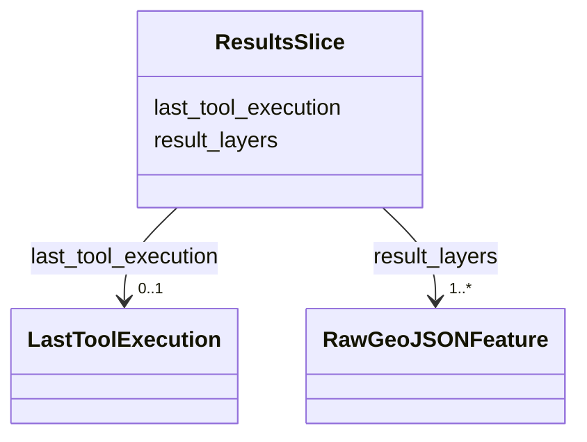

# Class: ResultsSlice 


_Accumulated tool result layers and last-execution record for undo support. Features 109-unify-result-layer-lifecycle and 110-tool-level-undo-gap._

__


URI: [debrief:class/ResultsSlice](https://debrief.info/schemas/class/ResultsSlice)





<!-- no inheritance hierarchy -->


## Slots

| Name | Cardinality and Range | Description | Inheritance |
| ---  | --- | --- | --- |
| [result_layers](../slots/result_layers.md) | 1..* <br/> [RawGeoJSONFeature](../classes/RawGeoJSONFeature.md) | Accumulated tool result features | direct |
| [last_tool_execution](../slots/last_tool_execution.md) | 0..1 <br/> [LastToolExecution](../classes/LastToolExecution.md) | Last tool execution record for single-step undo | direct |


## Identifier and Mapping Information


### Schema Source


* from schema: https://debrief.info/schemas/debrief


## Mappings

| Mapping Type | Mapped Value |
| ---  | ---  |
| self | debrief:ResultsSlice |
| native | debrief:ResultsSlice |


## LinkML Source

<!-- TODO: investigate https://stackoverflow.com/questions/37606292/how-to-create-tabbed-code-blocks-in-mkdocs-or-sphinx -->

### Direct

<details>
```yaml
name: ResultsSlice
description: 'Accumulated tool result layers and last-execution record for undo support.
  Features 109-unify-result-layer-lifecycle and 110-tool-level-undo-gap.

  '
from_schema: https://debrief.info/schemas/debrief
attributes:
  result_layers:
    name: result_layers
    description: Accumulated tool result features
    from_schema: https://debrief.info/schemas/session-state
    rank: 1000
    domain_of:
    - ResultsSlice
    range: RawGeoJSONFeature
    required: true
    multivalued: true
    inlined: true
    inlined_as_list: true
  last_tool_execution:
    name: last_tool_execution
    description: Last tool execution record for single-step undo
    from_schema: https://debrief.info/schemas/session-state
    rank: 1000
    domain_of:
    - ResultsSlice
    range: LastToolExecution
    required: false

```
</details>

### Induced

<details>
```yaml
name: ResultsSlice
description: 'Accumulated tool result layers and last-execution record for undo support.
  Features 109-unify-result-layer-lifecycle and 110-tool-level-undo-gap.

  '
from_schema: https://debrief.info/schemas/debrief
attributes:
  result_layers:
    name: result_layers
    description: Accumulated tool result features
    from_schema: https://debrief.info/schemas/session-state
    rank: 1000
    alias: result_layers
    owner: ResultsSlice
    domain_of:
    - ResultsSlice
    range: RawGeoJSONFeature
    required: true
    multivalued: true
    inlined: true
    inlined_as_list: true
  last_tool_execution:
    name: last_tool_execution
    description: Last tool execution record for single-step undo
    from_schema: https://debrief.info/schemas/session-state
    rank: 1000
    alias: last_tool_execution
    owner: ResultsSlice
    domain_of:
    - ResultsSlice
    range: LastToolExecution
    required: false

```
</details>