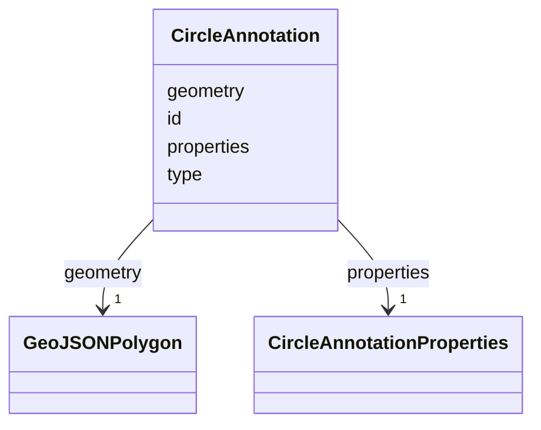

# Class: CircleAnnotation 


_GeoJSON Feature for circle annotations. Geometry is a Polygon approximating the circle (vertices at regular intervals). Properties contain center and radius for precise reconstruction and smooth rendering._


URI: [debrief:class/CircleAnnotation](https://debrief.info/schemas/class/CircleAnnotation)





<!-- no inheritance hierarchy -->


## Slots

| Name | Cardinality and Range | Description | Inheritance |
| ---  | --- | --- | --- |
| [type](../slots/type.md) | 1 <br/> [String](../types/String.md) | GeoJSON type discriminator | direct |
| [id](../slots/id.md) | 1 <br/> [String](../types/String.md) | Unique identifier | direct |
| [geometry](../slots/geometry.md) | 1 <br/> [GeoJSONPolygon](../classes/GeoJSONPolygon.md) | Circle as Polygon (approximated with vertices, e | direct |
| [properties](../slots/properties.md) | 1 <br/> [CircleAnnotationProperties](../classes/CircleAnnotationProperties.md) | Circle metadata including center and radius for reconstruction | direct |


## Identifier and Mapping Information


### Schema Source


* from schema: https://debrief.info/schemas/debrief


## Mappings

| Mapping Type | Mapped Value |
| ---  | ---  |
| self | debrief:CircleAnnotation |
| native | debrief:CircleAnnotation |


## LinkML Source

<!-- TODO: investigate https://stackoverflow.com/questions/37606292/how-to-create-tabbed-code-blocks-in-mkdocs-or-sphinx -->

### Direct

<details>
```yaml
name: CircleAnnotation
description: GeoJSON Feature for circle annotations. Geometry is a Polygon approximating
  the circle (vertices at regular intervals). Properties contain center and radius
  for precise reconstruction and smooth rendering.
from_schema: https://debrief.info/schemas/debrief
attributes:
  type:
    name: type
    description: GeoJSON type discriminator
    from_schema: https://debrief.info/schemas/annotations
    domain_of:
    - GeoJSONPoint
    - GeoJSONEmptyPoint
    - GeoJSONLineString
    - GeoJSONPolygon
    - GeoJSONMultiPoint
    - GeoJSONMultiLineString
    - GeoJSONMultiPolygon
    - TrackFeature
    - ReferenceLocation
    - SystemState
    - MultiPointFeature
    - MultiPolygonFeature
    - NarrativeEntry
    - CircleAnnotation
    - RectangleAnnotation
    - LineAnnotation
    - TextAnnotation
    - VectorAnnotation
    - PolyAnnotation
    - ToolParameter
    - FileProvEntry
    - RawGeoJSONFeature
    - RawGeoJSONFeatureCollection
    - DatasetAxisMetadata
    - DatasetEntry
    - StoryboardFeature
    - SceneFeature
    - SceneThumbnailAssetEntry
    range: string
    required: true
    equals_string: Feature
  id:
    name: id
    description: Unique identifier
    from_schema: https://debrief.info/schemas/annotations
    domain_of:
    - TrackFeature
    - ReferenceLocation
    - SystemState
    - MultiPointFeature
    - MultiPolygonFeature
    - NarrativeEntry
    - CircleAnnotation
    - RectangleAnnotation
    - LineAnnotation
    - TextAnnotation
    - VectorAnnotation
    - PolyAnnotation
    - Tool
    - PlatformRecord
    - PlotSummary
    - StacItemSummary
    - RawGeoJSONFeature
    - StoryboardProperties
    - SceneProperties
    - StoryboardFeature
    - SceneFeature
    required: true
  geometry:
    name: geometry
    description: Circle as Polygon (approximated with vertices, e.g., every 45 degrees)
    from_schema: https://debrief.info/schemas/annotations
    domain_of:
    - TrackFeature
    - ReferenceLocation
    - SystemState
    - MultiPointFeature
    - MultiPolygonFeature
    - InputFeatureState
    - NarrativeEntry
    - CircleAnnotation
    - RectangleAnnotation
    - LineAnnotation
    - TextAnnotation
    - VectorAnnotation
    - PolyAnnotation
    - RawGeoJSONFeature
    - StoryboardFeature
    - SceneFeature
    range: GeoJSONPolygon
    required: true
  properties:
    name: properties
    description: Circle metadata including center and radius for reconstruction
    from_schema: https://debrief.info/schemas/annotations
    domain_of:
    - TrackFeature
    - ReferenceLocation
    - SystemState
    - MultiPointFeature
    - MultiPolygonFeature
    - InputFeatureState
    - NarrativeEntry
    - CircleAnnotation
    - RectangleAnnotation
    - LineAnnotation
    - TextAnnotation
    - VectorAnnotation
    - PolyAnnotation
    - RawGeoJSONFeature
    - StoryboardFeature
    - SceneFeature
    range: CircleAnnotationProperties
    required: true

```
</details>

### Induced

<details>
```yaml
name: CircleAnnotation
description: GeoJSON Feature for circle annotations. Geometry is a Polygon approximating
  the circle (vertices at regular intervals). Properties contain center and radius
  for precise reconstruction and smooth rendering.
from_schema: https://debrief.info/schemas/debrief
attributes:
  type:
    name: type
    description: GeoJSON type discriminator
    from_schema: https://debrief.info/schemas/annotations
    alias: type
    owner: CircleAnnotation
    domain_of:
    - GeoJSONPoint
    - GeoJSONEmptyPoint
    - GeoJSONLineString
    - GeoJSONPolygon
    - GeoJSONMultiPoint
    - GeoJSONMultiLineString
    - GeoJSONMultiPolygon
    - TrackFeature
    - ReferenceLocation
    - SystemState
    - MultiPointFeature
    - MultiPolygonFeature
    - NarrativeEntry
    - CircleAnnotation
    - RectangleAnnotation
    - LineAnnotation
    - TextAnnotation
    - VectorAnnotation
    - PolyAnnotation
    - ToolParameter
    - FileProvEntry
    - RawGeoJSONFeature
    - RawGeoJSONFeatureCollection
    - DatasetAxisMetadata
    - DatasetEntry
    - StoryboardFeature
    - SceneFeature
    - SceneThumbnailAssetEntry
    range: string
    required: true
    equals_string: Feature
  id:
    name: id
    description: Unique identifier
    from_schema: https://debrief.info/schemas/annotations
    alias: id
    owner: CircleAnnotation
    domain_of:
    - TrackFeature
    - ReferenceLocation
    - SystemState
    - MultiPointFeature
    - MultiPolygonFeature
    - NarrativeEntry
    - CircleAnnotation
    - RectangleAnnotation
    - LineAnnotation
    - TextAnnotation
    - VectorAnnotation
    - PolyAnnotation
    - Tool
    - PlatformRecord
    - PlotSummary
    - StacItemSummary
    - RawGeoJSONFeature
    - StoryboardProperties
    - SceneProperties
    - StoryboardFeature
    - SceneFeature
    range: string
    required: true
  geometry:
    name: geometry
    description: Circle as Polygon (approximated with vertices, e.g., every 45 degrees)
    from_schema: https://debrief.info/schemas/annotations
    alias: geometry
    owner: CircleAnnotation
    domain_of:
    - TrackFeature
    - ReferenceLocation
    - SystemState
    - MultiPointFeature
    - MultiPolygonFeature
    - InputFeatureState
    - NarrativeEntry
    - CircleAnnotation
    - RectangleAnnotation
    - LineAnnotation
    - TextAnnotation
    - VectorAnnotation
    - PolyAnnotation
    - RawGeoJSONFeature
    - StoryboardFeature
    - SceneFeature
    range: GeoJSONPolygon
    required: true
  properties:
    name: properties
    description: Circle metadata including center and radius for reconstruction
    from_schema: https://debrief.info/schemas/annotations
    alias: properties
    owner: CircleAnnotation
    domain_of:
    - TrackFeature
    - ReferenceLocation
    - SystemState
    - MultiPointFeature
    - MultiPolygonFeature
    - InputFeatureState
    - NarrativeEntry
    - CircleAnnotation
    - RectangleAnnotation
    - LineAnnotation
    - TextAnnotation
    - VectorAnnotation
    - PolyAnnotation
    - RawGeoJSONFeature
    - StoryboardFeature
    - SceneFeature
    range: CircleAnnotationProperties
    required: true

```
</details>