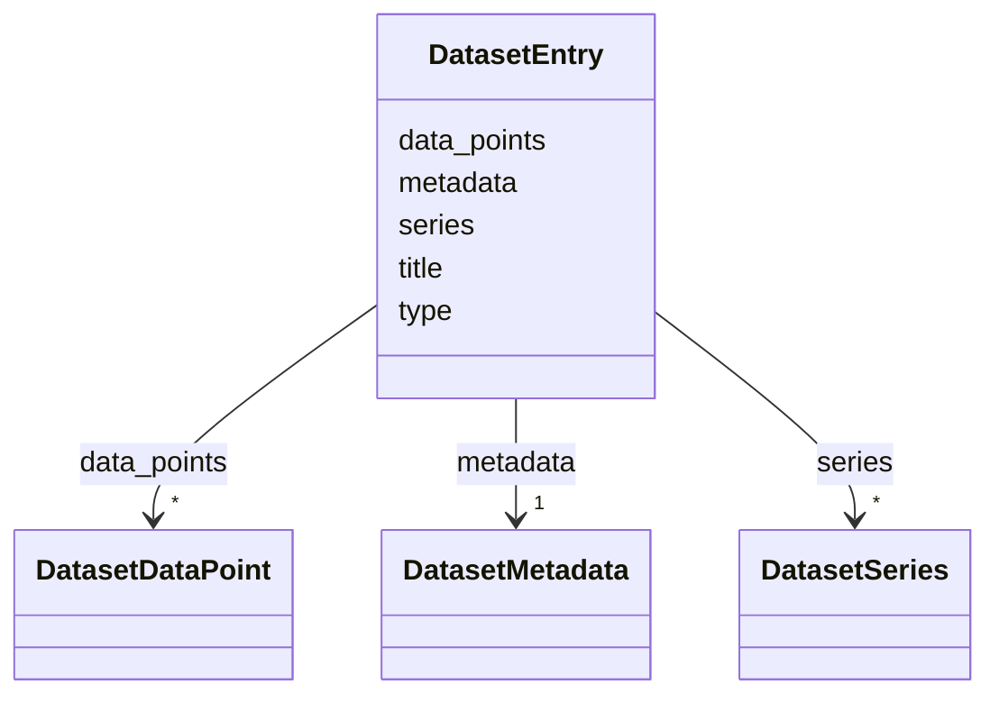

# Class: DatasetEntry 


_Standard envelope for all tool result datasets, matching the runtime DatasetEnvelope interface from shared/components/src/ChartRenderer/types.ts. Exactly one of data_points (flat/single-series) or series (multi-series) should be populated per instance._

__


URI: [debrief:class/DatasetEntry](https://debrief.info/schemas/class/DatasetEntry)





<!-- no inheritance hierarchy -->


## Slots

| Name | Cardinality and Range | Description | Inheritance |
| ---  | --- | --- | --- |
| [type](../slots/type.md) | 1 <br/> [String](../types/String.md) | Dataset subtype identifier (e | direct |
| [title](../slots/title.md) | 1 <br/> [String](../types/String.md) | Human-readable chart title | direct |
| [metadata](../slots/metadata.md) | 1 <br/> [DatasetMetadata](../classes/DatasetMetadata.md) | Axis definitions and display hints | direct |
| [data_points](../slots/data_points.md) | * <br/> [DatasetDataPoint](../classes/DatasetDataPoint.md) | Flat array of structured data records for histograms and single-series charts | direct |
| [series](../slots/series.md) | * <br/> [DatasetSeries](../classes/DatasetSeries.md) | Named data series for multi-line/multi-series charts | direct |


## Identifier and Mapping Information


### Schema Source


* from schema: https://debrief.info/schemas/debrief


## Mappings

| Mapping Type | Mapped Value |
| ---  | ---  |
| self | debrief:DatasetEntry |
| native | debrief:DatasetEntry |


## LinkML Source

<!-- TODO: investigate https://stackoverflow.com/questions/37606292/how-to-create-tabbed-code-blocks-in-mkdocs-or-sphinx -->

### Direct

<details>
```yaml
name: DatasetEntry
description: 'Standard envelope for all tool result datasets, matching the runtime
  DatasetEnvelope interface from shared/components/src/ChartRenderer/types.ts. Exactly
  one of data_points (flat/single-series) or series (multi-series) should be populated
  per instance.

  '
from_schema: https://debrief.info/schemas/debrief
attributes:
  type:
    name: type
    description: Dataset subtype identifier (e.g., "zone_histogram", "range_bearing_series")
    from_schema: https://debrief.com/schemas/tool-result
    domain_of:
    - GeoJSONPoint
    - GeoJSONEmptyPoint
    - GeoJSONLineString
    - GeoJSONPolygon
    - GeoJSONMultiPoint
    - GeoJSONMultiLineString
    - GeoJSONMultiPolygon
    - TrackFeature
    - ReferenceLocation
    - SystemState
    - MultiPointFeature
    - MultiPolygonFeature
    - NarrativeEntry
    - CircleAnnotation
    - RectangleAnnotation
    - LineAnnotation
    - TextAnnotation
    - VectorAnnotation
    - PolyAnnotation
    - ToolParameter
    - FileProvEntry
    - RawGeoJSONFeature
    - RawGeoJSONFeatureCollection
    - DatasetAxisMetadata
    - DatasetEntry
    - StoryboardFeature
    - SceneFeature
    - SceneThumbnailAssetEntry
    range: string
    required: true
  title:
    name: title
    description: Human-readable chart title
    from_schema: https://debrief.com/schemas/tool-result
    domain_of:
    - PlotSummary
    - StacItemSummary
    - DatasetEntry
    - SceneProperties
    - SceneThumbnailAssetEntry
    range: string
    required: true
  metadata:
    name: metadata
    description: Axis definitions and display hints
    from_schema: https://debrief.com/schemas/tool-result
    rank: 1000
    domain_of:
    - DatasetEntry
    range: DatasetMetadata
    required: true
  data_points:
    name: data_points
    description: 'Flat array of structured data records for histograms and single-series
      charts. Corresponds to DatasetEnvelope.data (Record<string, unknown>[]). Absent
      when series is populated.

      '
    from_schema: https://debrief.com/schemas/tool-result
    domain_of:
    - DatasetSeries
    - DatasetEntry
    range: DatasetDataPoint
    required: false
    multivalued: true
    inlined: true
    inlined_as_list: true
  series:
    name: series
    description: 'Named data series for multi-line/multi-series charts. Corresponds
      to DatasetEnvelope.series (DataSeries[]). Absent when data_points is populated.

      '
    from_schema: https://debrief.com/schemas/tool-result
    rank: 1000
    domain_of:
    - DatasetEntry
    range: DatasetSeries
    required: false
    multivalued: true
    inlined: true
    inlined_as_list: true

```
</details>

### Induced

<details>
```yaml
name: DatasetEntry
description: 'Standard envelope for all tool result datasets, matching the runtime
  DatasetEnvelope interface from shared/components/src/ChartRenderer/types.ts. Exactly
  one of data_points (flat/single-series) or series (multi-series) should be populated
  per instance.

  '
from_schema: https://debrief.info/schemas/debrief
attributes:
  type:
    name: type
    description: Dataset subtype identifier (e.g., "zone_histogram", "range_bearing_series")
    from_schema: https://debrief.com/schemas/tool-result
    alias: type
    owner: DatasetEntry
    domain_of:
    - GeoJSONPoint
    - GeoJSONEmptyPoint
    - GeoJSONLineString
    - GeoJSONPolygon
    - GeoJSONMultiPoint
    - GeoJSONMultiLineString
    - GeoJSONMultiPolygon
    - TrackFeature
    - ReferenceLocation
    - SystemState
    - MultiPointFeature
    - MultiPolygonFeature
    - NarrativeEntry
    - CircleAnnotation
    - RectangleAnnotation
    - LineAnnotation
    - TextAnnotation
    - VectorAnnotation
    - PolyAnnotation
    - ToolParameter
    - FileProvEntry
    - RawGeoJSONFeature
    - RawGeoJSONFeatureCollection
    - DatasetAxisMetadata
    - DatasetEntry
    - StoryboardFeature
    - SceneFeature
    - SceneThumbnailAssetEntry
    range: string
    required: true
  title:
    name: title
    description: Human-readable chart title
    from_schema: https://debrief.com/schemas/tool-result
    alias: title
    owner: DatasetEntry
    domain_of:
    - PlotSummary
    - StacItemSummary
    - DatasetEntry
    - SceneProperties
    - SceneThumbnailAssetEntry
    range: string
    required: true
  metadata:
    name: metadata
    description: Axis definitions and display hints
    from_schema: https://debrief.com/schemas/tool-result
    rank: 1000
    alias: metadata
    owner: DatasetEntry
    domain_of:
    - DatasetEntry
    range: DatasetMetadata
    required: true
  data_points:
    name: data_points
    description: 'Flat array of structured data records for histograms and single-series
      charts. Corresponds to DatasetEnvelope.data (Record<string, unknown>[]). Absent
      when series is populated.

      '
    from_schema: https://debrief.com/schemas/tool-result
    alias: data_points
    owner: DatasetEntry
    domain_of:
    - DatasetSeries
    - DatasetEntry
    range: DatasetDataPoint
    required: false
    multivalued: true
    inlined: true
    inlined_as_list: true
  series:
    name: series
    description: 'Named data series for multi-line/multi-series charts. Corresponds
      to DatasetEnvelope.series (DataSeries[]). Absent when data_points is populated.

      '
    from_schema: https://debrief.com/schemas/tool-result
    rank: 1000
    alias: series
    owner: DatasetEntry
    domain_of:
    - DatasetEntry
    range: DatasetSeries
    required: false
    multivalued: true
    inlined: true
    inlined_as_list: true

```
</details>