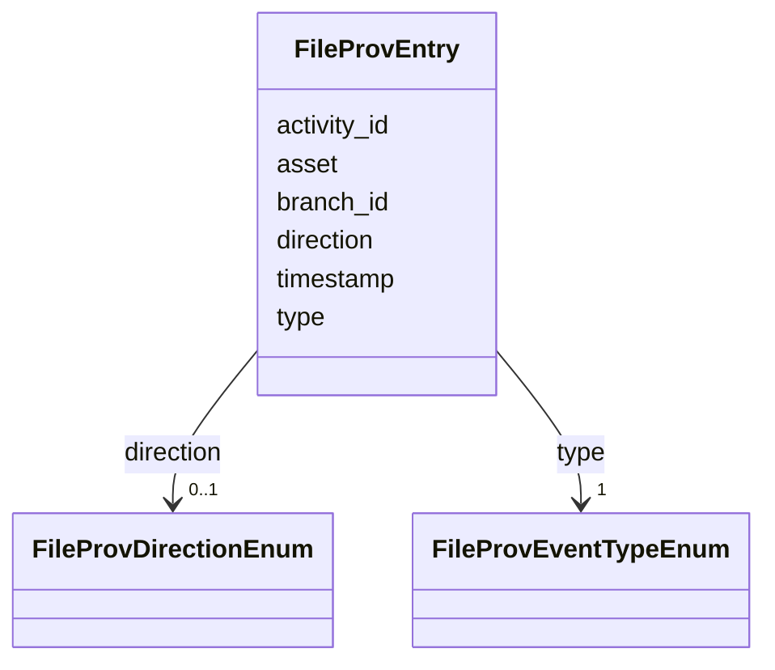

# Class: FileProvEntry 


_File-level provenance event (snapshot or branch creation)._


URI: [debrief:class/FileProvEntry](https://debrief.info/schemas/class/FileProvEntry)





<!-- no inheritance hierarchy -->


## Slots

| Name | Cardinality and Range | Description | Inheritance |
| ---  | --- | --- | --- |
| [activity_id](../slots/activity_id.md) | 1 <br/> [String](../types/String.md) | Unique event identifier | direct |
| [type](../slots/type.md) | 1 <br/> [FileProvEventTypeEnum](../enums/FileProvEventTypeEnum.md) | Event type: snapshot or branch | direct |
| [timestamp](../slots/timestamp.md) | 1 <br/> [datetime](../slots/datetime.md) | When the event occurred (ISO 8601 with timezone) | direct |
| [asset](../slots/asset.md) | 0..1 <br/> [String](../types/String.md) | Path to snapshot file (for snapshot events) | direct |
| [branch_id](../slots/branch_id.md) | 0..1 <br/> [String](../types/String.md) | Branch identifier (for branch events) | direct |
| [direction](../slots/direction.md) | 0..1 <br/> [FileProvDirectionEnum](../enums/FileProvDirectionEnum.md) | 'source' or 'target' (for branch events) | direct |


## Usages

| used by | used in | type | used |
| ---  | --- | --- | --- |
| [SystemRecordProperties](../classes/SystemRecordProperties.md) | [provenance](../slots/provenance.md) | range | [FileProvEntry](../classes/FileProvEntry.md) |


## Identifier and Mapping Information


### Schema Source


* from schema: https://debrief.info/schemas/debrief


## Mappings

| Mapping Type | Mapped Value |
| ---  | ---  |
| self | debrief:FileProvEntry |
| native | debrief:FileProvEntry |


## LinkML Source

<!-- TODO: investigate https://stackoverflow.com/questions/37606292/how-to-create-tabbed-code-blocks-in-mkdocs-or-sphinx -->

### Direct

<details>
```yaml
name: FileProvEntry
description: File-level provenance event (snapshot or branch creation).
from_schema: https://debrief.info/schemas/debrief
attributes:
  activity_id:
    name: activity_id
    description: Unique event identifier.
    from_schema: https://debrief.info/schemas/system-record
    domain_of:
    - LogEntry
    - FileProvEntry
    - PropertiesProvenanceEntry
    range: string
    required: true
  type:
    name: type
    description: 'Event type: snapshot or branch.'
    from_schema: https://debrief.info/schemas/system-record
    domain_of:
    - GeoJSONPoint
    - GeoJSONEmptyPoint
    - GeoJSONLineString
    - GeoJSONPolygon
    - GeoJSONMultiPoint
    - GeoJSONMultiLineString
    - GeoJSONMultiPolygon
    - TrackFeature
    - ReferenceLocation
    - SystemState
    - MultiPointFeature
    - MultiPolygonFeature
    - NarrativeEntry
    - CircleAnnotation
    - RectangleAnnotation
    - LineAnnotation
    - TextAnnotation
    - VectorAnnotation
    - PolyAnnotation
    - ToolParameter
    - FileProvEntry
    - RawGeoJSONFeature
    - RawGeoJSONFeatureCollection
    - DatasetAxisMetadata
    - DatasetEntry
    - StoryboardFeature
    - SceneFeature
    - SceneThumbnailAssetEntry
    range: FileProvEventTypeEnum
    required: true
  timestamp:
    name: timestamp
    description: When the event occurred (ISO 8601 with timezone).
    from_schema: https://debrief.info/schemas/system-record
    domain_of:
    - LogEntry
    - TuneAnnotation
    - FileProvEntry
    - PropertiesProvenanceEntry
    - FeatureSelection
    - SceneProperties
    range: datetime
    required: true
  asset:
    name: asset
    description: Path to snapshot file (for snapshot events).
    from_schema: https://debrief.info/schemas/system-record
    domain_of:
    - SnapshotRef
    - FileProvEntry
    range: string
    required: false
  branch_id:
    name: branch_id
    description: Branch identifier (for branch events).
    from_schema: https://debrief.info/schemas/system-record
    domain_of:
    - BranchRecord
    - BranchOrigin
    - FileProvEntry
    range: string
    required: false
  direction:
    name: direction
    description: '''source'' or ''target'' (for branch events).'
    from_schema: https://debrief.info/schemas/system-record
    rank: 1000
    domain_of:
    - FileProvEntry
    range: FileProvDirectionEnum
    required: false

```
</details>

### Induced

<details>
```yaml
name: FileProvEntry
description: File-level provenance event (snapshot or branch creation).
from_schema: https://debrief.info/schemas/debrief
attributes:
  activity_id:
    name: activity_id
    description: Unique event identifier.
    from_schema: https://debrief.info/schemas/system-record
    alias: activity_id
    owner: FileProvEntry
    domain_of:
    - LogEntry
    - FileProvEntry
    - PropertiesProvenanceEntry
    range: string
    required: true
  type:
    name: type
    description: 'Event type: snapshot or branch.'
    from_schema: https://debrief.info/schemas/system-record
    alias: type
    owner: FileProvEntry
    domain_of:
    - GeoJSONPoint
    - GeoJSONEmptyPoint
    - GeoJSONLineString
    - GeoJSONPolygon
    - GeoJSONMultiPoint
    - GeoJSONMultiLineString
    - GeoJSONMultiPolygon
    - TrackFeature
    - ReferenceLocation
    - SystemState
    - MultiPointFeature
    - MultiPolygonFeature
    - NarrativeEntry
    - CircleAnnotation
    - RectangleAnnotation
    - LineAnnotation
    - TextAnnotation
    - VectorAnnotation
    - PolyAnnotation
    - ToolParameter
    - FileProvEntry
    - RawGeoJSONFeature
    - RawGeoJSONFeatureCollection
    - DatasetAxisMetadata
    - DatasetEntry
    - StoryboardFeature
    - SceneFeature
    - SceneThumbnailAssetEntry
    range: FileProvEventTypeEnum
    required: true
  timestamp:
    name: timestamp
    description: When the event occurred (ISO 8601 with timezone).
    from_schema: https://debrief.info/schemas/system-record
    alias: timestamp
    owner: FileProvEntry
    domain_of:
    - LogEntry
    - TuneAnnotation
    - FileProvEntry
    - PropertiesProvenanceEntry
    - FeatureSelection
    - SceneProperties
    range: datetime
    required: true
  asset:
    name: asset
    description: Path to snapshot file (for snapshot events).
    from_schema: https://debrief.info/schemas/system-record
    alias: asset
    owner: FileProvEntry
    domain_of:
    - SnapshotRef
    - FileProvEntry
    range: string
    required: false
  branch_id:
    name: branch_id
    description: Branch identifier (for branch events).
    from_schema: https://debrief.info/schemas/system-record
    alias: branch_id
    owner: FileProvEntry
    domain_of:
    - BranchRecord
    - BranchOrigin
    - FileProvEntry
    range: string
    required: false
  direction:
    name: direction
    description: '''source'' or ''target'' (for branch events).'
    from_schema: https://debrief.info/schemas/system-record
    rank: 1000
    alias: direction
    owner: FileProvEntry
    domain_of:
    - FileProvEntry
    range: FileProvDirectionEnum
    required: false

```
</details>