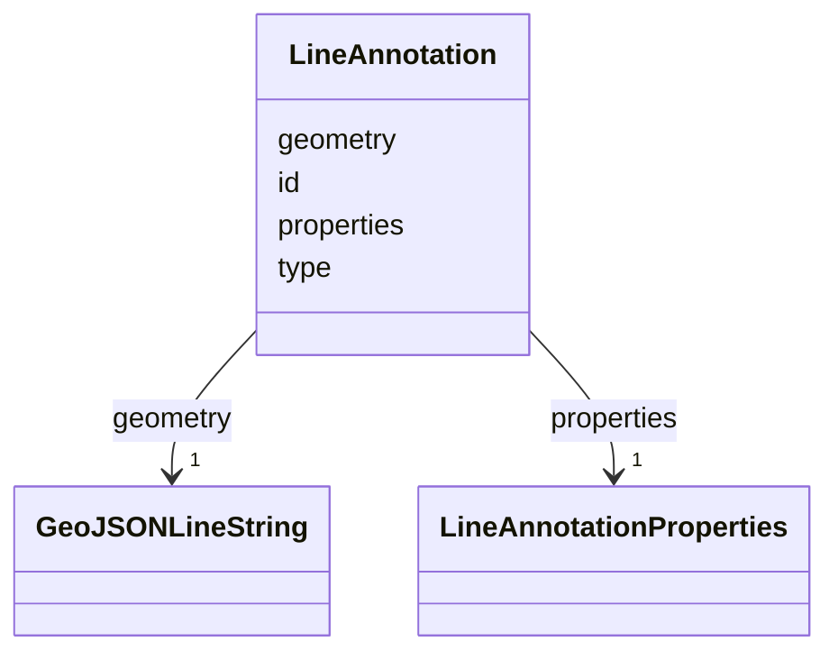

# Class: LineAnnotation 


_GeoJSON Feature for line segment annotations. Geometry is a LineString with 2 points (start and end)._


URI: [debrief:class/LineAnnotation](https://debrief.info/schemas/class/LineAnnotation)





<!-- no inheritance hierarchy -->


## Slots

| Name | Cardinality and Range | Description | Inheritance |
| ---  | --- | --- | --- |
| [type](../slots/type.md) | 1 <br/> [String](../types/String.md) | GeoJSON type discriminator | direct |
| [id](../slots/id.md) | 1 <br/> [String](../types/String.md) | Unique identifier | direct |
| [geometry](../slots/geometry.md) | 1 <br/> [GeoJSONLineString](../classes/GeoJSONLineString.md) | Line as LineString (2 points) | direct |
| [properties](../slots/properties.md) | 1 <br/> [LineAnnotationProperties](../classes/LineAnnotationProperties.md) | Line metadata | direct |


## Identifier and Mapping Information


### Schema Source


* from schema: https://debrief.info/schemas/debrief


## Mappings

| Mapping Type | Mapped Value |
| ---  | ---  |
| self | debrief:LineAnnotation |
| native | debrief:LineAnnotation |


## LinkML Source

<!-- TODO: investigate https://stackoverflow.com/questions/37606292/how-to-create-tabbed-code-blocks-in-mkdocs-or-sphinx -->

### Direct

<details>
```yaml
name: LineAnnotation
description: GeoJSON Feature for line segment annotations. Geometry is a LineString
  with 2 points (start and end).
from_schema: https://debrief.info/schemas/debrief
attributes:
  type:
    name: type
    description: GeoJSON type discriminator
    from_schema: https://debrief.info/schemas/annotations
    domain_of:
    - GeoJSONPoint
    - GeoJSONEmptyPoint
    - GeoJSONLineString
    - GeoJSONPolygon
    - GeoJSONMultiPoint
    - GeoJSONMultiLineString
    - GeoJSONMultiPolygon
    - TrackFeature
    - ReferenceLocation
    - SystemState
    - MultiPointFeature
    - MultiPolygonFeature
    - NarrativeEntry
    - CircleAnnotation
    - RectangleAnnotation
    - LineAnnotation
    - TextAnnotation
    - VectorAnnotation
    - PolyAnnotation
    - ToolParameter
    - FileProvEntry
    - RawGeoJSONFeature
    - RawGeoJSONFeatureCollection
    - DatasetAxisMetadata
    - DatasetEntry
    - StoryboardFeature
    - SceneFeature
    - SceneThumbnailAssetEntry
    range: string
    required: true
    equals_string: Feature
  id:
    name: id
    description: Unique identifier
    from_schema: https://debrief.info/schemas/annotations
    domain_of:
    - TrackFeature
    - ReferenceLocation
    - SystemState
    - MultiPointFeature
    - MultiPolygonFeature
    - NarrativeEntry
    - CircleAnnotation
    - RectangleAnnotation
    - LineAnnotation
    - TextAnnotation
    - VectorAnnotation
    - PolyAnnotation
    - Tool
    - PlatformRecord
    - PlotSummary
    - StacItemSummary
    - RawGeoJSONFeature
    - StoryboardProperties
    - SceneProperties
    - StoryboardFeature
    - SceneFeature
    required: true
  geometry:
    name: geometry
    description: Line as LineString (2 points)
    from_schema: https://debrief.info/schemas/annotations
    domain_of:
    - TrackFeature
    - ReferenceLocation
    - SystemState
    - MultiPointFeature
    - MultiPolygonFeature
    - InputFeatureState
    - NarrativeEntry
    - CircleAnnotation
    - RectangleAnnotation
    - LineAnnotation
    - TextAnnotation
    - VectorAnnotation
    - PolyAnnotation
    - RawGeoJSONFeature
    - StoryboardFeature
    - SceneFeature
    range: GeoJSONLineString
    required: true
  properties:
    name: properties
    description: Line metadata
    from_schema: https://debrief.info/schemas/annotations
    domain_of:
    - TrackFeature
    - ReferenceLocation
    - SystemState
    - MultiPointFeature
    - MultiPolygonFeature
    - InputFeatureState
    - NarrativeEntry
    - CircleAnnotation
    - RectangleAnnotation
    - LineAnnotation
    - TextAnnotation
    - VectorAnnotation
    - PolyAnnotation
    - RawGeoJSONFeature
    - StoryboardFeature
    - SceneFeature
    range: LineAnnotationProperties
    required: true

```
</details>

### Induced

<details>
```yaml
name: LineAnnotation
description: GeoJSON Feature for line segment annotations. Geometry is a LineString
  with 2 points (start and end).
from_schema: https://debrief.info/schemas/debrief
attributes:
  type:
    name: type
    description: GeoJSON type discriminator
    from_schema: https://debrief.info/schemas/annotations
    alias: type
    owner: LineAnnotation
    domain_of:
    - GeoJSONPoint
    - GeoJSONEmptyPoint
    - GeoJSONLineString
    - GeoJSONPolygon
    - GeoJSONMultiPoint
    - GeoJSONMultiLineString
    - GeoJSONMultiPolygon
    - TrackFeature
    - ReferenceLocation
    - SystemState
    - MultiPointFeature
    - MultiPolygonFeature
    - NarrativeEntry
    - CircleAnnotation
    - RectangleAnnotation
    - LineAnnotation
    - TextAnnotation
    - VectorAnnotation
    - PolyAnnotation
    - ToolParameter
    - FileProvEntry
    - RawGeoJSONFeature
    - RawGeoJSONFeatureCollection
    - DatasetAxisMetadata
    - DatasetEntry
    - StoryboardFeature
    - SceneFeature
    - SceneThumbnailAssetEntry
    range: string
    required: true
    equals_string: Feature
  id:
    name: id
    description: Unique identifier
    from_schema: https://debrief.info/schemas/annotations
    alias: id
    owner: LineAnnotation
    domain_of:
    - TrackFeature
    - ReferenceLocation
    - SystemState
    - MultiPointFeature
    - MultiPolygonFeature
    - NarrativeEntry
    - CircleAnnotation
    - RectangleAnnotation
    - LineAnnotation
    - TextAnnotation
    - VectorAnnotation
    - PolyAnnotation
    - Tool
    - PlatformRecord
    - PlotSummary
    - StacItemSummary
    - RawGeoJSONFeature
    - StoryboardProperties
    - SceneProperties
    - StoryboardFeature
    - SceneFeature
    range: string
    required: true
  geometry:
    name: geometry
    description: Line as LineString (2 points)
    from_schema: https://debrief.info/schemas/annotations
    alias: geometry
    owner: LineAnnotation
    domain_of:
    - TrackFeature
    - ReferenceLocation
    - SystemState
    - MultiPointFeature
    - MultiPolygonFeature
    - InputFeatureState
    - NarrativeEntry
    - CircleAnnotation
    - RectangleAnnotation
    - LineAnnotation
    - TextAnnotation
    - VectorAnnotation
    - PolyAnnotation
    - RawGeoJSONFeature
    - StoryboardFeature
    - SceneFeature
    range: GeoJSONLineString
    required: true
  properties:
    name: properties
    description: Line metadata
    from_schema: https://debrief.info/schemas/annotations
    alias: properties
    owner: LineAnnotation
    domain_of:
    - TrackFeature
    - ReferenceLocation
    - SystemState
    - MultiPointFeature
    - MultiPolygonFeature
    - InputFeatureState
    - NarrativeEntry
    - CircleAnnotation
    - RectangleAnnotation
    - LineAnnotation
    - TextAnnotation
    - VectorAnnotation
    - PolyAnnotation
    - RawGeoJSONFeature
    - StoryboardFeature
    - SceneFeature
    range: LineAnnotationProperties
    required: true

```
</details>