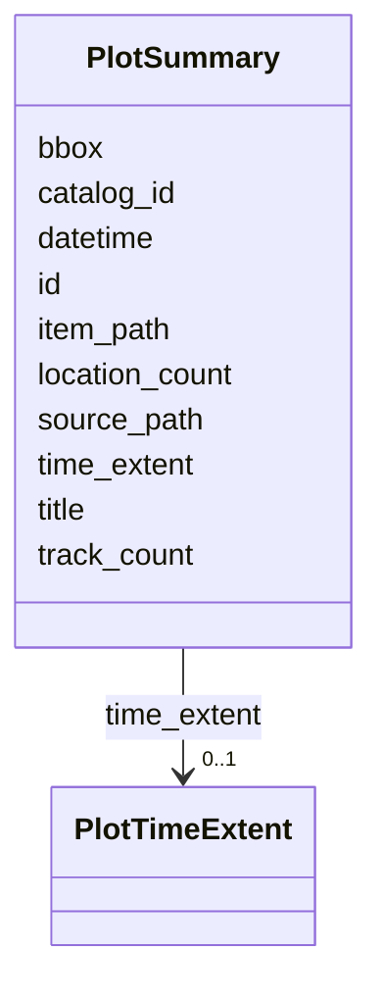

# Class: PlotSummary 


_Projection of a STAC Item for UI consumption (e.g., browser tree rows). Carries only the fields required for listing and opening a plot, derived from the STAC Item plus its debrief: extension properties. Replaces the Plot interface from apps/vscode/src/types/plot.ts as the canonical summary type._

__


URI: [debrief:class/PlotSummary](https://debrief.info/schemas/class/PlotSummary)





<!-- no inheritance hierarchy -->


## Slots

| Name | Cardinality and Range | Description | Inheritance |
| ---  | --- | --- | --- |
| [id](../slots/id.md) | 1 <br/> [String](../types/String.md) | STAC Item ID | direct |
| [title](../slots/title.md) | 1 <br/> [String](../types/String.md) | Plot title from STAC metadata | direct |
| [datetime](../slots/datetime.md) | 1 <br/> [String](../types/String.md) | Creation/capture timestamp (ISO 8601) | direct |
| [item_path](../slots/item_path.md) | 1 <br/> [String](../types/String.md) | Path to item | direct |
| [catalog_id](../slots/catalog_id.md) | 1 <br/> [String](../types/String.md) | Parent catalog identifier | direct |
| [source_path](../slots/source_path.md) | 0..1 <br/> [String](../types/String.md) | Original source file path (for provenance) | direct |
| [bbox](../slots/bbox.md) | 4..* <br/> [Float](../types/Float.md) | Geographic bounding box as [west, south, east, north] | direct |
| [time_extent](../slots/time_extent.md) | 0..1 <br/> [PlotTimeExtent](../classes/PlotTimeExtent.md) | Temporal extent of the plot (start/end ISO 8601 strings) | direct |
| [track_count](../slots/track_count.md) | 0..1 <br/> [Integer](../types/Integer.md) | Number of tracks in this plot | direct |
| [location_count](../slots/location_count.md) | 0..1 <br/> [Integer](../types/Integer.md) | Number of reference locations in this plot | direct |


## Identifier and Mapping Information


### Schema Source


* from schema: https://debrief.info/schemas/debrief


## Mappings

| Mapping Type | Mapped Value |
| ---  | ---  |
| self | debrief:PlotSummary |
| native | debrief:PlotSummary |


## LinkML Source

<!-- TODO: investigate https://stackoverflow.com/questions/37606292/how-to-create-tabbed-code-blocks-in-mkdocs-or-sphinx -->

### Direct

<details>
```yaml
name: PlotSummary
description: 'Projection of a STAC Item for UI consumption (e.g., browser tree rows).
  Carries only the fields required for listing and opening a plot, derived from the
  STAC Item plus its debrief: extension properties. Replaces the Plot interface from
  apps/vscode/src/types/plot.ts as the canonical summary type.

  '
from_schema: https://debrief.info/schemas/debrief
attributes:
  id:
    name: id
    description: STAC Item ID
    from_schema: https://debrief.info/schemas/stac-extension
    domain_of:
    - TrackFeature
    - ReferenceLocation
    - SystemState
    - MultiPointFeature
    - MultiPolygonFeature
    - NarrativeEntry
    - CircleAnnotation
    - RectangleAnnotation
    - LineAnnotation
    - TextAnnotation
    - VectorAnnotation
    - PolyAnnotation
    - Tool
    - PlatformRecord
    - PlotSummary
    - StacItemSummary
    - RawGeoJSONFeature
    - StoryboardProperties
    - SceneProperties
    - StoryboardFeature
    - SceneFeature
    range: string
    required: true
  title:
    name: title
    description: Plot title from STAC metadata
    from_schema: https://debrief.info/schemas/stac-extension
    rank: 1000
    domain_of:
    - PlotSummary
    - StacItemSummary
    - DatasetEntry
    - SceneProperties
    - SceneThumbnailAssetEntry
    range: string
    required: true
  datetime:
    name: datetime
    description: Creation/capture timestamp (ISO 8601)
    from_schema: https://debrief.info/schemas/stac-extension
    rank: 1000
    domain_of:
    - PlotSummary
    - StacItemSummary
    range: string
    required: true
  item_path:
    name: item_path
    description: Path to item.json relative to store root
    from_schema: https://debrief.info/schemas/stac-extension
    rank: 1000
    domain_of:
    - PlotSummary
    - StacItemSummary
    range: string
    required: true
  catalog_id:
    name: catalog_id
    description: Parent catalog identifier
    from_schema: https://debrief.info/schemas/stac-extension
    rank: 1000
    domain_of:
    - PlotSummary
    - StacItemSummary
    range: string
    required: true
  source_path:
    name: source_path
    description: Original source file path (for provenance)
    from_schema: https://debrief.info/schemas/stac-extension
    rank: 1000
    domain_of:
    - PlotSummary
    range: string
    required: false
  bbox:
    name: bbox
    description: Geographic bounding box as [west, south, east, north]
    from_schema: https://debrief.info/schemas/stac-extension
    domain_of:
    - TrackFeature
    - SystemStateProperties
    - MultiPointFeature
    - MultiPolygonFeature
    - PlotSummary
    - StacItemSummary
    - RawGeoJSONFeature
    - RawGeoJSONFeatureCollection
    range: float
    required: false
    multivalued: true
    minimum_cardinality: 4
    maximum_cardinality: 4
  time_extent:
    name: time_extent
    description: Temporal extent of the plot (start/end ISO 8601 strings)
    from_schema: https://debrief.info/schemas/stac-extension
    rank: 1000
    domain_of:
    - PlotSummary
    range: PlotTimeExtent
    required: false
  track_count:
    name: track_count
    description: Number of tracks in this plot
    from_schema: https://debrief.info/schemas/stac-extension
    rank: 1000
    domain_of:
    - PlotSummary
    range: integer
    required: false
    minimum_value: 0
  location_count:
    name: location_count
    description: Number of reference locations in this plot
    from_schema: https://debrief.info/schemas/stac-extension
    rank: 1000
    domain_of:
    - PlotSummary
    range: integer
    required: false
    minimum_value: 0

```
</details>

### Induced

<details>
```yaml
name: PlotSummary
description: 'Projection of a STAC Item for UI consumption (e.g., browser tree rows).
  Carries only the fields required for listing and opening a plot, derived from the
  STAC Item plus its debrief: extension properties. Replaces the Plot interface from
  apps/vscode/src/types/plot.ts as the canonical summary type.

  '
from_schema: https://debrief.info/schemas/debrief
attributes:
  id:
    name: id
    description: STAC Item ID
    from_schema: https://debrief.info/schemas/stac-extension
    alias: id
    owner: PlotSummary
    domain_of:
    - TrackFeature
    - ReferenceLocation
    - SystemState
    - MultiPointFeature
    - MultiPolygonFeature
    - NarrativeEntry
    - CircleAnnotation
    - RectangleAnnotation
    - LineAnnotation
    - TextAnnotation
    - VectorAnnotation
    - PolyAnnotation
    - Tool
    - PlatformRecord
    - PlotSummary
    - StacItemSummary
    - RawGeoJSONFeature
    - StoryboardProperties
    - SceneProperties
    - StoryboardFeature
    - SceneFeature
    range: string
    required: true
  title:
    name: title
    description: Plot title from STAC metadata
    from_schema: https://debrief.info/schemas/stac-extension
    rank: 1000
    alias: title
    owner: PlotSummary
    domain_of:
    - PlotSummary
    - StacItemSummary
    - DatasetEntry
    - SceneProperties
    - SceneThumbnailAssetEntry
    range: string
    required: true
  datetime:
    name: datetime
    description: Creation/capture timestamp (ISO 8601)
    from_schema: https://debrief.info/schemas/stac-extension
    rank: 1000
    alias: datetime
    owner: PlotSummary
    domain_of:
    - PlotSummary
    - StacItemSummary
    range: string
    required: true
  item_path:
    name: item_path
    description: Path to item.json relative to store root
    from_schema: https://debrief.info/schemas/stac-extension
    rank: 1000
    alias: item_path
    owner: PlotSummary
    domain_of:
    - PlotSummary
    - StacItemSummary
    range: string
    required: true
  catalog_id:
    name: catalog_id
    description: Parent catalog identifier
    from_schema: https://debrief.info/schemas/stac-extension
    rank: 1000
    alias: catalog_id
    owner: PlotSummary
    domain_of:
    - PlotSummary
    - StacItemSummary
    range: string
    required: true
  source_path:
    name: source_path
    description: Original source file path (for provenance)
    from_schema: https://debrief.info/schemas/stac-extension
    rank: 1000
    alias: source_path
    owner: PlotSummary
    domain_of:
    - PlotSummary
    range: string
    required: false
  bbox:
    name: bbox
    description: Geographic bounding box as [west, south, east, north]
    from_schema: https://debrief.info/schemas/stac-extension
    alias: bbox
    owner: PlotSummary
    domain_of:
    - TrackFeature
    - SystemStateProperties
    - MultiPointFeature
    - MultiPolygonFeature
    - PlotSummary
    - StacItemSummary
    - RawGeoJSONFeature
    - RawGeoJSONFeatureCollection
    range: float
    required: false
    multivalued: true
    minimum_cardinality: 4
    maximum_cardinality: 4
  time_extent:
    name: time_extent
    description: Temporal extent of the plot (start/end ISO 8601 strings)
    from_schema: https://debrief.info/schemas/stac-extension
    rank: 1000
    alias: time_extent
    owner: PlotSummary
    domain_of:
    - PlotSummary
    range: PlotTimeExtent
    required: false
  track_count:
    name: track_count
    description: Number of tracks in this plot
    from_schema: https://debrief.info/schemas/stac-extension
    rank: 1000
    alias: track_count
    owner: PlotSummary
    domain_of:
    - PlotSummary
    range: integer
    required: false
    minimum_value: 0
  location_count:
    name: location_count
    description: Number of reference locations in this plot
    from_schema: https://debrief.info/schemas/stac-extension
    rank: 1000
    alias: location_count
    owner: PlotSummary
    domain_of:
    - PlotSummary
    range: integer
    required: false
    minimum_value: 0

```
</details>