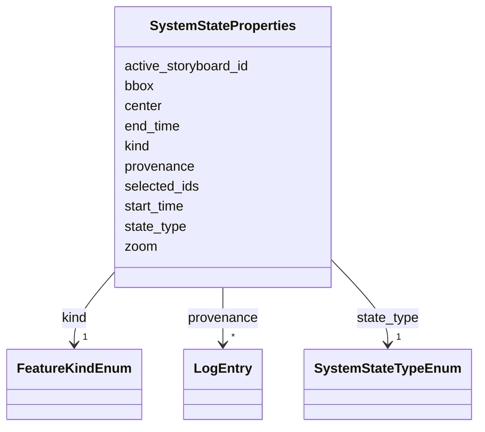

# Class: SystemStateProperties 


_Properties for SYSTEM features storing application state_


URI: [debrief:class/SystemStateProperties](https://debrief.info/schemas/class/SystemStateProperties)





<!-- no inheritance hierarchy -->


## Slots

| Name | Cardinality and Range | Description | Inheritance |
| ---  | --- | --- | --- |
| [kind](../slots/kind.md) | 1 <br/> [FeatureKindEnum](../enums/FeatureKindEnum.md) | Feature type discriminator | direct |
| [state_type](../slots/state_type.md) | 1 <br/> [SystemStateTypeEnum](../enums/SystemStateTypeEnum.md) | Discriminator for state variant (temporal, spatial, selection, active_storybo... | direct |
| [start_time](../slots/start_time.md) | 0..1 <br/> [datetime](../slots/datetime.md) | Viewport start time (ISO8601) - for temporal state | direct |
| [end_time](../slots/end_time.md) | 0..1 <br/> [datetime](../slots/datetime.md) | Viewport end time (ISO8601) - for temporal state | direct |
| [bbox](../slots/bbox.md) | * <br/> [Float](../types/Float.md) | Bounding box [minLon, minLat, maxLon, maxLat] - for spatial state | direct |
| [zoom](../slots/zoom.md) | 0..1 <br/> [Float](../types/Float.md) | Map zoom level - for spatial state | direct |
| [center](../slots/center.md) | * <br/> [Float](../types/Float.md) | Map center [longitude, latitude] - for spatial state | direct |
| [selected_ids](../slots/selected_ids.md) | * <br/> [String](../types/String.md) | Array of selected feature IDs - for selection state | direct |
| [active_storyboard_id](../slots/active_storyboard_id.md) | 0..1 <br/> [String](../types/String.md) | Storyboard properties | direct |
| [provenance](../slots/provenance.md) | * <br/> [LogEntry](../classes/LogEntry.md) | PROV-aligned provenance records (append-only log of tool operations) | direct |


## Usages

| used by | used in | type | used |
| ---  | --- | --- | --- |
| [SystemState](../classes/SystemState.md) | [properties](../slots/properties.md) | range | [SystemStateProperties](../classes/SystemStateProperties.md) |


## Identifier and Mapping Information


### Schema Source


* from schema: https://debrief.info/schemas/debrief


## Mappings

| Mapping Type | Mapped Value |
| ---  | ---  |
| self | debrief:SystemStateProperties |
| native | debrief:SystemStateProperties |


## LinkML Source

<!-- TODO: investigate https://stackoverflow.com/questions/37606292/how-to-create-tabbed-code-blocks-in-mkdocs-or-sphinx -->

### Direct

<details>
```yaml
name: SystemStateProperties
description: Properties for SYSTEM features storing application state
from_schema: https://debrief.info/schemas/debrief
attributes:
  kind:
    name: kind
    description: Feature type discriminator
    from_schema: https://debrief.info/schemas/geojson
    domain_of:
    - BaseFeatureProperties
    - TrackProperties
    - ReferenceLocationProperties
    - SystemStateProperties
    - MultiPointFeatureProperties
    - MultiPolygonFeatureProperties
    - NarrativeEntryProperties
    - CircleAnnotationProperties
    - RectangleAnnotationProperties
    - LineAnnotationProperties
    - TextAnnotationProperties
    - VectorAnnotationProperties
    - PolyAnnotationProperties
    - SelectionRequirement
    - SystemRecordProperties
    - StoryboardProperties
    - SceneProperties
    range: FeatureKindEnum
    required: true
    equals_string: SYSTEM
  state_type:
    name: state_type
    description: Discriminator for state variant (temporal, spatial, selection, active_storyboard)
    from_schema: https://debrief.info/schemas/geojson
    rank: 1000
    domain_of:
    - SystemStateProperties
    range: SystemStateTypeEnum
    required: true
  start_time:
    name: start_time
    description: Viewport start time (ISO8601) - for temporal state
    from_schema: https://debrief.info/schemas/geojson
    domain_of:
    - SegmentMetadata
    - TrackProperties
    - SystemStateProperties
    range: datetime
  end_time:
    name: end_time
    description: Viewport end time (ISO8601) - for temporal state
    from_schema: https://debrief.info/schemas/geojson
    domain_of:
    - SegmentMetadata
    - TrackProperties
    - SystemStateProperties
    range: datetime
  bbox:
    name: bbox
    description: Bounding box [minLon, minLat, maxLon, maxLat] - for spatial state
    from_schema: https://debrief.info/schemas/geojson
    domain_of:
    - TrackFeature
    - SystemStateProperties
    - MultiPointFeature
    - MultiPolygonFeature
    - PlotSummary
    - StacItemSummary
    - RawGeoJSONFeature
    - RawGeoJSONFeatureCollection
    range: float
    multivalued: true
  zoom:
    name: zoom
    description: Map zoom level - for spatial state
    from_schema: https://debrief.info/schemas/geojson
    rank: 1000
    domain_of:
    - SystemStateProperties
    - ViewportPolygon
    - Viewport
    range: float
  center:
    name: center
    description: Map center [longitude, latitude] - for spatial state
    from_schema: https://debrief.info/schemas/geojson
    rank: 1000
    domain_of:
    - SystemStateProperties
    - CircleAnnotationProperties
    - Viewport
    range: float
    multivalued: true
  selected_ids:
    name: selected_ids
    description: Array of selected feature IDs - for selection state
    from_schema: https://debrief.info/schemas/geojson
    rank: 1000
    domain_of:
    - SystemStateProperties
    range: string
    multivalued: true
  active_storyboard_id:
    name: active_storyboard_id
    description: Storyboard properties.id the analyst last pinned for this plot (#237)
    from_schema: https://debrief.info/schemas/geojson
    rank: 1000
    domain_of:
    - SystemStateProperties
    range: string
  provenance:
    name: provenance
    description: PROV-aligned provenance records (append-only log of tool operations)
    from_schema: https://debrief.info/schemas/geojson
    domain_of:
    - BaseFeatureProperties
    - SystemStateProperties
    - SystemRecordProperties
    range: LogEntry
    multivalued: true
    inlined: true
    inlined_as_list: true

```
</details>

### Induced

<details>
```yaml
name: SystemStateProperties
description: Properties for SYSTEM features storing application state
from_schema: https://debrief.info/schemas/debrief
attributes:
  kind:
    name: kind
    description: Feature type discriminator
    from_schema: https://debrief.info/schemas/geojson
    alias: kind
    owner: SystemStateProperties
    domain_of:
    - BaseFeatureProperties
    - TrackProperties
    - ReferenceLocationProperties
    - SystemStateProperties
    - MultiPointFeatureProperties
    - MultiPolygonFeatureProperties
    - NarrativeEntryProperties
    - CircleAnnotationProperties
    - RectangleAnnotationProperties
    - LineAnnotationProperties
    - TextAnnotationProperties
    - VectorAnnotationProperties
    - PolyAnnotationProperties
    - SelectionRequirement
    - SystemRecordProperties
    - StoryboardProperties
    - SceneProperties
    range: FeatureKindEnum
    required: true
    equals_string: SYSTEM
  state_type:
    name: state_type
    description: Discriminator for state variant (temporal, spatial, selection, active_storyboard)
    from_schema: https://debrief.info/schemas/geojson
    rank: 1000
    alias: state_type
    owner: SystemStateProperties
    domain_of:
    - SystemStateProperties
    range: SystemStateTypeEnum
    required: true
  start_time:
    name: start_time
    description: Viewport start time (ISO8601) - for temporal state
    from_schema: https://debrief.info/schemas/geojson
    alias: start_time
    owner: SystemStateProperties
    domain_of:
    - SegmentMetadata
    - TrackProperties
    - SystemStateProperties
    range: datetime
  end_time:
    name: end_time
    description: Viewport end time (ISO8601) - for temporal state
    from_schema: https://debrief.info/schemas/geojson
    alias: end_time
    owner: SystemStateProperties
    domain_of:
    - SegmentMetadata
    - TrackProperties
    - SystemStateProperties
    range: datetime
  bbox:
    name: bbox
    description: Bounding box [minLon, minLat, maxLon, maxLat] - for spatial state
    from_schema: https://debrief.info/schemas/geojson
    alias: bbox
    owner: SystemStateProperties
    domain_of:
    - TrackFeature
    - SystemStateProperties
    - MultiPointFeature
    - MultiPolygonFeature
    - PlotSummary
    - StacItemSummary
    - RawGeoJSONFeature
    - RawGeoJSONFeatureCollection
    range: float
    multivalued: true
  zoom:
    name: zoom
    description: Map zoom level - for spatial state
    from_schema: https://debrief.info/schemas/geojson
    rank: 1000
    alias: zoom
    owner: SystemStateProperties
    domain_of:
    - SystemStateProperties
    - ViewportPolygon
    - Viewport
    range: float
  center:
    name: center
    description: Map center [longitude, latitude] - for spatial state
    from_schema: https://debrief.info/schemas/geojson
    rank: 1000
    alias: center
    owner: SystemStateProperties
    domain_of:
    - SystemStateProperties
    - CircleAnnotationProperties
    - Viewport
    range: float
    multivalued: true
  selected_ids:
    name: selected_ids
    description: Array of selected feature IDs - for selection state
    from_schema: https://debrief.info/schemas/geojson
    rank: 1000
    alias: selected_ids
    owner: SystemStateProperties
    domain_of:
    - SystemStateProperties
    range: string
    multivalued: true
  active_storyboard_id:
    name: active_storyboard_id
    description: Storyboard properties.id the analyst last pinned for this plot (#237)
    from_schema: https://debrief.info/schemas/geojson
    rank: 1000
    alias: active_storyboard_id
    owner: SystemStateProperties
    domain_of:
    - SystemStateProperties
    range: string
  provenance:
    name: provenance
    description: PROV-aligned provenance records (append-only log of tool operations)
    from_schema: https://debrief.info/schemas/geojson
    alias: provenance
    owner: SystemStateProperties
    domain_of:
    - BaseFeatureProperties
    - SystemStateProperties
    - SystemRecordProperties
    range: LogEntry
    multivalued: true
    inlined: true
    inlined_as_list: true

```
</details>