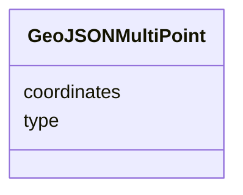

# Class: GeoJSONMultiPoint 


_GeoJSON MultiPoint geometry for reference point sets_


URI: [debrief:class/GeoJSONMultiPoint](https://debrief.info/schemas/class/GeoJSONMultiPoint)





<!-- no inheritance hierarchy -->


## Slots

| Name | Cardinality and Range | Description | Inheritance |
| ---  | --- | --- | --- |
| [type](../slots/type.md) | 1 <br/> [String](../types/String.md) | Geometry type discriminator | direct |
| [coordinates](../slots/coordinates.md) | 1..* <br/> [Float](../types/Float.md) | Array of [longitude, latitude] pairs | direct |


## Usages

| used by | used in | type | used |
| ---  | --- | --- | --- |
| [ReferenceLocation](../classes/ReferenceLocation.md) | [geometry](../slots/geometry.md) | any_of[range] | [GeoJSONMultiPoint](../classes/GeoJSONMultiPoint.md) |
| [MultiPointFeature](../classes/MultiPointFeature.md) | [geometry](../slots/geometry.md) | range | [GeoJSONMultiPoint](../classes/GeoJSONMultiPoint.md) |
| [RawGeoJSONFeature](../classes/RawGeoJSONFeature.md) | [geometry](../slots/geometry.md) | any_of[range] | [GeoJSONMultiPoint](../classes/GeoJSONMultiPoint.md) |


## Identifier and Mapping Information


### Schema Source


* from schema: https://debrief.info/schemas/debrief


## Mappings

| Mapping Type | Mapped Value |
| ---  | ---  |
| self | debrief:GeoJSONMultiPoint |
| native | debrief:GeoJSONMultiPoint |


## LinkML Source

<!-- TODO: investigate https://stackoverflow.com/questions/37606292/how-to-create-tabbed-code-blocks-in-mkdocs-or-sphinx -->

### Direct

<details>
```yaml
name: GeoJSONMultiPoint
description: GeoJSON MultiPoint geometry for reference point sets
from_schema: https://debrief.info/schemas/debrief
attributes:
  type:
    name: type
    description: Geometry type discriminator
    from_schema: https://debrief.info/schemas/geojson
    domain_of:
    - GeoJSONPoint
    - GeoJSONEmptyPoint
    - GeoJSONLineString
    - GeoJSONPolygon
    - GeoJSONMultiPoint
    - GeoJSONMultiLineString
    - GeoJSONMultiPolygon
    - TrackFeature
    - ReferenceLocation
    - SystemState
    - MultiPointFeature
    - MultiPolygonFeature
    - NarrativeEntry
    - CircleAnnotation
    - RectangleAnnotation
    - LineAnnotation
    - TextAnnotation
    - VectorAnnotation
    - PolyAnnotation
    - ToolParameter
    - FileProvEntry
    - RawGeoJSONFeature
    - RawGeoJSONFeatureCollection
    - DatasetAxisMetadata
    - DatasetEntry
    - StoryboardFeature
    - SceneFeature
    - SceneThumbnailAssetEntry
    - MCPContentItem
    - MCPParamSchema
    - ToolsUpdateMessage
    range: string
    required: true
    equals_string: MultiPoint
  coordinates:
    name: coordinates
    description: Array of [longitude, latitude] pairs
    from_schema: https://debrief.info/schemas/geojson
    domain_of:
    - GeoJSONPoint
    - GeoJSONEmptyPoint
    - GeoJSONLineString
    - GeoJSONPolygon
    - GeoJSONMultiPoint
    - GeoJSONMultiLineString
    - GeoJSONMultiPolygon
    - ViewportPolygon
    range: float
    required: true
    multivalued: true

```
</details>

### Induced

<details>
```yaml
name: GeoJSONMultiPoint
description: GeoJSON MultiPoint geometry for reference point sets
from_schema: https://debrief.info/schemas/debrief
attributes:
  type:
    name: type
    description: Geometry type discriminator
    from_schema: https://debrief.info/schemas/geojson
    alias: type
    owner: GeoJSONMultiPoint
    domain_of:
    - GeoJSONPoint
    - GeoJSONEmptyPoint
    - GeoJSONLineString
    - GeoJSONPolygon
    - GeoJSONMultiPoint
    - GeoJSONMultiLineString
    - GeoJSONMultiPolygon
    - TrackFeature
    - ReferenceLocation
    - SystemState
    - MultiPointFeature
    - MultiPolygonFeature
    - NarrativeEntry
    - CircleAnnotation
    - RectangleAnnotation
    - LineAnnotation
    - TextAnnotation
    - VectorAnnotation
    - PolyAnnotation
    - ToolParameter
    - FileProvEntry
    - RawGeoJSONFeature
    - RawGeoJSONFeatureCollection
    - DatasetAxisMetadata
    - DatasetEntry
    - StoryboardFeature
    - SceneFeature
    - SceneThumbnailAssetEntry
    - MCPContentItem
    - MCPParamSchema
    - ToolsUpdateMessage
    range: string
    required: true
    equals_string: MultiPoint
  coordinates:
    name: coordinates
    description: Array of [longitude, latitude] pairs
    from_schema: https://debrief.info/schemas/geojson
    alias: coordinates
    owner: GeoJSONMultiPoint
    domain_of:
    - GeoJSONPoint
    - GeoJSONEmptyPoint
    - GeoJSONLineString
    - GeoJSONPolygon
    - GeoJSONMultiPoint
    - GeoJSONMultiLineString
    - GeoJSONMultiPolygon
    - ViewportPolygon
    range: float
    required: true
    multivalued: true

```
</details>